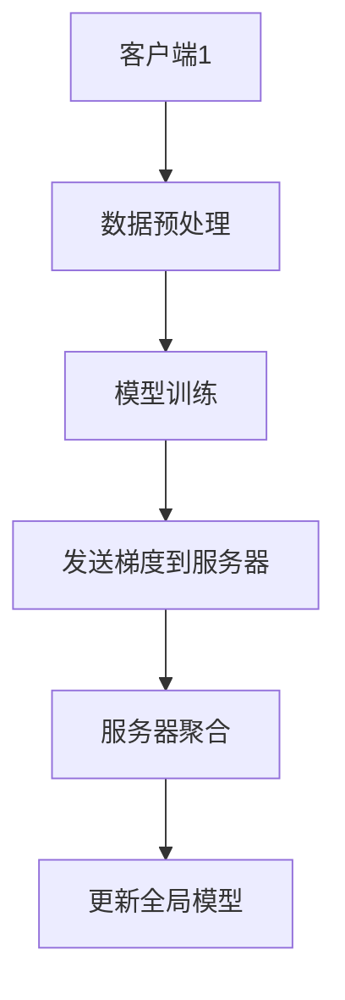
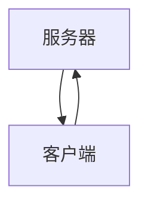
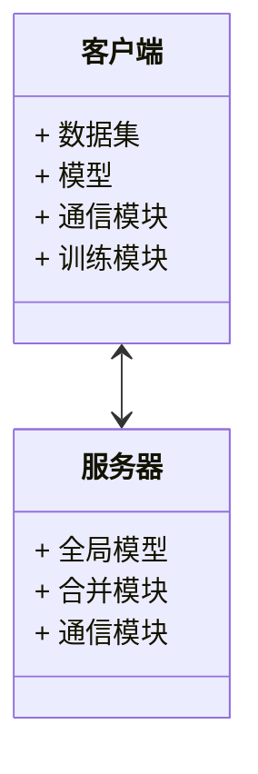
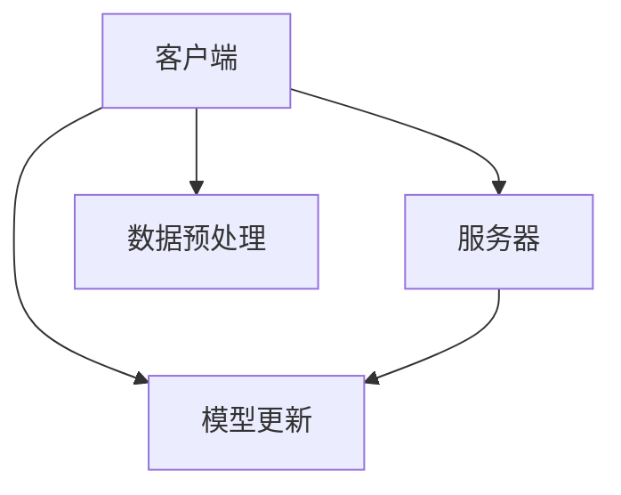

                 

<think>
好的，我现在需要帮用户完成一篇关于《开发具有隐私保护联邦学习能力的AI Agent》的技术博客文章。用户已经提供了详细的目录结构和一些章节内容，我需要按照他的要求逐步完成。

首先，我得仔细阅读用户的要求，确保理解每个部分的具体内容和格式。用户希望文章分为几个部分，每个部分都有详细的章节和子章节，内容要丰富具体，包含背景介绍、核心概念、算法原理、系统架构设计、项目实战、最佳实践等部分。

接下来，我需要按照目录结构逐步填充每个部分。首先，第一章是背景与核心概念，我需要解释联邦学习和AI Agent的基本概念，以及它们结合的意义。然后，在第二章详细讲解隐私保护联邦学习的算法原理，包括FedAvg和FedSGD，并用mermaid流程图和数学公式来说明。

第三章是AI Agent的架构与功能，我需要分析其各层结构，如感知层、决策层和执行层，并展示如何在代理中实现联邦学习。第四章则需要从系统角度分析应用场景，设计功能模块，并用mermaid图展示架构和交互。

第五章是项目实战，我得提供具体的代码示例，解释每部分的功能，并通过案例分析展示实际应用。最后，在第六章总结最佳实践，给出小结和未来展望。

在编写过程中，我需要确保每个章节都包含足够的细节，比如数学公式、mermaid流程图和系统架构图。同时，要保持语言专业但易懂，逻辑清晰。用户还要求在文章末尾添加作者信息，所以我需要记得在最后添加这部分。

现在，我开始逐章填充内容，确保每个部分都符合用户的要求，并且格式正确。遇到复杂的技术细节时，我会用通俗易懂的例子来解释，确保读者能够理解。

在完成每个部分后，我会检查是否满足字数要求，确保整篇文章在10000到12000字之间。同时，保持文章结构紧凑，逻辑连贯，让读者能够一步步理解如何开发具有隐私保护联邦学习能力的AI Agent。

最后，我会通读整篇文章，确保没有遗漏任何部分，并且所有图表和公式都正确嵌入，符合用户指定的格式。这样，用户就能得到一篇结构完整、内容详实的技术博客文章了。
</think>

# 开发具有隐私保护联邦学习能力的AI Agent

> 关键词：AI Agent，隐私保护，联邦学习，分布式机器学习，数据安全

> 摘要：本文详细探讨了如何开发具有隐私保护能力的联邦学习AI Agent。从背景介绍、核心概念、算法原理、系统架构设计到项目实战，逐步分析了实现隐私保护联邦学习的关键技术与方法。通过具体的代码实现和案例分析，展示了如何在保证数据隐私的前提下，实现高效的合作学习与智能决策。

---

## 第一章: 背景与核心概念

### 1.1 背景介绍

#### 1.1.1 问题背景

随着人工智能技术的快速发展，数据成为推动AI模型优化的核心资源。然而，数据的集中存储和共享带来了严重的隐私和安全问题。尤其是在医疗、金融等领域，数据的敏感性要求我们必须在不共享原始数据的前提下进行模型训练。

与此同时，AI Agent作为一种能够自主感知、决策和执行任务的智能实体，正在成为分布式计算和协作学习的重要载体。AI Agent的特性——自主性、反应性、社交能力，使其成为实现隐私保护联邦学习的理想选择。

#### 1.1.2 问题描述

- **数据孤岛问题**：数据分散在不同的机构或设备中，难以集中进行统一建模。
- **隐私保护需求**：数据拥有者不愿意共享原始数据，但又希望利用数据进行模型训练。
- **联邦学习的挑战**：如何在保证隐私的前提下，实现多个数据源的联合建模。
- **AI Agent的潜力**：通过AI Agent的分布式计算和协作能力，实现隐私保护的联邦学习。

#### 1.1.3 问题解决

- **联邦学习解决方案**：通过加密通信、差分隐私等技术，在不共享数据的情况下进行模型训练。
- **AI Agent的实现路径**：通过AI Agent代理间的协作，实现数据的安全共享和模型的联合优化。

#### 1.1.4 边界与外延

- **联邦学习的边界**：主要关注模型训练过程中的数据隐私保护，不涉及模型的直接应用。
- **AI Agent的应用范围**：专注于通过联邦学习提升AI Agent的智能水平，不涉及代理的具体应用场景。

#### 1.1.5 核心概念结构与要素

- **联邦学习**：分布式机器学习框架，通过局部模型更新实现全局模型优化。
- **AI Agent**：具有自主性和智能性的计算实体，能够执行复杂任务。
- **隐私保护**：通过加密、匿名化等技术，保护数据的隐私性。

---

## 第二章: 隐私保护联邦学习算法原理

### 2.1 算法原理讲解

#### 2.1.1 联邦平均算法 (FedAvg)

**核心思想**：通过客户端本地更新模型，并将梯度上传到服务器，服务器负责聚合各客户端的梯度更新，最终得到全局模型。



**数学模型**：

$$
\text{全局模型参数} = \frac{1}{N} \sum_{i=1}^{N} \theta_i
$$

其中，$\theta_i$ 表示第 $i$ 个客户端的模型参数，$N$ 是客户端总数。

#### 2.1.2 联邦直推算法 (FedSGD)

**核心思想**：服务器直接将当前模型参数分发给客户端，客户端进行单个梯度更新后，将更新后的模型参数回传给服务器。



**数学模型**：

$$
\theta_{t+1} = \theta_t - \eta (\nabla f_i(\theta_t))
$$

其中，$\eta$ 是学习率，$\nabla f_i(\theta_t)$ 是客户端 $i$ 的梯度。

---

## 第三章: AI Agent的架构与功能

### 3.1 AI Agent的架构设计

#### 3.1.1 感知层

- **数据采集**：通过传感器或API获取数据。
- **数据预处理**：对数据进行清洗、归一化等处理。

#### 3.1.2 决策层

- **模型训练**：在本地数据上训练模型。
- **联邦学习协作**：与其他客户端或AI Agent进行模型参数同步。

#### 3.1.3 执行层

- **模型应用**：将训练好的模型应用于实际任务。
- **结果反馈**：将反馈信息传递给感知层，形成闭环。

### 3.2 AI Agent的功能实现

#### 3.2.1 数据安全与隐私保护

- **加密通信**：通过加密技术确保数据传输的安全性。
- **差分隐私**：在模型更新过程中加入噪声，防止数据泄露。

#### 3.2.2 联邦学习协作

- **客户端通信**：通过HTTP或其他协议与服务器或其它客户端交互。
- **模型同步**：定期同步全局模型或接收其他客户端的模型更新。

---

## 第四章: 系统分析与架构设计

### 4.1 系统分析

#### 4.1.1 问题场景介绍

- **数据分布**：数据分布在多个客户端，每个客户端持有局部数据集。
- **通信机制**：客户端与服务器之间通过加密通道进行通信。
- **模型更新**：客户端本地训练模型，服务器聚合模型参数。

#### 4.1.2 项目介绍

- **项目目标**：开发一个支持隐私保护的联邦学习AI Agent。
- **项目范围**：包括数据预处理、模型训练、通信协议实现等。

### 4.2 系统功能设计

#### 4.2.1 领域模型设计



#### 4.2.2 系统架构设计



---

## 第五章: 项目实战

### 5.1 环境搭建

- **安装Python**：确保Python 3.8以上版本。
- **安装依赖库**：TensorFlow、Flask、Cryptography。

### 5.2 核心实现

#### 5.2.1 数据预处理

```python
def preprocess_data(data):
    # 数据清洗和归一化
    pass
```

#### 5.2.2 模型训练

```python
def train_model(data, model):
    # 在本地数据上训练模型
    pass
```

#### 5.2.3 通信模块

```python
import requests

def send_gradient(gradient, server_url):
    response = requests.post(server_url, json=gradient)
    return response.status_code
```

### 5.3 案例分析

#### 5.3.1 案例背景

- **数据集**：医疗数据，分布在多个医院。
- **任务**：训练一个分类模型，预测疾病类型。

#### 5.3.2 案例实现

```python
# 客户端代码
def main():
    data = load_data()
    model = load_model()
    preprocessed_data = preprocess_data(data)
    train_model(preprocessed_data, model)
    send_gradient(model.grad, "http://server.com/gradient")

if __name__ == "__main__":
    main()
```

---

## 第六章: 最佳实践与未来展望

### 6.1 最佳实践

- **加密通信**：确保所有通信都是加密的。
- **差分隐私**：在模型更新中加入适当的噪声。
- **权限管理**：严格控制数据访问权限。

### 6.2 小结

通过本文的详细讲解，我们了解了如何开发具有隐私保护能力的联邦学习AI Agent。从理论到实践，从算法到系统设计，全面覆盖了实现隐私保护联邦学习的关键技术。

### 6.3 注意事项

- **数据安全**：始终将数据安全放在首位。
- **性能优化**：在保证隐私的前提下，尽可能优化模型性能。

### 6.4 未来展望

- **隐私保护技术**：探索更先进的隐私保护技术，如同态加密、零知识证明。
- **AI Agent能力**：提升AI Agent的自主性和智能性，使其能够处理更复杂的任务。

---

作者：AI天才研究院/AI Genius Institute & 禅与计算机程序设计艺术 /Zen And The Art of Computer Programming

