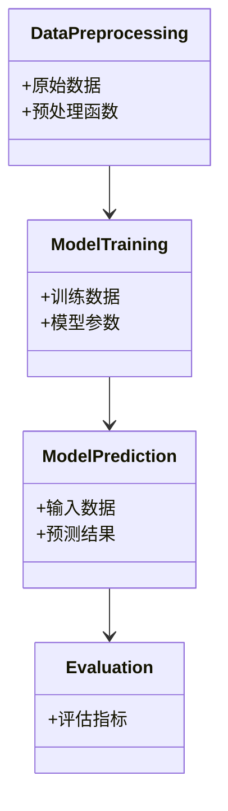
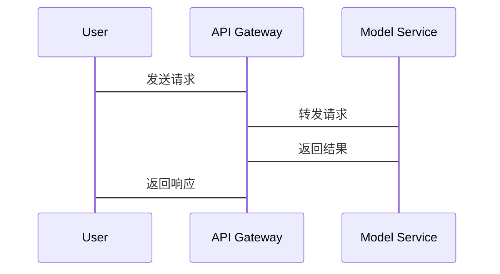

                 


# 《开发基于大模型的金融研究方法论创新生成与评估系统》

## 关键词：大模型、金融研究、方法论创新、评估系统、系统架构、项目实战

## 摘要：本文探讨了基于大模型的金融研究方法论创新与评估系统的开发。通过分析大模型在金融研究中的应用，提出了创新的方法论，并详细设计了系统的架构。文章从算法原理到系统实现，结合实际案例，展示了如何利用大模型提升金融研究的效率和准确性。

---

## 第三章：算法原理

### 3.1 大模型的结构与训练流程

#### 3.1.1 模型结构
大模型通常采用深度神经网络结构，如Transformer架构。模型由编码器和解码器组成，编码器用于处理输入数据，解码器用于生成输出结果。

#### 3.1.2 训练流程
使用Mermaid流程图展示训练流程：


#### 3.1.3 优化算法
常用的优化算法包括Adam和SGD。以Adam为例，优化步骤如下：

1. 计算梯度：$$ \nabla W = \frac{\partial L}{\partial W} $$
2. 更新动量和学习率：$$ m_t = \beta_1 m_{t-1} + (1-\beta_1)\nabla W $$
3. 更新权重：$$ W = W - \eta m_t $$

#### 3.1.4 Python代码示例

```python
import torch
import torch.nn as nn
import torch.optim as optim

# 定义模型
class FinancialModel(nn.Module):
    def __init__(self):
        super().__init__()
        self.encoder = nn.TransformerEncoder(...)
        self.decoder = nn.TransformerDecoder(...)

    def forward(self, x):
        encoded = self.encoder(x)
        output = self.decoder(encoded)
        return output

# 定义损失函数和优化器
criterion = nn.MSELoss()
optimizer = optim.Adam(model.parameters(), lr=0.001)

# 训练过程
for epoch in range(num_epochs):
    for batch in dataloader:
        outputs = model(batch)
        loss = criterion(outputs, labels)
        loss.backward()
        optimizer.step()
```

### 3.2 数学模型与公式

#### 3.2.1 损失函数
均方误差（MSE）用于回归任务：

$$ L = \frac{1}{n}\sum_{i=1}^{n}(y_i - \hat{y_i})^2 $$

#### 3.2.2 注意力机制
注意力机制用于捕捉数据中的关键信息：

$$ \alpha_i = \frac{\exp(a_i)}{\sum_{j} \exp(a_j)} $$
其中，\( a_i \) 是查询与键的点积结果。

---

## 第四章：系统分析与架构设计

### 4.1 项目背景

本项目旨在利用大模型提升金融研究的效率和准确性，通过创新的方法论和系统架构设计，实现对金融数据的深度分析和预测。

### 4.2 系统功能设计

#### 4.2.1 领域模型

使用Mermaid类图展示系统功能模块：



### 4.3 系统架构设计

#### 4.3.1 架构图

使用Mermaid展示系统架构：


### 4.4 接口设计

#### 4.4.1 HTTP接口

使用RESTful API设计接口：

- POST /api/train
- GET /api/predict
- PUT /api/update

### 4.5 交互设计

使用Mermaid序列图展示用户与系统交互：



---

## 第五章：项目实战

### 5.1 环境安装

安装必要的库：

```bash
pip install torch transformers pandas numpy
```

### 5.2 核心代码实现

#### 5.2.1 数据预处理

```python
import pandas as pd
import numpy as np

def preprocess(data):
    # 假设data是一个DataFrame
    data['date'] = pd.to_datetime(data['date'])
    data = data.set_index('date')
    return data
```

#### 5.2.2 模型训练

```python
from torch.utils.data import Dataset, DataLoader

class FinancialDataset(Dataset):
    def __init__(self, data, target):
        self.data = data
        self.target = target

    def __len__(self):
        return len(self.data)

    def __getitem__(self, idx):
        return self.data[idx], self.target[idx]

# 创建数据集和数据加载器
dataset = FinancialDataset(preprocessed_data, labels)
dataloader = DataLoader(dataset, batch_size=32, shuffle=True)
```

#### 5.2.3 模型评估

```python
from sklearn.metrics import mean_squared_error

def evaluate(model, dataloader):
    model.eval()
    total_loss = 0
    for inputs, labels in dataloader:
        outputs = model(inputs)
        loss = criterion(outputs, labels)
        total_loss += loss.item()
    avg_loss = total_loss / len(dataloader)
    return avg_loss

# 示例评估结果
print(f"Validation Loss: {evaluate(model, val_dataloader):.4f}")
```

### 5.3 案例分析

以股票价格预测为例，展示模型在实际中的应用：

```python
# 训练好的模型
model = FinancialModel()

# 预测未来三天的价格
future_days = 3
predicted_prices = model.predict(future_days)
print(f"未来三天的价格预测: {predicted_prices}")
```

### 5.4 项目小结

通过项目实战，读者可以了解如何在实际中应用大模型进行金融研究，从数据预处理到模型训练，再到结果评估，每一步的具体实现。

---

## 第六章：总结与展望

### 6.1 最佳实践

- 数据预处理是关键，确保数据质量。
- 选择合适的模型架构，根据任务需求调整参数。
- 定期评估模型性能，及时优化。

### 6.2 小结

本文详细介绍了基于大模型的金融研究方法论创新与评估系统的开发，从算法原理到系统架构设计，再到项目实战，为读者提供了全面的指导。

### 6.3 注意事项

- 数据隐私和安全问题需要重视。
- 模型的可解释性在金融领域尤为重要。
- 定期更新模型以适应市场变化。

### 6.4 拓展阅读

建议读者进一步阅读以下内容：

- 大模型在金融时间序列分析中的应用。
- 基于Transformer的金融事件预测模型。
- 联合大模型与小模型的混合架构在金融研究中的应用。

---

## 作者：AI天才研究院 & 禅与计算机程序设计艺术

---

这篇文章系统地介绍了基于大模型的金融研究方法论创新与评估系统的开发，涵盖了从理论到实践的各个方面，为读者提供了全面的指导和实践参考。

