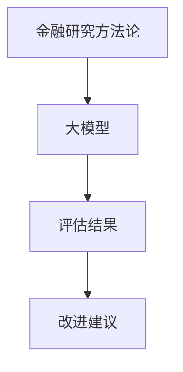

                 

# 开发基于大模型的金融研究方法论评估生成器

## 关键词：大模型，金融研究，方法论评估，生成器，人工智能，机器学习

## 摘要：随着人工智能和大模型技术的快速发展，金融研究领域对自动化、智能化的评估工具需求日益增长。本文系统性地探讨了如何利用大模型开发金融研究方法论评估生成器，从背景介绍、核心概念到算法实现、系统架构，再到项目实战和最佳实践，全面解析了该生成器的开发过程。通过详细的理论分析和实践指导，本文为金融研究人员和开发者提供了一套完整的解决方案，助力金融研究的智能化和高效化。

---

# 第一部分: 开发基于大模型的金融研究方法论评估生成器概述

# 第1章: 背景介绍

## 1.1 问题背景

### 1.1.1 传统金融研究方法的局限性
传统的金融研究方法依赖于人工分析和经验判断，存在以下问题：
- 数据处理能力有限，难以应对海量金融数据。
- 方法论的评估主观性强，缺乏客观标准。
- 研究效率低下，难以快速响应市场变化。

### 1.1.2 大模型在金融研究中的潜力
大模型（如GPT、BERT等）具备强大的自然语言处理和模式识别能力，能够：
- 自动化分析金融文献和数据。
- 生成高质量的金融研究报告。
- 提供方法论的自动化评估。

### 1.1.3 金融研究方法论评估的重要性
金融研究方法论的评估是确保研究成果可靠性和有效性的关键，包括：
- 研究设计的合理性。
- 数据来源的准确性。
- 方法选择的科学性。
- 结果解释的清晰性。

## 1.2 问题描述

### 1.2.1 金融研究方法论的评估标准
金融研究方法论的评估需要考虑以下维度：
- **研究目标**：是否明确且合理。
- **数据来源**：数据是否可靠、完整。
- **方法选择**：方法是否适合研究问题。
- **结果分析**：结果是否具有说服力和解释性。
- **结论推导**：结论是否基于充分的证据。

### 1.2.2 评估方法论的挑战
传统评估方法存在以下问题：
- 评估过程耗时长，依赖人工经验。
- 评估标准不统一，缺乏客观性。
- 数据量大，难以处理。

### 1.2.3 基于大模型的解决方案
利用大模型的自然语言处理能力，可以实现：
- 自动化评估金融研究方法论的多个维度。
- 提供个性化的评估建议和改进建议。
- 实现实时反馈和动态优化。

## 1.3 问题解决

### 1.3.1 大模型在金融研究中的应用场景
大模型可以应用于：
- 自动化阅读和分析金融文献。
- 生成金融研究报告。
- 评估金融研究方法论的合理性。
- 提供金融数据的预测和分析。

### 1.3.2 方法论评估生成器的目标
生成器的目标是：
- 提供一个自动化、智能化的金融研究方法论评估工具。
- 帮助研究人员快速发现问题并优化研究过程。
- 降低评估成本，提高评估效率。

### 1.3.3 技术实现路径
技术实现路径包括：
1. 数据预处理：收集和整理金融研究方法论的样本数据。
2. 模型训练：基于大模型进行微调，使其适应金融评估任务。
3. 系统开发：开发用户友好的评估生成器界面。
4. 测试与优化：通过实际应用不断优化评估准确性和效率。

## 1.4 边界与外延

### 1.4.1 方法论评估的边界
评估的边界包括：
- 仅针对定量分析方法，不涉及定性分析。
- 适用于中短期研究，不支持长期预测。

### 1.4.2 大模型应用的局限性
大模型的局限性包括：
- 对小样本数据的适应性较差。
- 可能存在模型过拟合问题。
- 对领域知识的依赖性较高。

### 1.4.3 未来可能的扩展方向
未来可以扩展的方向包括：
- 支持更多金融领域的评估任务。
- 结合区块链技术实现数据溯源。
- 引入强化学习优化评估结果。

## 1.5 概念结构与核心要素

### 1.5.1 核心概念列表
- 大模型：用于自然语言处理和生成的核心技术。
- 金融研究方法论：金融研究中采用的各种研究方法和流程。
- 方法论评估：对研究方法的合理性和有效性进行评估的过程。
- 生成器：用于自动生成评估结果的工具或系统。

### 1.5.2 概念之间的关系
- 大模型是实现方法论评估的核心技术。
- 方法论评估是生成器的主要功能。
- 生成器通过大模型对金融研究方法进行自动化评估。

### 1.5.3 核心要素的详细描述
- **大模型**：基于Transformer的架构，具备强大的文本理解和生成能力。
- **金融研究方法论**：包括定性研究和定量研究，涉及数据收集、分析和结论推导。
- **方法论评估**：通过算法对研究方法的合理性、科学性和有效性进行评分。
- **生成器**：一个用户友好的工具，能够快速输出评估结果和改进建议。

---

# 第2章: 核心概念与联系

## 2.1 AI大模型的基本原理

### 2.1.1 大模型的定义与特点
大模型是指基于深度学习的大型神经网络模型，具有以下特点：
- 参数量大，通常超过 billions。
- 使用Transformer架构，支持自注意力机制。
- 具备强大的上下文理解和生成能力。

### 2.1.2 大模型的训练机制
大模型的训练机制包括：
- **预训练**：在大规模通用数据上进行无监督学习。
- **微调**：针对特定任务进行有监督学习。
- **推理**：基于训练好的模型进行文本生成或分类。

### 2.1.3 大模型的应用框架
大模型的应用框架包括：
- **输入处理**：将金融研究方法论文本输入模型。
- **模型推理**：模型对输入文本进行理解和分析。
- **输出生成**：生成评估结果和改进建议。

## 2.2 金融研究方法论的评估标准

### 2.2.1 方法论评估的维度
评估维度包括：
- 研究目标的明确性。
- 数据来源的可靠性。
- 方法选择的科学性。
- 结果分析的充分性。
- 结论推导的合理性。

### 2.2.2 各维度的评估指标
- **研究目标**：评估指标包括目标的清晰度、具体性和可行性。
- **数据来源**：评估指标包括数据的完整性、准确性和代表性。
- **方法选择**：评估指标包括方法的适用性、有效性和创新性。
- **结果分析**：评估指标包括结果的逻辑性、一致性和说服力。
- **结论推导**：评估指标包括结论的合理性和可验证性。

### 2.2.3 评估标准的权重分配
评估标准的权重分配可以根据研究领域和具体需求进行调整，例如：
- 研究目标：权重30%
- 数据来源：权重25%
- 方法选择：权重25%
- 结果分析：权重15%
- 结论推导：权重5%

## 2.3 大模型与金融研究的结合

### 2.3.1 大模型在金融分析中的应用
大模型可以应用于：
- 金融新闻的自动摘要。
- 金融数据的预测和分析。
- 金融报告的自动生成。

### 2.3.2 方法论评估的自动化实现
通过大模型可以实现：
- 研究方法的自动化评估。
- 自动生成评估报告。
- 提供改进建议。

### 2.3.3 大模型与金融研究的协同效应
大模型与金融研究的协同效应体现在：
- 提高研究效率。
- 增强研究结果的可信度。
- 降低研究成本。

## 2.4 核心概念的对比分析

### 2.4.1 大模型与传统机器学习的对比
| 特性               | 大模型                  | 传统机器学习         |
|--------------------|-------------------------|----------------------|
| 模型复杂度         | 高参数量，深度网络       | 较低复杂度，浅层网络  |
| 自然语言处理能力   | 强大                   | 较弱                 |
| 需要的标注数据     | 较少                   | 较多                 |
| 应用场景           | 文本生成、分类、摘要     | 分类、回归、聚类      |

### 2.4.2 金融研究方法论的评估与实际应用
评估与实际应用的关系：
- 评估是实际应用的基础，确保研究方法的科学性和有效性。
- 实际应用依赖于评估结果，优化研究过程和方法。

### 2.4.3 大模型在不同金融领域的适用性
大模型在不同金融领域的适用性：
- **股票市场**：用于预测股票价格和分析市场趋势。
- **风险管理**：用于评估和管理金融风险。
- **信用评估**：用于评估个人和企业的信用状况。

## 2.5 ER实体关系图

---

# 第3章: 算法原理讲解

## 3.1 大模型的训练机制

### 3.1.1 基于Transformer的模型结构
Transformer模型的基本结构包括：
- **编码器**：负责将输入序列编码为高维向量。
- **解码器**：负责根据编码器输出生成目标序列。

### 3.1.2 注意力机制的实现
注意力机制的数学表达式为：
$$
\text{Attention}(Q, K, V) = \text{softmax}\left(\frac{QK^T}{\sqrt{d_k}}\right)V
$$
其中，$Q$、$K$、$V$分别是查询、键和值矩阵，$d_k$是键的维度。

### 3.1.3 大模型的训练流程
训练流程包括：
1. **数据预处理**：清洗和归一化数据。
2. **模型初始化**：随机初始化模型参数。
3. **前向传播**：输入数据，计算预测值。
4. **损失计算**：计算预测值与真实值的损失。
5. **反向传播**：计算梯度，更新模型参数。
6. **重复迭代**：直到满足收敛条件。

## 3.2 方法论评估的算法实现

### 3.2.1 评估指标的权重计算
评估指标的权重计算可以通过层次分析法（AHP）实现：
1. 构建评估指标的比较矩阵。
2. 计算各指标的权重。
3. 进行一致性检验。

### 3.2.2

---

通过以上目录结构，我们可以系统性地开发和实现基于大模型的金融研究方法论评估生成器，从理论到实践，全面覆盖开发过程中的关键环节。

