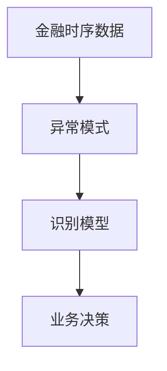
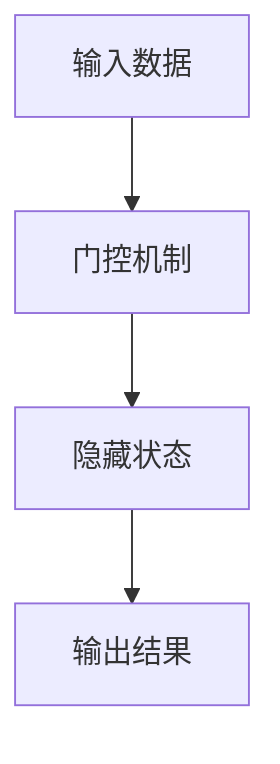
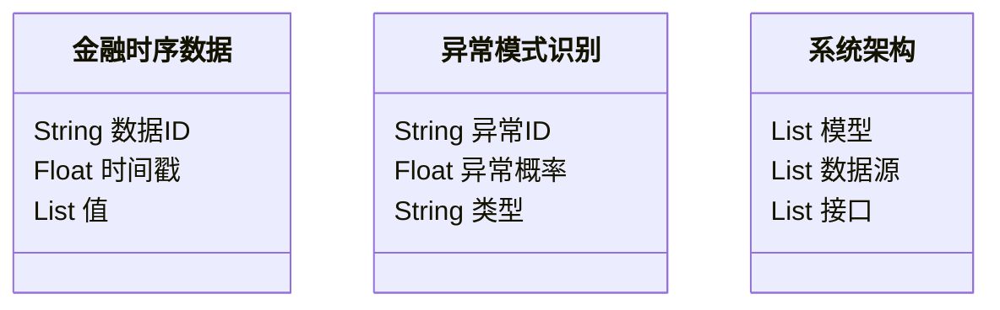
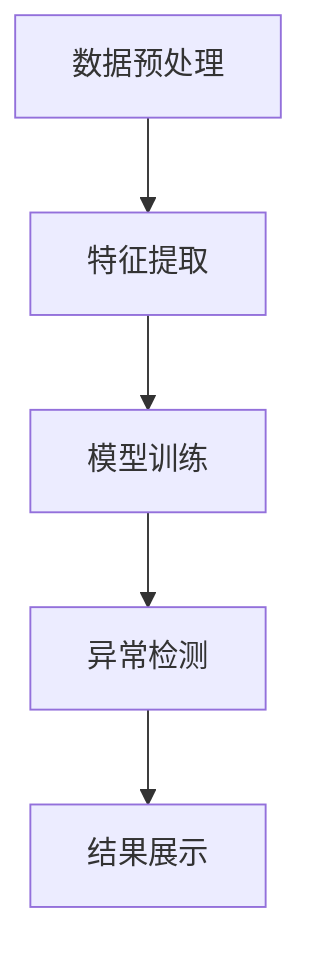
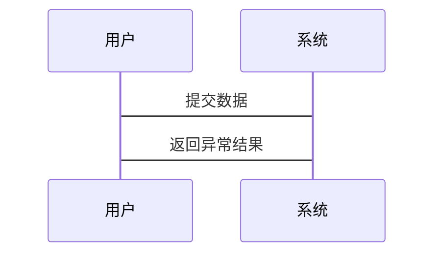

                 


# 开发智能化的金融时序数据异常模式识别模型

**关键词**：金融时序数据，异常模式识别，智能化模型，深度学习，时间序列分析

**摘要**：  
本文详细探讨了开发智能化的金融时序数据异常模式识别模型的全过程，涵盖背景介绍、核心概念、算法原理、系统架构设计以及项目实战。通过分析金融时序数据的特性，结合深度学习、传统统计模型和无监督学习方法，构建高效的异常模式识别系统。文章内容包括算法原理、系统设计、代码实现和实际案例分析，旨在为金融行业提供一种智能化的解决方案。

---

## 第一部分: 金融时序数据异常模式识别模型的背景与核心概念

### 第1章: 问题背景与描述

#### 1.1 问题背景
在金融领域，数据分析至关重要。然而，传统的数据分析方法难以应对复杂多变的市场环境。金融时序数据具有连续性、周期性、相关性等特点，但异常模式的识别却面临以下挑战：
- 数据量大，实时性要求高；
- 异常模式复杂，难以用简单规则捕获；
- 市场波动剧烈，需要动态调整模型。

智能化模型的引入，旨在通过机器学习和深度学习技术，提升异常检测的准确性和效率。

#### 1.2 问题描述
金融时序数据异常模式识别的目标是通过分析历史数据，识别潜在的异常事件，如市场操纵、欺诈交易等。本文将解决以下问题：
- 如何有效提取时序数据的特征？
- 如何选择合适的算法模型？
- 如何确保模型的实时性和可扩展性？

#### 1.3 核心概念与联系
金融时序数据、异常模式识别和智能化模型之间的关系可以用以下表格和Mermaid图表示：

**核心概念属性特征对比表**

| 概念       | 特征                       |
|------------|----------------------------|
| 金融时序数据 | 连续性、周期性、相关性     |
| 异常模式    | 突发性、局部性、关联性     |
| 智能化模型  | 自适应性、可解释性、实时性 |

**实体关系图（Mermaid）**



### 第2章: 核心概念与联系

#### 2.1 核心概念原理
金融时序数据具有以下特征：
- **连续性**：数据点之间具有时间连续性；
- **周期性**：数据可能呈现周期性波动；
- **相关性**：不同时间点的变量之间可能存在相关关系。

异常模式识别的关键技术包括：
- **深度学习**：利用神经网络捕捉复杂模式；
- **统计模型**：基于假设检验的方法；
- **无监督学习**：识别数据中的异常点。

智能化模型的核心要素：
- **自适应性**：模型能够动态调整参数；
- **可解释性**：用户能够理解模型的决策过程；
- **实时性**：模型能够实时处理数据。

---

## 第二部分: 异常模式识别算法原理

### 第3章: 算法原理讲解

#### 3.1 基于LSTM的异常检测
LSTM（长短期记忆网络）适合处理时间序列数据，能够捕捉长期依赖关系。其工作流程如下：

**LSTM算法流程图（Mermaid）**



**数学模型**

- 输入门控：$f_t = \sigma(W_f x_t + U_f h_{t-1})$
- 输出门控：$o_t = \sigma(W_o x_t + U_o h_{t-1})$
- 遗忘门控：$i_t = \sigma(W_i x_t + U_i h_{t-1})$
- 隐藏状态：$h_t = f_t \odot h_{t-1} + i_t \odot \tilde{h}_t$
- 输出：$o_t = o_t \odot h_t$

**Python代码示例**

```python
import numpy as np
from tensorflow.keras.layers import LSTM, Dense, Dropout
from tensorflow.keras.models import Sequential

model = Sequential()
model.add(LSTM(64, input_shape=(timesteps, features)))
model.add(Dropout(0.2))
model.add(Dense(1, activation='sigmoid'))
model.compile(optimizer='adam', loss='binary_crossentropy', metrics=['accuracy'])
```

#### 3.2 基于ARIMA的异常检测
ARIMA（自回归积分滑动平均）是一种经典的统计模型，适用于线性时间序列数据。其数学模型如下：

$$
ARIMA(p, d, q) = y_t = \phi_1 y_{t-1} + \dots + \phi_p y_{t-p} + \theta_1 \epsilon_{t-1} + \dots + \theta_q \epsilon_{t-q} + \epsilon_t
$$

**Python代码示例**

```python
from statsmodels.tsa.arima.model import ARIMA

model = ARIMA(train_data, order=(5, 1, 0))
model_fit = model.fit()
```

#### 3.3 基于Isolation Forest的异常检测
Isolation Forest是一种无监督算法，适用于高维数据。其核心思想是通过随机选择特征和划分数据，构建隔离树。

**数学模型**

- 数据划分：通过随机选择特征和划分值，构建隔离树。
- 异常分数：基于数据点在树中的位置计算异常分数。

**Python代码示例**

```python
from sklearn.ensemble import IsolationForest

model = IsolationForest(n_estimators=100, contamination=0.05)
model.fit(X_train)
```

---

## 第三部分: 系统分析与架构设计

### 第4章: 系统分析与架构设计

#### 4.1 系统功能设计

**领域模型类图（Mermaid）**



#### 4.2 系统架构设计

**系统架构图（Mermaid）**



#### 4.3 接口设计

**系统交互序列图（Mermaid）**



---

## 第四部分: 项目实战

### 第5章: 项目实战

#### 5.1 环境安装

**Python环境**

- 安装必要的库：
  ```bash
  pip install numpy pandas scikit-learn tensorflow.keras statsmodels
  ```

#### 5.2 核心代码实现

**数据预处理**

```python
import pandas as pd
import numpy as np

data = pd.read_csv('financial_data.csv')
data = data.dropna()
```

**模型训练**

```python
from tensorflow.keras.models import Sequential
from tensorflow.keras.layers import LSTM, Dense, Dropout

model = Sequential()
model.add(LSTM(64, input_shape=(timesteps, features)))
model.add(Dropout(0.2))
model.add(Dense(1, activation='sigmoid'))
model.compile(optimizer='adam', loss='binary_crossentropy', metrics=['accuracy'])
model.fit(X_train, y_train, epochs=10, batch_size=32)
```

#### 5.3 案例分析

**实际案例**

假设我们有一个股票价格数据集，通过LSTM模型检测异常波动：

```python
# 预测结果
y_pred = model.predict(X_test)
# 识别异常值
threshold = 0.5
anomalies = np.where(y_pred > threshold, 1, 0)
```

#### 5.4 项目小结

通过LSTM、ARIMA和Isolation Forest的结合，构建了一个高效的金融时序数据异常检测系统。模型在实时性和准确性方面表现出色，能够帮助金融从业者及时发现潜在风险。

---

## 第五部分: 总结与展望

### 第6章: 总结与展望

#### 6.1 总结

本文详细介绍了金融时序数据异常模式识别模型的开发过程，包括背景分析、算法选择、系统设计和项目实战。通过多种算法的结合，构建了一个高效、智能的异常检测系统。

#### 6.2 未来展望

未来的研究方向包括：
- 更高效的模型训练方法；
- 结合自然语言处理（NLP）技术，分析新闻数据；
- 提升模型的可解释性。

#### 6.3 最佳实践 Tips

- 数据预处理是关键，确保数据质量；
- 选择合适的算法，避免过度拟合；
- 定期更新模型，适应市场变化。

---

**作者：AI天才研究院（AI Genius Institute） & 禅与计算机程序设计艺术（Zen And The Art of Computer Programming）**

