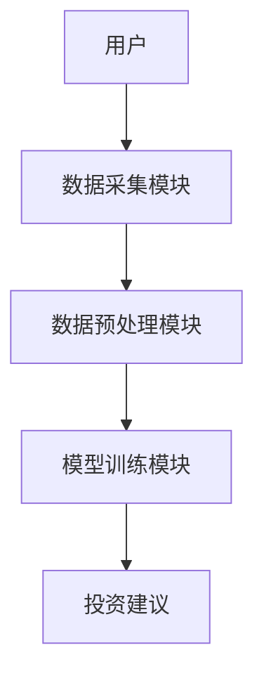

                 


# 投资理财智能助手的数据收集与预处理技巧

## 关键词：数据收集、数据预处理、投资理财、特征工程、机器学习

## 摘要：本文详细探讨了投资理财智能助手在数据收集与预处理过程中的关键技巧。从数据收集的重要性到数据预处理的核心步骤，再到特征工程和系统架构设计，文章通过丰富的案例和详细的代码实现，全面解析了如何高效、准确地处理投资理财数据，以支持智能决策。

---

# 第一部分：投资理财智能助手的背景与数据收集基础

## 第1章：投资理财智能助手的背景介绍

### 1.1 投资理财智能助手的定义与目标
#### 1.1.1 投资理财智能助手的定义
投资理财智能助手是一种结合人工智能和大数据技术的工具，旨在为用户提供个性化的投资建议、风险评估和资产配置方案。它通过分析海量数据，帮助用户做出更明智的投资决策。

#### 1.1.2 投资理财智能助手的核心目标
- 提供实时市场数据和分析
- 帮助用户制定投资策略
- 自动化管理投资组合
- 提供风险预警和收益预测

#### 1.1.3 投资理财智能助手的边界与外延
投资理财智能助手的边界包括数据收集、分析和决策支持，而外延则涵盖金融市场的各种数据源，如股票、基金、债券等。

---

### 1.2 数据收集在投资理财中的重要性
#### 1.2.1 数据收集的定义与作用
数据收集是投资理财智能助手的核心环节，通过收集市场数据、用户行为数据等，为后续分析提供基础。

#### 1.2.2 数据收集在投资理财中的应用场景
- 实时监控市场动态
- 分析用户投资偏好
- 评估投资风险

#### 1.2.3 数据收集的挑战与解决方案
- 数据来源多样且复杂
- 数据质量参差不齐
- 数据安全和隐私保护

---

### 1.3 数据预处理的基本概念
#### 1.3.1 数据预处理的定义
数据预处理是指在数据被用于机器学习模型之前，对数据进行清洗、转换和增强的过程。

#### 1.3.2 数据预处理的目标
- 提高数据质量
- 降低数据噪声
- 提升模型性能

#### 1.3.3 数据预处理的流程与步骤
1. 数据清洗：处理缺失值、异常值
2. 数据转换：标准化、归一化
3. 数据增强：特征提取、特征选择

---

## 第2章：数据收集的方法与技术

### 2.1 数据收集的来源与分类
#### 2.1.1 数据来源的分类
- 市场数据：股票价格、指数数据
- 用户数据：投资偏好、交易记录
- 新闻数据：财经新闻、市场评论

#### 2.1.2 数据类型的分类
- 结构化数据：表格数据
- 非结构化数据：文本、图像

#### 2.1.3 数据收集的渠道分析
- 网络爬取
- API接口调用
- 数据库采集

---

### 2.2 网络数据收集技术
#### 2.2.1 网络爬虫的基本原理
- 使用Python的requests库进行网页请求
- 使用BeautifulSoup进行数据解析

#### 2.2.2 网络API接口调用技术
- 调用金融数据API（如Yahoo Finance API）
- 数据解析与处理

#### 2.2.3 数据爬取的法律与道德规范
- 遵守网站的使用协议
- 遵守相关法律法规

---

### 2.3 数据库与文件数据收集
#### 2.3.1 数据库数据收集的基本方法
- 使用SQL查询数据库
- 数据抽取与转换

#### 2.3.2 文件数据的读取与解析
- 读取CSV文件
- 解析JSON文件

#### 2.3.3 数据抽取工具的使用
- 使用Pandas进行数据加载

---

## 第3章：数据预处理的核心步骤

### 3.1 数据清洗的基本概念
#### 3.1.1 数据清洗的定义
数据清洗是指识别和处理数据中的错误、不一致或缺失的部分。

#### 3.1.2 数据清洗的常见方法
- 删除重复数据
- 处理缺失值
- 删除异常值

---

### 3.2 数据转换与标准化
#### 3.2.1 数据转换的定义
数据转换是指将数据从一种形式转换为另一种形式，以便更好地用于模型训练。

#### 3.2.2 数据标准化的必要性
- 保证不同特征的尺度一致
- 提高模型的训练效率

#### 3.2.3 常用的数据转换方法
- 标准化：使用Z-score方法
- 分箱：将连续变量离散化

---

### 3.3 数据增强与特征工程
#### 3.3.1 数据增强的定义
数据增强是指通过增加数据的多样性和复杂性来提高模型的泛化能力。

#### 3.3.2 特征工程的基本概念
特征工程是指通过选择和创建特征来提高模型性能的过程。

#### 3.3.3 数据增强与特征工程的实现方法
- 特征提取：使用主成分分析（PCA）
- 特征选择：使用Lasso回归进行特征筛选

---

## 第4章：特征工程与数据预处理的高级技巧

### 4.1 特征工程的基本原理
#### 4.1.1 特征工程的重要性
- 提高模型的解释性
- 提升模型的预测精度

#### 4.1.2 特征工程的核心步骤
- 特征提取
- 特征变换
- 特征选择

---

### 4.2 时间序列数据的处理
#### 4.2.1 时间序列数据的定义
时间序列数据是指按时间顺序排列的数据。

#### 4.2.2 时间序列数据的特征提取
- 移动平均线（MA）
- 指数平滑（Exponential Smoothing）

---

### 4.3 文本数据的处理
#### 4.3.1 文本数据的清洗
- 去除停用词
- 分词处理

#### 4.3.2 文本数据的向量化
- 使用TF-IDF进行文本表示
- 使用Word2Vec生成词向量

---

## 第5章：机器学习基础与算法原理

### 5.1 机器学习基础
#### 5.1.1 常用机器学习算法
- 线性回归
- 支持向量机（SVM）
- 随机森林

#### 5.1.2 机器学习算法的评估指标
- 准确率
- 召回率
- F1分数

---

## 第6章：系统架构设计与实现

### 6.1 系统架构设计
#### 6.1.1 系统功能设计
- 数据采集模块
- 数据预处理模块
- 模型训练模块

#### 6.1.2 系统架构图


---

## 第7章：项目实战与案例分析

### 7.1 环境安装与配置
- 安装Python和相关库（如Pandas、Scikit-learn）

### 7.2 核心代码实现
#### 数据收集与预处理
```python
import pandas as pd
import numpy as np

# 数据清洗
df = pd.read_csv('data.csv')
df.dropna(inplace=True)
df['price'] = df['price'].apply(lambda x: x.strip('$'))

# 特征工程
from sklearn.preprocessing import StandardScaler
scaler = StandardScaler()
scaled_features = scaler.fit_transform(df[['price', 'volume']])
```

#### 模型训练与评估
```python
from sklearn.ensemble import RandomForestRegressor
model = RandomForestRegressor()
model.fit(scaled_features, df['target'])
print(model.score(scaled_features, df['target']))
```

### 7.3 案例分析
- 通过实际案例展示数据预处理对模型性能的提升。

---

## 第8章：最佳实践与小结

### 8.1 最佳实践
- 数据收集前明确需求
- 数据预处理中注重特征工程
- 模型训练后进行充分验证

### 8.2 小结
投资理财智能助手的数据收集与预处理是一个复杂但关键的过程。通过合理的技术和方法，可以显著提升模型的性能和投资决策的准确性。

---

## 作者：AI天才研究院/AI Genius Institute & 禅与计算机程序设计艺术 /Zen And The Art of Computer Programming

---

**注意：以上目录大纲仅为示例，实际内容需要根据具体需求进行调整和补充。**

