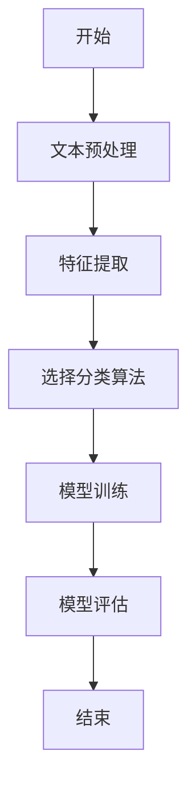
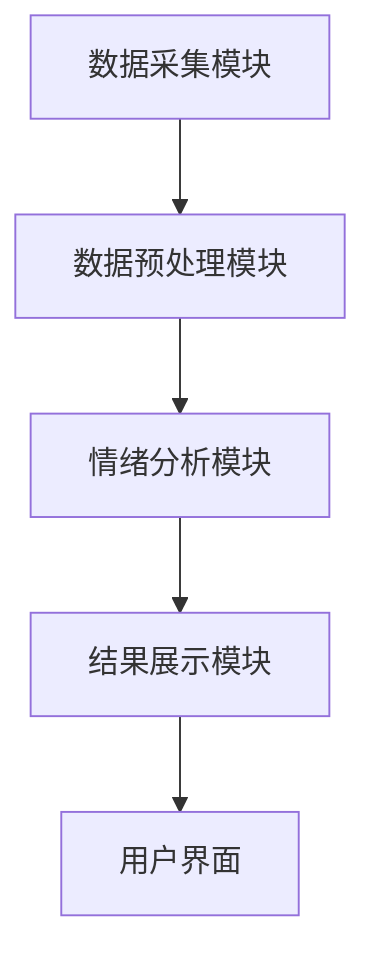

                 


# 目录大纲：智能加密货币市场情绪分析系统

---

## 第一部分：背景介绍

### 第1章：智能加密货币市场情绪分析系统概述

#### 1.1 问题背景
- 1.1.1 加密货币市场的波动性与不确定性
- 1.1.2 情绪分析在投资决策中的重要性
- 1.1.3 当前市场情绪分析的挑战与局限

#### 1.2 问题描述
- 1.2.1 加密货币市场的数据特点
- 1.2.2 情绪分析的目标与范围
- 1.2.3 系统需要解决的核心问题

#### 1.3 问题解决
- 1.3.1 智能情绪分析系统的解决方案
- 1.3.2 系统的核心功能与目标
- 1.3.3 解决方案的创新点与优势

#### 1.4 系统边界与外延
- 1.4.1 系统的功能边界
- 1.4.2 系统的适用范围与限制
- 1.4.3 系统与其他系统的接口关系

#### 1.5 核心概念与组成
- 1.5.1 系统的核心要素
- 1.5.2 各要素之间的关系
- 1.5.3 系统的整体架构

---

## 第二部分：核心概念与联系

### 第2章：情绪分析与加密货币市场的关联

#### 2.1 情绪分析的定义与原理
- 2.1.1 情绪分析的定义
- 2.1.2 情绪分析的基本原理
- 2.1.3 情绪分析的关键技术

#### 2.2 加密货币市场的特点
- 2.2.1 加密货币市场的波动性
- 2.2.2 市场参与者的多样性
- 2.2.3 市场信息的分散性

#### 2.3 情绪分析在加密货币市场的应用
- 2.3.1 市场预测
- 2.3.2 投资决策支持
- 2.3.3 风险管理

#### 2.4 核心概念的ER实体关系图

```mermaid
erDiagram
    actor User {
        <name>
        <id>
    }
    class Tweet {
        <id>
        <content>
        <sentiment_score>
        <timestamp>
    }
    class Market_Data {
        <id>
        <price>
        <volume>
        <timestamp>
    }
    class Sentiment_Analysis_System {
        <id>
        <analysis_result>
        <timestamp>
    }
    User --> Tweet : posts
    Tweet --> Sentiment_Analysis_System : analyzed by
    Market_Data --> Sentiment_Analysis_System : associated with
```

---

## 第三部分：算法原理

### 第3章：情绪分析算法的核心原理

#### 3.1 文本预处理
- 3.1.1 数据清洗与标准化
- 3.1.2 分词与词干提取
- 3.1.3 停用词处理与词向量表示

#### 3.2 特征提取
- 3.2.1 基于词袋模型的特征提取
- 3.2.2 基于词嵌入的特征提取（如Word2Vec、GloVe）
- 3.2.3 高阶特征（如情感强度、情绪倾向）

#### 3.3 情感分类模型
- 3.3.1 基于机器学习的分类算法（如SVM、随机森林）
- 3.3.2 基于深度学习的分类算法（如LSTM、Transformer）
- 3.3.3 模型调优与评估指标

#### 3.4 算法流程图



#### 3.5 核心代码实现

```python
import numpy as np
from sklearn.feature_extraction.text import TfidfVectorizer
from sklearn.svm import SVC
from sklearn.metrics import accuracy_score

# 示例数据
tweets = ["I love Bitcoin!", "This is a scam.", "The market is bullish today."]

# 文本预处理
vectorizer = TfidfVectorizer()
X = vectorizer.fit_transform(tweets)

# 模型训练
model = SVC()
model.fit(X, [1, 0, 1])

# 预测与评估
new_tweet = ["I'm bearish on Ethereum."]
X_new = vectorizer.transform([new_tweet[0]])
print("预测结果：", model.predict(X_new))
print("准确率：", accuracy_score([0], model.predict(X_new)))
```

#### 3.6 数学公式

- 情感分类的损失函数：
  $$ L = -\frac{1}{n}\sum_{i=1}^{n} [y_i \cdot \log(p_i) + (1-y_i) \cdot \log(1-p_i)] $$
  
  其中，$y_i$ 是真实标签，$p_i$ 是模型预测的概率。

---

## 第四部分：系统分析与架构设计

### 第4章：系统架构设计

#### 4.1 问题场景介绍
- 4.1.1 系统的使用场景
- 4.1.2 系统的用户角色
- 4.1.3 系统的运行环境

#### 4.2 项目介绍
- 4.2.1 项目目标
- 4.2.2 项目范围
- 4.2.3 项目技术选型

#### 4.3 系统功能设计
- 4.3.1 系统功能模块划分
- 4.3.2 功能模块之间的关系
- 4.3.3 功能模块的交互流程

#### 4.4 系统架构设计
- 4.4.1 系统架构图



- 4.4.2 接口设计
- 4.4.3 交互设计

---

## 第五部分：项目实战

### 第5章：智能情绪分析系统实现

#### 5.1 环境安装
- 5.1.1 安装Python
- 5.1.2 安装必要的库（如scikit-learn、TensorFlow、Keras）

#### 5.2 核心代码实现
- 5.2.1 数据采集与预处理
- 5.2.2 模型训练与优化
- 5.2.3 结果展示与可视化

#### 5.3 代码解读与分析
- 5.3.1 核心算法的实现细节
- 5.3.2 系统各模块的代码解读
- 5.3.3 系统运行结果的分析

#### 5.4 实际案例分析
- 5.4.1 案例背景
- 5.4.2 数据准备
- 5.4.3 系统运行
- 5.4.4 结果解读与分析

#### 5.5 项目小结
- 5.5.1 项目实现的关键点
- 5.5.2 项目中的经验与教训
- 5.5.3 项目后续的改进方向

---

## 第六部分：优化与扩展

### 第6章：系统优化与扩展

#### 6.1 系统优化
- 6.1.1 模型优化（如超参数调优、模型融合）
- 6.1.2 系统性能优化（如分布式计算、缓存优化）
- 6.1.3 数据处理优化（如实时数据流处理）

#### 6.2 系统扩展
- 6.2.1 扩展到其他金融市场
- 6.2.2 结合其他数据分析技术（如NLP、时间序列分析）
- 6.2.3 与其他系统的集成（如交易系统、预警系统）

#### 6.3 最佳实践 tips
- 6.3.1 开发过程中的注意事项
- 6.3.2 系统部署与维护的建议
- 6.3.3 数据安全与隐私保护的要点

#### 6.4 小结
- 6.4.1 优化与扩展的核心目标
- 6.4.2 优化与扩展的具体实施步骤
- 6.4.3 优化与扩展的预期效果

---

## 第七部分：总结与展望

### 第7章：总结与展望

#### 7.1 项目总结
- 7.1.1 项目的主要成果
- 7.1.2 项目的关键技术
- 7.1.3 项目的价值与意义

#### 7.2 未来展望
- 7.2.1 情绪分析技术的未来发展趋势
- 7.2.2 加密货币市场的未来挑战与机遇
- 7.2.3 系统的未来优化与扩展方向

---

## 作者信息

作者：AI天才研究院/AI Genius Institute & 禅与计算机程序设计艺术 /Zen And The Art of Computer Programming

