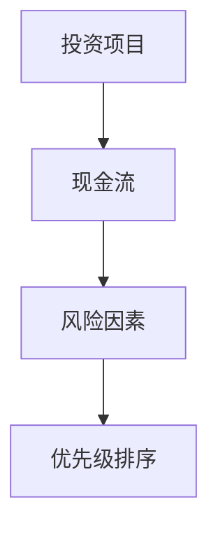
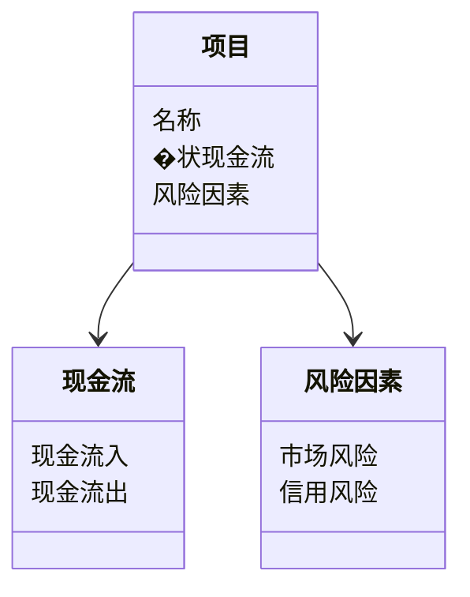
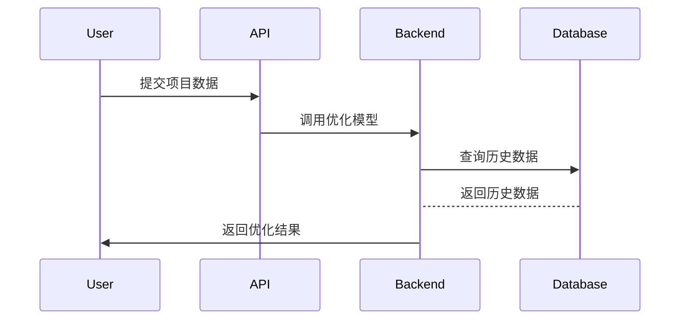

                 


# 智能化企业资本支出优化决策模型设计

## 关键词：
智能化资本支出优化、数学模型与算法、系统架构设计、机器学习应用、项目实战与案例分析

## 摘要：
随着企业竞争的加剧，资本支出优化在企业战略管理中的重要性日益凸显。本文提出了智能化企业资本支出优化决策模型的设计方案，通过整合数学模型、机器学习算法和系统架构设计，构建了一个高效、可靠的决策支持系统。文章详细探讨了模型的核心概念、算法原理、系统架构，并通过实际案例分析展示了模型的应用效果。本文还总结了项目实战中的经验，为企业在资本支出优化方面提供了有价值的参考和指导。

---

# 第1章：资本支出优化决策模型的背景与意义

## 1.1 问题背景与描述

### 1.1.1 资本支出优化的定义
资本支出优化是指企业在规划和执行资本支出项目时，通过科学的方法和工具，优化资源配置，以实现投资收益最大化和成本最小化的过程。

### 1.1.2 企业资本支出管理的挑战
企业在资本支出管理中面临诸多挑战，如项目优先级排序、资金分配、风险评估、预测准确性等问题。这些问题往往导致资源浪费、投资回报率低下，甚至影响企业的长期发展。

### 1.1.3 智能化决策的必要性
随着数据量的爆炸式增长和计算能力的提升，智能化决策工具的应用成为可能。通过机器学习、大数据分析等技术，企业可以更高效地进行资本支出优化，提升决策的准确性和及时性。

## 1.2 问题解决与边界

### 1.2.1 优化目标的设定
资本支出优化的目标通常包括最大化投资回报率（ROI）、最小化资本成本、平衡短期与长期投资需求等。

### 1.2.2 模型的边界与外延
模型的边界包括企业内部的资本支出项目，不涉及外部投资。外延则涵盖项目的全生命周期管理，从立项到执行再到评估。

### 1.2.3 核心要素与组成结构
资本支出优化模型的核心要素包括：投资项目的现金流预测、风险评估、项目优先级排序、资金分配策略等。

---

# 第2章：核心概念原理与属性对比

## 2.1 核心概念原理

### 2.1.1 资本预算与投资决策
资本预算是企业规划资本支出的重要工具，投资决策则是在多个项目中选择最优的投资组合。

### 2.1.2 现金流预测与风险评估
现金流预测是评估投资项目可行性的重要依据，风险评估则帮助企业识别潜在风险并制定应对策略。

### 2.1.3 多目标优化与权衡
资本支出优化通常涉及多个目标，如收益最大化、成本最小化、风险最小化等，需要在这些目标之间进行权衡。

## 2.2 概念属性对比表

| 比较维度 | 动态规划算法 | 机器学习模型 |
|----------|--------------|--------------|
| 优势     | 解决多阶段问题 | 高精度预测   |
| 劣势     | 需要明确状态转移 | 对数据依赖性强 |
| 适用场景 | 离散决策问题 | 非线性关系问题 |

## 2.3 ER实体关系图



---

# 第3章：算法原理与数学模型

## 3.1 算法原理

### 3.1.1 动态规划算法原理
动态规划是一种用于优化问题的数学方法，通过分解问题为更小的子问题，并存储子问题的解来避免重复计算。

### 3.1.2 机器学习模型应用
机器学习模型，如随机森林、支持向量机等，可以用于预测现金流和评估项目风险。

### 3.1.3 示例代码实现
```python
def capital_expenditure_optimization(...):
    # 示例代码
    pass
```

## 3.2 数学模型与公式

### 3.2.1 现金流折现公式
$$ NPV = \sum_{t=1}^{n} \frac{CF_t}{(1 + r)^t} $$  
其中，NPV是净现值，CF_t是第t期的现金流，r是折现率。

### 3.2.2 多目标优化模型
$$ Maximize \quad Z = \sum_{i=1}^{m} w_i x_i $$  
$$ Subject \quad to \quad \sum_{j=1}^{n} a_{ij} x_j \leq b_i, \quad i=1,2,...,k $$  
其中，Z是目标函数，w_i是目标权重，x_i是决策变量，a_{ij}和b_i是约束条件的系数和常数。

---

# 第4章：系统分析与架构设计

## 4.1 问题场景与系统功能设计

### 4.1.1 企业资本支出管理现状
描述当前企业在资本支出管理中存在的问题，如数据分散、决策依赖经验等。

### 4.1.2 智能化决策的应用场景
列举智能化决策在资本支出优化中的具体应用场景，如项目优先级排序、风险评估等。

### 4.1.3 示例项目介绍
简要介绍一个实际的资本支出优化项目，描述项目目标、范围和主要成果。

## 4.2 系统功能设计

### 4.2.1 领域模型 mermaid 类图


### 4.2.2 功能模块划分
将系统功能划分为若干模块，如数据输入、模型计算、结果展示等。

### 4.2.3 示例功能流程
描述一个典型的功能流程，如从数据输入到结果展示的全过程。

## 4.3 系统架构设计

### 4.3.1 系统架构 mermaid 图


### 4.3.2 模块间交互关系
描述系统各模块之间的交互关系和数据流。

### 4.3.3 示例架构分析
对系统架构进行分析，说明其优缺点和适用性。

---

# 第5章：系统接口与交互设计

## 5.1 系统接口设计

### 5.1.1 API接口定义
定义系统提供的API接口，如数据接口、计算接口等。

### 5.1.2 接口调用流程
描述API接口的调用流程，包括请求格式、返回结果等。

### 5.1.3 示例接口代码
提供一个API接口的示例代码，展示如何调用接口。

## 5.2 系统交互设计

### 5.2.1 序列图 mermaid 图


### 5.2.2 交互流程分析
分析系统交互的流程，说明每个步骤的作用和意义。

### 5.2.3 示例交互场景
描述一个典型的交互场景，如用户提交项目数据并获得优化结果。

---

# 第6章：项目实战与案例分析

## 6.1 项目实战指导

### 6.1.1 环境安装与配置
指导读者如何搭建开发环境，包括安装Python、机器学习库等。

### 6.1.2 核心代码实现
提供项目的核心代码，如模型训练、数据处理等，并进行详细解读。

### 6.1.3 代码应用与分析
展示代码的应用效果，并对结果进行分析和优化建议。

## 6.2 案例分析与经验总结

### 6.2.1 案例背景介绍
介绍一个实际的资本支出优化项目，描述项目背景、目标和范围。

### 6.2.2 模型应用过程
详细描述模型在项目中的应用过程，包括数据收集、模型训练、结果分析等。

### 6.2.3 实施效果与反馈
总结项目的实施效果，包括投资回报率的提升、成本的降低等，并收集用户的反馈意见。

---

# 第7章：经验总结与最佳实践

## 7.1 经验总结
总结项目实施中的经验和教训，提出改进建议。

## 7.2 最佳实践
提供一些最佳实践，如数据质量管理、模型持续优化等。

## 7.3 小结
回顾全文，强调资本支出优化模型的重要性和应用价值。

## 7.4 注意事项
提醒读者在实施模型时需要注意的事项，如数据隐私、模型维护等。

## 7.5 拓展阅读
推荐一些相关的书籍、论文或资源，供读者深入学习。

---

# 作者信息

作者：AI天才研究院/AI Genius Institute & 禅与计算机程序设计艺术 /Zen And The Art of Computer Programming

---

通过本文的详细讲解，读者可以深入了解智能化企业资本支出优化决策模型的设计与应用。从背景分析到算法实现，再到系统架构设计和项目实战，文章全面覆盖了资本支出优化的各个方面。希望本文能为企业的资本支出优化提供有价值的参考和指导。

