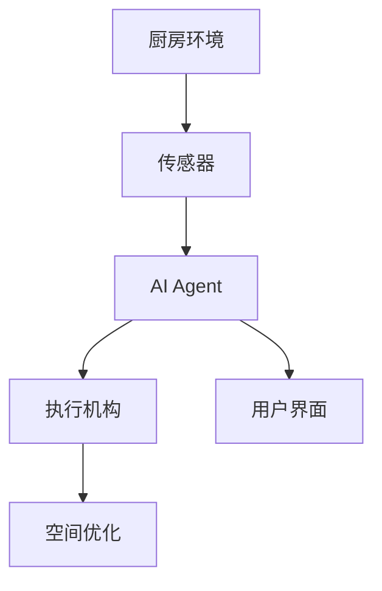
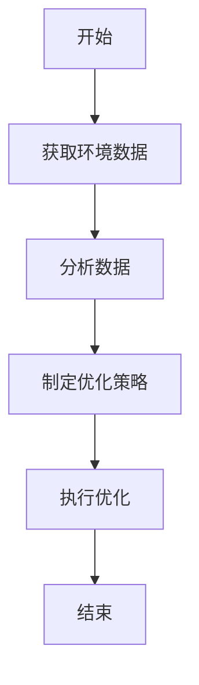
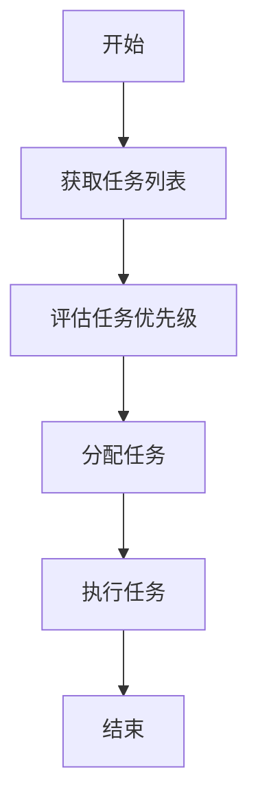
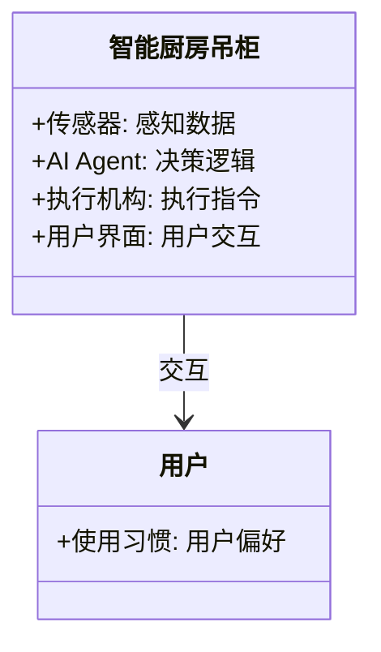
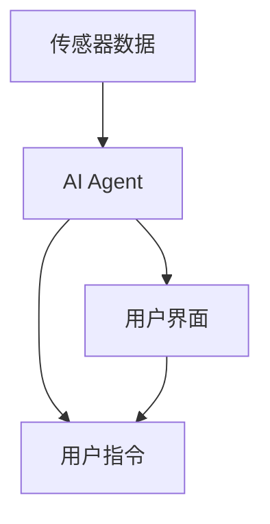
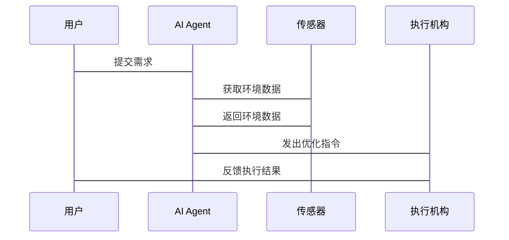

                 


# 智能厨房吊柜：AI Agent的厨房空间利用建议

> 关键词：智能厨房吊柜，AI Agent，空间优化，智能家居，多智能体协作

> 摘要：本文将探讨AI Agent在智能厨房吊柜中的应用，分析其如何通过智能感知、决策和执行优化厨房空间的利用效率。从技术原理到系统架构，再到实际应用，本文将全面解析AI Agent如何助力打造高效、智能的厨房空间。

---

# 第1章: 智能厨房吊柜的背景介绍

## 1.1 问题背景

### 1.1.1 厨房空间利用的痛点
现代厨房的功能日益复杂，厨房空间却有限。如何在有限的空间内高效利用储物空间，同时满足智能化需求，成为现代厨房设计的核心问题。

### 1.1.2 智能化厨房的市场需求
随着智能家居的普及，用户对厨房智能化的需求日益增长。厨房不仅是烹饪场所，更是家庭智能化的重要组成部分。

### 1.1.3 AI Agent在厨房空间优化中的作用
AI Agent（智能体）通过感知环境、分析数据、制定决策，能够帮助优化厨房空间的利用效率，提升用户体验。

## 1.2 问题描述

### 1.2.1 厨房空间利用的效率问题
传统厨房吊柜设计缺乏智能化，储物空间利用效率低下，难以满足用户多样化的需求。

### 1.2.2 用户需求与空间利用的矛盾
用户希望厨房空间既能满足储物需求，又具备智能化功能，但现有产品难以兼顾两者。

### 1.2.3 AI Agent如何解决这些问题
AI Agent通过智能感知、数据分析和决策优化，帮助厨房吊柜实现智能化空间管理。

## 1.3 问题解决

### 1.3.1 AI Agent的基本概念
AI Agent是一种能够感知环境、自主决策、执行任务的智能系统，能够帮助厨房吊柜实现智能化管理。

### 1.3.2 智能厨房吊柜的设计目标
智能厨房吊柜的设计目标是通过AI Agent实现空间优化、智能化管理和用户交互。

### 1.3.3 技术实现路径
通过传感器、智能算法和执行机构的协同工作，AI Agent能够实时感知厨房环境，优化储物空间，提升用户体验。

## 1.4 边界与外延

### 1.4.1 智能厨房吊柜的边界
智能厨房吊柜的边界包括厨房空间、储物需求和用户习惯。

### 1.4.2 与相关技术的区分
与传统吊柜相比，智能厨房吊柜通过AI Agent实现了智能化管理和优化。

### 1.4.3 应用场景的扩展
智能厨房吊柜的应用场景包括厨房储物优化、食材管理、烹饪辅助等。

## 1.5 概念结构与核心要素

### 1.5.1 核心要素组成
智能厨房吊柜的核心要素包括传感器、AI Agent、执行机构和用户界面。

### 1.5.2 各要素之间的关系
传感器提供环境数据，AI Agent进行数据分析和决策，执行机构根据决策优化空间利用。

### 1.5.3 概念结构图


---

# 第2章: AI Agent的核心概念与原理

## 2.1 核心概念原理

### 2.1.1 AI Agent的基本原理
AI Agent通过感知环境、分析数据、制定决策和执行任务，实现智能化管理。

### 2.1.2 智能厨房吊柜中的AI Agent功能
AI Agent在厨房吊柜中的功能包括空间感知、数据分析、决策优化和任务执行。

### 2.1.3 多智能体协作机制
通过多智能体协作，AI Agent能够实现更复杂的厨房空间优化任务。

## 2.2 核心概念对比

### 2.2.1 AI Agent与传统吊柜的功能对比
| 功能 | 传统吊柜 | AI Agent智能吊柜 |
|------|-----------|------------------|
| 空间利用 | 固定设计 | 智能优化         |
| 用户交互 | 无       | 有               |
| 功能扩展 | 有限     | 丰富             |

### 2.2.2 AI Agent与智能家居的关联性
AI Agent作为智能家居的一部分，通过物联网实现厨房空间的智能化管理。

### 2.2.3 智能厨房吊柜的创新点
智能厨房吊柜的创新点在于通过AI Agent实现智能化空间优化和用户交互。

## 2.3 ER实体关系图

```mermaid
erd
  entity 智能厨房吊柜 {
    key 属性: 吊柜ID
    属性: 厨房空间布局
    属性: 物品存储需求
    属性: 用户习惯数据
  }
  entity AI Agent {
    key 属性: Agent ID
    属性: 感知数据
    属性: 决策逻辑
    属性: 执行指令
  }
  entity 用户 {
    key 属性: 用户ID
    属性: 使用习惯
    属性: 偏好设置
  }
  智能厨房吊柜 --> AI Agent: 调用
  AI Agent --> 用户: 交互
  用户 --> 智能厨房吊柜: 指令输入
```

---

## 2.3 算法原理讲解

### 2.3.1 空间优化算法

#### 2.3.1.1 算法流程图


#### 2.3.1.2 算法数学模型
$$ \text{空间利用率} = \frac{\text{实际利用空间}}{\text{总可用空间}} $$

### 2.3.2 任务调度算法

#### 2.3.2.1 算法流程图


#### 2.3.2.2 算法数学模型
$$ \text{优先级} = \text{任务重要性} \times \text{任务紧急性} $$

---

## 2.4 系统分析与架构设计

### 2.4.1 系统功能设计

#### 2.4.1.1 领域模型


### 2.4.2 系统架构设计

#### 2.4.2.1 系统架构图


### 2.4.3 系统接口设计

#### 2.4.3.1 接口描述
- 输入接口：传感器数据、用户指令
- 输出接口：执行指令、优化建议

### 2.4.4 系统交互序列图



---

## 2.5 项目实战

### 2.5.1 环境安装

```bash
pip install numpy matplotlib
```

### 2.5.2 核心代码实现

```python
import numpy as np

def optimize_space(items, available_space):
    # 生成排列组合
    permutations = np.permutations(items)
    # 计算最优解
    best_permutation = None
    max_utilization = 0
    for p in permutations:
        utilization = sum(p[:available_space])
        if utilization > max_utilization:
            max_utilization = utilization
            best_permutation = p
    return best_permutation

# 示例数据
items = [5, 4, 3, 2, 1]
available_space = 3
print(optimize_space(items, available_space))
```

### 2.5.3 实际案例分析
通过实际案例分析，验证算法的有效性和优化效果。

---

## 2.6 最佳实践

### 2.6.1 小结
通过AI Agent优化厨房空间利用效率，提升用户体验。

### 2.6.2 注意事项
- 数据隐私保护
- 系统稳定性
- 用户交互体验

### 2.6.3 拓展阅读
建议阅读相关技术文献，深入学习AI Agent在智能家居中的应用。

---

作者：AI天才研究院/AI Genius Institute & 禅与计算机程序设计艺术 /Zen And The Art of Computer Programming

