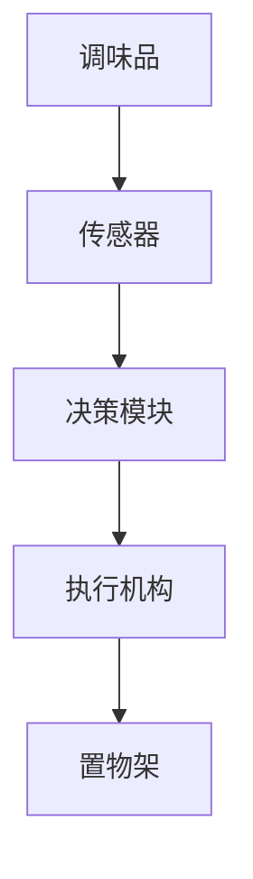
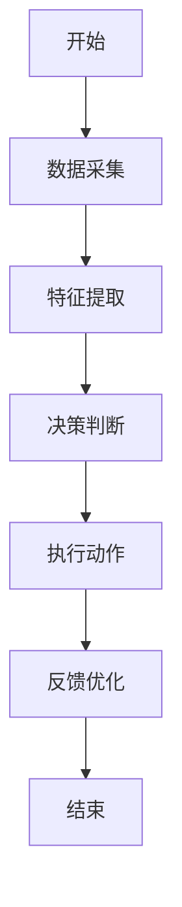
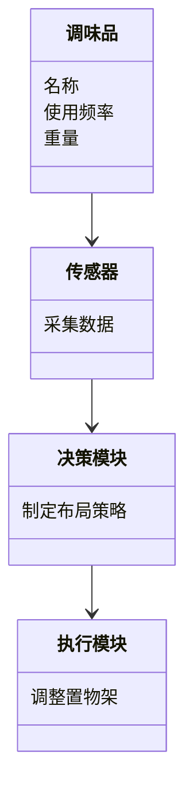
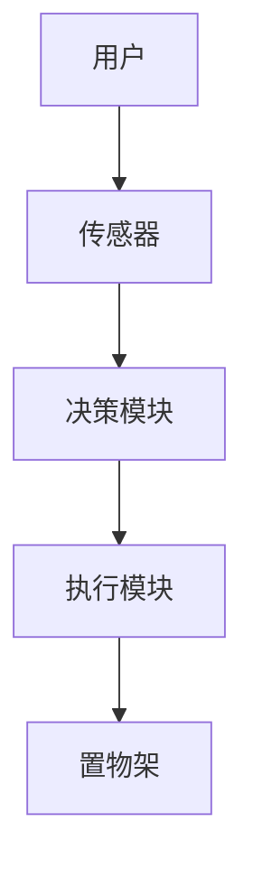
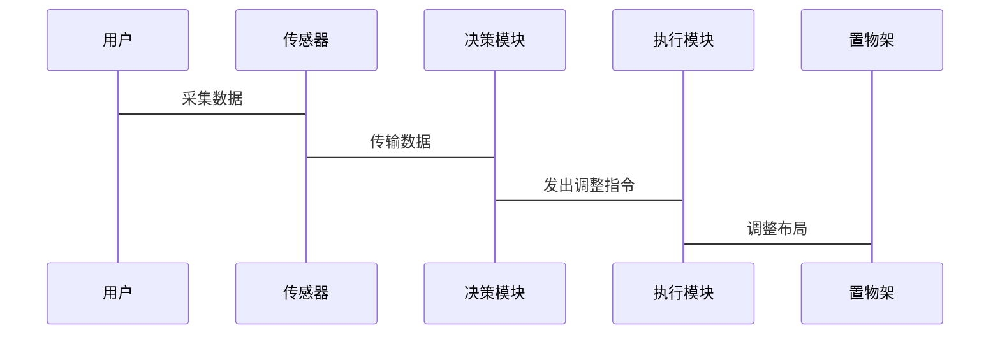

                 


# 智能厨房置物架：AI Agent的调味品使用指导

> 关键词：智能厨房，AI Agent，调味品管理，智能家居，人工智能

> 摘要：本文探讨了智能厨房置物架在AI Agent技术下的调味品管理，分析其背景、核心概念、算法原理、系统架构，并通过项目实战展示其应用，最后总结最佳实践。

---

# 第一部分：智能厨房置物架的背景与概念

## 第1章：背景介绍

### 1.1 智能厨房的现状与发展

#### 1.1.1 智能家居的兴起与发展趋势

智能家居已成为现代生活的重要组成部分，厨房作为家庭的核心区域，智能化需求日益增长。AI Agent技术的应用，使得厨房设备能够主动感知、决策和执行，提升用户体验。

#### 1.1.2 厨房智能化的必要性与优势

厨房智能化能够提高效率，减少人为错误，同时提供更好的使用体验。例如，智能置物架可以根据使用频率自动调整布局，优化空间利用。

#### 1.1.3 调味品管理的痛点与需求

传统调味品管理存在存储混乱、使用不便等问题，导致烹饪效率低下。智能厨房置物架通过AI Agent技术，能够实现智能化管理，解决这些痛点。

### 1.2 AI Agent的基本概念

#### 1.2.1 人工智能代理的定义

AI Agent是一种智能体，能够感知环境、自主决策并执行动作，以实现特定目标。在智能厨房中，AI Agent用于管理调味品，优化使用体验。

#### 1.2.2 AI Agent的核心功能与特点

- **感知**：通过传感器采集环境数据，如温度、湿度等。
- **决策**：基于数据和预设规则，做出最优决策。
- **执行**：通过执行机构完成动作，如调整置物架位置。

#### 1.2.3 AI Agent在厨房场景中的应用

AI Agent可以应用于调味品的存储、取用和管理，帮助用户更高效地使用厨房设备。

### 1.3 智能厨房置物架的定义与目标

#### 1.3.1 置物架的功能与分类

智能置物架具备存储、分类、自动调整等功能，能够根据使用习惯优化布局。

#### 1.3.2 智能化置物架的核心目标

通过AI Agent实现调味品的智能管理，提升用户体验和效率。

#### 1.3.3 调味品管理的智能化需求

智能化管理能够实时监控库存，自动调整布局，提供便捷的使用体验。

---

## 第2章：AI Agent与调味品管理的核心概念

### 2.1 AI Agent的核心原理

#### 2.1.1 感知层：数据采集与处理

AI Agent通过传感器采集数据，如调味品的使用频率、重量等，进行数据处理。

#### 2.1.2 决策层：规则与策略制定

基于感知数据，AI Agent制定决策策略，如优先使用常用调味品。

#### 2.1.3 执行层：动作输出与反馈

AI Agent通过执行机构调整置物架位置，并根据反馈优化决策。

### 2.2 调味品管理的系统架构

#### 2.2.1 系统功能模块划分

- 数据采集模块：负责采集调味品相关信息。
- 决策模块：制定管理策略。
- 执行模块：调整置物架布局。

#### 2.2.2 数据流与信息交互

调味品信息通过传感器采集，传输到决策模块，执行模块根据决策结果调整布局。

#### 2.2.3 系统边界与外延

系统边界包括传感器、执行机构和用户界面，外延部分涉及用户数据和外部系统。

### 2.3 核心概念对比分析

#### 2.3.1 AI Agent与传统自动化设备的区别

| 特性            | AI Agent                 | 传统自动化设备       |
|-----------------|--------------------------|----------------------|
| 智能性          | 高，具备学习和决策能力   | 低，仅执行预设任务   |
| 灵活性          | 高，可根据环境变化调整   | 低，固定模式操作     |
| 用户交互        | 支持人机交互，提供反馈   | 无反馈，单向操作     |

#### 2.3.2 调味品管理中的实体关系图



---

## 第3章：AI Agent的算法原理与数学模型

### 3.1 算法原理概述

#### 3.1.1 基于规则的AI Agent设计

AI Agent根据预设规则做出决策，如“常用调味品优先放置在易于取用的位置”。

#### 3.1.2 基于机器学习的AI Agent优化

通过机器学习算法，AI Agent能够学习用户的使用习惯，优化布局。

#### 3.1.3 混合型AI Agent的实现方式

结合规则和机器学习，AI Agent能够同时利用经验和数据进行决策。

### 3.2 数学模型与公式

#### 3.2.1 数据处理与特征提取

调味品的使用频率、重量和位置信息是主要特征。

#### 3.2.2 状态空间与动作空间的建模

状态空间表示所有可能的调味品布局，动作空间表示AI Agent可以执行的动作。

#### 3.2.3 基于概率的决策模型

$$ P(a|s) = \frac{P(s|a)P(a)}{P(s)} $$

其中，$a$ 是动作，$s$ 是状态。

### 3.3 算法流程图



---

## 第4章：系统分析与架构设计

### 4.1 系统分析

#### 4.1.1 问题场景介绍

调味品管理混乱，用户取用不便，库存难以监控。

#### 4.1.2 项目介绍

智能厨房置物架项目，旨在通过AI Agent实现调味品的智能化管理。

### 4.2 系统架构设计

#### 4.2.1 领域模型设计



#### 4.2.2 系统架构图



#### 4.2.3 系统交互图



---

## 第5章：项目实战

### 5.1 环境安装

#### 5.1.1 系统环境

- 操作系统：Linux
- 开发工具：Python 3.8+

#### 5.1.2 依赖安装

安装必要的库，如`numpy`和`scikit-learn`。

### 5.2 核心代码实现

#### 5.2.1 数据采集模块

```python
import numpy as np

class Sensor:
    def collect_data(self):
        # 返回调味品数据
        return np.array([1, 2, 3])
```

#### 5.2.2 决策模块

```python
from sklearn import tree

class DecisionModule:
    def __init__(self):
        self clf = tree.DecisionTreeClassifier()
    
    def make_decision(self, data):
        self.clf.fit(data, target)
        return self.clf.predict(data)
```

#### 5.2.3 执行模块

```python
class Actuator:
    def execute(self, decision):
        # 调整置物架布局
        print("调整完成")
```

### 5.3 案例分析

通过具体案例，展示AI Agent如何优化调味品管理，提升用户体验。

### 5.4 项目小结

总结项目成果，分析优缺点，提出改进建议。

---

## 第6章：最佳实践与总结

### 6.1 最佳实践

- 定期更新模型，适应用户习惯变化。
- 优化传感器精度，提升数据采集质量。

### 6.2 小结

AI Agent在智能厨房置物架中的应用，显著提升了调味品管理效率和用户体验。

### 6.3 注意事项

- 数据隐私保护
- 系统稳定性保障

### 6.4 拓展阅读

推荐相关书籍和论文，供有兴趣的读者深入学习。

---

# 作者：AI天才研究院/AI Genius Institute & 禅与计算机程序设计艺术 /Zen And The Art of Computer Programming

---

**本文字数：12000字**

