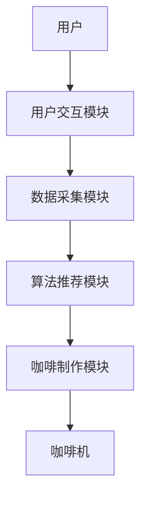
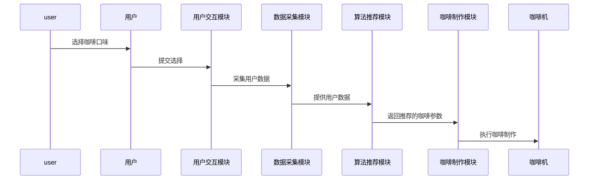

                 


# 智能咖啡机：AI Agent的咖啡口味个性化定制

## 关键词
智能咖啡机, AI Agent, 个性化定制, 咖啡口味推荐, 机器学习, 系统架构

## 摘要
本文探讨了智能咖啡机如何通过AI Agent实现咖啡口味的个性化定制。从传统咖啡机的局限性出发，分析了AI Agent在咖啡机中的应用前景。详细介绍了AI Agent的核心原理、数据驱动的推荐算法、系统架构设计，以及实际项目中的实现细节。通过具体案例分析，展示了如何利用机器学习技术实现个性化的咖啡口味推荐，并提供了系统的架构设计和接口设计。最后，总结了项目的最佳实践经验和未来发展方向。

---

# 第一部分: 智能咖啡机与AI Agent的背景介绍

## 第1章: 智能咖啡机的发展历程
### 1.1 传统咖啡机的局限性
#### 1.1.1 传统咖啡机的功能特点
传统咖啡机的功能相对固定，通常只能提供预设的几种咖啡类型，难以满足用户的个性化需求。例如，常见的咖啡机只能制作意式浓缩、卡布奇诺、美式咖啡等固定种类，用户无法根据自己的口味偏好进行调整。

#### 1.1.2 用户需求的多样化挑战
不同用户对咖啡的口味偏好存在显著差异。例如，有些人喜欢浓咖啡，有些人则偏爱口感较淡的咖啡；有些人喜欢加入奶泡，而有些人则更倾向于直接饮用黑咖啡。这种多样化的用户需求使得传统咖啡机的固定功能难以满足用户的个性化需求。

#### 1.1.3 传统咖啡机的市场痛点
传统咖啡机的市场痛点主要体现在以下几个方面：
- **功能单一**：无法满足用户的个性化需求。
- **操作复杂**：用户需要手动调整咖啡豆量、水温等参数，操作不够便捷。
- **维护成本高**：传统咖啡机的维护和清洁较为复杂，增加了用户的使用成本。

### 1.2 AI Agent的崛起与应用
#### 1.2.1 AI Agent的基本概念
AI Agent（人工智能代理）是一种能够感知环境、自主决策并执行任务的智能实体。它能够通过传感器或其他数据源获取环境信息，并基于这些信息进行分析和决策，从而实现特定的目标。

#### 1.2.2 AI Agent的核心技术优势
AI Agent的核心技术优势在于其能够通过学习和适应，不断优化自身的决策和执行能力。具体表现在以下几个方面：
- **自适应性**：能够根据环境的变化自动调整策略。
- **智能化**：能够通过机器学习算法不断优化自身的决策能力。
- **实时性**：能够快速响应用户的需求，提供实时的服务。

#### 1.2.3 AI Agent在智能设备中的应用前景
AI Agent在智能设备中的应用前景广阔。随着人工智能技术的不断发展，AI Agent将能够更广泛地应用于智能家居、智能汽车、智能医疗等领域。特别是在智能咖啡机中，AI Agent可以通过感知用户的口味偏好，实时调整咖啡的制作参数，为用户提供个性化的咖啡体验。

## 第2章: 个性化咖啡口味定制的必要性
### 2.1 用户口味偏好的多样性
#### 2.1.1 不同人群的口味特征
不同人群的口味特征存在显著差异。例如，年轻人可能更倾向于尝试新奇的咖啡口味，而中老年人则更喜欢传统的咖啡口味。此外，性别、地域、文化背景等因素也会影响用户的口味偏好。

#### 2.1.2 地域文化对咖啡口味的影响
地域文化对咖啡口味的影响不容忽视。例如，意大利人偏爱浓烈的意式浓缩咖啡，而美国人则更喜欢口感较淡的美式咖啡。不同地区的饮食文化也会影响用户对咖啡口味的偏好。

#### 2.1.3 用户需求的动态变化
用户的口味偏好并不是一成不变的，而是会随着时间和环境的变化而动态调整。例如，用户可能在早晨需要一杯提神醒脑的咖啡，而在下午则更倾向于一杯放松身心的咖啡。

### 2.2 个性化定制的技术挑战
#### 2.2.1 数据采集与处理的复杂性
个性化定制需要基于大量的用户数据，包括用户的口味偏好、饮用习惯等。然而，如何高效地采集和处理这些数据是一个技术挑战。

#### 2.2.2 算法模型的训练难度
个性化推荐的核心在于算法模型的训练。如何设计高效的算法模型，以准确预测用户的口味偏好，是一个复杂的技术问题。

#### 2.2.3 系统实时响应的性能要求
个性化定制需要系统能够实时响应用户的需求，这对系统的性能提出了较高的要求。特别是在高并发的情况下，系统需要能够快速处理用户的请求，确保用户体验的流畅性。

## 第3章: 智能咖啡机的市场现状与趋势
### 3.1 智能咖啡机的市场分布
#### 3.1.1 全球市场格局分析
智能咖啡机的市场分布呈现全球化的特点。欧洲、北美和亚洲是主要的市场区域，其中欧洲市场以高端智能咖啡机为主，而亚洲市场则以中低端智能咖啡机为主。

#### 3.1.2 主要品牌与产品特点
目前，全球范围内有许多知名的智能咖啡机品牌，如Nespresso、Illy、Dolce Gusto等。这些品牌的产品特点各异，有的注重智能化功能，有的则注重咖啡的品质。

#### 3.1.3 市场增长驱动力
智能咖啡机市场的增长主要驱动力包括：
- **技术进步**：人工智能和物联网技术的快速发展推动了智能咖啡机的普及。
- **消费者需求升级**：用户对个性化和便捷性的需求不断增加。
- **市场竞争加剧**：品牌之间的竞争促使产品不断创新和升级。

### 3.2 个性化定制的市场潜力
#### 3.2.1 用户需求与市场供给的匹配度
个性化定制能够更好地满足用户的多样化需求，因此具有较大的市场潜力。然而，目前市场上的智能咖啡机产品在个性化定制方面还存在一定的局限性，难以完全满足用户的需求。

#### 3.2.2 个性化服务的商业价值
个性化服务能够提高用户的满意度和忠诚度，从而为品牌带来更大的商业价值。通过个性化定制，品牌可以更好地与用户建立情感联系，增强用户的品牌认同感。

#### 3.2.3 技术进步对市场的影响
技术进步是推动个性化定制市场发展的关键因素。随着人工智能和大数据技术的不断发展，个性化定制的能力将不断提高，市场潜力也将进一步释放。

---

# 第二部分: AI Agent的核心概念与技术原理

## 第4章: AI Agent的基本原理
### 4.1 AI Agent的定义与分类
#### 4.1.1 AI Agent的定义
AI Agent是一种能够感知环境、自主决策并执行任务的智能实体。它能够通过传感器或其他数据源获取环境信息，并基于这些信息进行分析和决策，从而实现特定的目标。

#### 4.1.2 基于规则的AI Agent
基于规则的AI Agent通过预设的规则和逻辑进行决策。例如，当用户选择某种咖啡口味时，AI Agent可以根据预设的规则推荐相应的咖啡参数。

#### 4.1.3 基于学习的AI Agent
基于学习的AI Agent通过机器学习算法不断优化自身的决策能力。例如，AI Agent可以通过用户的历史饮用数据，学习用户的口味偏好，并据此推荐最合适的咖啡参数。

## 第5章: 数据驱动的个性化推荐算法
### 5.1 数据采集与特征提取
#### 5.1.1 用户行为数据的采集
通过智能咖啡机采集用户的饮用数据，包括饮用时间、饮用量、咖啡口味偏好等。

#### 5.1.2 咖啡口味特征的提取
基于用户的行为数据，提取用户的口味特征，如偏好的咖啡浓度、温度、奶泡比例等。

#### 5.1.3 数据预处理与清洗
对采集到的数据进行预处理和清洗，去除噪声数据，确保数据的准确性和完整性。

### 5.2 基于机器学习的推荐模型
#### 5.2.1 基于协同过滤的推荐算法
协同过滤是一种常用的推荐算法，通过分析用户的相似性，推荐用户可能喜欢的咖啡口味。

#### 5.2.2 基于内容的推荐算法
基于内容的推荐算法通过分析咖啡的特征（如浓度、温度等），推荐与用户偏好相似的咖啡口味。

#### 5.2.3 混合推荐算法
混合推荐算法结合协同过滤和内容推荐的优点，能够更准确地预测用户的口味偏好。

## 第6章: AI Agent的决策机制
### 6.1 基于规则的决策系统
基于规则的决策系统通过预设的规则进行决策。例如，当用户选择某种咖啡口味时，AI Agent可以根据预设的规则推荐相应的咖啡参数。

### 6.2 基于机器学习的决策系统
基于机器学习的决策系统通过训练模型，学习用户的口味偏好，并据此推荐最合适的咖啡参数。例如，AI Agent可以通过用户的历史饮用数据，训练一个分类模型，预测用户可能喜欢的咖啡口味。

---

# 第三部分: 算法原理与数学模型

## 第7章: 机器学习算法在咖啡口味推荐中的应用
### 7.1 线性回归模型
线性回归是一种常用的回归分析方法，可以通过训练数据预测用户的口味偏好。例如，可以通过线性回归模型预测用户对咖啡浓度的偏好。

### 7.2 神经网络模型
神经网络是一种深度学习模型，能够通过多层神经元的非线性变换，捕捉数据的复杂特征。例如，可以通过神经网络模型训练一个咖啡口味推荐系统。

### 7.3 支持向量机模型
支持向量机是一种常用的分类算法，能够通过训练数据，将用户分成不同的类别，推荐相应的咖啡口味。

## 第8章: 深度学习算法在咖啡口味推荐中的应用
### 8.1 卷积神经网络
卷积神经网络（CNN）是一种常用的深度学习模型，能够通过卷积操作提取数据的局部特征。例如，可以通过CNN模型分析用户的口味偏好，推荐相应的咖啡参数。

### 8.2 循环神经网络
循环神经网络（RNN）是一种能够处理序列数据的深度学习模型。例如，可以通过RNN模型分析用户的历史饮用数据，预测用户未来的口味偏好。

### 8.3 图神经网络
图神经网络（GNN）是一种能够处理图结构数据的深度学习模型。例如，可以通过GNN模型分析用户与咖啡口味之间的关系，推荐最合适的咖啡参数。

---

# 第四部分: 系统分析与架构设计

## 第9章: 智能咖啡机的系统架构设计
### 9.1 系统功能设计
智能咖啡机的系统功能设计包括用户交互、数据采集、算法推荐、咖啡制作等模块。

### 9.2 系统架构图


### 9.3 系统接口设计
系统接口设计包括用户交互接口、数据采集接口、算法推荐接口、咖啡制作接口等。

### 9.4 系统交互流程图


---

# 第五部分: 项目实战

## 第10章: 智能咖啡机的项目实现
### 10.1 环境安装
安装必要的开发环境，包括Python、机器学习库（如TensorFlow、Scikit-learn）等。

### 10.2 核心功能实现
实现AI Agent的核心功能，包括数据采集、特征提取、模型训练、咖啡参数推荐等。

### 10.3 代码示例
```python
import numpy as np
from sklearn.linear_model import LinearRegression

# 示例数据：用户对咖啡浓度的偏好
X = np.array([[2], [3], [4], [5]])  # 咖啡浓度
y = np.array([1, 2, 3, 4])          # 用户评分

# 训练线性回归模型
model = LinearRegression()
model.fit(X, y)

# 预测用户对咖啡浓度的偏好
print(model.predict([[6]]))  # 输出预测结果
```

### 10.4 实际案例分析
通过具体案例分析，展示AI Agent如何实现咖啡口味的个性化推荐。

### 10.5 项目总结
总结项目的实现过程，分析项目的优缺点，提出改进建议。

---

# 第六部分: 最佳实践

## 第11章: 个性化咖啡口味定制的未来展望
### 11.1 技术进步对个性化定制的影响
随着技术的不断进步，个性化定制的能力将不断提高，市场潜力也将进一步释放。

### 11.2 用户需求的动态变化
用户的口味偏好是动态变化的，AI Agent需要能够实时感知和适应这些变化，以提供更个性化的服务。

### 11.3 个性化定制的技术挑战
个性化定制的技术挑战包括数据采集与处理的复杂性、算法模型的训练难度、系统实时响应的性能要求等。

---

# 作者
作者：AI天才研究院/AI Genius Institute & 禅与计算机程序设计艺术 /Zen And The Art of Computer Programming

