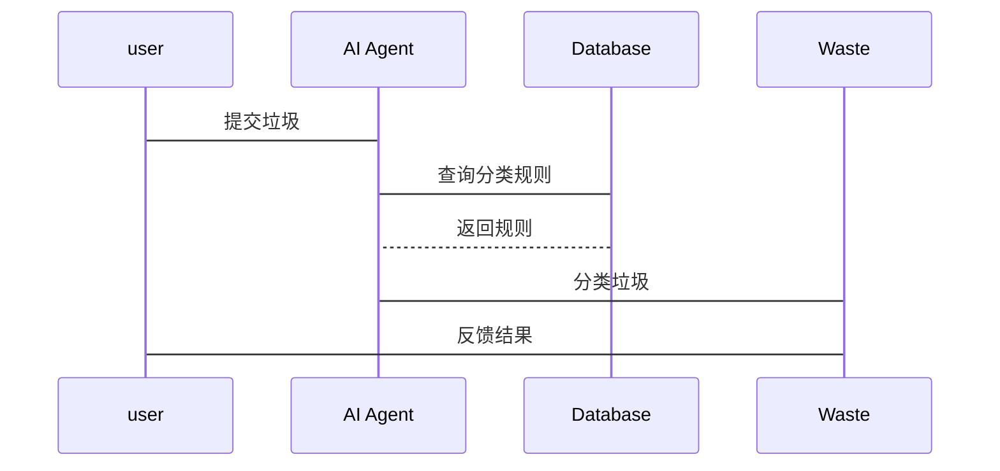

                 


# 智能垃圾箱：AI Agent的废物分类与回收指导

> 关键词：AI Agent, 废物分类, 图像识别, 深度学习, 智能垃圾箱

> 摘要：本文系统地探讨了AI Agent在智能垃圾箱中的应用，详细分析了废物分类的算法原理、系统架构设计及项目实战，结合实际案例，总结了最佳实践和注意事项，为AI技术在废物管理中的应用提供了深入的理论支持和实践指导。

---

# 第1章: AI Agent与智能垃圾箱概述

## 1.1 AI Agent的基本概念
### 1.1.1 AI Agent的定义与特点
人工智能代理（AI Agent）是指能够感知环境、自主决策并执行任务的智能实体。其特点包括自主性、反应性、目标导向和社会能力。

### 1.1.2 智能垃圾箱的定义与应用场景
智能垃圾箱是一种集成AI技术的设备，用于自动分类和处理垃圾。其应用场景包括家庭、办公室、公共场所等。

### 1.1.3 AI在废物分类中的作用
AI技术能够提高废物分类的准确性和效率，减少人工成本，促进可持续发展。

## 1.2 废物分类与回收的背景与挑战
### 1.2.1 全球废物管理现状
全球每年产生大量垃圾，传统分类方法效率低下，资源浪费严重。

### 1.2.2 废物分类的重要性
正确分类可以提高回收利用率，减少环境污染，促进资源循环利用。

### 1.2.3 当前废物分类的主要问题
人工分类效率低、成本高，分类标准不统一，技术手段落后。

## 1.3 AI技术在废物分类中的优势
### 1.3.1 AI技术的核心优势
AI能够快速识别和分类，减少人工错误，提高效率。

### 1.3.2 AI Agent在废物分类中的应用潜力
AI Agent可以实现智能分类、实时反馈和优化，推动废物管理智能化。

### 1.3.3 未来发展趋势与研究方向
深度学习、多模态融合、实时反馈优化是未来发展的主要方向。

## 1.4 本章小结
本章介绍了AI Agent的基本概念，分析了废物分类的背景和挑战，并探讨了AI技术的优势和未来发展方向。

---

# 第2章: AI Agent的核心原理

## 2.1 AI Agent的感知机制
### 2.1.1 视觉感知（图像识别）
通过摄像头捕捉图像，利用CNN进行识别。例如，使用ResNet分类垃圾类型。

### 2.1.2 听觉感知（语音识别）
通过语音指令辅助分类，使用RNN处理序列数据。

### 2.1.3 综合感知（多模态融合）
结合图像和语音信息，提升分类准确性。

## 2.2 AI Agent的决策机制
### 2.2.1 分类算法（如CNN、RNN）
CNN适用于图像分类，RNN适用于序列分类，CRNN结合两者优点。

### 2.2.2 决策树与规则引擎
基于规则的决策树提供简单高效的分类方法，适用于特定场景。

### 2.2.3 深度学习模型（如ResNet、Inception）
深度学习模型在复杂场景下表现更优，但需要大量数据和计算资源。

## 2.3 AI Agent的执行机制
### 2.3.1 自动分类与分拣
通过机械臂实现精准分拣，减少人工干预。

### 2.3.2 智能导航与定位
使用SLAM技术实现垃圾箱的自主定位和导航。

### 2.3.3 实时反馈与优化
根据分类结果实时调整策略，提升整体效率。

## 2.4 AI Agent的核心概念对比表
| 比较维度 | CNN | RNN | CRNN |
|----------|-----|-----|-----|
| 适用场景 | 图像分类 | 序列分类 | 复合场景 |
| 优缺点   | 高精度，适合结构化数据 | 处理序列信息能力强 | 综合能力强，但复杂 |

## 2.5 AI Agent的ER实体关系图
```mermaid
er
  entity AI Agent {
    id: int
    type: string
    status: string
  }
  entity Waste {
    id: int
    type: string
    location: string
  }
  AI Agent -- 分拣: Waste
```

## 2.6 本章小结
本章详细讲解了AI Agent的感知、决策和执行机制，并通过对比和实体关系图展示了核心概念。

---

# 第3章: 垃圾分类的算法原理

## 3.1 垃圾分类的常用算法
### 3.1.1 CNN在图像分类中的应用
使用CNN提取图像特征，分类垃圾类型。

### 3.1.2 RNN在序列分类中的应用
通过RNN处理序列数据，如语音指令。

### 3.1.3 混合模型（如CRNN）
结合CNN和RNN，适用于复杂场景。

## 3.2 垃圾分类的数学模型
### 3.2.1 卷积神经网络（CNN）的数学模型
$$\text{输出} = \text{卷积}(\text{输入}, \text{滤波器})$$

### 3.2.2 循环神经网络（RNN）的数学模型
$$\text{隐藏层} = \text{RNN}(\text{输入}, \text{隐藏层状态})$$

### 3.2.3 混合模型的数学模型
结合CNN和RNN的输出，进行最终分类。

## 3.3 算法的优化与改进
### 3.3.1 使用迁移学习降低计算成本
利用预训练模型，减少训练数据需求。

### 3.3.2 引入注意力机制提升精度
通过注意力机制，聚焦关键特征。

## 3.4 本章小结
本章通过数学模型和算法优化，展示了如何提高垃圾分类的准确性和效率。

---

# 第4章: 系统架构设计

## 4.1 系统功能设计
### 4.1.1 领域模型（mermaid类图）
```mermaid
classDiagram
    class AI Agent {
        - id: int
        - type: string
        - status: string
        + classify(waste): string
    }
    class Waste {
        - id: int
        - type: string
        - location: string
    }
    AI Agent --1> Waste
```

### 4.1.2 系统架构设计（mermaid架构图）


## 4.2 系统接口设计
### 4.2.1 系统交互流程（mermaid序列图）


## 4.3 本章小结
本章通过系统架构设计和接口设计，展示了AI Agent在智能垃圾箱中的整体结构和交互流程。

---

# 第5章: 项目实战

## 5.1 环境搭建
### 5.1.1 安装Python和相关库
使用Anaconda安装环境，安装TensorFlow、Keras、OpenCV等库。

## 5.2 系统核心实现
### 5.2.1 图像识别模块
编写Python代码，使用CNN进行图像分类。

```python
import tensorflow as tf
from tensorflow.keras import layers

model = tf.keras.Sequential([
    layers.Conv2D(32, (3,3), activation='relu', input_shape=(224,224,3)),
    layers.MaxPooling2D(),
    layers.Flatten(),
    layers.Dense(128, activation='relu'),
    layers.Dense(10, activation='softmax')
])
```

### 5.2.2 机械臂控制模块
通过API控制机械臂，实现垃圾分拣。

## 5.3 代码应用解读与分析
详细解读每部分代码的功能，分析实现细节。

## 5.4 实际案例分析
通过具体案例，展示系统在实际应用中的表现。

## 5.5 项目小结
总结项目实施过程中的经验教训，提出改进建议。

---

# 第6章: 最佳实践与总结

## 6.1 最佳实践 tips
### 6.1.1 数据预处理的重要性
确保数据质量，提升模型性能。

### 6.1.2 模型优化技巧
使用迁移学习、数据增强等方法提升模型精度。

## 6.2 小结
回顾全文，总结AI Agent在智能垃圾箱中的应用价值和未来发展方向。

## 6.3 注意事项
### 6.3.1 数据隐私保护
确保用户数据的安全和隐私。

### 6.3.2 系统稳定性
确保系统在复杂环境下的稳定运行。

## 6.4 拓展阅读
推荐相关书籍和论文，供读者深入学习。

---

# 作者：AI天才研究院 & 禅与计算机程序设计艺术

