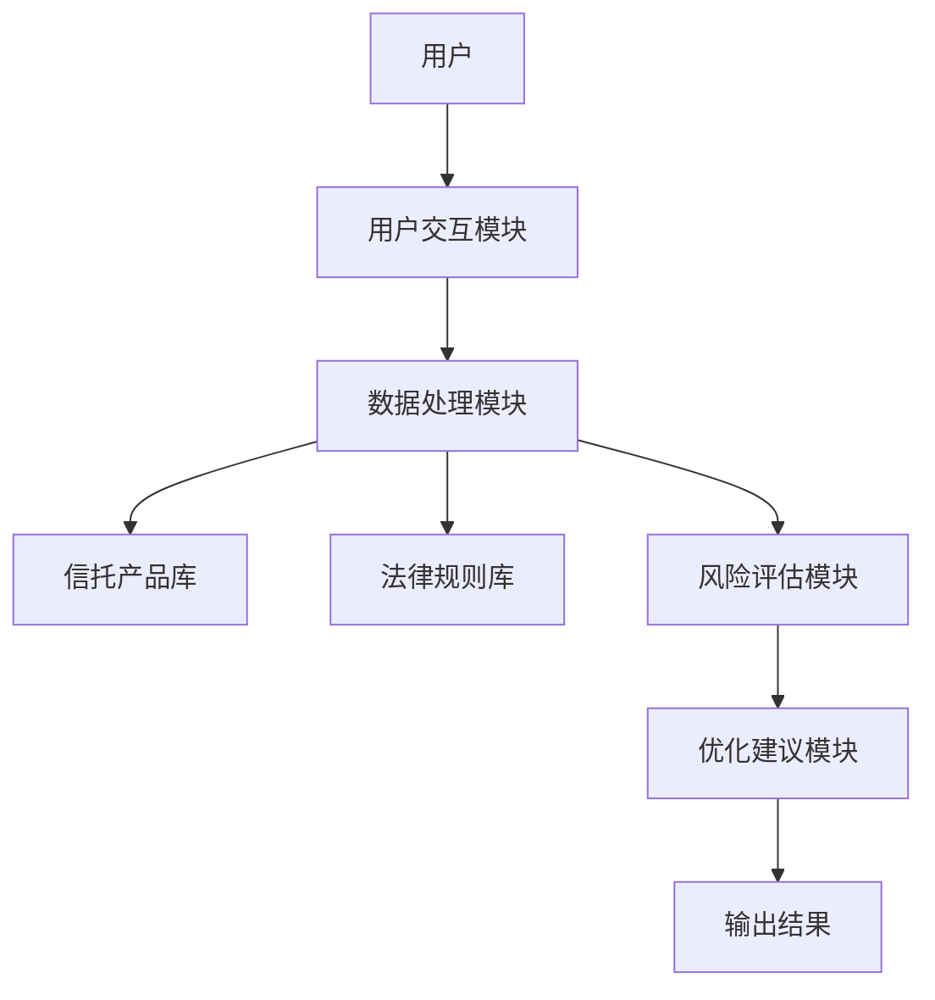
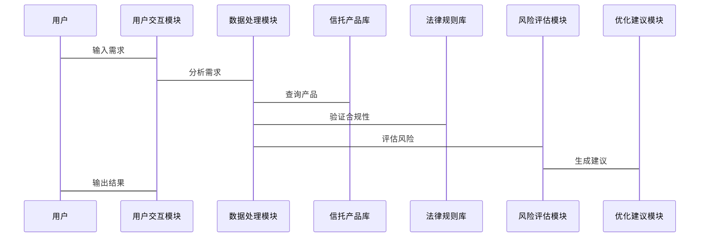

                 

# 《智能家族信托规划助手》

## 关键词：智能家族信托，AI技术，家族财富管理，风险评估，信托产品推荐

## 摘要：  
随着家族信托在财富传承和资产保护中的重要性日益增加，如何利用人工智能技术优化家族信托的规划过程成为一个亟待解决的问题。本文将深入探讨智能家族信托规划助手的核心概念、算法原理、系统架构及实际应用场景，通过技术与法律的结合，为读者提供一个全面的视角，展示如何利用智能化工具提升家族信托的规划效率和效果。

---

## 第一部分: 智能家族信托规划助手的背景与概念

## 第1章: 家族信托概述

### 1.1 家族信托的基本概念

#### 1.1.1 信托的基本定义与原理  
信托是一种法律关系，涉及委托人、受托人和受益人。委托人将资产转移给受托人，后者根据信托合同的条款管理资产，并将收益分配给受益人。信托的核心在于资产的所有权与使用权分离，确保资产的安全性和合规性。

#### 1.1.2 家族信托的核心特点  
- 财产隔离：资产独立于委托人和其他债权人，确保财富安全。  
- 财产传承：通过信托合同明确资产分配规则，实现财富的代际传承。  
- 税务优化：通过合理的信托结构设计，降低税务负担。  
- 灵活性：信托条款可根据家族需求定制。  

#### 1.1.3 家族信托的历史与发展  
家族信托起源于英国，经过数百年的发展，现已成为全球财富管理的重要工具。随着技术的进步，智能化工具的引入使家族信托的规划更加高效和精准。

---

### 1.2 家族信托的功能与作用

#### 1.2.1 财产保护与传承  
信托通过法律结构确保资产的安全性，避免因家庭成员纠纷或债务问题导致资产流失。同时，通过信托合同明确财产分配规则，实现财富的有序传承。

#### 1.2.2 税务优化与财富管理  
家族信托可以通过合理的资产配置和结构设计，降低遗产税、所得税等税务负担，优化财富分配效率。

#### 1.2.3 家族治理与成员权益分配  
信托可以为家族提供一个公平、透明的财富分配机制，避免因财产分配引发的家庭矛盾，促进家族和谐。

---

### 1.3 智能化在家族信托中的应用前景

#### 1.3.1 传统家族信托的局限性  
- 传统家族信托的规划过程复杂，依赖人工经验，效率较低。  
- 税务法规不断变化，人工规划难以实时优化。  
- 家族成员需求多样，传统方式难以满足个性化需求。  

#### 1.3.2 智能化技术如何提升家族信托效率  
- 利用人工智能技术快速分析用户需求，匹配最优信托方案。  
- 通过大数据分析实时优化信托结构，确保合规性与高效性。  
- 提供交互式知识普及功能，帮助用户更好地理解信托规划。  

#### 1.3.3 智能家族信托助手的定义与目标  
智能家族信托助手是一种基于人工智能技术的工具，旨在通过自动化分析和优化算法，为用户提供个性化的信托规划建议，提升信托规划的效率和效果。

---

## 第2章: 智能家族信托助手的核心概念

### 2.1 智能家族信托助手的工作原理

#### 2.1.1 数据采集与用户需求分析  
智能家族信托助手通过收集用户的资产信息、家庭结构、财务目标等数据，利用自然语言处理技术分析用户需求，生成个性化的信托规划方案。

#### 2.1.2 信托产品匹配算法  
基于用户需求，智能家族信托助手通过协同过滤和内容推荐算法，从信托产品库中筛选出最适合用户的信托产品。

#### 2.1.3 风险评估与优化建议  
利用机器学习模型评估信托方案的风险，并根据市场变化动态优化信托结构，确保信托方案的稳定性和高效性。

---

### 2.2 智能家族信托助手的功能模块

#### 2.2.1 用户信息输入与分析模块  
用户通过填写问卷或与系统交互，输入家庭资产、财务目标等信息，系统利用自然语言处理技术进行需求分析。

#### 2.2.2 信托产品推荐模块  
系统基于用户需求，通过协同过滤和内容推荐算法，推荐最优的信托产品。

#### 2.2.3 风险评估与优化建议模块  
系统利用机器学习模型评估信托方案的风险，并根据市场变化动态优化信托结构。

#### 2.2.4 交互式知识普及模块  
系统提供交互式知识普及功能，帮助用户更好地理解信托规划的相关知识。

---

### 2.3 智能家族信托助手的核心技术

#### 2.3.1 人工智能技术在信托规划中的应用  
- 自然语言处理技术用于用户需求分析。  
- 机器学习技术用于信托产品推荐和风险评估。  

#### 2.3.2 数据挖掘与分析技术  
通过大数据分析技术，优化信托结构，确保信托方案的合规性和高效性。

#### 2.3.3 自然语言处理技术在用户需求分析中的应用  
利用NLP技术，分析用户需求，生成个性化的信托规划方案。

---

## 第3章: 智能家族信托助手的核心算法与数学模型

### 3.1 信托产品推荐算法

#### 3.1.1 基于协同过滤的推荐算法  
协同过滤是一种基于用户行为数据的推荐算法，通过分析用户的历史行为，找到与目标用户相似的用户群体，推荐相似的产品。

##### 算法步骤：
1. 收集用户的行为数据。  
2. 计算用户之间的相似度。  
3. 根据相似用户的偏好，推荐产品。  

#### 3.1.2 基于内容的推荐算法  
基于内容的推荐算法通过分析产品的属性特征，推荐与用户需求匹配的产品。

##### 算法步骤：
1. 提取产品的特征向量。  
2. 计算用户需求与产品特征的相似度。  
3. 根据相似度推荐产品。  

#### 3.1.3 混合推荐算法  
混合推荐算法结合协同过滤和内容推荐的优势，通过加权融合的方式，提升推荐的准确性和多样性。

---

### 3.2 风险评估与优化建议算法

#### 3.2.1 风险评估指标体系的构建  
- 财务风险：评估信托方案的财务稳健性。  
- 法律风险：评估信托方案的合规性。  
- 市场风险：评估信托方案的市场适应性。  

#### 3.2.2 基于机器学习的风险预测模型  
利用机器学习技术，构建风险预测模型，评估信托方案的风险等级。

##### 算法步骤：
1. 收集历史信托方案数据。  
2. 提取风险相关特征。  
3. 训练风险预测模型。  
4. 预测信托方案的风险等级。  

#### 3.2.3 优化建议生成算法  
根据风险评估结果，优化信托方案，降低风险，提升信托方案的稳定性和高效性。

---

## 第4章: 智能家族信托助手的系统架构与实现

### 4.1 系统功能设计

#### 4.1.1 用户交互模块  
用户通过网页或移动应用与系统交互，输入需求，查看推荐结果。

#### 4.1.2 数据处理模块  
系统收集和处理用户数据，进行需求分析和信托方案生成。

#### 4.1.3 信托产品库  
系统内置丰富的信托产品库，支持多种信托产品推荐。

#### 4.1.4 法律规则库  
系统内置信托相关的法律和税务规则，确保信托方案的合规性。

#### 4.1.5 风险评估模块  
系统利用机器学习模型评估信托方案的风险，并提供优化建议。

---

### 4.2 系统架构设计

#### 4.2.1 系统架构图  

#### 4.2.2 系统交互流程图  

---

## 第5章: 智能家族信托助手的项目实战

### 5.1 项目背景

#### 5.1.1 项目目标  
设计并实现一个智能家族信托助手，帮助用户优化信托方案。

#### 5.1.2 项目需求  
- 提供个性化的信托产品推荐。  
- 实现实时风险评估与优化建议。  
- 提供交互式知识普及功能。  

---

### 5.2 系统设计与实现

#### 5.2.1 系统设计  
系统分为前端和后端两部分，前端负责用户交互，后端负责数据处理和算法实现。

#### 5.2.2 核心实现  
- 数据处理模块：利用Python和Pandas进行数据清洗和分析。  
- 信托产品推荐算法：基于协同过滤和内容推荐算法，使用Python的Scikit-learn库实现。  
- 风险评估模块：利用机器学习模型，使用TensorFlow框架实现。  

---

### 5.3 系统测试与优化

#### 5.3.1 测试环境搭建  
搭建测试环境，进行功能测试和性能测试。

#### 5.3.2 测试结果分析  
分析测试结果，优化系统性能和算法效率。

---

## 第6章: 智能家族信托助手的法律与伦理

### 6.1 智能家族信托助手的法律合规性

#### 6.1.1 信托法律框架  
智能家族信托助手需要遵守信托相关的法律法规，确保信托方案的合规性。

#### 6.1.2 数据隐私与安全  
系统需要保护用户数据隐私，确保数据的安全性。

---

### 6.2 智能家族信托助手的伦理问题

#### 6.2.1 算法的公平性与透明性  
算法需要公平、透明，避免因算法黑箱导致的不公正结果。

#### 6.2.2 用户知情权与选择权  
用户需要充分了解信托方案的风险和利益，确保知情权和选择权。

---

## 第7章: 总结与展望

### 7.1 总结

#### 7.1.1 核心成果  
本文深入探讨了智能家族信托助手的核心概念、算法原理和系统架构，并通过项目实战展示了其实现过程。

#### 7.1.2 经验总结  
智能家族信托助手的实现需要技术与法律的结合，算法的优化和系统的完善需要不断迭代。

---

### 7.2 未来展望

#### 7.2.1 技术发展趋势  
随着人工智能技术的不断进步，智能家族信托助手的功能将更加智能化和个性化。

#### 7.2.2 实际应用前景  
智能家族信托助手将在财富管理领域发挥越来越重要的作用，为用户提供更加高效和精准的服务。

---

## 作者：AI天才研究院/AI Genius Institute & 禅与计算机程序设计艺术/Zen And The Art of Computer Programming

---

**联系方式**：  
- 电子邮箱：contact@aicourse.com  
- 官方网站：https://www.aicourse.com

