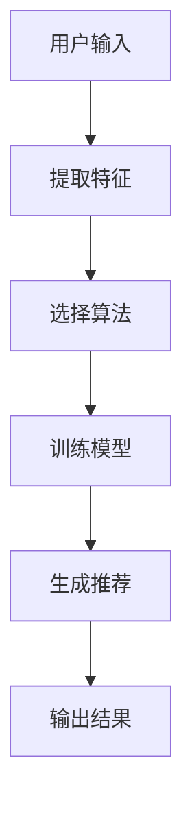

                 


# 智能投资者教育平台开发

> 关键词：智能投资者教育平台，人工智能，投资者教育，机器学习，自然语言处理，系统架构，技术博客

> 摘要：本文详细探讨了智能投资者教育平台的开发过程，涵盖背景分析、核心概念、算法原理、系统架构设计、项目实战及最佳实践。通过结合人工智能技术，本文展示了如何构建一个高效、个性化的投资者教育平台，帮助投资者提升决策能力。

---

## 第一部分: 智能投资者教育平台开发背景与核心概念

### 第1章: 智能投资者教育平台的背景与问题背景

#### 1.1 问题背景

##### 1.1.1 投资者教育的重要性
投资者教育是帮助个人和机构投资者提升金融素养、做出明智投资决策的关键环节。然而，传统投资者教育模式存在以下问题：
- **内容繁杂**：金融市场知识广泛且复杂，投资者难以快速掌握。
- **个性化不足**：传统教育通常采用统一的课程，难以满足不同投资者的需求。
- **互动性差**：缺乏实时反馈和个性化指导，投资者在学习过程中容易感到孤立。

##### 1.1.2 传统投资者教育的局限性
传统投资者教育主要依赖于线下讲座、书籍和视频课程。这些方法虽然提供了一定的知识，但存在以下问题：
- **学习效率低**：投资者需要花费大量时间筛选和学习相关内容。
- **缺乏互动**：投资者在学习过程中缺乏互动，难以获得个性化的指导。
- **更新不及时**：金融市场变化迅速，传统教育内容难以及时更新。

##### 1.1.3 人工智能在投资者教育中的应用潜力
人工智能（AI）技术的快速发展为投资者教育带来了新的可能性。通过AI技术，投资者教育平台可以实现以下功能：
- **个性化推荐**：根据投资者的背景、目标和风险偏好，推荐个性化的学习内容。
- **实时反馈**：通过自然语言处理和机器学习，提供实时的互动反馈，帮助投资者更好地理解复杂概念。
- **预测与模拟**：利用历史数据和机器学习模型，预测市场趋势并模拟投资结果，帮助投资者做出更明智的决策。

#### 1.2 问题描述

##### 1.2.1 投资者教育平台的功能需求
智能投资者教育平台需要满足以下功能需求：
- **用户注册与登录**：支持用户注册、登录和信息管理。
- **个性化课程推荐**：根据用户需求推荐相关课程。
- **实时互动**：提供实时的问答和讨论功能。
- **投资模拟与预测**：基于历史数据和机器学习模型，提供投资模拟和预测功能。

##### 1.2.2 现有平台的痛点与不足
现有投资者教育平台主要存在以下痛点：
- **内容同质化**：大多数平台提供的内容相似，缺乏个性化。
- **技术门槛高**：投资者需要具备一定的技术背景才能使用平台。
- **缺乏实时反馈**：投资者在学习过程中缺乏实时指导。

##### 1.2.3 智能投资者教育平台的目标与边界
智能投资者教育平台的目标是通过AI技术，为投资者提供个性化、实时的教育服务，帮助投资者提升投资能力。平台的边界包括：
- **目标用户**：个人投资者和机构投资者。
- **功能范围**：课程推荐、投资模拟、实时互动等。
- **技术限制**：基于现有的AI技术，无法实现完全自主的投资决策。

#### 1.3 问题解决

##### 1.3.1 智能投资者教育的核心问题
智能投资者教育的核心问题在于如何通过技术手段实现个性化、实时的教育服务。具体包括：
- **个性化推荐**：如何根据用户需求推荐相关内容。
- **实时互动**：如何实现实时的问答和反馈。
- **预测与模拟**：如何基于数据实现投资预测和模拟。

##### 1.3.2 人工智能技术如何解决这些问题
人工智能技术可以通过以下方式解决上述问题：
- **机器学习**：用于个性化推荐和预测。
- **自然语言处理**：用于实时互动和内容分析。
- **深度学习**：用于复杂模式识别和模拟。

##### 1.3.3 平台设计的创新点与价值
智能投资者教育平台的创新点在于结合AI技术实现个性化教育。其价值体现在：
- **提升学习效率**：通过个性化推荐和实时反馈，帮助投资者更快掌握所需知识。
- **降低投资风险**：通过预测和模拟功能，帮助投资者做出更明智的决策。
- **提升用户体验**：通过互动和个性化服务，提升用户的学习体验。

---

### 第2章: 智能投资者教育平台的核心概念与联系

#### 2.1 核心概念原理

##### 2.1.1 智能投资者教育平台的定义
智能投资者教育平台是一个基于人工智能技术的在线教育平台，旨在为投资者提供个性化、实时的教育服务。

##### 2.1.2 平台的核心功能模块
平台的核心功能模块包括：
- **用户管理**：注册、登录和信息管理。
- **课程推荐**：根据用户需求推荐相关内容。
- **实时互动**：问答、讨论和反馈。
- **投资模拟**：基于历史数据和机器学习模型，提供投资模拟和预测。

##### 2.1.3 平台的用户角色与交互流程
平台的用户角色包括：
- **投资者**：注册用户，使用平台进行学习和投资模拟。
- **教育内容提供者**：提供课程内容和数据。
- **技术支持团队**：负责平台的技术维护和优化。

交互流程包括：
1. 用户注册并登录平台。
2. 系统根据用户需求推荐课程。
3. 用户学习课程并参与实时互动。
4. 系统根据用户反馈优化推荐算法。

#### 2.2 核心概念属性对比

##### 2.2.1 平台功能模块对比分析
| 功能模块       | 描述                                                                 |
|----------------|----------------------------------------------------------------------|
| 用户管理       | 管理用户注册、登录和信息更新                                             |
| 课程推荐       | 根据用户需求推荐个性化课程                                               |
| 实时互动       | 提供实时问答、讨论和反馈功能                                             |
| 投资模拟       | 基于历史数据和机器学习模型，提供投资模拟和预测功能                       |

##### 2.2.2 不同用户角色的需求分析
| 用户角色       | 需求描述                                                                 |
|----------------|--------------------------------------------------------------------------|
| 投资者         | 需要个性化课程推荐、实时互动和投资模拟功能                               |
| 教育内容提供者 | 需要提供高质量的课程内容和数据                                             |
| 技术支持团队   | 需要确保平台的稳定运行和功能优化                                             |

##### 2.2.3 平台功能与用户需求的匹配度分析
| 平台功能       | 用户需求匹配度       | 解释                                         |
|----------------|--------------------|----------------------------------------------|
| 用户管理       | 高                  | 个性化用户管理是实现其他功能的基础。         |
| 课程推荐       | 高                  | 个性化推荐是提升用户体验的关键。               |
| 实时互动       | 中高                | 实时互动提升了用户体验，但实现难度较高。         |
| 投资模拟       | 高                  | 投资模拟是平台的核心价值所在。                 |

#### 2.3 ER实体关系图
```mermaid
erDiagram
    user {
        id
        username
        email
        password
        role
    }
    course {
        id
        title
        description
        difficulty_level
        duration
    }
    recommendation {
        id
        user_id
        course_id
        recommendation_score
    }
    transaction {
        id
        user_id
        course_id
        purchase_time
        price
    }
    user --> course : Enrolled
    user --> recommendation : Recommended
    user --> transaction : Purchased
```

---

### 第3章: 智能投资者教育平台的算法原理

#### 3.1 算法原理概述

##### 3.1.1 机器学习在投资者教育中的应用
机器学习在投资者教育中的应用主要体现在个性化推荐和预测分析。例如，使用协同过滤算法推荐课程内容。

##### 3.1.2 深度学习在平台推荐系统中的作用
深度学习通过神经网络模型处理复杂的模式识别任务，如自然语言处理和图像识别。

##### 3.1.3 自然语言处理在课程内容分析中的应用
自然语言处理技术用于分析课程内容，提取关键词和主题，从而实现更精准的推荐。

#### 3.2 算法流程图


#### 3.3 算法实现

##### 3.3.1 机器学习算法实现
```python
# 简单的协同过滤算法示例
import numpy as np

def collaborative_filtering(user_items, user_avg_rating):
    # 计算用户相似度
    user_similarity = np.dot(user_items, user_items.T)
    # 找出最相似的用户
    similar_users = np.argsort(user_similarity[user, :])[::-1]
    # 推荐课程
    recommended_courses = []
    for u in similar_users:
        if u != user:
            recommended_courses.extend(user_items[u])
    return recommended_courses
```

##### 3.3.2 深度学习算法实现
```python
# 简单的神经网络模型示例
import tensorflow as tf

model = tf.keras.Sequential([
    tf.keras.layers.Dense(64, activation='relu'),
    tf.keras.layers.Dense(1, activation='sigmoid')
])

model.compile(optimizer='adam', loss='binary_crossentropy', metrics=['accuracy'])
model.fit(X_train, y_train, epochs=10, batch_size=32)
```

##### 3.3.3 算法原理的数学模型和公式
- **协同过滤算法**：
  $$ \text{推荐评分} = \frac{\sum_{u \in U} (r_{u,i} - \bar{r}_u)}{\sum_{u \in U} (s_{u,i} - \bar{s})} $$
  
- **神经网络模型**：
  $$ y = \sigma(w x + b) $$

---

## 总结

通过以上分析，我们详细探讨了智能投资者教育平台的开发过程，从背景分析到算法实现，再到系统架构设计，为读者提供了一个全面的视角。希望本文能够为相关领域的开发者和研究者提供有价值的参考和启发。

作者：AI天才研究院/AI Genius Institute & 禅与计算机程序设计艺术 /Zen And The Art of Computer Programming

