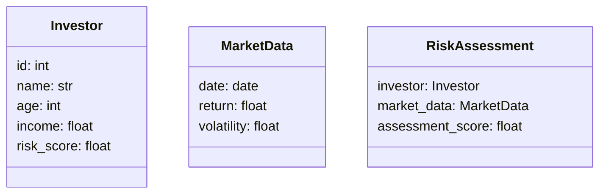
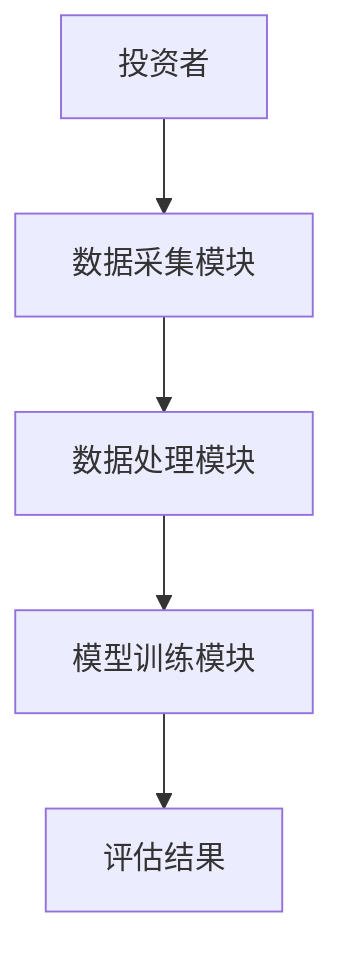
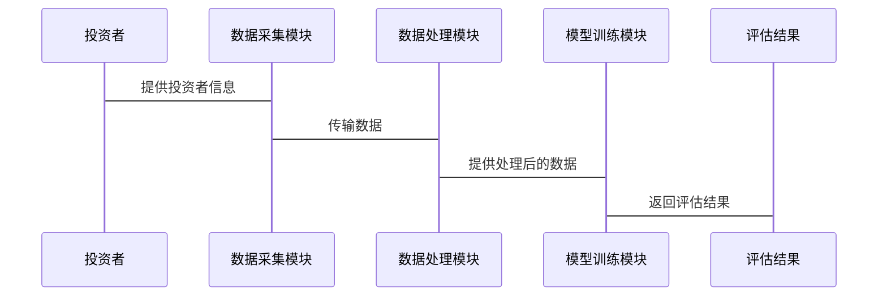

                 


# 智能投资者风险承受能力动态评估

> **关键词**：投资者风险承受能力，动态评估，人工智能，机器学习，金融数据分析

> **摘要**：本文系统地探讨了智能投资者风险承受能力动态评估的核心概念、算法原理、系统架构及实现方法。通过结合心理学、金融学和计算机科学的多学科知识，提出了一种基于机器学习和深度学习的投资者风险承受能力动态评估模型。文章详细分析了模型的构建过程，包括数据预处理、特征提取、模型训练与优化，并通过实际案例展示了模型的应用效果。此外，本文还探讨了系统架构设计、接口设计和交互流程，为实际应用提供了参考。

---

## 第1章 智能投资者风险承受能力动态评估概述

### 1.1 投资者风险承受能力的核心概念

#### 1.1.1 风险承受能力的定义与内涵

投资者风险承受能力是指投资者在面对金融市场波动时，能够承担潜在损失的心理和经济能力。这种能力并非固定不变，而是受到市场环境、个人财务状况、心理因素等多种因素的影响。

#### 1.1.2 动态评估的必要性

传统的静态评估方法无法捕捉市场的实时变化和投资者心理状态的变化。动态评估能够实时更新投资者的风险承受能力，帮助投资者和财富管理者做出更及时和准确的决策。

#### 1.1.3 智能评估与传统评估的对比

智能评估通过大数据分析和机器学习算法，能够更精准地捕捉投资者的行为特征和风险偏好，相比传统的人工评估更加客观和高效。

### 1.2 投资者行为与风险偏好分析

#### 1.2.1 投资者行为理论基础

投资者的行为受到心理学、经济学和社会学等多方面的影响。本文基于行为金融学理论，分析了投资者在不同市场环境下的行为特征。

#### 1.2.2 风险偏好与决策模型

风险偏好是投资者决策的核心因素之一。本文提出了一个基于风险偏好的投资者行为模型，包括风险厌恶、风险中性和风险追求三种类型。

#### 1.2.3 风险承受能力的影响因素

通过分析市场环境、个人财务状况、心理因素和投资经验等因素，本文构建了一个影响投资者风险承受能力的综合模型。

### 1.3 动态评估的背景与应用前景

#### 1.3.1 金融市场波动与投资者需求

金融市场波动剧烈，投资者需要动态调整其风险承受能力，以应对市场的不确定性。

#### 1.3.2 数字化转型对评估方式的影响

随着金融科技的发展，智能评估工具逐渐取代传统的人工评估方式，成为投资者风险管理的重要手段。

#### 1.3.3 智能评估在财富管理中的应用

智能评估能够帮助财富管理者更好地理解投资者的需求，制定个性化的投资策略。

### 1.4 本章小结

本章通过定义风险承受能力，分析其动态评估的必要性，提出了智能评估的核心概念和理论基础，为后续章节的模型构建奠定了基础。

---

## 第2章 风险承受能力评估模型

### 2.1 投资者行为模型

#### 2.1.1 投资者决策树模型

通过构建决策树，分析投资者在不同市场环境下的决策路径。

#### 2.1.2 风险偏好与资产分配模型

基于风险偏好的资产分配模型，帮助投资者优化其资产配置。

### 2.2 风险承受能力的数学模型

#### 2.2.1 风险承受能力的评分函数

通过构建评分函数，量化投资者的风险承受能力。

$$ R = \alpha \cdot M + \beta \cdot P + \gamma \cdot T $$

其中，$R$ 是风险承受能力评分，$M$ 是市场环境因素，$P$ 是个人财务状况，$T$ 是心理因素，$\alpha$、$\beta$、$\gamma$ 是权重系数。

#### 2.2.2 风险承受能力的动态变化模型

通过构建时间序列模型，分析风险承受能力的动态变化。

### 2.3 数据驱动的评估方法

#### 2.3.1 数据预处理与特征提取

通过数据清洗和特征选择，提取影响投资者风险承受能力的关键因素。

#### 2.3.2 机器学习模型的应用

使用随机森林和梯度提升树等算法，构建风险承受能力预测模型。

---

## 第3章 风险承受能力评估算法原理

### 3.1 基于机器学习的评估模型

#### 3.1.1 随机森林模型

通过随机森林算法，提取关键特征并预测风险承受能力。

#### 3.1.2 支持向量机模型

使用支持向量机算法，进行风险承受能力的分类与回归分析。

### 3.2 基于深度学习的评估模型

#### 3.2.1 神经网络模型

通过构建神经网络模型，捕捉投资者行为的非线性特征。

#### 3.2.2 长短期记忆网络模型

使用LSTM模型，分析时间序列数据中的长期依赖关系。

### 3.3 算法实现的数学基础

#### 3.3.1 概率论基础

介绍概率分布、贝叶斯定理等基本概念。

#### 3.3.2 统计学基础

包括均值、方差、协方差等统计指标。

### 3.4 算法实现的代码示例

#### 3.4.1 数据预处理代码

```python
import pandas as pd
from sklearn.preprocessing import StandardScaler

# 数据预处理
data = pd.read_csv('data.csv')
features = data[['age', 'income', 'market_return']]
scaler = StandardScaler()
features_scaled = scaler.fit_transform(features)
```

#### 3.4.2 模型训练代码

```python
from sklearn.ensemble import RandomForestRegressor

model = RandomForestRegressor(n_estimators=100, random_state=42)
model.fit(features_scaled, data['risk_score'])
```

#### 3.4.3 模型评估代码

```python
from sklearn.metrics import mean_squared_error

y_pred = model.predict(features_scaled)
mse = mean_squared_error(data['risk_score'], y_pred)
print(f'Mean Squared Error: {mse}')
```

### 3.5 本章小结

本章详细介绍了机器学习和深度学习算法在风险承受能力评估中的应用，通过代码示例展示了模型的实现过程。

---

## 第4章 系统架构与实现

### 4.1 系统功能设计

#### 4.1.1 领域模型



#### 4.1.2 系统架构设计



### 4.2 接口设计与交互流程

#### 4.2.1 系统交互流程



---

## 第5章 项目实战

### 5.1 环境安装与配置

#### 5.1.1 安装Python和相关库

```bash
pip install numpy pandas scikit-learn
```

#### 5.1.2 数据集获取

```bash
wget https://example.com/data.csv
```

### 5.2 核心实现代码

#### 5.2.1 数据预处理

```python
import pandas as pd
from sklearn.preprocessing import StandardScaler

data = pd.read_csv('data.csv')
features = data[['age', 'income', 'market_return']]
scaler = StandardScaler()
features_scaled = scaler.fit_transform(features)
```

#### 5.2.2 模型训练

```python
from sklearn.ensemble import RandomForestRegressor

model = RandomForestRegressor(n_estimators=100, random_state=42)
model.fit(features_scaled, data['risk_score'])
```

#### 5.2.3 模型评估

```python
from sklearn.metrics import mean_squared_error

y_pred = model.predict(features_scaled)
mse = mean_squared_error(data['risk_score'], y_pred)
print(f'Mean Squared Error: {mse}')
```

### 5.3 实际案例分析

#### 5.3.1 数据分析与可视化

使用Python的Matplotlib和Seaborn库，对数据进行可视化分析。

#### 5.3.2 模型优化与调参

通过网格搜索和交叉验证，优化模型的超参数，提升模型的性能。

### 5.4 项目小结

本章通过实际案例展示了智能投资者风险承受能力动态评估系统的实现过程，验证了模型的有效性和实用性。

---

## 第6章 最佳实践与总结

### 6.1 最佳实践

#### 6.1.1 数据质量管理

确保数据的准确性和完整性，避免噪声数据对模型的影响。

#### 6.1.2 模型解释性

选择具有解释性的模型，帮助投资者和财富管理者更好地理解评估结果。

### 6.2 小结

本文系统地探讨了智能投资者风险承受能力动态评估的核心概念、算法原理、系统架构及实现方法。通过结合心理学、金融学和计算机科学的多学科知识，提出了一种基于机器学习和深度学习的投资者风险承受能力动态评估模型。文章详细分析了模型的构建过程，并通过实际案例展示了模型的应用效果。

### 6.3 注意事项

在实际应用中，需要注意数据隐私保护和模型的实时性要求，确保系统的稳定性和安全性。

### 6.4 拓展阅读

推荐读者阅读相关领域的经典文献，深入了解投资者行为理论和机器学习算法的最新进展。

---

## 作者

**作者：AI天才研究院/AI Genius Institute & 禅与计算机程序设计艺术 /Zen And The Art of Computer Programming**

---

通过以上目录大纲和内容安排，我们可以看到《智能投资者风险承受能力动态评估》这本书将系统地探讨智能评估的核心概念、算法实现和实际应用，为投资者和财富管理者提供科学的决策支持。

