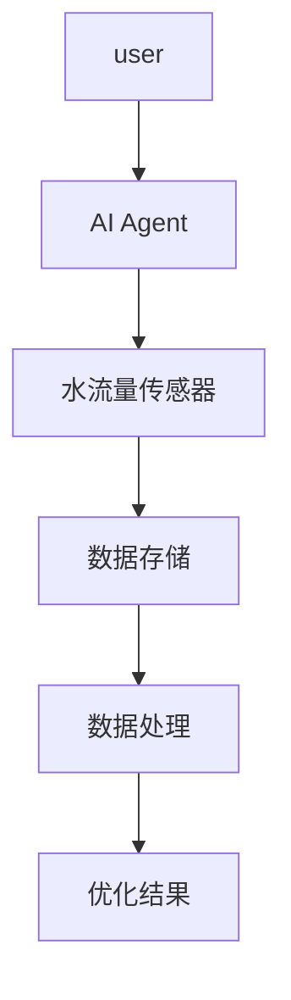
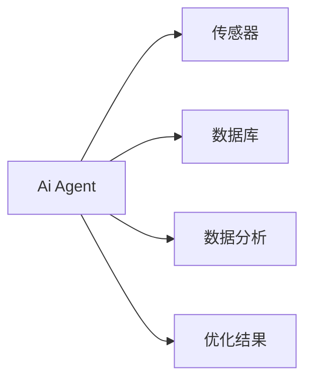
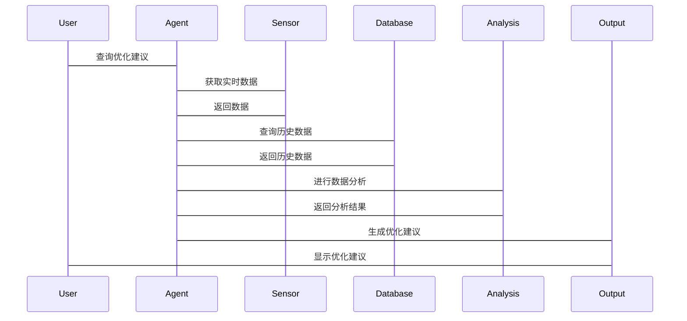

                 


---

# 智能浴室系统：AI Agent的用水习惯优化

## 关键词
- 智能浴室系统
- AI Agent
- 用水习惯优化
- 强化学习
- 系统架构
- 项目实战

## 摘要
随着水资源的日益紧张和环保意识的增强，优化用水习惯成为一个重要课题。智能浴室系统通过AI Agent技术，能够实时监测和分析用户的用水行为，提供个性化的优化建议。本文详细探讨了AI Agent在智能浴室中的应用，从背景介绍到算法原理，再到系统架构和项目实战，全面解析如何通过技术手段实现用水习惯的优化。

---

## 第1章 背景介绍

### 1.1 问题背景
#### 1.1.1 用水习惯优化的必要性
随着全球水资源短缺问题的加剧，优化个人用水习惯显得尤为重要。传统的浴室系统无法实时监测和反馈用户的用水行为，导致水资源浪费。通过AI技术，我们可以实现对用水习惯的智能化优化。

#### 1.1.2 智能浴室系统的概念
智能浴室系统是一种结合了物联网（IoT）和人工智能技术的智能设备，能够实时监测用户的用水行为，并通过AI Agent提供个性化的优化建议。

#### 1.1.3 AI Agent在智能浴室中的作用
AI Agent（智能代理）是智能浴室系统的核心，负责数据的采集、分析和优化建议的生成。它能够根据用户的用水习惯和实时数据，动态调整用水策略。

### 1.2 问题描述
#### 1.2.1 传统浴室系统的局限性
传统浴室系统无法实时监测用户的用水行为，且缺乏智能化的优化功能，导致水资源浪费。

#### 1.2.2 用水浪费的现状分析
通过调查发现，许多用户在洗澡时浪费了大量水资源，尤其是在洗澡时间过长或水温调节不当的情况下。

#### 1.2.3 用户需求与痛点
用户希望能够在洗澡时节省水资源，同时保持舒适体验。然而，传统浴室系统无法满足这些需求。

### 1.3 问题解决
#### 1.3.1 AI Agent的核心优势
AI Agent能够实时监测用户的用水行为，通过学习用户的习惯，提供个性化的优化建议，从而实现水资源的高效利用。

#### 1.3.2 智能浴室系统的优势
智能浴室系统通过AI Agent实现了对用水行为的实时监测和优化，帮助用户节省水资源，同时提升了用户体验。

#### 1.3.3 用水习惯优化的实现路径
通过AI Agent的学习和优化算法，智能浴室系统能够动态调整用户的用水习惯，从而实现水资源的高效利用。

### 1.4 边界与外延
#### 1.4.1 智能浴室系统的边界
智能浴室系统的优化范围仅限于用户的用水行为，不涉及其他生活场景。

#### 1.4.2 用水习惯优化的范围
优化范围包括洗澡时间、水温调节、水流大小等与用水相关的习惯。

#### 1.4.3 相关技术的外延
智能浴室系统可能涉及其他智能设备（如智能水表、智能马桶）的集成，形成家庭用水管理的完整解决方案。

### 1.5 概念结构与核心要素
#### 1.5.1 智能浴室系统的构成
智能浴室系统由传感器、AI Agent、数据存储和用户界面四个部分组成。

#### 1.5.2 AI Agent的核心要素
AI Agent的核心要素包括数据采集、数据处理、优化算法和用户反馈。

#### 1.5.3 用水习惯优化的模型
用水习惯优化模型包括数据采集、行为分析、优化建议生成和效果评估四个阶段。

---

## 第2章 核心概念与联系

### 2.1 AI Agent的原理
#### 2.1.1 AI Agent的基本概念
AI Agent是一种能够感知环境并采取行动以实现目标的智能系统。

#### 2.1.2 AI Agent的核心算法
AI Agent的核心算法包括强化学习和遗传算法，能够通过学习优化用户的用水习惯。

#### 2.1.3 AI Agent与智能浴室的结合
AI Agent通过与智能浴室设备的交互，实时监测用户的用水行为，并提供优化建议。

### 2.2 实体关系图


### 2.3 核心概念对比
#### 2.3.1 AI Agent与传统算法的对比
AI Agent通过学习和自适应优化，能够更好地适应用户的用水习惯。

#### 2.3.2 智能浴室系统与其他智能设备的对比
智能浴室系统通过AI Agent实现了对用水行为的智能化优化，而其他智能设备缺乏这种优化能力。

#### 2.3.3 用水习惯优化与其他优化方法的对比
AI Agent的优化方法更加智能化和个性化，能够根据用户的习惯动态调整优化策略。

---

## 第3章 算法原理讲解

### 3.1 强化学习算法
#### 3.1.1 强化学习的基本概念
强化学习是一种通过试错学习优化策略的算法，适用于动态环境下的决策问题。

#### 3.1.2 强化学习在用水优化中的应用
AI Agent通过强化学习算法，能够根据用户的用水行为动态调整优化策略。

#### 3.1.3 强化学习的数学模型
$$ Q(s, a) = r + \gamma \max_{a'} Q(s', a') $$
其中，$Q$表示状态-动作值函数，$s$表示当前状态，$a$表示当前动作，$r$表示奖励，$\gamma$表示折扣因子。

#### 3.1.4 强化学习的实现步骤
1. 状态空间的定义。
2. 动作空间的定义。
3. 奖励函数的设计。
4. 策略的更新。

### 3.2 遗传算法
#### 3.2.1 遗传算法的基本概念
遗传算法是一种基于自然选择和遗传机制的优化算法，适用于复杂问题的全局优化。

#### 3.2.2 遗传算法在用水优化中的应用
AI Agent通过遗传算法优化用户的用水习惯，找到最优的用水策略。

#### 3.2.3 遗传算法的数学模型
$$ f(x) = \sum_{i=1}^{n} x_i $$
其中，$x_i$表示用水习惯的各个特征。

#### 3.2.4 遗传算法的实现步骤
1. 初始化种群。
2. 计算适应度。
3. 选择和交叉。
4. 变异。

---

## 第4章 系统分析与架构设计方案

### 4.1 问题场景介绍
智能浴室系统需要实时监测用户的用水行为，通过AI Agent优化用水习惯，实现水资源的高效利用。

### 4.2 项目介绍
智能浴室系统由传感器、AI Agent、数据存储和用户界面四个部分组成，能够实时监测用户的用水行为，并提供优化建议。

### 4.3 系统功能设计
#### 4.3.1 数据采集模块
数据采集模块负责采集用户的用水行为数据，包括水流量、水温、使用时间等。

#### 4.3.2 数据处理模块
数据处理模块对采集到的数据进行清洗和预处理，提取有效的特征。

#### 4.3.3 优化模块
优化模块通过AI Agent和优化算法，生成个性化的优化建议。

#### 4.3.4 用户反馈模块
用户反馈模块将优化建议反馈给用户，并根据用户的反馈调整优化策略。

### 4.4 系统架构设计


### 4.5 系统接口设计
系统接口设计包括传感器接口、数据库接口和用户界面接口，确保各模块之间的数据交互。

### 4.6 系统交互设计


---

## 第5章 项目实战

### 5.1 环境搭建
需要安装Python、AI框架（如TensorFlow或PyTorch）和相关传感器驱动程序。

### 5.2 核心实现
#### 5.2.1 传感器数据采集
```python
import time
from sensor_library import WaterSensor

sensor = WaterSensor()
while True:
    data = sensor.read()
    print(data)
    time.sleep(1)
```

#### 5.2.2 AI Agent实现
```python
class AI-Agent:
    def __init__(self):
        self.data = []
        self.model = load_model()

    def optimize(self, data):
        optimized_data = self.model.predict(data)
        return optimized_data
```

#### 5.2.3 优化算法实现
```python
def reinforce_learning(data):
    # 实现强化学习算法
    pass
```

### 5.3 代码解读与分析
详细解读上述代码，说明各部分的功能和实现细节。

### 5.4 实际案例分析
通过具体案例分析，展示智能浴室系统如何优化用户的用水习惯。

### 5.5 项目小结
总结项目实现的关键点和经验教训。

---

## 第6章 最佳实践与小结

### 6.1 最佳实践
- 定期更新优化模型，确保优化效果。
- 加强用户反馈机制，提升用户体验。
- 注意数据隐私保护，确保用户信息的安全。

### 6.2 小结
通过本文的详细讲解，读者可以全面了解智能浴室系统中AI Agent的优化原理和实现方法。

### 6.3 注意事项
- 确保系统稳定性，避免因故障导致数据丢失。
- 定期维护系统，确保传感器和设备的正常运行。

### 6.4 拓展阅读
推荐阅读相关领域的书籍和论文，深入学习AI Agent和强化学习的知识。

---

## 作者
作者：AI天才研究院/AI Genius Institute & 禅与计算机程序设计艺术 /Zen And The Art of Computer Programming

--- 

以上是完整的技术博客文章目录和内容的详细说明，您可以根据需要进行调整和补充。

