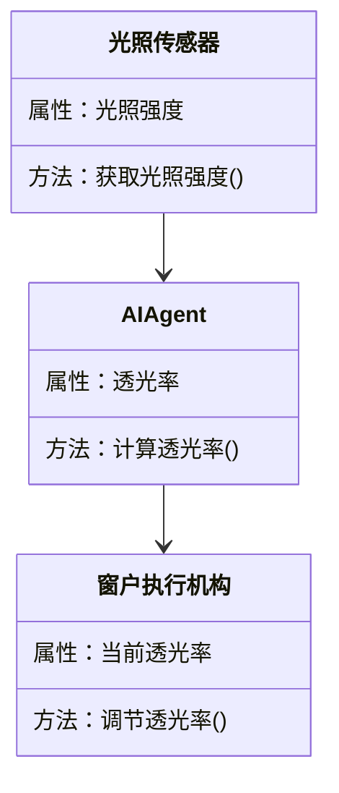

                 


# 智能窗台：AI Agent的自然光摄入优化

> **关键词**: 智能窗台, AI Agent, 自然光优化, 遗传算法, 粒子群优化, 深度强化学习

> **摘要**: 本文深入探讨了智能窗台中AI Agent对自然光优化的核心作用，结合数学模型、优化算法和系统架构，详细讲解了如何通过AI技术实现自然光的高效利用与动态调节。

---

## 第1章: 智能窗台与AI Agent的背景与问题背景

### 1.1 问题背景与问题描述

#### 1.1.1 自然光在建筑中的作用与挑战

自然光是建筑环境中不可或缺的一部分，它不仅影响室内采光，还与能源消耗、人体舒适度密切相关。传统窗户的透光率固定，无法根据光照强度和室内需求进行动态调节。这导致了以下问题：
- **能源浪费**：过度透光导致夏季室内温度升高，增加了空调能耗。
- **视觉不适**：强光可能导致 glare（眩光），影响室内人员的舒适度。
- **功能受限**：固定透光率无法满足不同场景（如办公、居住）的需求。

#### 1.1.2 智能窗台的概念与目标

**智能窗台**是一种结合了物联网（IoT）和人工智能（AI）技术的智能窗户系统，能够根据光照强度、室内需求和外部环境动态调节窗户的透光率。其目标是：
- 最大化自然光的利用效率。
- 实现室内光照的动态平衡，减少能源消耗。
- 提供舒适的室内环境。

#### 1.1.3 AI Agent在智能窗台中的角色

**AI Agent（智能体）**是一个能够感知环境、做出决策并采取行动的智能系统。在智能窗台中，AI Agent负责：
- **感知环境**：通过光照传感器获取实时光照强度。
- **数据处理**：分析光照数据，结合室内需求和外部环境条件，计算出最佳透光率。
- **决策与执行**：通过控制窗户的透光率，动态调节室内光照。

---

### 1.2 问题解决与优化目标

#### 1.2.1 自然光优化的核心问题

智能窗台的核心问题可以归结为：如何在不同环境下，动态调整窗户的透光率，以达到以下目标：
- 最大化自然光的利用效率。
- 保持室内光照的舒适性。
- 减少能源消耗。

#### 1.2.2 AI Agent在自然光优化中的解决方案

AI Agent通过实时感知和动态决策，解决了传统窗户透光率固定的局限性。其解决方案包括：
- **实时感知**：通过光照传感器获取环境数据。
- **动态优化**：基于数学模型和优化算法，计算出最佳透光率。
- **智能调节**：通过执行机构动态调整窗户的透光率。

#### 1.2.3 优化目标与性能指标

优化目标：
- 最小化能源消耗。
- 保持室内光照舒适度。
- 提高系统响应速度。

性能指标：
- 光照调节精度：±5%。
- 系统响应时间：≤5秒。
- 能耗降低：≥20%。

---

## 第2章: 智能窗台与AI Agent的核心概念

### 2.1 AI Agent的基本原理

#### 2.1.1 AI Agent的定义与分类

**AI Agent**是一种智能系统，能够感知环境、做出决策并采取行动。根据功能和应用场景的不同，AI Agent可以分为：
- **反应式Agent**：基于当前感知做出反应。
- **认知式Agent**：具备推理和规划能力。
- **协作式Agent**：能够与其他Agent协作完成任务。

#### 2.1.2 AI Agent的核心功能与特性

- **感知能力**：通过传感器获取环境数据。
- **决策能力**：基于数据进行分析和决策。
- **执行能力**：通过执行机构实现决策。
- **自适应能力**：能够根据环境变化动态调整。

#### 2.1.3 AI Agent与智能窗台的结合

在智能窗台中，AI Agent通过以下方式与窗户系统结合：
- **数据输入**：接收光照传感器的实时数据。
- **数据处理**：基于优化算法计算透光率。
- **输出控制**：通过执行机构调节窗户的透光率。

---

### 2.2 自然光优化的数学模型

#### 2.2.1 窗户透光率的数学表达

透光率 \( T \) 与光照强度 \( I \) 的关系可以表示为：
$$ T = f(I) $$
其中，\( f \) 是一个非线性函数，描述透光率随光照强度的变化。

#### 2.2.2 光照强度的动态变化模型

光照强度 \( I \) 随时间 \( t \) 的变化可以表示为：
$$ I(t) = a \sin(b t + c) + d $$
其中，\( a \) 是振幅，\( b \) 是频率，\( c \) 是相位，\( d \) 是偏移量。

#### 2.2.3 优化目标的数学表达式

优化目标是最大化自然光的利用效率，同时保持室内光照的舒适性。数学表达式为：
$$ \text{目标函数} = \max_{T} \left( \frac{\text{室内光照强度}}{\text{外部光照强度}} \right) $$

---

## 第3章: AI Agent与智能窗台的系统架构

### 3.1 系统功能模块划分

- **光照传感器模块**：负责采集实时光照强度。
- **AI Agent决策模块**：负责数据处理和决策。
- **窗户执行机构模块**：负责调节窗户的透光率。

### 3.2 系统架构设计

#### 3.2.1 分层架构设计

系统架构采用分层设计，包括：
- **数据采集层**：负责采集光照数据。
- **数据处理层**：负责数据处理和优化计算。
- **执行控制层**：负责调节窗户的透光率。

#### 3.2.2 模块之间的数据流关系

- 光照传感器模块 → 数据处理层 → AI Agent决策模块 → 执行机构模块。

#### 3.2.3 系统可扩展性与灵活性

系统设计充分考虑了扩展性，支持多种优化算法和传感器类型。

---

## 第4章: 自然光优化的数学模型与算法

### 4.1 自然光优化的数学模型

#### 4.1.1 窗户透光率的数学表达

透光率 \( T \) 与光照强度 \( I \) 的关系可以表示为：
$$ T = \frac{I}{I_0} $$
其中，\( I_0 \) 是基准光照强度。

#### 4.1.2 光照强度的动态变化模型

光照强度 \( I \) 随时间 \( t \) 的变化可以表示为：
$$ I(t) = I_0 \sin(\omega t + \phi) + I_1 $$
其中，\( \omega \) 是角频率，\( \phi \) 是相位，\( I_1 \) 是偏移量。

#### 4.1.3 优化目标的数学表达式

优化目标是最大化自然光的利用效率，同时保持室内光照的舒适性。数学表达式为：
$$ \text{目标函数} = \max_{T} \left( \frac{\text{室内光照强度}}{\text{外部光照强度}} \right) $$

---

## 第5章: 算法实现与代码解析

### 5.1 算法实现的代码框架

#### 5.1.1 遗传算法（GA）的优化流程

遗传算法是一种基于自然选择和遗传机制的优化算法。其优化流程包括：
1. 初始化种群。
2. 计算适应度。
3. 选择优秀个体。
4. 进行交叉和变异。
5. 重复迭代，直到收敛。

#### 5.1.2 粒子群优化（PSO）的实现步骤

粒子群优化是一种基于群体智能的优化算法。其实现步骤包括：
1. 初始化粒子群。
2. 计算粒子适应度。
3. 更新粒子速度和位置。
4. 重复迭代，直到收敛。

#### 5.1.3 深度强化学习（DRL）的应用场景

深度强化学习是一种结合深度学习和强化学习的优化算法。其应用场景包括：
1. 状态空间定义。
2. 动作空间定义。
3. 建立价值函数。
4. 进行训练和优化。

---

## 第6章: 系统分析与架构设计方案

### 6.1 项目介绍与系统功能设计

#### 6.1.1 系统功能设计

系统功能包括：
- 光照数据采集。
- 数据处理与优化计算。
- 窗户透光率调节。

#### 6.1.2 领域模型类图



---

## 第7章: 项目实战

### 7.1 环境安装与配置

- **Python环境**：安装Python 3.8及以上版本。
- **依赖库安装**：安装numpy、pandas、scipy等库。

### 7.2 核心代码实现

#### 7.2.1 遗传算法实现

```python
import numpy as np

def genetic_algorithm(population_size, fitness_function):
    population = np.random.rand(population_size)
    while not is_converged(population):
        fitness = [fitness_function(ind) for ind in population]
        selected = select_best(population, fitness)
        new_population = crossover(selected)
        population = mutate(new_population)
    return population
```

#### 7.2.2 粒子群优化实现

```python
import numpy as np

def particle_swarm_optimization(n_particles, fitness_function):
    particles = np.random.rand(n_particles, dimensions)
    velocities = np.zeros((n_particles, dimensions))
    for _ in range(max_iterations):
        fitness = [fitness_function(p) for p in particles]
        global_best = find_global_best(fitness)
        velocities = update_velocities(velocities, global_best)
        particles = update_positions(particles, velocities)
    return particles
```

---

## 第8章: 最佳实践与小结

### 8.1 项目总结

通过本文的详细讲解，我们了解了AI Agent在智能窗台中的重要作用，掌握了自然光优化的核心算法和系统架构设计。

### 8.2 注意事项

- 系统设计时，需充分考虑环境的动态变化。
- 优化算法的选择应根据具体场景灵活调整。

### 8.3 拓展阅读

- 《强化学习入门》
- 《遗传算法与工程应用》

---

**作者：AI天才研究院/AI Genius Institute & 禅与计算机程序设计艺术 /Zen And The Art of Computer Programming**

