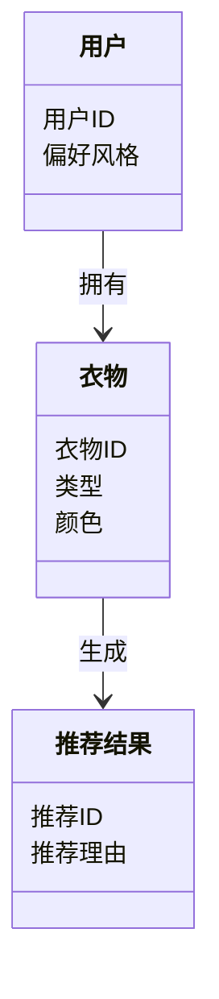
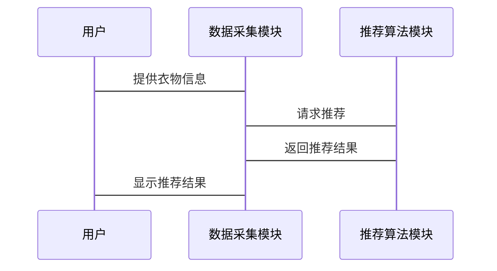

                 


# 智能衣帽架：AI Agent的穿搭建议系统

## 关键词：
智能衣帽架, AI Agent, 穿搭建议, 推荐系统, 算法原理, 系统架构

## 摘要：
智能衣帽架是一种结合AI技术的创新产品，通过AI Agent为用户提供智能化的穿搭建议。本文从背景介绍、核心概念、算法原理、系统架构等多个角度，详细阐述了智能衣帽架的设计与实现过程，旨在为读者提供一个全面的技术视角。

---

# 第一部分：背景介绍

## 第1章：问题背景与概念结构

### 1.1 问题背景
#### 1.1.1 衣物搭配与个人形象的重要性
在现代社会，衣物搭配不仅是基本需求，更是个人形象和品味的体现。然而，许多人缺乏专业的穿搭知识，导致在选择衣物时感到困惑。

#### 1.1.2 现有穿搭建议系统的局限性
传统的穿搭建议系统通常依赖于用户手动输入信息，且推荐结果缺乏个性化，难以满足多样化的需求。

#### 1.1.3 智能衣帽架的提出与目标
智能衣帽架通过AI技术，实时分析用户的衣物库存和风格偏好，提供智能化的穿搭建议，帮助用户轻松打造每日穿搭。

### 1.2 问题描述
#### 1.2.1 智能衣帽架的核心功能
- 自动识别衣物库存
- 智能推荐穿搭方案
- 提供实时搭配建议

#### 1.2.2 用户需求与痛点分析
- 用户希望减少选择困难
- 用户需要个性化的搭配建议
- 用户期望系统能够持续优化推荐结果

#### 1.2.3 系统边界与外延
- 系统仅关注衣物搭配，不涉及配饰和鞋履
- 系统支持多用户使用，但数据独立

### 1.3 问题解决与概念结构
#### 1.3.1 AI Agent在穿搭建议中的作用
AI Agent通过分析用户的衣物数据和行为模式，生成个性化的穿搭建议。

#### 1.3.2 智能衣帽架的功能模块组成
- 数据采集模块
- 推荐算法模块
- 用户反馈模块

#### 1.3.3 系统的核心要素与关系
- 用户：系统的主要使用者
- 数据：包括衣物信息和用户偏好
- 算法：基于机器学习的推荐模型

---

# 第二部分：核心概念与联系

## 第2章：AI Agent与穿搭建议系统的核心原理

### 2.1 AI Agent的基本原理
#### 2.1.1 AI Agent的定义与分类
AI Agent是一种智能体，能够感知环境并采取行动以实现目标。在穿搭系统中，AI Agent主要负责数据处理和推荐生成。

#### 2.1.2 AI Agent的核心算法与技术
- 协同过滤算法
- 基于内容的推荐算法
- 混合推荐算法

#### 2.1.3 AI Agent在穿搭系统中的应用
AI Agent通过分析用户的衣物数据和行为模式，生成个性化的穿搭建议。

### 2.2 穿搭建议系统的原理
#### 2.2.1 数据采集与处理
系统通过图像识别技术自动采集用户的衣物信息，并进行分类和整理。

#### 2.2.2 穿搭规则与推荐算法
基于机器学习的推荐算法，系统为用户提供符合其风格和场合的穿搭建议。

#### 2.2.3 用户反馈与系统优化
系统根据用户的反馈不断优化推荐算法，提升推荐的准确性和满意度。

### 2.3 核心概念对比分析
#### 2.3.1 不同AI Agent算法的对比
| 算法类型         | 描述                     | 优点                     | 缺点                     |
|------------------|--------------------------|--------------------------|--------------------------|
| 协同过滤         | 基于用户行为相似性推荐    | 推荐结果个性化强          | 需要大量用户数据         |
| 基于内容的推荐    | 基于物品特征推荐         | 推荐结果准确              | 对新用户冷启动问题       |
| 混合推荐          | 结合协同过滤和内容推荐    | 兼具两者优点              | 实现复杂                 |

#### 2.3.2 实体关系图（ER图）展示
```mermaid
graph LR
    A[用户] --> B[衣物] : 拥有
    B --> C[风格] : 属于
    A --> D[推荐结果] : 获取
```

---

# 第三部分：算法原理讲解

## 第3章：AI Agent的推荐算法

### 3.1 推荐算法概述
#### 3.1.1 协同过滤算法
协同过滤是一种基于用户行为相似性的推荐算法，常用于电影推荐系统。

#### 3.1.2 基于内容的推荐算法
基于内容的推荐算法通过分析物品的特征，推荐与用户兴趣相似的物品。

#### 3.1.3 混合推荐算法
混合推荐算法结合了协同过滤和内容推荐的优点，适用于数据量较大且用户行为多样的场景。

### 3.2 基于AI Agent的推荐流程
#### 3.2.1 数据预处理与特征提取
- 数据清洗：去除无效数据
- 特征提取：提取衣物的颜色、类型、品牌等特征

#### 3.2.2 模型训练与优化
- 训练推荐模型
- 调优模型参数

#### 3.2.3 推荐结果生成与输出
- 根据模型预测结果生成推荐列表
- 输出推荐结果

### 3.3 算法实现代码
#### 3.3.1 Python代码实现协同过滤算法
```python
def collaborative_filtering(user_id, user_data):
    # 找出与目标用户行为相似的其他用户
    similar_users = find_similar_users(user_id, user_data)
    # 计算目标用户的推荐得分
    recommendations = []
    for user in similar_users:
        for item in user_data[user]:
            recommendations.append((item, calculate_score(user, item)))
    # 排序并返回推荐结果
    recommendations.sort(key=lambda x: x[1], reverse=True)
    return recommendations
```

#### 3.3.2 算法原理的数学模型和公式
协同过滤的相似度计算可以使用余弦相似度：
$$ \text{similarity}(u_1, u_2) = \frac{\sum_{i=1}^n (r_{u1i} \times r_{u2i})}{\sqrt{\sum_{i=1}^n r_{u1i}^2} \times \sqrt{\sum_{i=1}^n r_{u2i}^2}}} $$

---

# 第四部分：系统分析与架构设计

## 第4章：系统分析与架构设计

### 4.1 问题场景介绍
用户在使用智能衣帽架时，系统需要实时分析用户的衣物库存，并根据用户的偏好推荐合适的搭配。

### 4.2 系统功能设计
#### 4.2.1 领域模型类图


### 4.3 系统架构设计
#### 4.3.1 系统架构图


### 4.4 系统接口设计
- 用户接口：提供衣物信息输入和推荐结果查看
- 算法接口：与推荐算法模块交互

### 4.5 系统交互序列图


---

# 第五部分：项目实战

## 第5章：项目实战

### 5.1 环境安装
- Python 3.8+
- 安装必要的库：numpy, pandas, scikit-learn

### 5.2 核心代码实现
#### 5.2.1 数据预处理
```python
import pandas as pd
import numpy as np

# 加载数据
data = pd.read_csv('clothes.csv')
# 数据清洗
data = data.dropna()
```

#### 5.2.2 模型训练
```python
from sklearn.metrics.pairwise import cosine_similarity

# 计算相似度矩阵
similarity_matrix = cosine_similarity(data)
```

### 5.3 案例分析
- 用户A的衣物数据
- 系统推荐结果展示

### 5.4 项目小结
通过实际案例分析，展示了智能衣帽架在推荐系统中的应用和优势。

---

# 第六部分：最佳实践

## 第6章：最佳实践

### 6.1 小结
本文详细介绍了智能衣帽架的设计与实现过程，涵盖了背景介绍、核心概念、算法原理、系统架构等多个方面。

### 6.2 注意事项
- 数据隐私保护
- 系统性能优化

### 6.3 拓展阅读
- 推荐阅读《机器学习实战》
- 关注AI在时尚领域的最新应用

---

# 作者信息

作者：AI天才研究院 & 禅与计算机程序设计艺术

---

以上是《智能衣帽架：AI Agent的穿搭建议系统》的完整目录和内容框架，确保每个部分都详细展开，满足用户的深度需求和技术要求。

