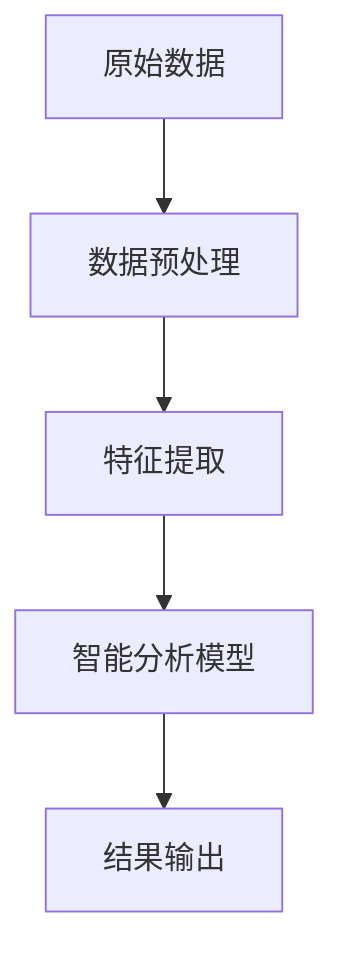
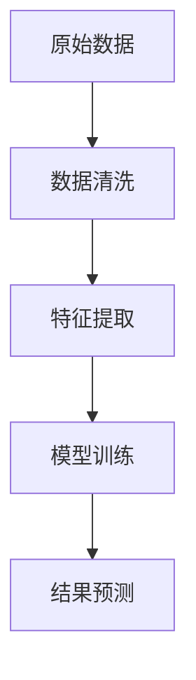
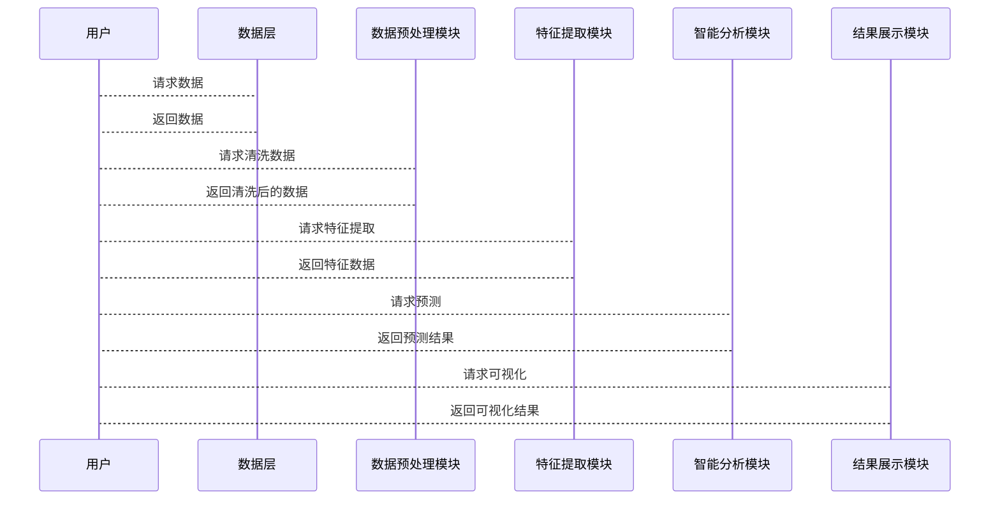

                 


```markdown
# 智能财务报表分析器

## 关键词
智能财务报表分析器, 人工智能, 财务数据, 数据预处理, 深度学习, 系统架构, 项目实战

## 摘要
智能财务报表分析器是一种基于人工智能技术的财务数据分析工具，旨在通过自动化和智能化的方法，帮助财务分析师快速、准确地解读和预测财务报表。本文从问题背景、核心概念、算法原理、系统架构到项目实战，全面系统地阐述了智能财务报表分析器的设计与实现。通过本文的讲解，读者可以深入了解智能财务报表分析器的工作原理，并掌握其实战应用方法。

---

## 第一部分: 智能财务报表分析器的背景与核心概念

### 第1章: 问题背景与核心概念

#### 1.1 问题背景
##### 1.1.1 财务报表分析的传统方法与局限性
传统财务报表分析主要依赖人工阅读和计算，效率低下且容易出错。分析师需要手动提取数据、计算指标、识别趋势，并根据经验做出判断。这种方式不仅耗时，还容易受到主观因素的影响。

##### 1.1.2 人工智能在财务分析中的应用潜力
人工智能（AI）技术，特别是机器学习和深度学习，能够从大量数据中提取特征、识别模式，并做出预测。这些技术可以显著提高财务报表分析的效率和准确性，帮助分析师做出更明智的决策。

##### 1.1.3 智能财务报表分析器的定义与目标
智能财务报表分析器是一种结合AI技术的工具，旨在自动化地处理和分析财务数据，生成有价值的洞察。其目标是通过智能化的方法，帮助用户快速理解财务报表，识别潜在风险，并提供数据驱动的决策支持。

#### 1.2 核心概念
##### 1.2.1 数据采集与预处理
数据采集是智能财务报表分析器的第一步，包括从多种数据源（如Excel、数据库）获取财务数据。预处理步骤包括数据清洗（处理缺失值、异常值）和数据标准化。

##### 1.2.2 财务指标特征提取
通过分析财务报表中的各项指标（如收入、利润、负债等），提取关键特征，为后续的分析和预测提供基础。

##### 1.2.3 智能分析模型的构建
基于提取的特征，构建机器学习或深度学习模型，对财务数据进行分类、回归或聚类分析，生成预测结果。

#### 1.3 边界与外延
##### 1.3.1 智能财务报表分析器的功能边界
智能财务报表分析器主要专注于财务数据的分析，不涉及数据录入、生成报表等任务。

##### 1.3.2 与其他财务工具的区分
与传统的财务软件不同，智能财务报表分析器具有自动化和智能化的特点，能够主动发现数据中的规律和趋势。

##### 1.3.3 智能分析的外延应用
智能财务报表分析器的应用范围不仅限于财务领域，还可以扩展到企业风险管理、投资决策等领域。

#### 1.4 与传统财务分析方法的对比
##### 1.4.1 传统方法的优缺点
- **优点**：灵活性高，适用于复杂情境。
- **缺点**：效率低，容易出错，依赖人工经验。

##### 1.4.2 智能分析的优势
- **高效性**：自动化处理大量数据，节省时间。
- **准确性**：减少人为错误，提高分析结果的可靠性。
- **可扩展性**：能够处理不同类型和规模的数据。

##### 1.4.3 适用场景的对比分析
智能财务报表分析器特别适用于需要快速、大量数据处理的场景，如定期财务报告分析、企业风险管理等。

### 第2章: 智能财务报表分析器的核心原理

#### 2.1 核心概念与联系
##### 2.1.1 数据流与分析流程


##### 2.1.2 模型输入与输出的关系
- **输入**：经过预处理的财务数据特征。
- **输出**：分类结果、预测值或趋势分析。

##### 2.1.3 系统功能模块的实体关系图
```mermaid
entity Relationship {
  财务数据 [-->] 数据预处理模块;
  数据预处理模块 [-->] 特征提取模块;
  特征提取模块 [-->] 智能分析模型;
  智能分析模型 [-->] 结果输出模块;
}
```

#### 2.2 核心算法原理
##### 2.2.1 数据预处理流程


##### 2.2.2 特征提取与选择
```python
# 示例代码
import pandas as pd
data = pd.read_csv('financial_data.csv')
features = data[['收入', '利润', '负债', '资产']]
```

##### 2.2.3 模型训练与预测
```python
from sklearn.linear_model import LinearRegression
model = LinearRegression()
model.fit(features, target)
predictions = model.predict(new_features)
```

##### 2.2.4 算法原理的数学模型
$$
y = \beta_0 + \beta_1x_1 + \beta_2x_2 + \dots + \beta_nx_n + \epsilon
$$
其中，$y$ 是目标变量，$x_i$ 是特征变量，$\beta_i$ 是回归系数，$\epsilon$ 是误差项。

---

## 第二部分: 智能财务报表分析器的系统分析与架构设计

### 第3章: 系统分析与架构设计方案

#### 3.1 问题场景介绍
智能财务报表分析器主要用于企业财务数据的自动化分析，帮助管理层快速获取关键指标和趋势分析。

#### 3.2 系统功能设计
##### 3.2.1 功能模块划分
- 数据采集模块
- 数据预处理模块
- 特征提取模块
- 智能分析模块
- 结果展示模块

##### 3.2.2 系统功能的领域模型类图


#### 3.3 系统架构设计
##### 3.3.1 分层架构设计
- 数据层：负责数据的存储和访问。
- 业务逻辑层：处理数据预处理、特征提取和模型训练。
- 用户界面层：展示分析结果和用户交互。

##### 3.3.2 系统架构图


##### 3.3.3 接口设计
- 数据接口：与数据库或文件交互。
- 分析接口：接收特征数据，返回预测结果。
- 展示接口：输出可视化结果。

##### 3.3.4 系统交互流程图


---

## 第三部分: 智能财务报表分析器的项目实战

### 第4章: 项目实战

#### 4.1 环境安装与配置
##### 4.1.1 安装Python和相关库
```bash
pip install numpy pandas scikit-learn matplotlib
```

#### 4.2 系统核心实现
##### 4.2.1 数据预处理代码
```python
import pandas as pd
import numpy as np

# 数据清洗
data = pd.read_csv('financial_data.csv')
data = data.dropna()
data = data.replace([np.inf, -np.inf], np.nan).dropna()
```

##### 4.2.2 特征提取代码
```python
from sklearn.feature_selection import SelectKBest
from sklearn.feature_selection import chi2

selector = SelectKBest(score_func=chi2, k=4)
selector.fit_transform(data, target)
```

##### 4.2.3 模型训练代码
```python
from sklearn.model

