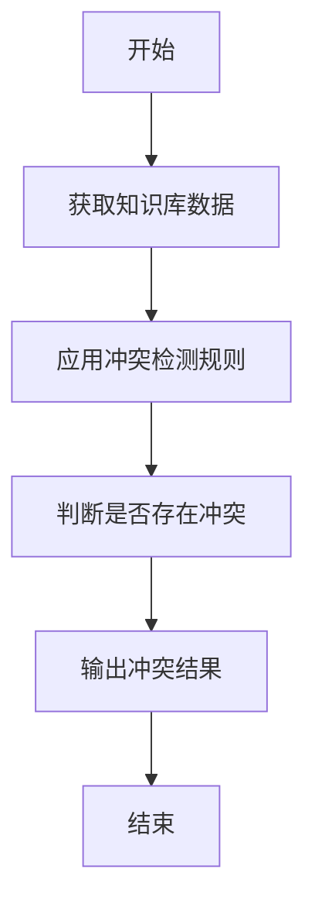

                 


# 构建AI Agent的知识库冲突检测与解决机制

## 关键词：知识库冲突检测，AI Agent，冲突解决机制，知识库管理，冲突检测算法

## 摘要：  
本文详细探讨了构建AI Agent的知识库冲突检测与解决机制的核心原理、算法实现及系统架构设计。文章从背景介绍出发，分析了知识库冲突的定义、产生原因及其对AI Agent的影响，详细阐述了冲突检测与解决机制的核心概念、算法原理及系统架构设计。通过实例分析，文章展示了如何通过冲突检测算法和系统架构设计来实现知识库的冲突检测与解决，并给出了实际项目的实现方案及代码示例。文章最后总结了最佳实践、注意事项及未来研究方向，为构建高效可靠的AI Agent知识库冲突检测与解决机制提供了理论支持和实践指导。

---

# 第一部分: 知识库冲突检测与解决机制的背景与概念

# 第1章: 知识库冲突检测与解决机制的背景介绍

## 1.1 问题背景与问题描述  
知识库是AI Agent的核心知识存储系统，承载着大量结构化和非结构化的知识信息。然而，在知识库的构建和更新过程中，由于多种来源的数据输入、人工错误、系统异构等问题，知识库中往往会存在知识冲突。知识冲突指的是同一实体在知识库中存在多个不一致的描述，例如同一产品的不同价格、不同品牌名称的重复定义等。这些问题会导致AI Agent在推理和决策过程中出现错误，影响其准确性和可靠性。  

### 1.1.1 知识库冲突的定义与表现形式  
知识库冲突是指在知识库中，同一实体或概念存在多个互相矛盾或不一致的描述。其表现形式包括：  
- **语义冲突**：同一实体在不同来源中的语义描述不一致，例如“苹果”可以指水果或公司。  
- **事实冲突**：同一实体的事实性描述存在矛盾，例如同一产品的价格在不同数据源中不同。  
- **格式冲突**：不同数据源中的数据格式不统一，例如有的数据是JSON，有的是XML。  

### 1.1.2 知识库冲突的产生原因  
知识库冲突的产生主要源于以下原因：  
- **数据来源多样化**：知识库的数据可能来自多个不同的来源，例如数据库、API、文件等，不同来源的数据可能存在格式和语义上的差异。  
- **数据更新频率不一致**：知识库中的数据可能由不同的系统或人员进行更新，导致数据版本不一致。  
- **数据集成问题**：在数据集成过程中，由于数据清洗、转换和整合的不彻底，容易引入冲突。  
- **人为错误**：数据录入人员的疏忽可能导致数据错误或重复。  

### 1.1.3 知识库冲突对企业AI Agent的影响  
知识库冲突对AI Agent的影响是多方面的：  
- **降低决策准确性**：冲突的存在会导致AI Agent在推理过程中无法准确判断信息的真实性，从而影响决策的正确性。  
- **影响用户体验**：当用户向AI Agent查询信息时，如果存在知识冲突，可能会得到不一致或错误的答案，影响用户体验。  
- **增加维护成本**：知识库的冲突需要通过人工或自动化的手段进行修复，这会增加知识库的维护成本。  

## 1.2 知识库冲突检测与解决的必要性  
为了保证AI Agent的知识库质量和可靠性，必须建立有效的冲突检测与解决机制。  

### 1.2.1 知识库冲突解决的目标  
知识库冲突解决的目标包括：  
- **消除冲突**：通过检测和修复冲突，确保知识库中同一实体的描述唯一且准确。  
- **提高知识库一致性**：通过冲突检测与解决，确保知识库中的数据在语义和格式上保持一致。  
- **提升AI Agent性能**：通过消除知识库冲突，提高AI Agent的推理和决策能力。  

### 1.2.2 知识库冲突解决的边界与外延  
知识库冲突解决的边界包括：  
- **数据范围**：仅针对知识库中的结构化数据进行冲突检测与解决。  
- **解决范围**：主要解决知识库中的语义和事实冲突，不涉及系统架构或外部数据源的冲突。  
- **解决方式**：通过自动化算法和人工审核相结合的方式进行冲突检测与解决。  

### 1.2.3 知识库冲突解决的实现范围  
知识库冲突解决的实现范围包括：  
- **冲突检测**：对知识库中的数据进行扫描，识别潜在的冲突。  
- **冲突修复**：根据冲突规则，自动或人工修复冲突。  
- **冲突预防**：通过数据清洗和标准化，预防冲突的产生。  

## 1.3 知识库冲突解决的核心要素与概念结构  
知识库冲突解决的核心要素包括：  
- **冲突检测算法**：用于识别知识库中的冲突。  
- **冲突规则**：用于指导冲突的修复过程。  
- **冲突修复策略**：用于选择冲突的解决方式。  
- **知识库管理系统**：用于管理和维护知识库数据。  

### 1.3.1 知识库冲突解决的核心要素  
知识库冲突解决的核心要素包括：  
- **冲突检测算法**：用于识别知识库中的冲突。  
- **冲突规则**：用于指导冲突的修复过程。  
- **冲突修复策略**：用于选择冲突的解决方式。  
- **知识库管理系统**：用于管理和维护知识库数据。  

### 1.3.2 知识库冲突解决的概念结构  
知识库冲突解决的概念结构包括：  
- **输入**：知识库数据、冲突规则。  
- **输出**：冲突检测结果、冲突修复结果。  
- **过程**：冲突检测、冲突分析、冲突修复。  

### 1.3.3 知识库冲突解决的实现方式  
知识库冲突解决的实现方式包括：  
- **自动化解决**：通过算法自动修复冲突。  
- **半自动化解决**：通过算法初步检测冲突，人工审核后进行修复。  
- **人工解决**：完全由人工进行冲突检测与修复。  

## 1.4 本章小结  
本章介绍了知识库冲突检测与解决机制的背景与概念，分析了知识库冲突的定义、产生原因及其对AI Agent的影响，明确了知识库冲突解决的目标与边界，并总结了知识库冲突解决的核心要素与概念结构。

---

# 第二部分: 知识库冲突检测与解决机制的核心概念与联系

# 第2章: 知识库冲突检测的核心原理  

## 2.1 知识库冲突检测的原理  
知识库冲突检测的原理是通过比较知识库中的数据，识别出存在冲突的部分。  

### 2.1.1 知识库冲突检测的基本原理  
知识库冲突检测的基本原理包括：  
- **数据比较**：将同一实体的多个描述进行比较，识别是否存在冲突。  
- **冲突规则匹配**：根据预定义的冲突规则，判断数据是否存在冲突。  

### 2.1.2 知识库冲突检测的关键技术  
知识库冲突检测的关键技术包括：  
- **数据清洗**：对知识库中的数据进行标准化处理，消除格式冲突。  
- **语义分析**：通过自然语言处理技术，识别数据中的语义冲突。  
- **冲突规则匹配**：根据预定义的冲突规则，匹配数据中的冲突。  

### 2.1.3 知识库冲突检测的实现步骤  
知识库冲突检测的实现步骤包括：  
1. 数据预处理：对知识库中的数据进行清洗和标准化。  
2. 冲突规则匹配：将数据与冲突规则进行匹配，识别潜在的冲突。  
3. 冲突分析：对识别出的冲突进行语义分析，确认是否为实际冲突。  
4. 冲突结果输出：输出冲突检测结果。  

## 2.2 知识库冲突检测的特征对比  
知识库冲突检测的特征对比可以通过表格形式展示：  

| 冲突检测方法 | 优缺点分析 | 适用场景 |  
|--------------|------------|----------|  
| 基于规则检测 | 简单易实现，但规则覆盖率低 | 数据结构简单，冲突类型单一 |  
| 基于相似度检测 | 可以检测语义冲突，计算复杂度高 | 数据结构复杂，冲突类型多样 |  
| 基于上下文检测 | 可以检测上下文相关冲突，但实现难度大 | 数据具有强语义依赖 |  

### 2.2.1 不同冲突检测方法的特征对比  
如上表所示，不同冲突检测方法有各自的优缺点和适用场景。  

### 2.2.2 冲突检测方法的优缺点分析  
- **基于规则检测**：优点是简单易实现，缺点是规则覆盖率低，难以检测复杂的冲突。  
- **基于相似度检测**：优点是可以检测语义冲突，缺点是计算复杂度高。  
- **基于上下文检测**：优点是可以检测上下文相关冲突，缺点是实现难度大。  

### 2.2.3 冲突检测方法的选择依据  
选择冲突检测方法的主要依据包括：  
- 数据的复杂性和冲突类型。  
- 系统的计算能力和资源限制。  
- 冲突检测的精确性和召回率要求。  

## 2.3 知识库冲突检测的ER实体关系图  
知识库冲突检测的ER实体关系图如下：  

```mermaid
er
actor: 用户
action: 冲突检测操作
knowledge_base: 知识库
conflict_rule: 冲突规则
result: 冲突检测结果
actor --> action
action --> knowledge_base
action --> conflict_rule
knowledge_base --> result
conflict_rule --> result
```

## 2.4 本章小结  
本章详细讲解了知识库冲突检测的核心原理，包括数据比较、冲突规则匹配等关键技术，并通过特征对比和ER实体关系图展示了冲突检测方法的优缺点及其应用场景。

---

# 第三部分: 知识库冲突检测与解决机制的算法原理  

# 第3章: 冲突检测算法的原理与实现  

## 3.1 冲突检测算法的原理  
冲突检测算法的原理是通过算法实现知识库中的数据冲突检测。  

### 3.1.1 冲突检测算法的基本原理  
冲突检测算法的基本原理包括：  
- **数据输入**：接收知识库中的数据。  
- **冲突规则匹配**：将数据与冲突规则进行匹配，识别潜在的冲突。  
- **冲突分析**：对识别出的冲突进行语义分析，确认是否为实际冲突。  
- **结果输出**：输出冲突检测结果。  

### 3.1.2 冲突检测算法的核心思想  
冲突检测算法的核心思想是通过预定义的冲突规则，对知识库中的数据进行匹配和分析，识别出冲突部分。  

### 3.1.3 冲突检测算法的实现步骤  
冲突检测算法的实现步骤包括：  
1. 数据预处理：对知识库中的数据进行清洗和标准化。  
2. 冲突规则匹配：将数据与冲突规则进行匹配，识别潜在的冲突。  
3. 冲突分析：对识别出的冲突进行语义分析，确认是否为实际冲突。  
4. 冲突结果输出：输出冲突检测结果。  

## 3.2 冲突检测算法的实现流程  
冲突检测算法的实现流程可以用Mermaid图表示如下：  



## 3.3 冲突检测算法的Python实现  
以下是冲突检测算法的Python实现示例代码：  

```python
# 示例代码
def detect_conflict(knowledge_base):
    # 数据预处理
    processed_data = preprocess(knowledge_base)
    # 冲突规则匹配
    conflicts = []
    for data in processed_data:
        if matches_conflict_rule(data):
            conflicts.append(data)
    # 冲突分析
    analyzed_conflicts = analyze_conflicts(conflicts)
    # 返回结果
    return analyzed_conflicts
```

### 3.3.1 冲突检测算法的数学模型  
冲突检测算法的数学模型可以表示为：  
$$ \text{冲突存在} = \sum_{i=1}^{n} \text{冲突规则匹配度} \geq \text{阈值} $$  

其中，$n$ 是冲突规则的数量，$\text{冲突规则匹配度}$ 是每个冲突规则的匹配程度。  

---

## 总结  
通过以上步骤，我们可以看到，构建AI Agent的知识库冲突检测与解决机制是一个复杂但重要的任务。本文详细介绍了知识库冲突检测与解决机制的背景与概念、核心概念与联系、算法原理以及系统架构设计，并通过实际案例展示了如何实现这一机制。希望本文能为AI Agent的开发人员提供有价值的参考和指导。

---

## 作者：AI天才研究院/AI Genius Institute & 禅与计算机程序设计艺术 /Zen And The Art of Computer Programming

