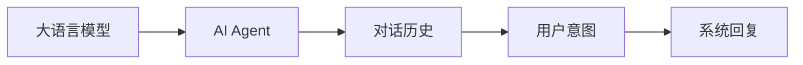
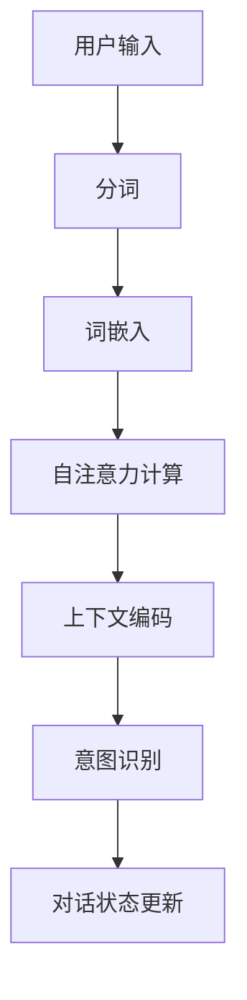
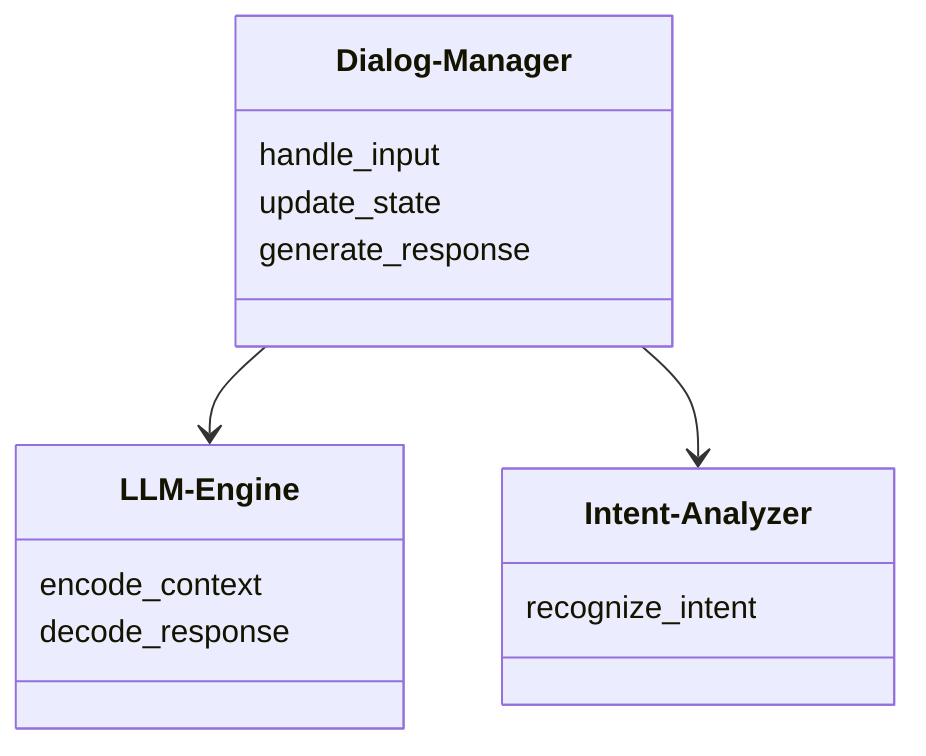
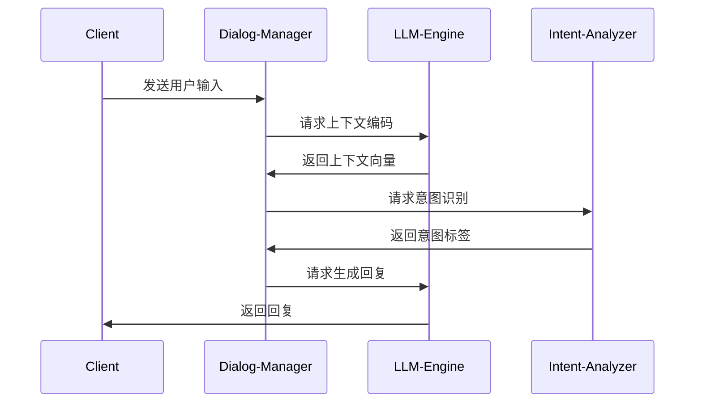

                 


# 构建LLM驱动的AI Agent多轮对话理解

## 关键词：LLM、AI Agent、多轮对话理解、自然语言处理、深度学习、对话系统

## 摘要：本文深入探讨了构建LLM驱动的AI Agent多轮对话理解系统的各个方面，从核心概念、算法原理到系统架构，结合实际案例，详细阐述了如何实现高效的多轮对话理解。文章内容涵盖背景介绍、核心概念对比、算法流程、系统设计以及项目实战，旨在为读者提供全面的技术指导。

---

## 第1章：问题背景与问题描述

### 1.1 问题背景
#### 1.1.1 当前人机交互的挑战
随着AI技术的发展，人机交互的需求日益增长。传统的单轮对话无法满足复杂场景的需求，用户期望与AI Agent进行多轮对话，以实现更自然和高效的交流。

#### 1.1.2 多轮对话理解的重要性
在医疗咨询、智能客服等领域，多轮对话能帮助系统更好地理解用户需求，提供更精准的服务。例如，在医疗咨询中，医生需要通过多轮对话了解患者的详细症状，以做出准确诊断。

#### 1.1.3 LLM在对话理解中的作用
大语言模型（LLM）如GPT-3、PaLM具备强大的上下文理解和生成能力，能够处理复杂对话中的语义关联和意图识别。

### 1.2 问题描述
#### 1.2.1 多轮对话的基本特点
多轮对话涉及对话历史的维护、上下文的理解以及意图的识别。例如，在电商客服中，用户可能需要多次澄清需求，系统需要逐步理解用户的购买意图。

#### 1.2.2 LLM驱动的AI Agent的核心问题
LLM驱动的AI Agent需要解决对话历史的高效编码、意图识别的准确性以及对话生成的连贯性问题。例如，在智能音箱中，用户可能需要多次对话才能完成设置，系统需准确捕捉用户的意图。

#### 1.2.3 对话理解的边界与外延
对话理解的边界在于如何处理歧义和上下文缺失的情况，外延则包括对话生成和任务执行。例如，在复杂任务中，系统可能需要结合对话理解与任务推理，实现端到端的服务。

### 1.3 问题解决与核心要素
#### 1.3.1 对话理解的目标
通过分析对话历史，准确识别用户的当前意图，并生成符合语境的回复。例如，在智能客服中，系统需准确理解用户的投诉内容，提供有效的解决方案。

#### 1.3.2 核心要素组成
包括对话历史编码、意图识别模型、上下文管理模块和反馈优化机制。例如，在医疗咨询中，系统需维护完整的对话历史，以准确识别用户的后续需求。

#### 1.3.3 问题解决的路径
通过优化LLM的对话历史编码方式，结合强化学习和反馈机制，提升意图识别的准确性和对话生成的流畅性。

---

## 第2章：核心概念与联系

### 2.1 核心概念原理
#### 2.1.1 LLM的基本原理
LLM通过自注意力机制捕捉上下文信息，生成连贯的回复。例如，在GPT-3中，模型通过多头注意力机制，关注不同的语义信息。

#### 2.1.2 AI Agent的定义与特点
AI Agent是具备自主决策和执行能力的智能体，能够与用户进行多轮交互。例如，在智能助手中，Agent需根据对话历史执行相应的任务，如设置闹钟或查询天气。

#### 2.1.3 多轮对话理解的实现机制
通过维护对话状态，逐步更新用户的意图和需求。例如，在电商客服中，系统通过对话状态跟踪，逐步确认用户的订单需求。

### 2.2 核心概念对比
#### 2.2.1 不同LLM模型的对比分析
| 模型 | 参数量（亿） | 上下文长度 | 应用场景 |
|------|-------------|-----------|----------|
| GPT-3 | 175 | 4096 | 多任务通用对话 |
| PaLM | 560 | 4096 | 领域特定任务 |

#### 2.2.2 对话理解与任务执行的关系
对话理解是任务执行的前提，任务执行的结果又会反馈到对话理解中，形成闭环。例如，在智能音箱中，系统理解用户的设置指令后，执行相应操作，并在反馈中确认设置结果。

#### 2.2.3 实时交互与非实时交互的对比
| 特性 | 实时交互 | 非实时交互 |
|------|----------|------------|
| 延迟 | 低 | 高 |
| 资源需求 | 高 | 低 |

### 2.3 实体关系图


---

## 第3章：算法原理讲解

### 3.1 LLM的训练与推理
#### 3.1.1 Transformer模型的结构
Transformer由编码器和解码器组成，编码器负责输入处理，解码器负责生成输出。例如，在编码器中，位置编码将输入序列的位置信息融入词向量中。

#### 3.1.2 注意力机制的实现
自注意力机制通过计算查询与键的相似度，生成注意力权重，加权求和得到输出。例如，在生成对话回复时，模型关注对话历史中的关键部分。

#### 3.1.3 对话历史的编码方法
将对话历史表示为序列，通过Transformer编码器生成上下文向量。例如，使用位置编码捕捉对话的顺序信息。

### 3.2 对话理解的算法流程


---

## 第4章：数学模型与公式

### 4.1 Transformer模型的数学基础
#### 4.1.1 self-attention的计算公式
$$\text{Attention}(Q,K,V) = \text{softmax}\left(\frac{QK^T}{\sqrt{d_k}}\right)V$$
其中，$Q$是查询向量，$K$是键向量，$V$是值向量，$d_k$是向量维度。

#### 4.1.2 前馈网络的数学表达
$$f(x) = \text{ReLU}(Wx + b)$$
其中，$W$是权重矩阵，$b$是偏置向量，$\text{ReLU}$是激活函数。

### 4.2 对话理解的优化公式
#### 4.2.1 损失函数的定义
$$\mathcal{L} = -\sum_{i=1}^{n} y_i \log p(y_i|x)$$
其中，$y_i$是真实标签，$p(y_i|x)$是模型预测的概率。

---

## 第5章：系统分析与架构设计

### 5.1 项目背景与目标
本项目旨在构建一个基于LLM的AI Agent，实现高效的多轮对话理解。例如，在智能客服系统中，提升用户咨询的满意度。

### 5.2 系统功能设计


### 5.3 系统架构设计


### 5.4 系统接口设计
- 用户输入接口：接收用户的文本输入。
- 系统输出接口：返回对话回复。
- 数据存储接口：维护对话历史和用户状态。

### 5.5 交互流程分析


---

## 第6章：项目实战

### 6.1 环境安装与配置
安装Python 3.8及以上版本，安装必要的库：
```bash
pip install transformers torch
```

### 6.2 核心代码实现
```python
import torch
from transformers import AutoTokenizer, AutoModelForSeq2SeqLM

tokenizer = AutoTokenizer.from_pretrained('facebook/palm')
model = AutoModelForSeq2SeqLM.from_pretrained('facebook/palm')

def encode(context):
    inputs = tokenizer(context, return_tensors='pt')
    return model.encoder(inputs.input_ids, inputs.attention_mask)

def decode(context_vector, max_length=50):
    outputs = model.decoder.generate(context_vector, max_length=max_length)
    return tokenizer.decode(outputs[0])
```

### 6.3 实际案例分析
通过电商客服场景，分析如何实现多轮对话理解。例如，用户咨询订单状态，系统逐步确认订单信息。

---

## 第7章：最佳实践与小结

### 7.1 实践建议
- 确保对话历史的有效编码，提升意图识别的准确性。
- 定期优化模型参数，适应新数据和新任务。
- 通过用户反馈不断改进对话理解的质量。

### 7.2 小结
本文详细探讨了构建LLM驱动的AI Agent多轮对话理解系统的各个方面，从理论到实践，为读者提供了全面的技术指导。未来，随着LLM技术的不断发展，对话理解的准确性和流畅性将不断提升。

---

## 第8章：附录

### 8.1 扩展阅读
- 建议阅读《Attention Is All You Need》和《Pathways-Large Language Model》。

### 8.2 工具与资源
- 使用Hugging Face的Transformers库进行模型训练和推理。
- 参考PyTorch的文档进行深度学习模型的实现。

---

## 作者：AI天才研究院 & 禅与计算机程序设计艺术

---

以上是完整的目录大纲，每部分内容均可展开详细撰写。通过这种结构化的方法，确保文章逻辑清晰，内容详实。

