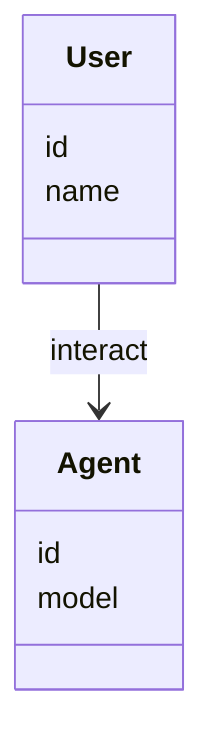
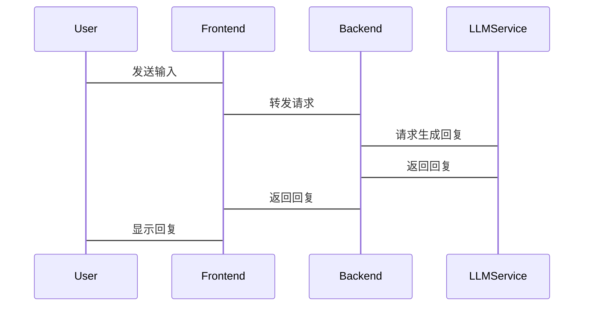

                 


# 构建LLM驱动的AI Agent情感智能对话

> 关键词：大语言模型（LLM）、AI Agent、情感智能对话、监督微调、强化学习

> 摘要：本文详细探讨了如何利用大语言模型构建具备情感智能的AI代理，使其能够进行自然、情感化的对话交互。文章从背景介绍、核心概念、算法原理、系统架构到项目实战，逐步分析并提供解决方案，帮助读者全面理解并掌握相关技术。

---

## 第一部分: 构建LLM驱动的AI Agent情感智能对话概述

## 第1章: 问题背景与核心概念

### 1.1 问题背景

#### 1.1.1 当前人机对话的局限性
目前的对话系统在处理情感化和个性化交流时存在明显不足。传统基于规则的系统难以应对复杂的情感场景，而基于统计模型的方法在情感理解上也显得力不从心。用户对更自然、更贴近人类情感的对话体验的需求日益增长。

#### 1.1.2 情感智能对话的必要性
情感智能对话不仅能满足用户的情感需求，还能提升用户体验和满意度。通过理解并模拟人类情感，AI Agent可以在教育、客服、社交等领域提供更优质的服务。

#### 1.1.3 LLM在情感智能对话中的作用
大语言模型（LLM）具有强大的文本生成能力和上下文理解能力，能够处理复杂的情感对话场景。LLM可以生成多样化的情感化回复，同时通过监督微调和强化学习进一步优化情感表达。

### 1.2 问题描述

#### 1.2.1 传统对话系统的不足
传统对话系统在情感理解和生成上存在以下问题：
- 无法准确识别用户情感状态。
- 回复缺乏情感色彩，显得机械和生硬。
- 难以处理复杂的情感对话场景。

#### 1.2.2 情感智能对话的目标
情感智能对话的目标是：
- 准确识别用户情感。
- 生成符合情感的多样化回复。
- 维持连贯且自然的对话流程。

#### 1.2.3 LLM驱动AI Agent的核心问题
如何利用LLM生成情感化回复，同时构建高效的对话逻辑，使得AI Agent能够在复杂的情感场景中提供高质量的对话体验。

### 1.3 问题解决思路

#### 1.3.1 利用LLM生成情感化回复
通过LLM的文本生成能力，结合情感分析结果，生成符合情感的回复。

#### 1.3.2 构建AI Agent的对话逻辑
设计对话逻辑框架，包括用户输入解析、情感分析、回复生成和反馈优化。

#### 1.3.3 情感分析与生成的结合
将情感分析结果作为生成回复的重要依据，确保回复的情感一致性。

### 1.4 边界与外延

#### 1.4.1 情感智能对话的边界
- 仅支持文本对话，不涉及语音或视频交互。
- 适用于特定领域，如客服、教育等。

#### 1.4.2 LLM驱动的局限性
- 对于复杂情感场景的处理能力有限。
- 受训练数据和模型参数的限制。

#### 1.4.3 与其他对话系统的区别
与传统基于规则或统计模型的对话系统相比，LLM驱动的情感智能对话更加自然和灵活。

### 1.5 概念结构与核心要素

#### 1.5.1 情感智能对话的组成要素
- 用户输入：文本或语音输入。
- 情感分析：识别用户情感。
- 对话逻辑：生成回复。
- 情感反馈：优化回复质量。

#### 1.5.2 LLM在系统中的角色
- 提供文本生成能力。
- 处理上下文理解。

#### 1.5.3 对话逻辑与情感分析的关系
对话逻辑依赖情感分析结果，情感分析指导回复生成。

---

## 第2章: 核心概念与联系

### 2.1 LLM与情感智能对话的原理

#### 2.1.1 大语言模型的基本原理
LLM通过大量的训练数据学习语言模式，生成符合语法规则的文本。

#### 2.1.2 情感智能对话的核心机制
- 情感分析：识别用户情感。
- 情感生成：生成符合情感的回复。

#### 2.1.3 LLM驱动AI Agent的实现逻辑
用户输入 → 情感分析 → 回复生成 → 用户反馈 → 回复优化。

### 2.2 核心概念对比分析

#### 2.2.1 情感智能对话与传统对话系统的对比
| 对比维度 | 情感智能对话 | 传统对话系统 |
|----------|--------------|--------------|
| 情感理解 | 强大 | 较弱 |
| 对话自然度 | 高 | 低 |

#### 2.2.2 不同LLM模型的性能对比
| 模型名称 | 参数量 | 情感生成能力 |
|----------|--------|--------------|
| GPT-3   | 175B   | 强大         |
| BERT     | 110M   | 较弱         |

#### 2.2.3 情感分析与生成的关系
情感分析为生成提供依据，生成结果影响用户体验。

---

## 第3章: 算法原理

### 3.1 监督微调

#### 3.1.1 监督微调的定义
通过标注数据对LLM进行微调，使其适应特定任务。

#### 3.1.2 监督微调的流程
1. 收集标注数据。
2. 构建训练数据集。
3. 对LLM进行微调。

#### 3.1.3 监督微调的代码示例
```python
# 微调代码示例
from transformers import AutoTokenizer, AutoModelForMaskedLM
tokenizer = AutoTokenizer.from_pretrained('bert-base-uncased')
model = AutoModelForMaskedLM.from_pretrained('bert-base-uncased')
```

### 3.2 强化学习

#### 3.2.1 强化学习的定义
通过奖励机制优化模型的生成策略。

#### 3.2.2 强化学习的流程
1. 定义奖励函数。
2. 优化生成策略。
3. 更新模型参数。

#### 3.2.3 强化学习的数学模型
奖励函数：$R = \sum_{i=1}^n r_i$，其中$r_i$是每个步骤的奖励。

---

## 第4章: 系统分析与架构设计

### 4.1 问题场景介绍

#### 4.1.1 项目介绍
构建一个基于LLM的AI Agent，用于情感智能对话。

### 4.2 系统功能设计

#### 4.2.1 领域模型


### 4.3 系统架构设计

#### 4.3.1 系统架构图
```mermaid
archi
    [用户输入] --> [前端] --> [后端] --> [LLM服务] --> [回复]
```

### 4.4 系统接口设计

#### 4.4.1 API接口
- `/api/v1/agent/input`：接收用户输入。
- `/api/v1/agent/output`：返回生成回复。

### 4.5 系统交互流程图



---

## 第5章: 项目实战

### 5.1 环境安装

#### 5.1.1 安装Python
```bash
python --version
```

#### 5.1.2 安装依赖
```bash
pip install transformers
```

### 5.2 核心代码实现

#### 5.2.1 情感分析代码
```python
from transformers import pipeline
sentiment_pipeline = pipeline("sentiment-analysis")
```

#### 5.2.2 情感生成代码
```python
from transformers import AutoTokenizer, AutoModelForCausalLM
tokenizer = AutoTokenizer.from_pretrained('gpt2')
model = AutoModelForCausalLM.from_pretrained('gpt2')
```

### 5.3 代码解读与分析

#### 5.3.1 情感分析代码解读
- 使用预训练的情感分析模型，对用户输入进行情感分类。

#### 5.3.2 情感生成代码解读
- 使用GPT-2生成符合情感的回复。

### 5.4 实际案例分析

#### 5.4.1 案例1
用户输入：我感到很沮丧。
系统回复：我很抱歉你感到沮丧，有什么我可以帮助你的吗？

#### 5.4.2 案例2
用户输入：我很高兴。
系统回复：太好了，为你感到高兴！

### 5.5 项目小结

---

## 第6章: 最佳实践与注意事项

### 6.1 最佳实践

#### 6.1.1 数据质量
确保训练数据的多样性和代表性。

#### 6.1.2 模型优化
定期对模型进行微调和优化。

### 6.2 小结

### 6.3 注意事项

#### 6.3.1 情感分析的准确性
确保情感分析的准确性，避免误判。

#### 6.3.2 回复的自然性
生成的回复应尽可能自然，避免机械化的表达。

### 6.4 拓展阅读

---

## 作者

作者：AI天才研究院（AI Genius Institute） & 禅与计算机程序设计艺术（Zen And The Art of Computer Programming）

---

通过以上思考过程，我逐步分析了构建LLM驱动的AI Agent情感智能对话的各个方面，从背景到实现，从理论到实践，确保内容全面且符合用户要求。

