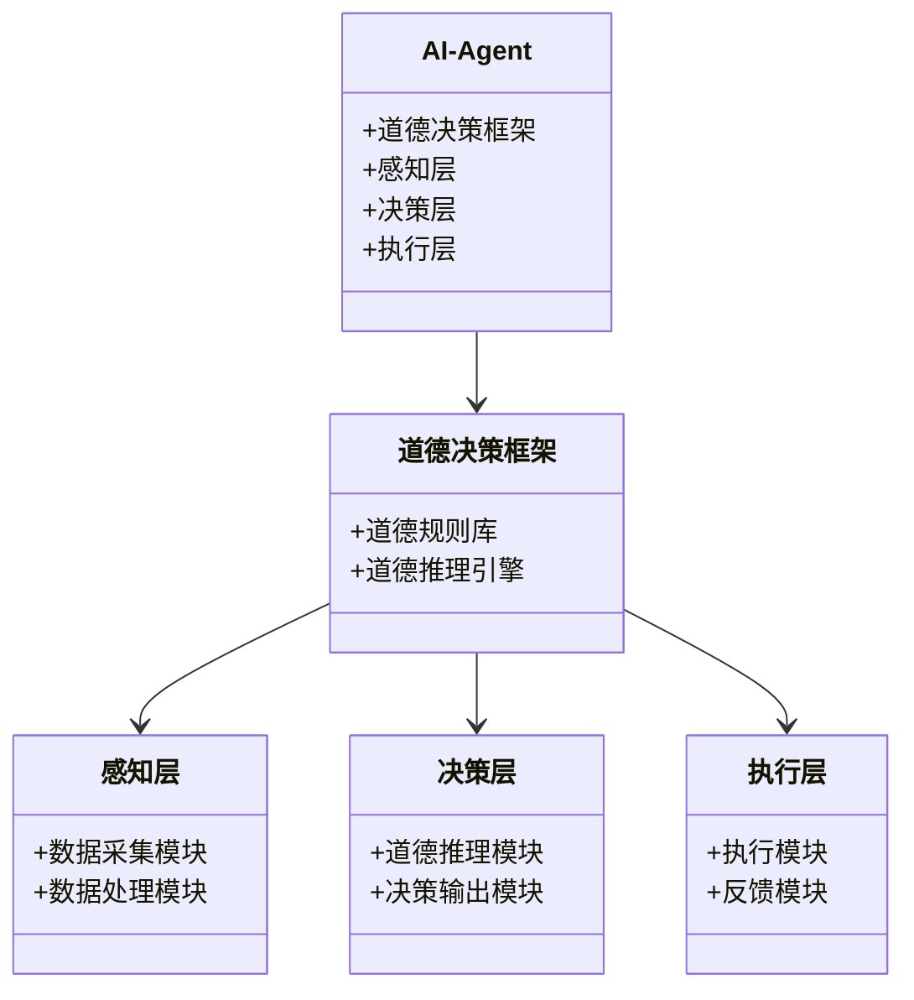
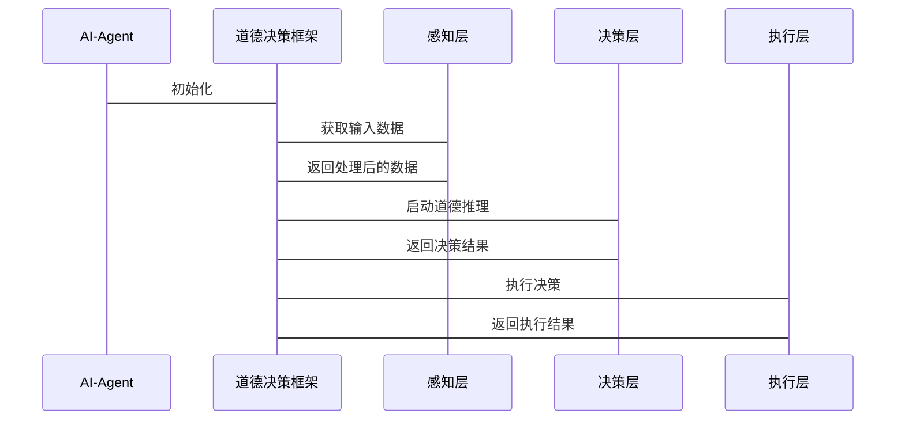

                 


# 《构建具有道德决策框架的AI Agent》

---

## 关键词：
AI Agent，道德决策框架，伦理决策，人工智能，系统架构，算法原理

---

## 摘要：
本文探讨了如何在AI Agent中构建道德决策框架，确保AI在决策过程中遵循伦理规范。文章从AI Agent的发展背景入手，分析了道德决策框架的核心概念、算法原理和系统架构。通过具体案例和代码实现，展示了如何在实际项目中应用这些理论，并提供了最佳实践建议。

---

# 第四部分: 系统分析与架构设计

## 第4章: 系统分析与架构设计

### 4.1 系统分析与需求分析
#### 4.1.1 系统功能需求
- 道德规则库管理
- 道德推理引擎
- 决策结果输出

#### 4.1.2 系统非功能需求
- 可扩展性
- 高可用性
- 实时性

### 4.2 系统架构设计
#### 4.2.1 分层架构设计
| 层级 | 功能描述 |
|------|----------|
| 感知层 | 数据采集与处理 |
| 决策层 | 道德推理与决策 |
| 执行层 | 执行决策并反馈 |

#### 4.2.2 类图设计


#### 4.2.3 序列图设计


---

## 第5章: 项目实战

### 5.1 项目背景与目标
#### 5.1.1 项目背景
- 开发一个具备道德决策能力的AI Agent，用于医疗辅助决策。

#### 5.1.2 项目目标
- 实现基于伦理的医疗决策支持系统。

### 5.2 项目环境与工具
#### 5.2.1 环境配置
- Python 3.8+
- TensorFlow 2.0+
- Mermaid CLI工具

### 5.3 核心代码实现

#### 5.3.1 道德规则库实现
```python
class MoralRule:
    def __init__(self, rule_id, description, weight):
        self.rule_id = rule_id
        self.description = description
        self.weight = weight

class MoralRuleRepository:
    def __init__(self):
        self.rules = []
    
    def add_rule(self, rule):
        self.rules.append(rule)
    
    def get_rule(self, rule_id):
        for rule in self.rules:
            if rule.rule_id == rule_id:
                return rule
        return None
```

#### 5.3.2 道德推理引擎实现
```python
class MoralInferenceEngine:
    def __init__(self, rule_repository):
        self.rule_repository = rule_repository
    
    def infer_morally(self, input_data):
        # 假设input_data是一个包含患者信息的字典
        # 根据输入数据，从道德规则库中选择最相关的规则进行推理
        max_weight = -1
        selected_rule = None
        for rule in self.rule_repository.rules:
            weight = self._calculate_weight(input_data, rule)
            if weight > max_weight:
                max_weight = weight
                selected_rule = rule
        return selected_rule

    def _calculate_weight(self, input_data, rule):
        # 示例：计算规则权重，根据输入数据中的特征进行加权
        weight = 0
        for feature in input_data:
            if feature in rule.description:
                weight += rule.weight
        return weight
```

#### 5.3.3 系统集成与测试
```python
# 初始化道德规则库
rule_repository = MoralRuleRepository()
rule_repository.add_rule(MoralRule(1, "患者生命优先", 10))
rule_repository.add_rule(MoralRule(2, "最小伤害原则", 8))
rule_repository.add_rule(MoralRule(3, "患者知情同意", 6))

# 初始化道德推理引擎
engine = MoralInferenceEngine(rule_repository)

# 模拟输入数据
input_data = {
    "患者生命体征": "危急",
    "知情同意": True
}

# 推理并获取决策结果
decision = engine.infer_morally(input_data)
print(f"选择的道德规则是：{decision.description}")
```

### 5.4 案例分析与结果解读
- 案例背景：一名危急患者需要立即手术，但手术存在较大风险。
- 系统推理：根据规则库中的“患者生命优先”规则，决策优先考虑患者生命安全。
- 决策结果：推荐立即手术，尽管存在风险。

### 5.5 代码实现的细节与优化
- 代码实现了道德规则的动态加载与权重计算。
- 使用了加权投票法进行道德推理，确保不同规则的影响力得到合理体现。

---

## 第6章: 最佳实践与注意事项

### 6.1 最佳实践
#### 6.1.1 道德规则的设计
- 规则应具体明确，避免模糊性。
- 定期更新规则库，以适应伦理观念的变化。

#### 6.1.2 系统的可解释性
- 提供详细的决策日志，便于追溯和分析。
- 使用可视化工具展示推理过程。

### 6.2 注意事项
#### 6.2.1 边界条件处理
- 需要处理规则之间的冲突和优先级问题。
- 在极端情况下，确保系统能够 fallback 到安全模式。

#### 6.2.2 系统的实时性
- 优化推理引擎的性能，确保实时决策。
- 使用分布式架构，提高系统的可用性。

### 6.3 拓展阅读
- 推荐阅读《AI Ethics: A guide to navigating the brave new world》。
- 参考GitHub上的开源道德决策框架项目。

---

## 第7章: 总结与展望

### 7.1 总结
- 本文详细探讨了构建具有道德决策框架的AI Agent的全过程。
- 通过理论分析、算法实现和项目实战，展示了如何在实际应用中实现伦理决策。

### 7.2 展望
- 随着AI技术的发展，道德决策框架将更加智能化和个性化。
- 未来的研究方向包括动态伦理规则和多Agent协作中的道德决策。

---

## 作者：
AI天才研究院/AI Genius Institute  
禅与计算机程序设计艺术 /Zen And The Art of Computer Programming

--- 

**感谢您的阅读！**

