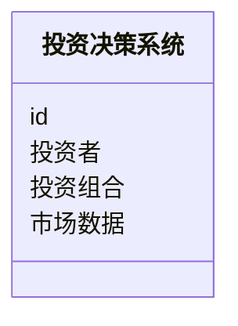
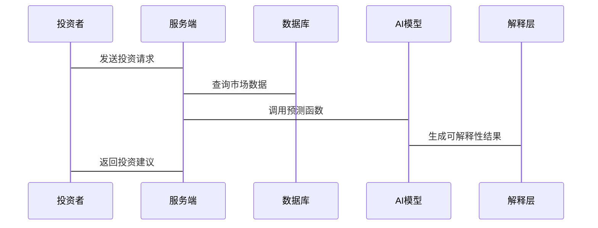

                 


# 构建可解释的AI投资决策支持系统

## 关键词：可解释性AI，投资决策，SHAP值，LIME算法，投资组合优化

## 摘要

本文详细探讨了如何构建一个可解释的AI投资决策支持系统。通过分析可解释性AI的核心算法、数学模型及系统架构，结合实际项目实战，展示了如何在投资决策中实现透明和可靠的人工智能解决方案。文章从背景介绍到系统设计，再到代码实现，层层深入，帮助读者全面理解可解释性AI在投资领域的应用。

---

# 第一部分: 可解释性AI与投资决策概述

## 第1章: 可解释性AI与投资决策的背景

### 1.1 问题背景

#### 1.1.1 传统投资决策的局限性

传统投资决策主要依赖于分析师的主观判断和经验，存在以下问题：
- **信息不全**：依赖单个分析师的判断，容易遗漏关键市场信号。
- **主观性**：决策过程受主观因素影响，难以保证客观性。
- **决策风险**：缺乏系统性分析，导致投资决策的不可控风险。

#### 1.1.2 AI在投资决策中的应用现状

人工智能在投资领域的应用日益广泛，主要体现在：
- **数据处理**：AI能够快速处理海量数据，发现潜在投资机会。
- **预测模型**：利用机器学习算法预测市场趋势，优化投资组合。
- **自动化交易**：AI驱动的算法交易已成为金融市场的重要组成部分。

#### 1.1.3 可解释性AI的需求与重要性

随着AI在投资领域的深入应用，可解释性成为关键需求：
- **透明性**：投资者需要了解AI决策的依据，确保决策的透明性和可信度。
- **合规性**：金融机构需要满足监管要求，确保AI决策过程符合法规。
- **风险管理**：可解释性AI有助于识别和管理投资风险。

### 1.2 问题描述

#### 1.2.1 投资决策中的不确定性

投资决策面临的不确定性包括市场波动、政策变化和宏观经济因素等，这些因素使得投资决策具有高度不确定性。

#### 1.2.2 AI模型的黑箱问题

复杂的AI模型（如深度神经网络）通常被视为“黑箱”，其决策过程难以解释，这在投资领域尤为关键，因为需要明确决策背后的逻辑。

#### 1.2.3 可解释性在投资决策中的必要性

可解释性AI能够帮助投资者理解模型的决策逻辑，增强对投资决策的信任，并在出现错误时及时调整策略。

### 1.3 问题解决

#### 1.3.1 可解释性AI的核心目标

可解释性AI的目标是通过透明化模型决策过程，提供可信赖的投资建议，并支持决策的可追溯性。

#### 1.3.2 解决投资决策中的可解释性问题

通过采用可解释性算法（如LIME和SHAP值）和技术，构建透明的AI投资决策支持系统。

#### 1.3.3 边界与外延

- **边界**：专注于投资决策的可解释性，不涉及交易执行和市场微观结构。
- **外延**：可应用于投资组合管理、风险评估和市场预测等场景。

### 1.4 核心概念与联系

#### 1.4.1 核心概念原理

- **可解释性AI**：通过透明化模型决策过程，提供可信赖的投资建议。
- **投资决策支持系统**：整合数据、模型和分析工具，支持投资决策。

#### 1.4.2 核心概念属性特征对比

| 特性 | 可解释性AI | 投资决策支持系统 |
|------|------------|-------------------|
| 目标 | 提供透明的决策过程 | 支持投资决策 |
| 方法 | 使用LIME和SHAP值 | 整合数据和模型 |
| 输出 | 明确的决策依据 | 投资策略和建议 |

#### 1.4.3 ER实体关系图架构

```mermaid
erd
    投资者
        id
    投资决策系统
        id
    投资组合
        id
    市场数据
        id
```

---

## 第二部分: 可解释性AI的核心算法与数学模型

## 第2章: 可解释性AI的核心算法

### 2.1 核心算法原理

#### 2.1.1 LIME算法

LIME（Local Interpretable Model-agnostic Explanations）用于解释AI模型的决策过程，通过局部线性近似提供可解释的结果。

#### 2.1.2 SHAP值

SHAP（SHapley Additive exPlanations）基于博弈论中的Shapley值，量化每个特征对模型预测的贡献。

#### 2.1.3 TreeExplainer

TreeExplainer是用于解释树模型（如随机森林和梯度提升树）的可解释性工具。

### 2.2 算法原理的数学模型

#### 2.2.1 LIME算法的数学公式

$$ \text{权重计算} = \sum_{i=1}^{n} w_i x_i $$

#### 2.2.2 SHAP值的计算公式

$$ \text{SHAP值} = \phi_i = \sum_{S \subseteq \{i\}} \text{weight}(S) \cdot f(S) $$

### 2.3 算法实现

#### 2.3.1 使用Python实现LIME

```python
from lime import lime lime_tabular

explainer = lime lime_tabular.LimeTabularExplainer(X_train, feature_names=feature_names)
explanation = explainer.explain_instance(X_test[0], model.predict)
print(explanation.as_list())
```

#### 2.3.2 使用SHAP库解释模型

```python
import shap

explainer = shap.TreeExplainer(model)
shap_values = explainer.shap_values(X_test)
shap.summary_plot(shap_values, X_test, plot_type="bar")
```

## 第3章: 投资决策中的数学模型与公式

### 3.1 投资决策模型

#### 3.1.1 线性回归模型

$$ y = \beta_0 + \beta_1 x_1 + \beta_2 x_2 + \dots + \beta_n x_n $$

#### 3.1.2 随机森林模型

$$ y = \sum_{i=1}^{n} \text{Tree}_i(x) $$`

### 3.2 可解释性评估指标

#### 3.2.1 SHAP值的可解释性评分

SHAP值提供每个特征对模型预测的贡献度，帮助理解模型决策过程。

#### 3.2.2 LIME的解释性评分

LIME通过局部线性近似，提供模型在特定数据点的可解释性评分。

---

## 第三部分: 投资决策支持系统的架构设计

## 第4章: 系统分析与架构设计方案

### 4.1 系统功能设计

#### 4.1.1 领域模型



### 4.2 系统架构设计


### 4.3 系统接口设计

- **输入接口**：接收投资者的投资请求和市场数据。
- **输出接口**：返回投资建议和可解释性结果。

### 4.4 系统交互流程



---

## 第四部分: 项目实战

## 第5章: 项目实战

### 5.1 环境安装

```bash
pip install numpy pandas scikit-learn lime python-shap
```

### 5.2 系统核心实现源代码

```python
import numpy as np
import pandas as pd
from sklearn.ensemble import RandomForestRegressor
from lime import lime lime_tabular
import shap

# 加载数据
data = pd.read_csv('investment_data.csv')
X = data.drop('target', axis=1)
y = data['target']

# 训练模型
model = RandomForestRegressor()
model.fit(X, y)

# 使用LIME解释模型
explainer = lime lime_tabular.LimeTabularExplainer(X, feature_names=X.columns)
explanation = explainer.explain_instance(X.iloc[0], model.predict)

# 使用SHAP解释模型
shap_explainer = shap.TreeExplainer(model)
shap_values = shap_explainer.shap_values(X)
shap.summary_plot(shap_values, X, plot_type="bar")
```

### 5.3 代码应用解读与分析

- **数据加载**：使用Pandas加载投资数据，并将其分为特征变量和目标变量。
- **模型训练**：使用随机森林回归模型进行训练。
- **LIME解释**：对特定数据点进行解释，生成可解释性结果。
- **SHAP分析**：通过SHAP值分析模型中各特征的重要性，生成可视化结果。

### 5.4 案例分析

假设我们有一个投资组合，市场数据包括股票价格、宏观经济指标和行业趋势。通过AI模型预测投资组合的收益，并使用SHAP值分析各特征对预测的影响。

### 5.5 项目小结

通过本项目，我们成功构建了一个可解释的AI投资决策支持系统，能够提供透明的投资建议，并帮助投资者理解决策过程。

---

## 第五部分: 最佳实践与总结

## 第6章: 最佳实践

### 6.1 小结

本文详细介绍了可解释性AI在投资决策中的应用，通过理论分析和项目实战，展示了如何构建一个透明、可靠的AI投资决策支持系统。

### 6.2 注意事项

- **数据质量**：确保数据的准确性和完整性，避免偏差。
- **模型选择**：根据具体场景选择合适的可解释性算法。
- **用户反馈**：及时收集用户反馈，优化系统性能。

### 6.3 拓展阅读

- **可解释性AI**：深入学习LIME和SHAP值的工作原理。
- **投资组合优化**：探索更高级的投资组合优化算法。

---

## 作者

作者：AI天才研究院 & 禅与计算机程序设计艺术

