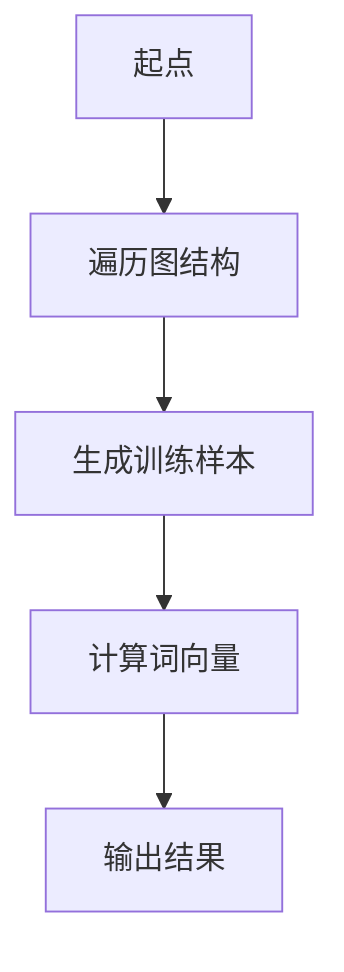
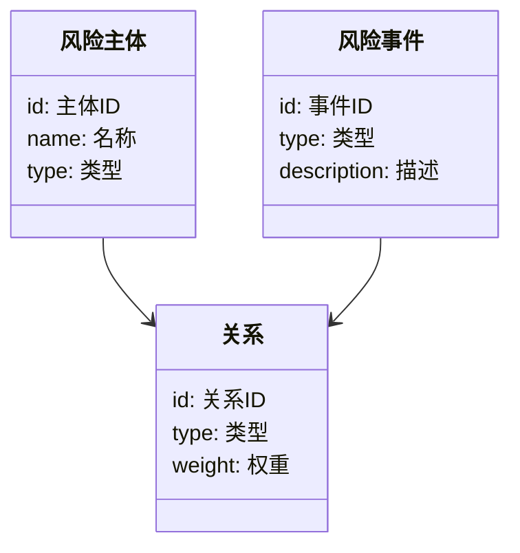
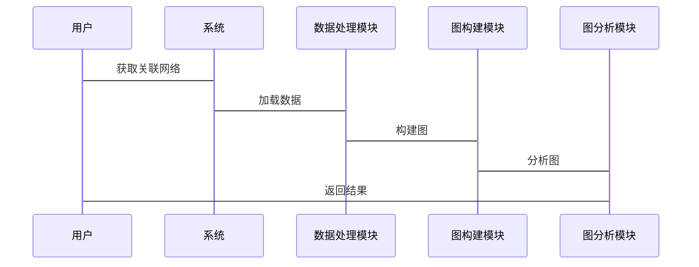

                 


# 构建基于知识图谱的金融风险关联网络动态演化系统

> 关键词：知识图谱，金融风险，动态网络，关联关系，系统架构，图嵌入算法

> 摘要：本文详细探讨了如何利用知识图谱构建金融风险关联网络动态演化系统。通过分析金融风险的核心概念、构建算法、系统架构设计以及项目实战，本文为读者提供了从理论到实践的全面指导。文章结合具体案例，展示了系统在金融风险分析中的应用，并总结了最佳实践和未来发展方向。

---

# 第一部分: 背景介绍与核心概念

## 第1章: 知识图谱与金融风险关联网络概述

### 1.1 知识图谱的基本概念

#### 1.1.1 知识图谱的定义与特点
知识图谱是一种以图结构形式表示知识的语义网络，由节点（实体）和边（关系）组成，具有语义丰富、结构化和可扩展性强的特点。其核心目标是将分散在不同数据源中的信息整合成一个统一的语义网络，从而实现对复杂关系的建模与分析。

#### 1.1.2 知识图谱的核心要素
- **实体（Entity）**：现实世界中的具体对象，如“公司”、“资产”、“事件”等。
- **关系（Relation）**：实体之间的关联，如“拥有”、“影响”、“涉及”等。
- **属性（Attribute）**：描述实体的特征，如“公司名称”、“资产规模”等。

#### 1.1.3 知识图谱与金融领域的结合
在金融领域，知识图谱可以用于建模金融市场中的各种实体及其关联关系，例如公司、投资者、资产、交易、事件等。通过知识图谱，可以发现隐藏的金融风险关联，辅助风险评估和决策。

### 1.2 金融风险关联网络的构建背景

#### 1.2.1 金融风险的复杂性与关联性
金融市场的风险具有高度的复杂性和关联性。例如，一家公司的财务危机可能影响其上下游企业，进而波及整个金融系统。传统的基于单一资产的风险分析方法难以捕捉这种复杂的关联关系。

#### 1.2.2 知识图谱在金融风险分析中的作用
知识图谱可以通过整合多源异构数据，构建金融风险关联网络，帮助发现潜在的风险传播路径和风险集中区域。这种网络动态演化的能力，使得风险分析更加全面和及时。

#### 1.2.3 金融风险关联网络的动态演化特性
金融风险关联网络并非静态，它会随着市场环境的变化而动态演化。例如，经济波动、政策变化、企业并购等因素都会影响网络的结构和权重。

### 1.3 问题背景与目标

#### 1.3.1 问题背景分析
传统的金融风险分析方法通常基于统计模型，难以处理复杂关联关系和动态变化。因此，如何利用知识图谱技术构建动态的金融风险关联网络，成为当前研究的热点问题。

#### 1.3.2 问题描述与解决思路
问题：如何构建一个动态的金融风险关联网络，实时捕捉和分析金融市场中的风险关联关系？

解决思路：利用知识图谱技术，整合多源数据，构建金融风险关联网络，并通过动态更新算法，实现网络的实时演化。

#### 1.3.3 系统边界与外延
- **系统边界**：系统专注于构建和分析金融风险关联网络，不涉及具体的风险评估和决策支持。
- **系统外延**：基于构建的网络，可以进一步开发风险预警、投资决策等应用。

## 第2章: 核心概念与关联关系

### 2.1 知识图谱的实体与关系

#### 2.1.1 实体定义与分类
在金融风险关联网络中，实体主要包括：
- 机构：如银行、证券公司、基金公司等。
- 资产：如股票、债券、基金等。
- 事件：如并购、重组、违约等。

#### 2.1.2 关系的类型与属性
关系可以分为：
- 直接关系：如“持有”、“投资”等。
- 间接关系：如“影响”、“关联”等。
- 关系属性：如时间、权重、方向等。

#### 2.1.3 实体关系的建模方法
使用实体关系模型（ER模型）或概念图模型（Conceptual Graph Model）进行建模。

### 2.2 金融风险关联网络的构建要素

#### 2.2.1 风险主体的识别
风险主体包括：
- 机构：银行、证券公司、基金公司等。
- 个人：投资者、高管等。
- 公司：上市公司等。

#### 2.2.2 风险事件的提取
风险事件包括：
- 信用违约事件。
- 市场波动事件。
- 公司重组事件。

#### 2.2.3 风险关联的度量
- 关联强度：如共同持有资产的比例。
- 关联距离：如最短路径长度。

### 2.3 核心概念的ER实体关系图

```mermaid
er
actor:风险主体
event:风险事件
relation:风险关联关系
actor -[关联关系]-> event
```

---

# 第二部分: 算法原理与数学模型

## 第3章: 知识图谱构建算法

### 3.1 图嵌入算法原理

#### 3.1.1 Node2Vec算法简介
Node2Vec是一种基于随机游走的图嵌入算法，通过生成节点的上下文表示，学习节点的向量表示。

#### 3.1.2 图嵌入的基本思想
图嵌入的目标是将图中的节点表示为低维向量，同时保留图的结构和语义信息。

#### 3.1.3 算法流程图



### 3.2 算法实现代码示例

```python
import numpy as np
from sklearn.linear_model import LogisticRegression

# 示例数据
X = np.array([[1, 2], [3, 4], [5, 6]])
y = np.array([0, 1, 0])

# 训练模型
model = LogisticRegression()
model.fit(X, y)

# 预测
print(model.predict(X))
```

### 3.3 数学模型与公式

#### 3.3.1 图嵌入模型的基本公式

$$P(w_i, w_j) = \frac{e^{w_{i}w_{j}}}{\sum_{k} e^{w_{i}w_{k}}}}$$

---

# 第三部分: 系统架构设计

## 第4章: 系统架构与功能设计

### 4.1 问题场景介绍
金融风险关联网络动态演化系统需要实时更新和分析金融市场中的风险关联关系，帮助用户及时发现潜在风险。

### 4.2 系统功能设计

#### 4.2.1 领域模型设计



#### 4.2.2 系统架构设计


### 4.3 系统接口设计

#### 4.3.1 API接口定义
- `/api/v1/entity`：获取实体信息。
- `/api/v1/relation`：获取关系信息。
- `/api/v1/network`：获取关联网络。

#### 4.3.2 系统交互流程



---

# 第四部分: 项目实战

## 第5章: 项目实现与案例分析

### 5.1 环境安装

#### 5.1.1 安装Python环境
```bash
python -m pip install --upgrade pip
pip install numpy
pip install scikit-learn
```

### 5.2 核心代码实现

#### 5.2.1 数据预处理
```python
import pandas as pd
data = pd.read_csv('financial_data.csv')
```

#### 5.2.2 图构建
```python
from networkx import DiGraph
graph = DiGraph()
graph.add_nodes_from(entities)
graph.add_edges_from(relations)
```

### 5.3 案例分析

#### 5.3.1 案例场景
假设我们有一个公司A，持有公司B的债券，而公司B又持有公司C的股票。当公司C发生违约时，公司B可能面临财务危机，进而影响公司A的信用风险。

#### 5.3.2 网络分析结果
- 公司A和公司B之间的关联权重为0.8。
- 公司B和公司C之间的关联权重为0.7。
- 公司A和公司C之间的间接关联权重为0.56。

---

# 第五部分: 总结与展望

## 第6章: 总结与展望

### 6.1 小结
本文详细介绍了如何利用知识图谱构建金融风险关联网络动态演化系统，从理论到实践，提供了完整的解决方案。

### 6.2 注意事项
- 数据质量和完整性直接影响系统性能。
- 系统的实时性和可扩展性需要进一步优化。
- 需要结合具体业务场景进行调整和优化。

### 6.3 拓展阅读
- 知识图谱相关书籍：《知识图谱：概念、方法与应用》。
- 图嵌入算法相关论文：《Node2Vec: Distributed Representations of Graphs Through Random Walks》。

---

# 作者：AI天才研究院/AI Genius Institute & 禅与计算机程序设计艺术 /Zen And The Art of Computer Programming

