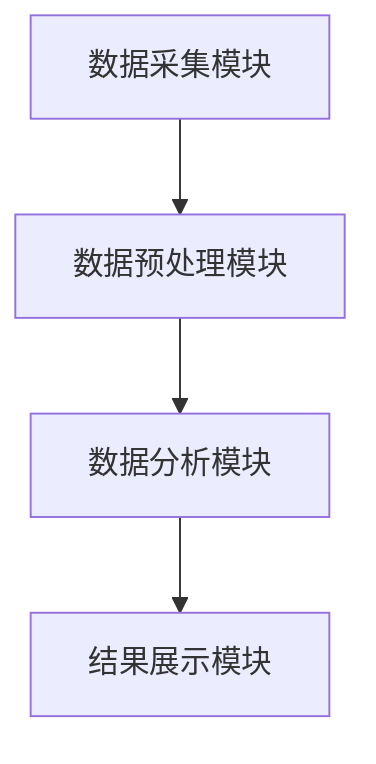
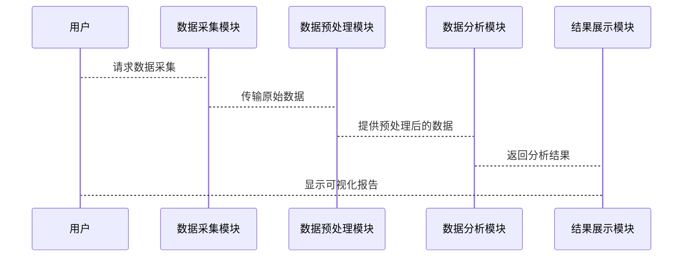

                 


```markdown
# 构建智能企业市场调研系统：社交媒体聆听与趋势分析

> 关键词：社交媒体聆听，市场调研系统，趋势分析，自然语言处理，机器学习，数据采集

> 摘要：本文详细探讨了如何构建智能企业市场调研系统，重点分析了社交媒体聆听技术及其在趋势分析中的应用。通过自然语言处理和机器学习算法，结合实际案例和系统架构设计，为读者提供了从理论到实践的全面指导。

---

## 第一部分: 智能企业市场调研系统概述

### 第1章: 社交媒体聆听与市场调研的背景

#### 1.1 企业市场调研的传统方式与局限性
- 1.1.1 传统市场调研方法的优缺点
  - 优点：数据来源广泛，方法多样。
  - 缺点：成本高，效率低，难以实时获取反馈。
- 1.1.2 社交媒体时代市场调研的新需求
  - 实时性：快速获取用户反馈。
  - 大数据：海量数据支持深度分析。
  - 互动性：与用户直接互动，提升用户参与度。

#### 1.2 社交媒体聆听的定义与核心价值
- 1.2.1 社交媒体数据的特征与类型
  - 文本数据：用户评论、社交媒体帖子。
  - 图像数据：用户分享的图片、视频。
  - 结构化数据：点赞、评论数等。
- 1.2.2 社交媒体聆听在市场调研中的作用
  - 品牌声誉监测。
  - 竞争对手分析。
  - 用户行为研究。

#### 1.3 智能企业市场调研系统的概念
- 1.3.1 系统的核心目标与功能
  - 数据采集：从社交媒体获取数据。
  - 数据分析：使用NLP和机器学习进行分析。
  - 趋势预测：基于历史数据预测未来趋势。
- 1.3.2 系统的边界与外延
  - 系统仅处理社交媒体数据，不包括其他数据源。
  - 系统输出分析结果，不直接参与商业决策。

### 1.4 本章小结
- 总结了传统市场调研的局限性，强调了社交媒体聆听的重要性。
- 介绍了智能市场调研系统的核心概念和功能。

---

## 第二部分: 核心概念与技术原理

### 第2章: 社交媒体数据采集与预处理

#### 2.1 数据采集方法
- 2.1.1 第三方API接口的使用
  - Twitter API：获取推文数据。
  - Facebook API：获取用户帖子和互动数据。
- 2.1.2 网络爬虫技术的应用
  - 使用BeautifulSoup和Requests库抓取网页数据。
  - 爬虫的反爬机制：识别验证码、设置合理请求间隔。

#### 2.2 数据清洗与特征提取
- 2.2.1 噪声数据的识别与处理
  - 去除无关信息：如广告、垃圾评论。
  - 标准化处理：统一文本格式。
- 2.2.2 文本数据的分词与标准化
  - 使用jieba进行中文分词。
  - 去除停用词，提取关键词。

### 第3章: 自然语言处理技术在市场调研中的应用

#### 3.1 情感分析
- 3.1.1 情感分析的原理与算法
  - 基于词袋模型的分类。
  - 基于深度学习的模型：如LSTM和BERT。
- 3.1.2 基于深度学习的情感分析模型
  - 使用预训练模型进行微调。

#### 3.2 主题模型
- 3.2.1 LDA主题模型的原理与实现
  - 主题模型的基本原理。
  - 使用Gensim库实现LDA。
- 3.2.2 主题模型在市场调研中的应用
  - 发现用户讨论的主题。
  - 分析主题随时间的变化趋势。

### 第4章: 趋势分析与预测

#### 4.1 时间序列分析
- 4.1.1 时间序列数据的特征提取
  - 趋势、周期性、随机性。
- 4.1.2 基于ARIMA的预测模型
  - ARIMA模型的参数选择。
  - 使用Python的statsmodels库实现。

#### 4.2 基于机器学习的市场趋势预测
- 4.2.1 机器学习算法的选择与优化
  - 使用线性回归、随机森林等模型。
  - 超参数调优。
- 4.2.2 趋势预测的评估与验证
  - 使用交叉验证评估模型性能。
  - 比较不同模型的预测效果。

---

## 第三部分: 算法原理与实现

### 第3章: 算法原理与实现

#### 3.1 情感分析算法实现
```python
# 使用预训练BERT模型进行情感分类
from transformers import BertTokenizer, BertForSequenceClassification
import torch

tokenizer = BertTokenizer.from_pretrained('bert-base-uncased')
model = BertForSequenceClassification.from_pretrained('bert-base-uncased')

def classify(text):
    inputs = tokenizer(text, return_tensors='pt')
    outputs = model(**inputs)
    prediction = torch.argmax(outputs.logits).item()
    return 'positive' if prediction == 1 else 'negative'
```

#### 3.2 LDA主题模型的实现
```python
from gensim import corpora, models

texts = [...]  # 文本列表
dictionary = corpora.Dictionary(texts)
corpus = [dictionary.doc2bow(text) for text in texts]
lda_model = models.LdaModel(corpus, num_topics=5, id2word=dictionary)

# 查看主题
for topic in lda_model.print_topics():
    print(topic)
```

#### 3.3 ARIMA模型的实现
```python
import statsmodels.api as sm

data = [...]  # 时间序列数据
model = sm.tsa.ARIMA(data, order=(1, 1, 1))
model_fit = model.fit()
forecast = model_fit.forecast(steps=5)
```

---

## 第四部分: 系统架构设计

### 第4章: 系统架构设计

#### 4.1 系统功能设计
- 数据采集模块：
  - 通过API接口和爬虫采集数据。
- 数据预处理模块：
  - 数据清洗、分词、特征提取。
- 数据分析模块：
  - 情感分析、主题建模、趋势预测。
- 结果展示模块：
  - 可视化分析结果。

#### 4.2 系统架构图


#### 4.3 系统交互流程


---

## 第五部分: 项目实战

### 第5章: 项目实战

#### 5.1 环境安装与配置
- Python 3.8及以上版本。
- 安装必要的库：pandas、numpy、scikit-learn、transformers、gensim、statsmodels。

#### 5.2 核心代码实现
```python
# 数据清洗示例
import pandas as pd
import re

def clean_text(text):
    text = re.sub(r'[^\w\s]', '', text)
    text = text.lower()
    return text

df['clean_text'] = df['text'].apply(clean_text)
```

#### 5.3 案例分析与解读
- 案例背景：假设我们分析某个品牌在社交媒体上的声誉。
- 数据分析过程：情感分析、主题建模。
- 结果解读：发现主要讨论话题及其情感倾向。

---

## 第六部分: 最佳实践与总结

### 第6章: 最佳实践与总结

#### 6.1 小结
- 总结了构建智能市场调研系统的全过程。
- 强调了数据处理、算法选择和系统架构设计的重要性。

#### 6.2 注意事项
- 数据隐私问题：确保符合相关法律法规。
- 系统性能优化：针对大规模数据进行优化。
- 模型的可解释性：选择适合业务需求的模型。

#### 6.3 未来发展方向
- 结合更多数据源：如线上评论、线下调研。
- 引入更先进的NLP技术：如大语言模型。
- 实时分析：提升系统的响应速度。

#### 6.4 拓展阅读
- 推荐书籍：《自然语言处理实战》、《时间序列分析》。
- 推荐博客：相关技术博客和开源项目。

---

## 作者：AI天才研究院/AI Genius Institute & 禅与计算机程序设计艺术/Zen And The Art of Computer Programming
```

