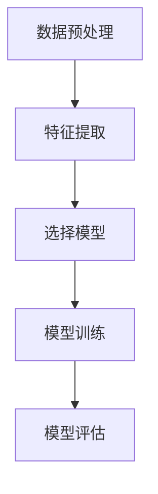
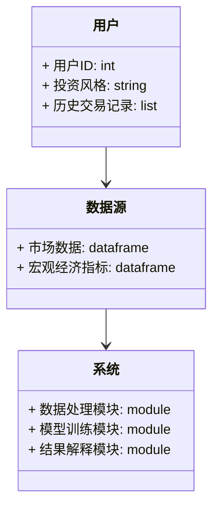

                 


# 构建智能化的个人投资风格分析与匹配系统

> 关键词：投资风格分析、机器学习、大数据分析、系统架构、智能化投资

> 摘要：本文旨在探讨如何通过智能化技术构建个人投资风格分析与匹配系统。从背景介绍到系统架构设计，从算法原理到项目实战，系统地分析和实现这一系统。通过机器学习和大数据分析，结合投资学理论，帮助投资者更好地理解自身风格，并匹配合适的投资策略。

---

# 第一部分: 背景介绍与核心概念

## # 第1章: 个人投资风格分析的背景与意义

### 1.1 投资风格分析的基本概念
#### 1.1.1 投资风格的定义
投资风格是指投资者在选择和管理投资组合时所遵循的一套特定规则、偏好和策略。它反映了投资者的风险承受能力、收益目标以及市场观点。

#### 1.1.2 投资风格的分类与特点
投资风格可以分为多种类型，常见的包括：
- **保守型**：低风险，追求稳定收益。
- **成长型**：高风险，追求高收益，注重投资对象的成长潜力。
- **价值型**：寻找被市场低估的投资标的。
- **趋势型**：根据市场趋势进行投资。

#### 1.1.3 投资风格分析的重要性
通过分析个人的投资风格，投资者可以更好地理解自己的投资偏好，制定合理的投资策略，并在市场变化中及时调整。

### 1.2 智能化投资分析的必要性
#### 1.2.1 传统投资分析的局限性
传统投资分析依赖于人工判断，主观性强，难以系统化和量化。

#### 1.2.2 数据驱动与智能化的优势
大数据和人工智能技术的引入，使得投资分析更加客观、精确和高效。

#### 1.2.3 个人投资风格分析的边界与外延
个人投资风格分析不仅仅关注投资结果，还涉及投资者的心理特征、行为习惯和决策过程。

### 1.3 本书的核心目标与结构
#### 1.3.1 本书的核心目标
构建一个智能化的个人投资风格分析与匹配系统，帮助投资者更好地理解自身风格，并匹配合适的投资策略。

#### 1.3.2 本书的结构安排
从理论到实践，逐步构建系统，涵盖数据采集、特征提取、模型训练、系统设计和项目实战。

#### 1.3.3 本书的读者群体
适合金融从业者、投资者以及对人工智能和大数据分析感兴趣的技术人员。

---

## # 第2章: 投资风格分析的理论基础

### 2.1 投资学基础
#### 2.1.1 投资的基本概念
投资是指将资金投入到某种资产中，以期获得收益的行为。

#### 2.1.2 资产配置与投资组合管理
资产配置是指将资金分配到不同资产类别中，以优化风险和收益。投资组合管理则是对这些资产的管理和调整。

#### 2.1.3 风险与收益的平衡
风险与收益成正比，投资者需要在两者之间找到平衡点。

### 2.2 数据科学与机器学习在投资分析中的应用
#### 2.2.1 数据科学的基本概念
数据科学是通过数据分析提取有价值的信息的过程。

#### 2.2.2 机器学习在金融领域的应用
机器学习可以用于预测市场趋势、识别投资机会和风险控制。

#### 2.2.3 深度学习与强化学习在投资中的潜力
深度学习可以处理复杂的非线性关系，强化学习可以模拟投资决策过程。

### 2.3 智能化投资分析的核心要素
#### 2.3.1 数据来源与特征提取
数据来源包括市场数据、投资者行为数据和宏观经济数据等。

#### 2.3.2 模型选择与优化
选择合适的模型，并通过训练优化模型性能。

#### 2.3.3 结果解释与反馈机制
通过模型输出解释结果，并根据反馈不断优化系统。

---

# 第二部分: 核心概念与联系

## # 第3章: 投资风格分析的核心概念与联系

### 3.1 投资风格分析的原理
#### 3.1.1 数据特征提取的原理
通过分析投资者的历史交易数据，提取其行为特征。

#### 3.1.2 机器学习模型选择的原理
根据数据特征选择合适的机器学习模型。

#### 3.1.3 模型训练与优化的原理
通过训练数据优化模型参数，提高预测准确性。

### 3.2 核心概念对比分析
#### 3.2.1 不同投资风格的特征对比
通过表格对比不同投资风格的特征。

#### 3.2.2 不同模型的性能对比
对比不同机器学习模型在投资风格分析中的表现。

#### 3.2.3 不同数据来源的优劣势对比
分析不同数据来源对投资风格分析的影响。

### 3.3 系统架构的ER实体关系图
```mermaid
er
actor: 用户
|-----|-----|
| 用户 | 提供数据 |
|-----|-----|
| 数据源 | 数据 |
|-----|-----|
| 数据处理
```

---

## # 第4章: 算法原理与实现

### 4.1 机器学习模型的选择与训练
#### 4.1.1 算法流程图


#### 4.1.2 代码实现
```python
# 数据预处理
import pandas as pd
data = pd.read_csv('investment_data.csv')

# 特征提取
from sklearn.preprocessing import StandardScaler
scaler = StandardScaler()
X = data.drop('label', axis=1)
X_scaled = scaler.fit_transform(X)

# 选择模型
from sklearn.ensemble import RandomForestClassifier
model = RandomForestClassifier(n_estimators=100)

# 模型训练
model.fit(X_scaled, data['label'])

# 模型评估
from sklearn.metrics import accuracy_score
y_pred = model.predict(X_scaled)
print(accuracy_score(data['label'], y_pred))
```

#### 4.1.3 数学公式
模型训练过程中，随机森林算法的决策树构建过程可以用以下公式表示：
$$ \text{特征重要性} = \sum_{i=1}^{n} \text{特征的分裂增益} $$

### 4.2 算法优化与调优
#### 4.2.1 超参数调优
使用网格搜索优化模型参数。

#### 4.2.2 正则化与降维
通过正则化方法减少过拟合，并使用主成分分析降维。

#### 4.2.3 模型融合
将多个模型的结果进行融合，提高预测准确性。

---

## # 第5章: 系统分析与架构设计

### 5.1 问题场景介绍
系统需要处理大量投资数据，分析投资者风格，并提供匹配的投资策略。

### 5.2 系统功能设计
#### 5.2.1 领域模型


### 5.3 系统架构设计
#### 5.3.1 系统架构图


#### 5.3.2 接口设计
RESTful API接口设计，包括数据上传、模型调用和结果查询。

#### 5.3.3 交互流程
用户通过前端上传数据，系统处理并返回分析结果。

---

## # 第6章: 项目实战

### 6.1 环境配置
安装必要的库，如Pandas、Scikit-learn、Flask等。

### 6.2 核心代码实现
实现数据处理、模型训练和结果解释模块。

### 6.3 案例分析
通过实际案例展示系统如何分析投资风格并匹配策略。

### 6.4 项目总结
总结项目实现过程中的经验与教训。

---

# 第三部分: 总结与扩展阅读

## # 第7章: 总结与注意事项

### 7.1 最佳实践 tips
- 数据质量至关重要，确保数据清洗和预处理。
- 模型选择要结合实际业务需求。
- 系统设计要考虑可扩展性和可维护性。

### 7.2 小结
通过智能化技术构建投资风格分析系统，能够帮助投资者更好地理解自身风格，并制定合理的投资策略。

### 7.3 注意事项
- 数据隐私保护
- 模型的实时更新与维护
- 系统的稳定性与可靠性

---

## # 第8章: 扩展阅读与深入探讨

### 8.1 深入探讨投资风格的动态变化
市场变化会影响投资风格的表现，系统需要具备动态调整能力。

### 8.2 未来技术的发展方向
人工智能和大数据技术的进一步发展将为投资风格分析带来更多可能性。

### 8.3 推荐的书籍与资源
推荐相关的书籍和技术资源，供读者深入学习。

---

作者：AI天才研究院/AI Genius Institute & 禅与计算机程序设计艺术 /Zen And The Art of Computer Programming

