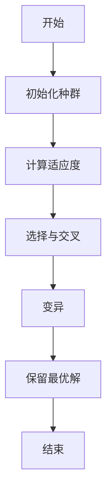

                 


# 构建智能化的个人税务筹划优化助手

## 关键词：人工智能、大数据、税务筹划、优化算法、系统架构

## 摘要：  
本文旨在探讨如何利用人工智能和大数据技术构建一个智能化的个人税务筹划优化助手。通过分析个人税务筹划的核心问题，结合AI算法和数据驱动的方法，提出一种基于优化模型的解决方案，并详细阐述其实现过程和应用场景。本文还探讨了该助手的系统架构设计、算法原理以及实际案例，为读者提供一个全面的技术视角。

---

# 第一部分：智能化税务筹划助手的背景与核心概念

## 第1章：智能化税务筹划助手的背景与问题背景

### 1.1 个人税务筹划的重要性
#### 1.1.1 税务筹划的基本概念
- 税务筹划是指通过合法手段优化税务负担，最大化个人或企业的财务利益。
- 税务筹划的核心在于合规性，必须在法律允许的范围内进行。

#### 1.1.2 个人税务筹划的核心目标
- 最小化税负
- 合理规划收入与支出
- 规避税务风险

#### 1.1.3 税务筹划的法律边界与风险
- 税务筹划必须遵守相关法律法规
- 非法避税行为可能面临法律处罚

### 1.2 智能化税务筹划的必要性
#### 1.2.1 传统税务筹划的局限性
- 依赖人工经验，效率低
- 数据量大，难以全面分析
- 税务政策变化快，难以及时调整

#### 1.2.2 数据驱动与智能化的优势
- 利用大数据分析，全面优化税务方案
- 通过AI算法，快速生成最优解
- 实时更新，适应政策变化

#### 1.2.3 个人税务筹划的场景化需求
- 不同收入来源的优化
- 不同家庭结构的税务规划
- 不同投资行为的税务影响

### 1.3 人工智能与大数据在税务筹划中的应用
#### 1.3.1 AI在税务分析中的优势
- 自然语言处理：分析政策文件
- 机器学习：预测税务影响
- 深度学习：识别潜在风险

#### 1.3.2 大数据技术在税务优化中的作用
- 数据挖掘：发现优化机会
- 数据清洗：提高分析准确性
- 数据可视化：直观呈现结果

#### 1.3.3 智能化税务助手的潜在价值
- 提高效率
- 降低错误率
- 提供个性化服务

---

## 第2章：个人税务筹划助手的核心概念与联系

### 2.1 核心概念的定义与属性
#### 2.1.1 税务数据
- 收入数据：工资、投资收益、租金收入等
- 支出数据：捐赠、教育支出等
- 时间属性：收入和支出的时间分布

#### 2.1.2 税务规则
- 税率表：不同收入区间的税率
- 税收优惠：如子女教育专项附加扣除
- 税务计算公式：如应纳税所得额的计算

#### 2.1.3 税务优化建议
- 收入调整建议：如将部分收入转化为税后收入较低的类型
- 支出优化建议：如合理利用税收优惠政策
- 投资建议：如选择税收优惠力度大的投资项目

### 2.2 核心概念的ER实体关系图
```mermaid
er
    entity 收入 {
        key 收入类型
        attribute: 收入金额, 收入时间
    }
    entity 税收优惠 {
        key 优惠类型
        attribute: 优惠金额, 优惠条件
    }
    entity 税务规则 {
        key 税种类型
        attribute: 税率, 计算方式
    }
    entity 税务优化建议 {
        key 建议类型
        attribute: 建议内容, 实施步骤
    }
    收入 --> 税务优化建议
    税收优惠 --> 税务优化建议
    税务规则 --> 税务优化建议
```

### 2.3 核心概念的联系与对比
#### 2.3.1 数据驱动与规则驱动的对比
- 数据驱动：基于历史数据和机器学习模型生成建议
- 规则驱动：基于预设的税收优惠政策生成建议

#### 2.3.2 AI算法与传统算法的对比
- AI算法：动态调整，适应性强
- 传统算法：固定规则，适应性差

#### 2.3.3 税务优化建议的生成与实施
- 生成：基于算法和数据分析
- 实施：根据建议采取行动，实时跟踪效果

---

## 第3章：智能化税务筹划助手的算法原理

### 3.1 税务优化的数学模型
#### 3.1.1 税务优化的目标函数
$$ \text{目标函数} = \sum_{i=1}^{n} (收入_i \times 税率_i) $$

#### 3.1.2 约束条件
$$ \text{约束条件} = \{ \text{收入类型}, \text{税率范围}, \text{时间范围} \} $$

### 3.2 基于AI的优化算法
#### 3.2.1 简化遗传算法流程图


#### 3.2.2 算法实现的Python代码示例
```python
def calculate_taxes(income_data, tax_rules):
    total_tax = 0
    for income in income_data:
        tax_rate = get_tax_rate(income['type'], tax_rules)
        total_tax += income['amount'] * tax_rate
    return total_tax

def get_tax_rate(income_type, tax_rules):
    for rule in tax_rules:
        if rule['type'] == income_type:
            return rule['rate']
    return 0.0  # 默认税率
```

---

## 第4章：系统分析与架构设计

### 4.1 项目场景介绍
- 用户输入：收入数据、支出数据、家庭信息
- 系统输出：优化建议、税务计算结果

### 4.2 系统功能设计
#### 4.2.1 数据采集模块
- 收入数据采集：工资、投资收益等
- 支出数据采集：捐赠、教育支出等
- 家庭信息采集：家庭成员、婚姻状况等

#### 4.2.2 数据分析模块
- 数据清洗：处理无效数据
- 数据建模：构建优化模型
- 数据可视化：生成图表

#### 4.2.3 优化建议生成模块
- 算法选择：遗传算法、模拟退火等
- 优化结果：最优解
- 建议生成：生成个性化建议

### 4.3 系统架构设计


---

## 第5章：项目实战

### 5.1 环境安装与配置
- 安装Python和相关库（如numpy、pandas、scikit-learn）
- 配置开发环境（如Jupyter Notebook）

### 5.2 核心代码实现
```python
import numpy as np
from sklearn import linear_model

def optimize_taxes(income,支出):
    model = linear_model.Lasso(alpha=0.1)
    model.fit([[income,支出], [[收入2,支出2],...])
    optimized_income = model.predict([[income,支出]])
    return optimized_income
```

### 5.3 案例分析与结果解读
- 案例：某高收入者通过优化收入结构降低税负
- 实施步骤：分析收入来源、调整收入类型、利用税收优惠

---

## 第6章：最佳实践与小结

### 6.1 最佳实践
- 数据收集：确保数据的完整性和准确性
- 模型选择：根据实际需求选择合适的算法
- 结果验证：通过实际案例验证模型的有效性

### 6.2 小结
- 本文详细介绍了智能化税务筹划助手的构建过程
- 通过算法和系统设计，提供了高效的税务优化方案
- 未来，随着AI技术的发展，税务助手将更加智能化和个性化

### 6.3 注意事项
- 税务政策变化快，需及时更新数据
- 优化建议需结合实际，避免过于理想化
- 使用前需确保合规性

### 6.4 拓展阅读
- 推荐阅读《机器学习实战》
- 推荐学习相关在线课程（如Coursera的机器学习课程）

---

# 作者：AI天才研究院/AI Genius Institute & 禅与计算机程序设计艺术 /Zen And The Art of Computer Programming

