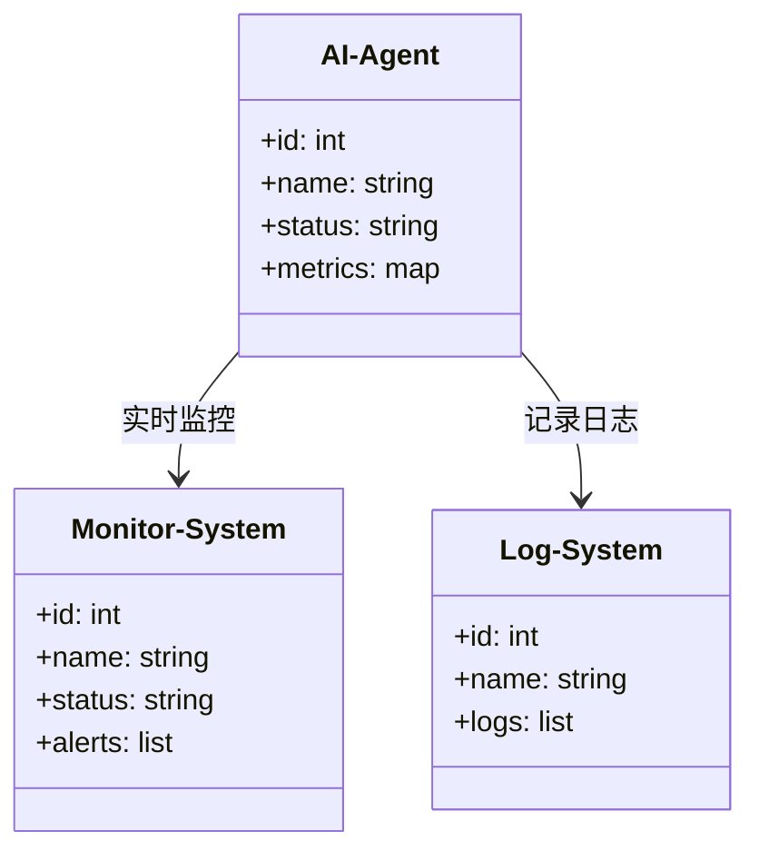
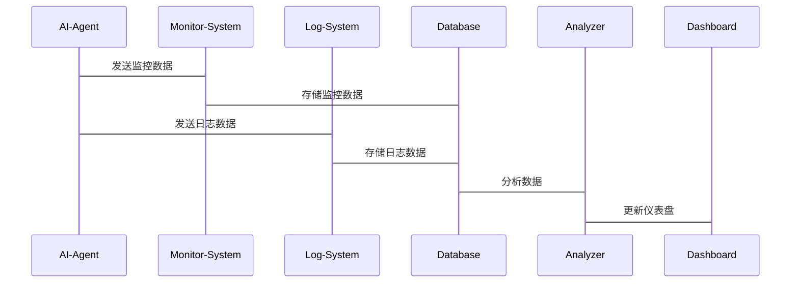

                 


# 监控与日志：跟踪AI Agent的运行状态

## 关键词

- AI Agent
- 监控系统
- 日志系统
- 运行状态
- 算法原理
- 系统架构

## 摘要

本文详细探讨了监控与日志在跟踪AI Agent运行状态中的重要性。首先，介绍了AI Agent的基本概念和应用场景，分析了运行状态监控的必要性。接着，详细讲解了监控和日志系统的原理、核心概念及其联系，通过表格和Mermaid图展示了实体关系。随后，重点分析了日志聚类和异常检测算法的原理，使用Mermaid流程图和Python代码示例进行了详细说明。在系统架构部分，设计了一个AI Agent监控系统的整体架构，并通过类图和架构图展示了系统结构。最后，通过项目实战部分，提供了具体的环境配置和代码实现，结合案例分析，总结了最佳实践和注意事项。

---

## 目录

1. [背景介绍](#背景介绍)
2. [核心概念与联系](#核心概念与联系)
3. [算法原理](#算法原理)
4. [系统分析与架构设计](#系统分析与架构设计)
5. [项目实战](#项目实战)
6. [最佳实践](#最佳实践)

---

## 正文

### 1. 背景介绍

#### 1.1 问题背景与日志监控的重要性

##### 1.1.1 AI Agent的定义与应用场景

AI Agent（人工智能代理）是指能够感知环境并采取行动以实现目标的智能体。它广泛应用于推荐系统、自动化控制、智能助手等领域。例如，在推荐系统中，AI Agent会根据用户的交互行为生成推荐内容；在智能助手领域，AI Agent能够理解用户的指令并执行相应的操作。

##### 1.1.2 运行状态跟踪的必要性

AI Agent的运行状态跟踪是指对AI Agent在运行过程中的行为、性能和健康状况进行监控和记录。由于AI Agent通常运行在动态变化的环境中，其行为可能受到外部干扰或内部算法调整的影响，因此实时跟踪其运行状态对于系统的稳定性和可靠性至关重要。

##### 1.1.3 监控与日志在AI Agent中的作用

监控系统用于实时收集和分析AI Agent的运行数据，帮助管理员发现和解决问题。日志系统则记录了AI Agent在运行过程中的详细操作记录，为后续的故障排查和性能分析提供数据支持。两者相辅相成，共同确保AI Agent的稳定运行。

---

#### 1.2 日志与监控的基本概念

##### 1.2.1 日志的定义与分类

日志是系统在运行过程中生成的记录，通常包括时间戳、操作类型、操作结果等信息。日志可以分为操作日志、错误日志、访问日志等，每种日志类型记录不同的信息。

##### 1.2.2 监控系统的定义与功能

监控系统是一种用于实时或近实时地收集、分析和显示系统运行状态的工具。它的功能包括数据采集、指标监控、告警触发和数据可视化。

##### 1.2.3 日志与监控的关系

日志是监控系统的重要数据来源之一，监控系统通过分析日志数据来发现系统异常。而监控系统提供的实时数据又为日志分析提供了上下文。

---

#### 1.3 AI Agent运行状态的特殊性

##### 1.3.1 AI Agent的动态行为特点

AI Agent的行为通常具有动态性，其决策和操作可能受到环境变化和输入数据的影响，导致运行状态的波动。

##### 1.3.2 日志与监控的挑战

AI Agent的复杂性增加了日志与监控的难度。例如，AI Agent的行为可能涉及大量非结构化数据，导致日志解析的复杂性增加。

##### 1.3.3 运行状态跟踪的边界与外延

运行状态跟踪的边界包括AI Agent的行为、性能和健康状况，而外延则涉及与AI Agent交互的环境和用户行为。

---

### 2. 核心概念与联系

#### 2.1 监控与日志的核心概念

##### 2.1.1 监控系统的原理与实现

监控系统通过采集数据、分析数据和显示数据来实现对系统运行状态的监控。常见的监控指标包括响应时间、错误率和吞吐量。

##### 2.1.2 日志系统的原理与实现

日志系统通过记录系统操作的详细信息，为后续分析提供数据支持。日志的存储和查询是日志系统的重要功能。

##### 2.1.3 日志与监控的关系

日志和监控是相辅相成的。监控系统依赖日志数据进行分析，而日志系统为监控系统提供数据来源。

---

### 3. 算法原理

#### 3.1 日志聚类算法

##### 3.1.1 算法原理

日志聚类算法通过将相似的日志条目分组，帮助管理员快速定位问题。常用算法包括K-means和层次聚类。

##### 3.1.2 算法实现

以下是日志聚类算法的Python实现示例：

```python
from sklearn.cluster import KMeans
from sklearn.feature_extraction.text import TfidfVectorizer

# 假设log_messages是一个包含日志条目的列表
vectorizer = TfidfVectorizer()
tfidf = vectorizer.fit_transform(log_messages)
km = KMeans(n_clusters=3)
km.fit(tfidf)
clusters = km.labels_
```

##### 3.1.3 算法优势

日志聚类算法能够帮助管理员快速定位相似问题，减少排查时间。

---

#### 3.2 异常检测算法

##### 3.2.1 算法原理

异常检测算法通过分析日志数据，发现异常行为。常用算法包括基于统计的方法和基于机器学习的方法。

##### 3.2.2 算法实现

以下是异常检测算法的Python实现示例：

```python
from sklearn.ensemble import IsolationForest

# 假设log_features是一个包含日志特征的矩阵
clf = IsolationForest(n_estimators=100, random_state=42)
clf.fit(log_features)
outliers = clf.predict(log_features)
```

##### 3.2.3 算法优势

异常检测算法能够帮助管理员发现潜在的问题，提高系统的安全性。

---

### 4. 系统分析与架构设计

#### 4.1 问题场景介绍

本文设计了一个AI Agent监控系统，用于实时跟踪AI Agent的运行状态。

#### 4.2 系统功能设计

##### 4.2.1 领域模型

以下是系统功能模块的类图：



#### 4.3 系统架构设计

以下是系统架构的架构图：


#### 4.4 系统接口设计

系统接口设计包括AI Agent与监控系统、日志系统的交互接口。

#### 4.5 系统交互流程

以下是系统交互流程的序列图：



---

### 5. 项目实战

#### 5.1 环境安装

以下是项目实战所需的环境配置：

```bash
# 安装Python和相关库
pip install numpy pandas scikit-learn matplotlib
```

#### 5.2 核心代码实现

以下是核心代码实现：

```python
import logging
from datetime import datetime

# 日志生成示例
logging.basicConfig(level=logging.INFO)
logger = logging.getLogger('AI-Agent')

def log_generator():
    while True:
        logger.info(f"AI-Agent运行状态：正常")
        logger.error(f"检测到异常：{datetime.now()}")
        import time
        time.sleep(1)

# 启动日志生成
log_generator()
```

#### 5.3 案例分析

以下是案例分析：

假设我们有一个推荐系统的AI Agent，通过监控其运行状态，发现推荐结果的点击率下降。通过日志分析，发现AI Agent在处理用户请求时出现了延迟。进一步分析发现，延迟的原因是由于后端服务响应时间过长。通过优化后端服务，问题得以解决。

#### 5.4 项目小结

项目实战部分通过具体的环境配置和代码实现，展示了如何将理论应用于实践，帮助读者更好地理解监控与日志在AI Agent运行状态跟踪中的应用。

---

### 6. 最佳实践

#### 6.1 关键点总结

- 监控与日志是AI Agent运行状态跟踪的重要工具。
- 选择合适的算法和工具能够提高系统的监控效率。

#### 6.2 注意事项

- 确保日志和监控系统的安全性，防止数据泄露。
- 定期维护和优化监控与日志系统，确保其高效运行。

#### 6.3 拓展阅读

- 《系统监控与日志管理实战》
- 《AI Agent设计与实现》

---

## 作者信息

作者：AI天才研究院/AI Genius Institute & 禅与计算机程序设计艺术 /Zen And The Art of Computer Programming

