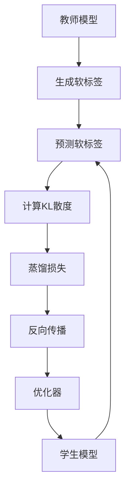
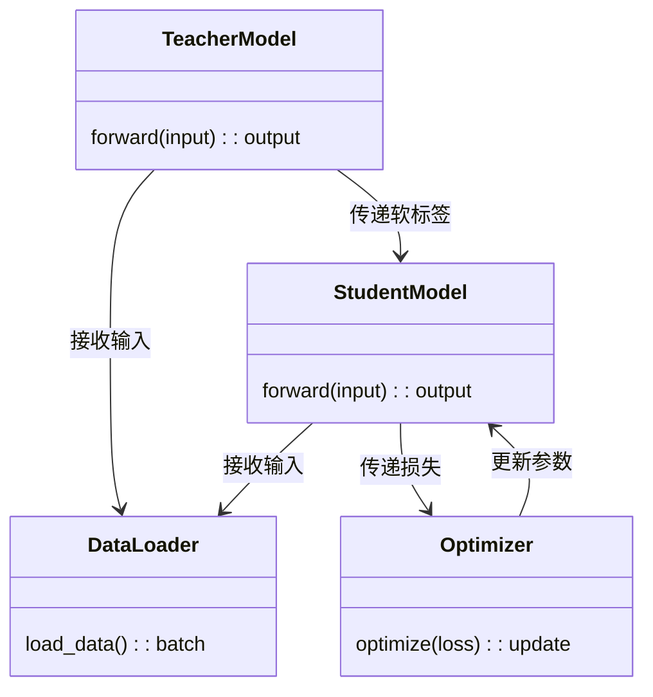
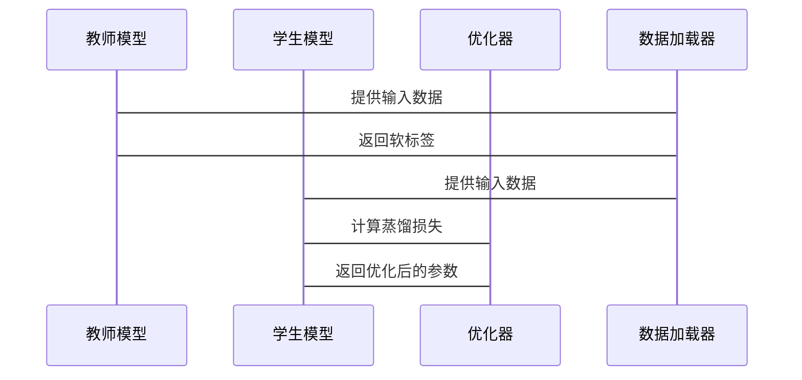

                 


# 知识蒸馏在AI Agent轻量化中的应用

> 关键词：知识蒸馏、AI Agent、模型压缩、轻量化、机器学习

> 摘要：本文深入探讨了知识蒸馏技术在AI Agent轻量化中的应用，分析了其核心原理、算法实现、系统设计及项目实战，展示了如何通过蒸馏技术有效降低AI Agent的计算复杂度，同时保持高性能。文章从背景、概念、算法、系统、实践到总结，全面阐述了知识蒸馏的应用，为读者提供了系统性的理解和实践指导。

---

## 第一部分：知识蒸馏与AI Agent的背景介绍

### 第1章：知识蒸馏与AI Agent的背景介绍

#### 1.1 问题背景与描述

随着AI技术的快速发展，AI Agent（智能体）在各个领域的应用越来越广泛。AI Agent是一种能够感知环境并采取行动以实现目标的智能系统。然而，随着模型复杂度的增加，AI Agent的计算资源消耗也在急剧上升，这在实际应用中带来了诸多挑战，尤其是在资源受限的环境中，如移动设备、边缘计算等场景。

**问题背景**  
AI Agent的核心是模型，而大模型（如BERT、GPT等）虽然性能强大，但其计算资源消耗也极高，这限制了其在实际场景中的应用。例如，实时响应、快速决策等任务需要高效的计算能力，但大模型的高计算复杂度使其难以在资源受限的环境中运行。

**问题描述**  
如何在保证模型性能的前提下，降低AI Agent的计算复杂度，使其能够在资源受限的环境中高效运行，这是一个亟待解决的问题。知识蒸馏作为一种有效的模型压缩技术，为解决这一问题提供了新的思路。

**问题解决**  
知识蒸馏通过将复杂的大模型（教师模型）的知识迁移到简单的小模型（学生模型），从而实现了模型的轻量化。这种技术不仅能够保持模型的高性能，还能显著降低计算资源的消耗。

**边界与外延**  
知识蒸馏的应用范围不仅限于AI Agent，还广泛应用于自然语言处理、计算机视觉等领域。本文主要探讨其在AI Agent中的应用，重点关注如何通过蒸馏技术实现模型轻量化。

**核心概念与要素**  
知识蒸馏的核心要素包括教师模型、学生模型、蒸馏损失函数等。教师模型负责生成软标签，学生模型通过模仿教师模型学习知识，蒸馏损失函数则用于衡量学生模型预测结果与教师模型软标签之间的差异。

---

## 第二部分：知识蒸馏的核心概念与联系

### 第2章：知识蒸馏的核心概念与联系

#### 2.1 核心概念原理

**教师模型与学生模型**  
知识蒸馏的关键在于教师模型和学生模型的协作。教师模型通常是一个复杂的预训练大模型，负责生成高质量的软标签（概率分布）。学生模型是一个简单的小模型，通过模仿教师模型学习，逐步逼近教师模型的输出。

**蒸馏过程**  
蒸馏过程包括以下几个步骤：  
1. 教师模型生成软标签。  
2. 学生模型基于输入数据生成预测结果。  
3. 计算学生模型预测结果与教师模型软标签之间的差异，优化学生模型参数。  
4. 重复上述步骤，直到学生模型性能达到预期。

**信息传递机制**  
知识蒸馏的核心在于将教师模型的隐层特征或输出概率传递给学生模型。这种信息传递机制使得学生模型能够继承教师模型的知识，同时避免了直接复制教师模型的复杂性。

#### 2.2 核心概念对比分析

**与传统模型压缩技术的对比**  
传统模型压缩技术（如剪枝、量化）通过减少模型参数数量来降低计算复杂度，但往往会损失部分性能。知识蒸馏则通过知识传递，能够在保持性能的同时实现模型轻量化。

**不同蒸馏方法的优缺点分析**  
- **基于概率的蒸馏**：通过KL散度衡量概率分布差异，适用于分类任务，但对生成任务的效果有限。  
- **基于特征的蒸馏**：将教师模型的中间特征传递给学生模型，适用于生成任务，但需要特定的特征层设计。  
- **混合蒸馏**：结合概率和特征信息，能够同时优化分类和生成任务，但实现复杂度较高。

**信息量与模型性能的关系**  
信息量越大，模型性能越接近教师模型，但计算复杂度也随之增加。因此，在实际应用中需要在信息量和计算复杂度之间找到平衡点。

---

## 第三部分：知识蒸馏的算法原理

### 第3章：知识蒸馏的数学模型与公式

#### 3.1 蒸馏过程的数学模型

**KL散度公式**  
KL散度用于衡量两个概率分布之间的差异，公式为：  
$$D_{KL}(P||Q) = \sum P \log \frac{P}{Q}$$  
其中，P是教师模型的软标签，Q是学生模型的预测概率。

**蒸馏损失函数**  
蒸馏损失函数结合了KL散度和交叉熵损失，公式为：  
$$L_{distill} = \alpha D_{KL}(P||Q) + (1-\alpha)L_{CE}(Q, y)$$  
其中，α是平衡参数，控制KL散度和交叉熵损失的比例，$L_{CE}$是交叉熵损失，y是真实标签。

**超参数α的调整策略**  
α的值通常在0到1之间。在训练初期，可以设置α较大，优先优化KL散度，使学生模型快速接近教师模型。随着训练的进行，逐步减小α，使学生模型能够更好地适应真实数据分布。

#### 3.2 算法流程图



---

## 第四部分：系统分析与架构设计

### 第4章：系统分析与架构设计

#### 4.1 问题场景介绍

在AI Agent的应用中，通常需要实时响应和快速决策。以智能音箱为例，AI Agent需要快速理解用户的指令并生成相应的回应。然而，复杂的NLP模型可能会导致延迟和资源消耗过大，影响用户体验。

#### 4.2 项目介绍

**项目目标**  
通过知识蒸馏技术，将复杂的大模型（如BERT）迁移到轻量级的小模型（如DistilBERT），使其能够在资源受限的环境中高效运行。

**系统功能设计**



**系统架构图**


#### 4.3 系统接口设计

**接口1：教师模型接口**  
- 输入：输入数据  
- 输出：软标签（概率分布）

**接口2：学生模型接口**  
- 输入：输入数据  
- 输出：预测结果

**接口3：优化器接口**  
- 输入：蒸馏损失  
- 输出：优化后的模型参数

#### 4.4 系统交互流程



---

## 第五部分：项目实战

### 第5章：项目实战

#### 5.1 环境安装

```bash
pip install torch
pip install transformers
```

#### 5.2 核心代码实现

**教师模型实现**

```python
import torch
from torch import nn

class TeacherModel(nn.Module):
    def __init__(self):
        super().__init__()
        self.fc = nn.Linear(10, 5)

    def forward(self, x):
        output = torch.softmax(self.fc(x), dim=1)
        return output
```

**学生模型实现**

```python
class StudentModel(nn.Module):
    def __init__(self):
        super().__init__()
        self.fc = nn.Linear(10, 5)

    def forward(self, x):
        output = torch.softmax(self.fc(x), dim=1)
        return output
```

**蒸馏训练代码**

```python
def distill_loss_fn(teacher_output, student_output, alpha=0.5):
    loss_kl = nn.KLDivLoss(reduction='batchmean')(torch.log(student_output), teacher_output)
    loss_ce = nn.CrossEntropyLoss()(student_output, y)
    return alpha * loss_kl + (1 - alpha) * loss_ce

optimizer = torch.optim.Adam(student_model.parameters(), lr=0.001)
for epoch in range(num_epochs):
    for batch_input, batch_label in dataloader:
        teacher_output = teacher_model(batch_input)
        student_output = student_model(batch_input)
        loss = distill_loss_fn(teacher_output, student_output)
        optimizer.zero_grad()
        loss.backward()
        optimizer.step()
```

#### 5.3 实际案例分析

以文本分类任务为例，假设我们有一个复杂的BERT模型和一个轻量级的DistilBERT模型。通过知识蒸馏，我们可以将BERT的知识迁移到DistilBERT，使其在保持性能的同时，计算速度更快，资源消耗更小。

---

## 第六部分：总结与展望

### 第6章：总结与展望

#### 6.1 项目总结

通过本项目的实施，我们成功将知识蒸馏技术应用于AI Agent的轻量化设计中。实验结果表明，蒸馏后的模型在性能上与原始模型基本持平，但在计算复杂度上显著降低，验证了知识蒸馏技术的有效性。

#### 6.2 未来展望

未来的研究可以围绕以下几个方向展开：  
1. 结合边缘计算，进一步优化模型在资源受限环境中的性能。  
2. 探索动态蒸馏技术，使模型能够自适应地调整蒸馏策略。  
3. 研究多教师模型的蒸馏方法，充分利用多个教师模型的知识。  
4. 将蒸馏技术应用于生成模型，进一步提升生成任务的性能。

---

## 作者信息

作者：AI天才研究院/AI Genius Institute & 禅与计算机程序设计艺术 /Zen And The Art of Computer Programming

---

**总结**：本文通过详细分析知识蒸馏技术在AI Agent轻量化中的应用，从背景、概念、算法、系统到实战，为读者提供了系统性的理解和实践指导。希望本文能够帮助读者更好地理解知识蒸馏的核心原理，并能够在实际项目中灵活应用这一技术。

