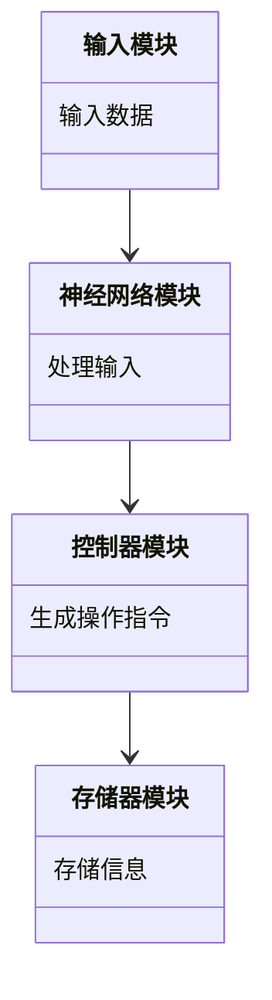

                 

<think>
嗯，我现在需要撰写一篇关于神经图灵机的博客文章。这个主题听起来有点复杂，我得先理解什么是神经图灵机。好像它结合了神经网络和图灵机的概念，用于增强AI代理的学习能力。那么，我应该从哪里开始呢？

首先，我得了解神经图灵机的背景。神经网络在AI中很常见，但它们有时候在处理需要外部存储和复杂逻辑的任务时会遇到困难。而图灵机是一个理论模型，能够模拟任何算法。所以，神经图灵机可能是将神经网络和图灵机结合起来，赋予AI代理更强的学习和问题解决能力。

接下来，我需要解释神经图灵机的基本概念。它可能包括一个神经网络作为处理单元，一个外部存储器，以及一个控制器来管理整个过程。这样，AI代理可以利用存储器来存储和检索信息，处理更复杂的问题。

然后，我得探讨神经图灵机的核心原理。它如何结合神经网络和图灵机的机制？可能涉及到注意力机制，或者强化学习中的策略网络。这部分需要详细解释，让读者明白它的工作流程。

接下来是算法部分。我需要展示神经图灵机的算法步骤，可能包括输入处理、控制器选择、存储器读写等。同时，数学模型也很重要，可能需要使用矩阵运算和概率模型来描述。

系统架构设计也是关键。我应该画一个类图，展示系统的各个模块及其关系。然后用架构图展示整体结构，包括输入模块、神经网络模块、控制器、存储器等部分。还要设计接口和交互流程，确保各模块协同工作。

项目实战部分，我需要指导读者如何安装环境，比如安装Python和相关库。然后提供核心代码，详细解释每一部分的功能。案例分析部分，可以选一个具体的任务，比如文本摘要，展示神经图灵机的应用效果。

最后，总结与展望。我需要回顾神经图灵机的优势和应用场景，同时指出当前的局限性和未来的发展方向。可能还可以分享一些实际应用案例，展示其潜力。

现在，我需要把这些思考整合成一个连贯的文章。确保每个部分都详细且易于理解，同时使用专业的技术语言。可能需要多次修改，确保逻辑清晰，内容准确。
</think>

# 神经图灵机：增强AI Agent的算法学习能力

> **关键词**：神经图灵机, AI Agent, 算法学习, 神经网络, 图灵机模型  
> **摘要**：本文深入探讨神经图灵机的概念、原理及其在增强AI Agent学习能力中的应用。通过分析其算法流程、系统架构及项目实战，展示如何利用神经图灵机提升AI代理的智能水平。

---

## 第一部分：神经图灵机的背景与概念

### 第1章：神经图灵机的起源与背景

#### 1.1 神经图灵机的起源
- **神经网络的局限性**：传统神经网络在处理复杂任务时，如需要外部存储和逻辑推理的任务，表现有限。
- **图灵机模型的引入**：图灵机模型通过引入存储器和控制器，提供强大的计算能力。
- **神经图灵机的提出**：结合神经网络的处理能力和图灵机的存储机制，神经图灵机应运而生。

#### 1.2 神经图灵机的基本概念
- **定义**：神经图灵机是一种结合神经网络和图灵机模型的计算模型。
- **核心特点**：
  - 集成外部存储器，用于存储和检索信息。
  - 使用神经网络作为处理单元，具备学习能力。
- **与传统AI的区别**：
  - 传统AI依赖规则和逻辑推理，神经图灵机结合学习和存储。

#### 1.3 神经图灵机在AI Agent中的应用
- **AI Agent的基本概念**：AI Agent是能够感知环境并执行任务的智能体。
- **神经图灵机的作用**：增强AI Agent的学习能力和动态适应能力。
- **应用场景**：复杂环境中的任务处理，如自动驾驶、智能助手。

---

## 第二部分：神经图灵机的核心概念与联系

### 第2章：神经图灵机的核心原理

#### 2.1 神经图灵机的原理
- **输入处理**：神经网络处理输入数据，提取特征。
- **控制器的选择**：控制器决定操作类型（读取、写入、擦除）。
- **存储器的读写操作**：通过地址向量访问存储器中的信息。

#### 2.2 神经图灵机的核心组件
- **神经网络层**：处理输入并生成操作指令。
- **控制器**：管理存储器的操作。
- **存储器**：存储和检索信息，支持动态交互。

#### 2.3 神经图灵机与传统神经网络的对比
- **网络结构对比**：神经图灵机引入存储器和控制器，结构更复杂。
- **学习机制对比**：神经图灵机具备更强的动态交互能力。
- **应用场景对比**：适合需要长期记忆和复杂推理的任务。

---

## 第三部分：神经图灵机的算法原理

### 第3章：神经图灵机的算法流程

#### 3.1 神经图灵机的算法步骤
1. 输入数据经过神经网络处理，生成操作指令。
2. 控制器根据指令选择操作类型（读取、写入、擦除）。
3. 通过地址向量访问存储器中的信息，进行读写操作。
4. 输出结果基于神经网络和存储器内容生成。

#### 3.2 神经图灵机的数学模型
- **输入向量表示**：$x \in \mathbb{R}^d$
- **控制器参数化表示**：$c \in \mathbb{R}^m$
- **存储器向量表示**：$m \in \mathbb{R}^{n \times k}$
- **输出计算公式**：$y = f(x, c, m)$

#### 3.3 神经图灵机的训练过程
- **损失函数**：交叉熵损失函数。
- **反向传播**：使用链式法则更新参数。
- **参数更新策略**：Adam优化器。

---

## 第四部分：神经图灵机的系统架构与设计

### 第4章：神经图灵机的系统架构

#### 4.1 神经图灵机的系统组成
- **输入模块**：接收外部输入数据。
- **神经网络模块**：处理输入并生成操作指令。
- **控制器模块**：管理存储器的操作。
- **存储器模块**：存储和检索信息。

#### 4.2 系统功能设计（领域模型）


#### 4.3 系统架构设计（架构图）


---

## 第五部分：项目实战

### 第5章：神经图灵机的项目实现

#### 5.1 环境安装
- 安装Python和相关库（如TensorFlow、Keras）。

#### 5.2 核心代码实现
```python
import tensorflow as tf
from tensorflow.keras import layers

class NeuralTuringMachine:
    def __init__(self, input_dim, memory_size, word_dim):
        self.input_dim = input_dim
        self.memory_size = memory_size
        self.word_dim = word_dim

        self.controller = self.create_controller()
        self.memory = self.create_memory()

    def create_controller(self):
        controller = layers.Dense(self.word_dim, activation='tanh')
        return controller

    def create_memory(self):
        memory = tf.Variable(tf.random.uniform((self.memory_size, self.word_dim)), trainable=False)
        return memory

    def read(self, address):
        return tf.gather(self.memory, address)

    def write(self, address, value):
        self.memory = tf.scatter_update(self.memory, address, value)

    def compute(self, inputs):
        controller_output = self.controller(inputs)
        address = tf.nn.softmax(controller_output)
        read_value = self.read(address)
        return read_value
```

#### 5.3 案例分析
- **任务**：文本摘要。
- **过程**：输入文本，神经图灵机通过控制器读取存储器中的信息，生成摘要。

---

## 第六部分：总结与展望

### 第6章：神经图灵机的总结与展望

#### 6.1 总结
- 神经图灵机结合神经网络和图灵机，提升AI Agent的学习能力。
- 其核心优势在于动态交互和长期记忆能力。

#### 6.2 展望
- **未来研究方向**：优化存储器结构，提升处理效率。
- **应用场景拓展**：应用于更复杂的任务，如自动驾驶和智能助手。

---

**作者**：AI天才研究院 & 禅与计算机程序设计艺术

