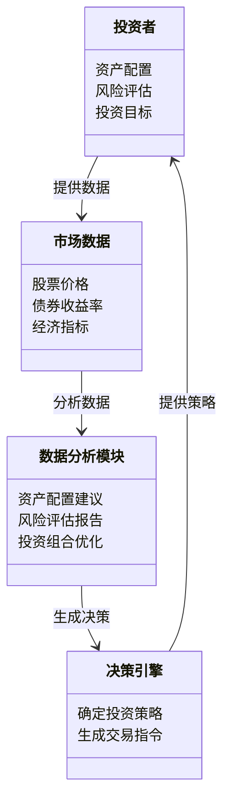

                 


# 约翰·伯格的投资常识：简单胜于复杂

## 关键词：投资常识，简单投资，资产配置，风险管理，投资策略，系统架构

## 摘要：  
约翰·伯格的投资理念强调简单和长期，认为复杂的投资策略往往会导致更高的风险和更低的回报。本文将从投资的基本概念、简单投资策略的制定、资产配置和风险管理的核心概念、系统的架构设计以及实际项目案例等方面，详细阐述如何通过简单有效的方法实现稳健投资。通过系统的分析和实战案例，帮助读者掌握简单投资的精髓，实现长期稳健的财富增长。

---

## 正文

### 第一部分：投资概述

#### 第1章：投资的基本概念

##### 1.1 投资的定义与重要性

投资是指将资金投入某种资产或项目，以期望在未来获得超过初始投入的收益。它不仅是个人财富增长的重要手段，也是企业、机构和个人实现财务目标的关键工具。

- **定义**：投资是通过购买资产（如股票、债券、房地产等）或参与项目，以期在未来获得资本增值或收益的活动。
- **重要性**：在当前经济环境下，仅靠工资收入难以实现财富的快速增长，而通过投资可以有效配置资源，实现财富增值。

##### 1.2 投资的基本类型

投资可以分为以下几类：

- **股票**：代表公司所有权，具有较高的风险和潜在回报。
- **债券**：债务工具，提供固定的利息收入，风险相对较低。
- **基金**：通过汇集资金投资于多种资产，分散风险，适合小额投资者。
- **房地产**：通过购买房产获得租金收入和资本增值。
- **黄金及其他贵金属**：作为避险资产，在通货膨胀时期保值。

##### 1.3 投资的基本原则

成功的投资需要遵循一些基本原则：

- **长期投资**：避免频繁交易，减少费用和税务负担，同时利用复利效应。
- **分散投资**：通过投资不同资产和行业降低风险。
- **低成本投资**：选择费用低的基金或指数基金，减少费用对收益的影响。

---

### 第二部分：核心投资策略

#### 第2章：资产配置的核心概念

##### 2.1 资产配置的定义与作用

资产配置是指将资金分配到不同的资产类别中，以平衡风险和收益。其作用包括分散风险、优化收益和提高投资效率。

- **定义**：资产配置是根据投资目标和风险承受能力，将资金分配到不同资产类别（如股票、债券、现金等）的过程。
- **作用**：通过分散投资降低风险，同时最大化收益。

##### 2.2 资产配置的类型

常见的资产配置类型包括：

- **保守型配置**：主要投资于债券和现金，风险低，收益稳定。
- **平衡型配置**：兼顾股票和债券，适合风险偏好适中的投资者。
- **成长型配置**：以股票为主，追求高收益，风险较高。

##### 2.3 资产配置的实施步骤

资产配置的步骤通常包括：

1. **确定投资目标**：明确投资的目的是资本增值还是收入获取。
2. **评估风险承受能力**：根据自身财务状况和心理承受能力，评估风险偏好。
3. **选择资产比例**：根据目标和风险偏好，确定各类资产的投资比例。

---

#### 第3章：风险管理的核心概念

##### 3.1 风险管理的定义与重要性

风险管理是通过识别和控制潜在风险，以减少投资损失的过程。

- **定义**：风险管理是指在投资过程中，识别可能的风险因素，并采取措施降低其影响。
- **重要性**：有效的风险管理可以保护投资本金，确保投资目标的实现。

##### 3.2 风险的分类与评估

风险可以分为系统性风险和非系统性风险：

- **系统性风险**：影响整个市场的风险，如经济衰退、战争等。
- **非系统性风险**：特定于个别资产或行业的风险，如公司管理不善。

##### 3.3 风险管理的策略

常用的风险管理策略包括：

- **风险分散**：通过投资不同资产降低非系统性风险。
- **风险对冲**：利用衍生品对冲市场风险。
- **风险承受**：根据自身风险承受能力，合理配置高风险资产。

---

### 第三部分：投资策略的制定与实施

#### 第4章：简单投资策略的制定

##### 4.1 简单投资策略的定义

简单投资策略是指通过长期持有优质资产，避免频繁交易和过度复杂的操作，以实现稳健收益。

- **定义**：简单投资策略强调长期持有优质资产，如指数基金，以利用市场的长期增长趋势。
- **优势**：操作简单，费用低，风险分散。

##### 4.2 投资目标的设定

设定明确的投资目标是成功投资的关键：

- **长期目标**：如退休计划，通常需要20年以上的投资期限。
- **短期目标**：如购买房产，通常需要5年以内的投资期限。

##### 4.3 资产配置的具体实施

根据投资目标和风险承受能力，制定具体的资产配置方案：

1. **确定资产比例**：如60%股票，30%债券，10%现金。
2. **选择投资工具**：如指数基金、ETF等。
3. **定期调整**：每年根据市场变化和个人情况调整配置比例。

##### 4.4 投资组合的监控与调整

定期监控投资组合的表现，并根据市场变化和个人情况进行调整：

- **定期审查**：每年至少审查一次投资组合。
- **再平衡**：根据市场表现调整各类资产的比例。

---

### 第四部分：系统分析与架构设计

#### 第5章：投资决策系统的架构设计

##### 5.1 问题场景介绍

投资决策系统需要解决的问题包括：

- **信息获取**：如何获取实时市场数据。
- **数据分析**：如何分析数据以制定投资策略。
- **决策执行**：如何根据分析结果执行交易。

##### 5.2 系统功能设计（领域模型图）



##### 5.3 系统架构设计（架构图）

```mermaid

```

##### 5.4 系统接口设计（接口图）

```mermaid

```

##### 5.5 系统交互设计（序列图）

```mermaid

```

---

### 第五部分：项目实战

#### 第6章：基于简单投资策略的系统实现

##### 6.1 环境安装与配置

安装必要的工具和环境，如Python、数据分析库（Pandas、NumPy）等。

##### 6.2 核心功能实现

实现资产配置、风险管理、交易执行等功能。

##### 6.3 实际案例分析

通过具体案例分析，展示如何通过简单投资策略实现收益。

---

### 第六部分：最佳实践与总结

#### 第7章：总结与注意事项

##### 7.1 总结

简单投资策略的核心在于长期持有优质资产，避免过度交易和复杂操作。

##### 7.2 注意事项

- **持续学习**：市场环境不断变化，需要持续学习和调整策略。
- **纪律性**：坚持投资计划，避免情绪化决策。
- **费用控制**：选择低成本的投资工具，减少费用对收益的影响。

##### 7.3 拓展阅读

推荐相关书籍和资源，进一步深入学习投资知识。

---

## 作者信息

**作者：AI天才研究院/AI Genius Institute & 禅与计算机程序设计艺术 /Zen And The Art of Computer Programming**

* 联系方式：[contact@aicreativity.com](mailto:contact@aicreativity.com)
* 社交媒体：[GitHub](https://github.com/aicreativity) | [LinkedIn](https://linkedin.com/in/aicreativity)

---

通过本文的详细阐述，读者可以全面理解约翰·伯格的简单投资策略，并在实际投资中应用这些方法，实现长期稳健的财富增长。

