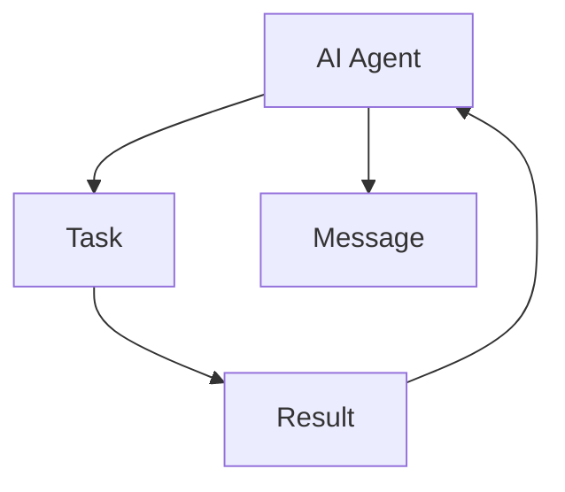
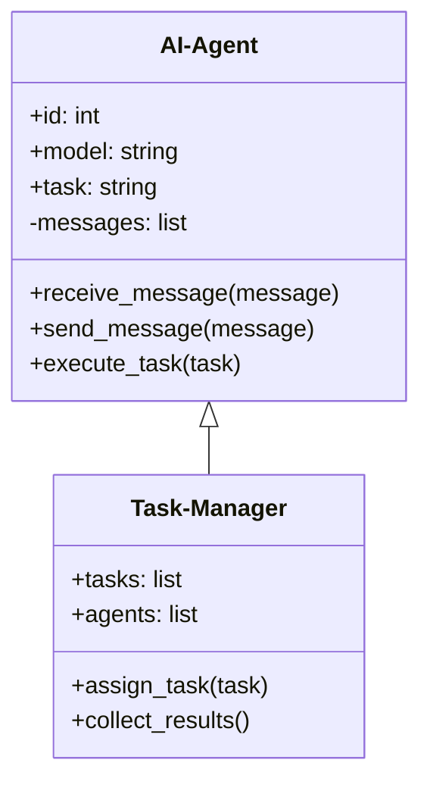

                 


```markdown
# 群体智能 AI Agent：多个 LLM 协作的分布式系统

## 关键词：群体智能、AI Agent、LLM、分布式系统、协作、多智能体

## 摘要：本文探讨了群体智能AI Agent通过多个大语言模型协作实现分布式系统的原理与应用。文章从背景介绍、核心概念、算法原理、系统架构设计到项目实战，详细阐述了多个LLM协作的优势与挑战，为读者提供了一套完整的技术解决方案。

---

## 第一部分: 群体智能与AI Agent概述

### 第1章: 群体智能与AI Agent的背景介绍

#### 1.1 群体智能的基本概念
- **定义**：群体智能是指通过多个个体（如AI Agent）协作，共同完成复杂任务的智能形式。
- **背景**：随着计算能力的提升，多个智能体协作变得可行，广泛应用于分布式计算、机器人和自然语言处理等领域。
- **问题描述**：单个AI模型能力有限，通过协作可以提高整体性能和应对复杂任务。
- **解决方法**：通过分布式系统架构，多个LLM协作实现群体智能。

#### 1.2 AI Agent的基本概念
- **定义**：AI Agent是具有感知和自主决策能力的智能体，能够执行特定任务。
- **特点**：具备主动性、反应性、社会性，能够与其他Agent协作。
- **应用场景**：问答系统、推荐系统、自动化控制等。

#### 1.3 群体智能与AI Agent的关系
- **结合**：多个AI Agent协作形成群体智能，共同完成复杂任务。
- **优势**：任务分配更高效，知识覆盖更广泛，错误容错能力更强。
- **挑战**：通信延迟、同步问题、协作策略优化。

#### 1.4 本章小结
本章介绍了群体智能和AI Agent的基本概念，探讨了它们的结合与挑战。

---

## 第二部分: 群体智能AI Agent的核心概念与联系

### 第2章: 群体智能AI Agent的核心概念

#### 2.1 群体智能AI Agent的原理
- **工作流程**：信息接收、任务分配、协作执行、结果汇总。
- **通信机制**：通过消息传递协议进行信息交换。
- **协作机制**：任务分配算法和共识机制确保协作一致性。

#### 2.2 群体智能AI Agent的属性特征对比
| 特性         | 群体智能AI Agent       | 单体AI Agent        |
|--------------|-----------------------|---------------------|
| 智能来源     | 多个模型协作           | 单个模型           |
| 决策能力     | 分布式决策             | 中央决策           |
| 知识覆盖     | 更广泛                 | 有限               |
| 容错能力     | 高                    | 低                |

#### 2.3 群体智能AI Agent的ER实体关系图


---

## 第三部分: 群体智能AI Agent的算法原理

### 第3章: 群体智能AI Agent的算法原理

#### 3.1 分布式计算的基本原理
- **定义**：将任务分解成多个部分，由不同节点并行处理。
- **核心算法**：MapReduce，实现任务分配和结果汇总。
- **实现步骤**：
  1. 将任务分发给各个节点。
  2. 各节点并行处理任务。
  3. 收集各节点结果，汇总输出。

#### 3.2 群体智能AI Agent的共识机制
- **定义**：确保所有节点达成一致的方法。
- **实现算法**：通过多次通信，节点达成一致。
- **应用场景**：任务分配和结果确认。

#### 3.3 群体智能AI Agent的任务分配算法
- **定义**：根据节点能力和负载分配任务。
- **实现步骤**：
  1. 评估各节点资源和能力。
  2. 根据评估结果分配任务。
  3. 监控任务执行，动态调整。

---

## 第四部分: 群体智能AI Agent的系统分析与架构设计

### 第4章: 群体智能AI Agent的系统分析与架构设计

#### 4.1 项目背景
- **背景**：解决复杂问题，提升系统性能。
- **目标**：实现多个LLM协作，完成复杂任务。

#### 4.2 系统功能设计
- **领域模型图**：


#### 4.3 系统架构设计


#### 4.4 系统接口设计
- **API接口**：`assign_task()`, `receive_message()`, `execute_task()`, `collect_results()`。
- **交互过程**：
  1. Task Manager分配任务。
  2. AI Agent接收任务并执行。
  3. AI Agent发送结果给Task Manager。
  4. Task Manager收集所有结果，输出最终结果。

---

## 第五部分: 群体智能AI Agent的项目实战

### 第5章: 群体智能AI Agent的项目实战

#### 5.1 环境安装
- **安装依赖**：Python 3.8+, requests库，flask库。
- **配置环境**：安装必要依赖，设置API接口。

#### 5.2 系统核心实现源代码
```python
import requests
from flask import Flask, request, jsonify

class AI-Agent:
    def __init__(self, model):
        self.model = model
        self.id = id
        self.task = None
        self.messages = []

    def receive_message(self, message):
        self.messages.append(message)
        self.process_messages()

    def send_message(self, message, recipient):
        response = requests.post(f'http://localhost:5000/send/{recipient}', json=message)
        return response.status_code == 200

    def execute_task(self, task):
        # 执行任务并返回结果
        return self.model(task)

class Task_Manager:
    def __init__(self, agents):
        self.agents = agents
        self.tasks = []

    def assign_task(self, task):
        for agent in self.agents:
            if agent.task is None:
                agent.task = task
                break

    def collect_results(self):
        results = []
        for agent in self.agents:
            if agent.task:
                results.append(agent.execute_task(agent.task))
        return results

# Flask服务器实现
app = Flask(__name__)

@app.route('/assign_task', methods=['POST'])
def assign_task():
    data = request.json
    task = data['task']
    task_manager.assign_task(task)
    return jsonify({'status': 'success'})

@app.route('/execute_task', methods=['POST'])
def execute_task():
    data = request.json
    result = task_manager.collect_results()
    return jsonify({'result': result})

if __name__ == '__main__':
    agent1 = AI-Agent("gpt3")
    agent2 = AI-Agent("paLM")
    task_manager = Task_Manager([agent1, agent2])
    app.run(debug=True)
```

#### 5.3 代码应用解读与分析
- **AI-Agent类**：处理消息和任务执行。
- **Task_Manager类**：分配任务和收集结果。
- **Flask服务器**：提供API接口，实现任务分配和结果收集。

#### 5.4 实际案例分析
- **案例**：文本分类任务。
- **分析**：任务分配给两个模型，分别处理，最终结果合并。

#### 5.5 项目小结
项目实现了多个LLM协作，通过分布式系统架构，提高了任务处理效率和准确性。

---

## 第六部分: 群体智能AI Agent的最佳实践与总结

### 第6章: 群体智能AI Agent的最佳实践

#### 6.1 实践中的注意事项
- **通信延迟**：优化通信机制，减少延迟。
- **任务分配**：动态调整任务分配策略。
- **模型选择**：根据任务选择合适的模型。

#### 6.2 群体智能AI Agent的小结
- **优势**：任务处理能力强，知识覆盖广，容错能力强。
- **挑战**：通信延迟、同步问题、协作策略优化。

#### 6.3 注意事项
- **数据同步**：确保数据一致性。
- **错误处理**：设计容错机制，处理节点故障。
- **性能优化**：优化通信和计算效率。

#### 6.4 拓展阅读
- **参考文献**：
  1. 群体智能算法研究。
  2. 分布式系统设计与实现。
  3. 多模型协作技术。

---

## 作者：AI天才研究院 & 禅与计算机程序设计艺术

---

**本文通过详细分析和实践，展示了群体智能AI Agent在多个LLM协作中的应用，为读者提供了一套完整的解决方案，帮助他们理解并实现高效的分布式系统。**
```

