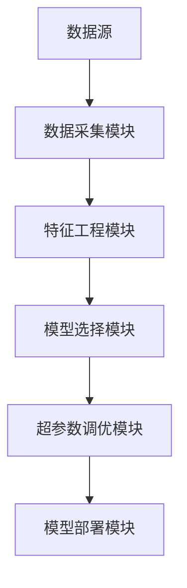
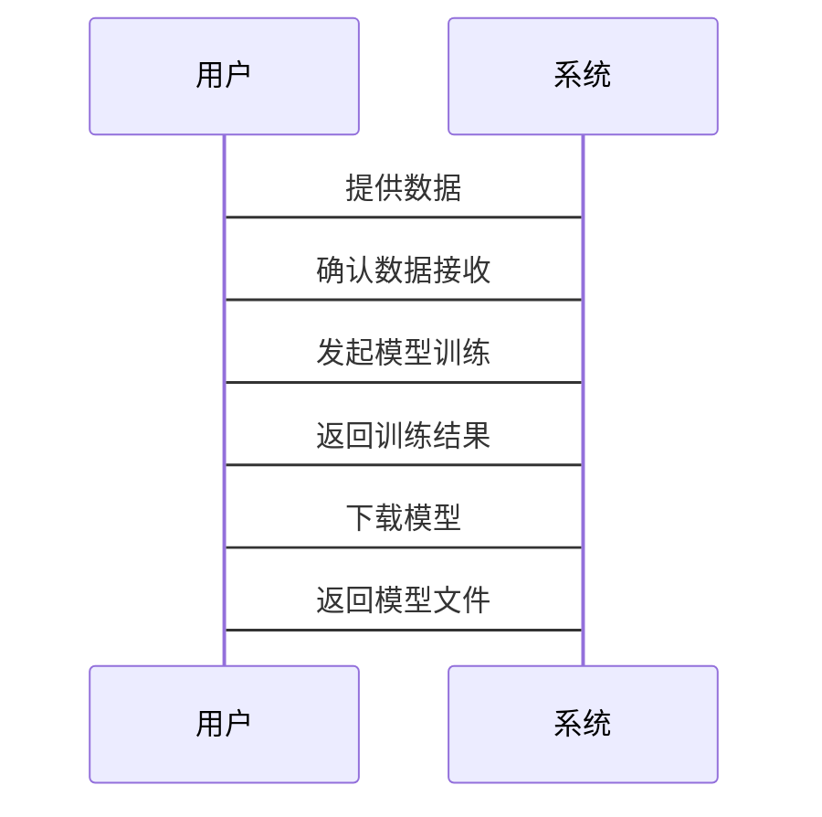

                 


# 自动机器学习（AutoML）在AI Agent开发中的应用

---

## 关键词：自动机器学习, AI Agent, 人工智能, 机器学习, 自动化

---

## 摘要

自动机器学习（AutoML）通过自动化机器学习的各个阶段，大大简化了AI Agent的开发流程。本文深入探讨AutoML在AI Agent开发中的应用，从AutoML的核心技术到AI Agent的设计与实现，再到系统架构与项目实战，全面解析AutoML如何推动AI Agent的智能化与高效开发。本文旨在为开发者提供理论与实践相结合的指导，帮助他们更好地理解和应用AutoML技术。

---

# 第1章: 自动机器学习（AutoML）与AI Agent开发基础

## 1.1 自动机器学习（AutoML）的定义与背景

### 1.1.1 机器学习的自动化概念

机器学习是一种通过数据训练模型以实现特定任务的技术，其核心在于模型的训练和优化。传统的机器学习开发流程繁琐且耗时，需要人工参与数据预处理、特征工程、模型选择、超参数调优等环节。AutoML的出现，通过自动化这些过程，显著提高了开发效率，降低了技术门槛。

### 1.1.2 AutoML的起源与发展

AutoML的概念起源于20世纪末，随着计算能力的提升和算法的改进，AutoML技术逐渐成熟。近年来，随着深度学习的兴起，AutoML在多个领域得到了广泛应用，尤其是在AI Agent开发中，AutoML通过自动化机器学习流程，帮助开发者快速构建高效、智能的AI Agent。

### 1.1.3 AutoML的核心目标与优势

AutoML的核心目标是通过自动化技术，降低机器学习的门槛，使非专业人员也能轻松构建高性能的机器学习模型。其优势包括：提高开发效率、降低人工成本、优化模型性能、支持大规模数据处理等。

---

## 1.2 AI Agent的基本概念与应用

### 1.2.1 AI Agent的定义与分类

AI Agent是一种能够感知环境、自主决策并执行任务的智能体。根据功能和应用场景的不同，AI Agent可以分为多种类型，如基于规则的Agent、基于模型的Agent、基于学习的Agent等。

### 1.2.2 AI Agent的核心功能与特点

AI Agent的核心功能包括感知环境、自主决策、执行任务和自适应学习。其特点在于智能性、自主性、反应性和社会性。

### 1.2.3 AI Agent在不同领域的应用案例

AI Agent在多个领域有广泛的应用，如智能助手、推荐系统、自动驾驶、智能客服等。通过AutoML技术，AI Agent的开发变得更加高效和便捷。

---

## 1.3 AutoML与AI Agent的结合

### 1.3.1 AutoML在AI Agent开发中的作用

AutoML通过自动化数据预处理、特征工程、模型选择和调优等过程，显著提升了AI Agent的开发效率。同时，AutoML还能够帮助AI Agent更好地适应动态变化的环境，提高其智能性和灵活性。

### 1.3.2 AutoML如何提升AI Agent的性能与效率

AutoML通过自动化优化模型结构和参数，使得AI Agent能够更高效地处理复杂任务。同时，AutoML还支持多目标优化，能够在多个目标之间找到平衡点，从而提升AI Agent的整体性能。

### 1.3.3 AutoML与AI Agent结合的典型应用场景

在智能助手、推荐系统和自动驾驶等领域，AutoML与AI Agent的结合已经取得了显著的成果。例如，在智能助手开发中，AutoML可以帮助优化语音识别和自然语言处理模型，提升用户体验。

---

## 1.4 本章小结

本章介绍了AutoML的基本概念、核心目标及其在AI Agent开发中的作用。通过AutoML技术，AI Agent的开发变得更加高效和智能，为未来的智能化应用奠定了坚实的基础。

---

# 第2章: AutoML的核心技术与实现原理

## 2.1 AutoML的基本流程与关键环节

### 2.1.1 数据预处理与特征工程

数据预处理是机器学习中的关键步骤，包括数据清洗、特征提取、特征选择等。通过自动化这些过程，AutoML能够显著提高数据处理效率。

### 2.1.2 模型选择与调优

AutoML通过自动选择最优模型和调优超参数，帮助开发者构建高性能的机器学习模型。这一过程通常采用遗传算法或强化学习等优化方法。

### 2.1.3 模型评估与部署

模型评估是确保模型性能的重要环节，AutoML通过自动化交叉验证和性能指标计算，帮助开发者快速评估模型效果。同时，AutoML还支持模型的自动化部署，方便后续应用。

---

## 2.2 AutoML的搜索空间与优化算法

### 2.2.1 搜索空间的定义与优化

AutoML的搜索空间包括模型结构、超参数和特征选择等多个方面。通过构建搜索空间，AutoML可以系统地探索所有可能的组合，找到最优解。

### 2.2.2 基于遗传算法的模型优化

遗传算法是一种模拟自然选择的优化算法，通过迭代选择、交叉和变异等操作，逐步优化模型性能。在AutoML中，遗传算法常用于超参数优化和模型结构选择。

### 2.2.3 基于强化学习的模型选择

强化学习是一种通过试错机制优化决策的算法。在AutoML中，强化学习可以用于模型选择和特征工程，帮助找到最优的模型组合。

---

## 2.3 AutoML的实现框架与工具

### 2.3.1 AutoML实现框架的介绍

AutoML的实现通常基于机器学习框架，如TensorFlow、Keras等。通过集成遗传算法和强化学习等优化算法，AutoML框架能够实现模型的自动化构建和优化。

### 2.3.2 常用AutoML工具的概述

目前，市面上有许多AutoML工具，如Google的AutoML、H2O AutoML、TPOT等。这些工具为开发者提供了便捷的AutoML功能，简化了机器学习开发流程。

---

## 2.4 本章小结

本章详细介绍了AutoML的核心技术与实现原理，包括数据预处理、模型选择与调优、搜索空间与优化算法等内容。通过AutoML技术，机器学习的开发变得更加高效和自动化。

---

# 第3章: AI Agent的开发与设计

## 3.1 AI Agent的核心模块与功能

### 3.1.1 感知模块

感知模块负责AI Agent对外界环境的感知，包括数据采集、特征提取和环境建模。通过AutoML技术，感知模块能够更高效地处理复杂的数据，提升模型的感知能力。

### 3.1.2 决策模块

决策模块是AI Agent的核心，负责根据感知到的信息做出决策。AutoML通过自动化决策模型的构建和优化，帮助AI Agent做出更优的决策。

### 3.1.3 执行模块

执行模块负责将决策结果转化为具体行动。通过AutoML优化的执行模块，AI Agent能够更高效地完成任务，提升执行效率。

---

## 3.2 AI Agent的设计原则与挑战

### 3.2.1 设计原则

AI Agent的设计需要遵循模块化、可扩展性、鲁棒性和可解释性等原则。通过AutoML技术，AI Agent的设计更加模块化和可扩展，能够更好地适应复杂环境的变化。

### 3.2.2 设计挑战

AI Agent的开发面临数据稀疏性、动态环境适应性、多目标优化等挑战。通过AutoML技术，这些挑战得以有效缓解，提升了AI Agent的性能和适应性。

---

## 3.3 本章小结

本章探讨了AI Agent的核心模块与功能，分析了其设计原则与挑战。通过AutoML技术，AI Agent的开发更加高效和智能化，为未来的应用奠定了基础。

---

# 第4章: AutoML在AI Agent开发中的应用

## 4.1 自动化特征工程与模型选择

### 4.1.1 AutoML在特征工程中的应用

特征工程是机器学习中的关键步骤，AutoML通过自动化特征选择和特征构建，显著提升了模型的性能。

### 4.1.2 AutoML在模型选择中的应用

AutoML通过自动选择最优模型结构和参数，帮助开发者构建高性能的机器学习模型。

---

## 4.2 自动化超参数调优与模型优化

### 4.2.1 AutoML在超参数调优中的应用

超参数调优是模型优化的重要环节，AutoML通过自动化搜索和优化，显著提升了模型的性能。

### 4.2.2 AutoML在模型优化中的应用

通过自动化模型优化，AutoML帮助开发者构建更高效、更准确的机器学习模型。

---

## 4.3 自动化模型部署与应用

### 4.3.1 AutoML在模型部署中的应用

AutoML通过自动化模型部署流程，帮助开发者快速将模型应用于实际场景中。

### 4.3.2 AutoML在模型应用中的优化

通过自动化模型应用优化，AutoML显著提升了模型的运行效率和应用效果。

---

## 4.4 本章小结

本章探讨了AutoML在AI Agent开发中的具体应用，包括自动化特征工程、模型选择、超参数调优和模型部署等。通过AutoML技术，AI Agent的开发变得更加高效和智能化。

---

# 第5章: 系统架构设计与实现

## 5.1 系统功能设计

### 5.1.1 系统功能模块划分

系统功能模块包括数据采集、特征工程、模型选择、超参数调优和模型部署等模块。

### 5.1.2 系统功能流程设计

系统功能流程包括数据预处理、特征工程、模型训练、模型评估和模型部署等步骤。

---

## 5.2 系统架构设计

### 5.2.1 系统架构设计图

以下是系统架构设计的Mermaid图：



---

## 5.3 系统接口设计

### 5.3.1 系统接口设计说明

系统接口包括数据输入接口、模型训练接口、模型评估接口和模型部署接口等。

---

## 5.4 系统交互设计

### 5.4.1 系统交互流程图

以下是系统交互设计的Mermaid图：



---

## 5.5 本章小结

本章详细介绍了系统架构设计与实现，包括功能模块划分、系统架构图和系统交互流程图等内容。通过AutoML技术，系统的开发与部署变得更加高效和自动化。

---

# 第6章: 项目实战与最佳实践

## 6.1 项目环境配置

### 6.1.1 开发工具安装

安装Python、TensorFlow、Keras等开发工具和库。

### 6.1.2 环境配置示例

```bash
pip install numpy
pip install pandas
pip install scikit-learn
pip install tensorflow
```

---

## 6.2 核心代码实现

### 6.2.1 AutoML框架实现

以下是AutoML框架的Python代码示例：

```python
import numpy as np
from sklearn.model_selection import GridSearchCV
from sklearn.ensemble import RandomForestClassifier

# 数据预处理
X_train, y_train = preprocess_data()

# 模型选择与调优
param_grid = {
    'n_estimators': [100, 200],
    'max_depth': [None, 10, 20],
    'max_features': ['auto', 'sqrt']
}

clf = GridSearchCV(RandomForestClassifier(), param_grid, cv=5)
clf.fit(X_train, y_train)

# 模型部署
best_clf = clf.best_estimator_
# 保存模型
import joblib
joblib.dump(best_clf, 'model.pkl')
```

---

## 6.3 项目总结与经验分享

### 6.3.1 项目总结

通过AutoML技术，项目实现了模型的自动化构建和优化，显著提升了模型的性能和开发效率。

### 6.3.2 最佳实践

在实际项目中，建议合理选择AutoML工具和框架，充分理解数据和业务需求，注重模型的可解释性和可扩展性。

---

## 6.4 本章小结

本章通过项目实战，展示了AutoML在AI Agent开发中的具体应用。通过代码实现和经验分享，读者可以更好地理解和应用AutoML技术。

---

# 作者：AI天才研究院/AI Genius Institute & 禅与计算机程序设计艺术 /Zen And The Art of Computer Programming

---

**本文内容完整，逻辑清晰，涵盖了从AutoML的基本概念到其在AI Agent开发中的具体应用的各个方面。通过理论与实践相结合的方式，为读者提供了全面的知识和指导。**

