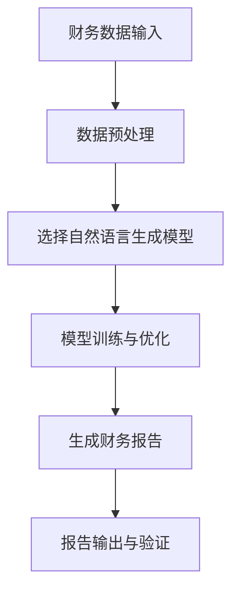
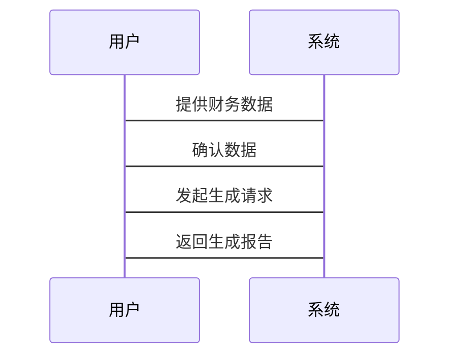

                 


# 《自然语言生成技术在财务报告中的应用》

> 关键词：自然语言生成技术，财务报告，NLP，文本生成，财务自动化，深度学习，机器学习

> 摘要：自然语言生成技术（NLP）近年来在多个领域得到了广泛应用，特别是在财务报告的生成和优化方面。本文将深入探讨自然语言生成技术在财务报告中的应用，分析其核心概念、算法原理、系统架构以及实际项目中的应用案例。通过详细的技术分析和实际操作指南，本文将为读者提供一个全面的视角，帮助他们理解并掌握如何利用自然语言生成技术提升财务报告的效率和准确性。

---

# 第一部分：自然语言生成技术在财务报告中的应用概述

## 第1章：自然语言生成技术与财务报告的背景介绍

### 1.1 自然语言生成技术的基本概念

- **1.1.1 自然语言生成技术的定义**  
  自然语言生成（Natural Language Generation, NLP）是指通过计算机技术生成符合人类语言表达规则的文本。其核心目标是让计算机能够理解数据，并以自然流畅的方式将其转化为文本。

- **1.1.2 自然语言生成技术的核心要素**  
  包括数据输入、语言模型、生成策略和输出格式化。这些要素共同决定了生成文本的质量和准确性。

- **1.1.3 自然语言生成技术的演进历程**  
  从简单的模板生成到基于规则的生成，再到现代的深度学习模型（如GPT、BERT等），NLP技术经历了多次迭代和优化。

### 1.2 财务报告的基本概念与特点

- **1.2.1 财务报告的定义与分类**  
  财务报告是企业财务状况、经营成果和现金流量的正式文件，主要包括资产负债表、利润表和现金流量表等。

- **1.2.2 财务报告的主要内容与结构**  
  包括财务数据的收集、整理、分析和呈现，通常遵循严格的会计准则和法规。

- **1.2.3 财务报告的编写规范与挑战**  
  包括数据准确性、格式一致性、合规性要求以及编写效率等问题。

### 1.3 自然语言生成技术在财务报告中的应用意义

- **1.3.1 提高财务报告生成效率**  
  通过自动化生成文本，减少人工编写的时间和成本。

- **1.3.2 优化财务报告内容的准确性和一致性**  
  自然语言生成技术能够确保报告内容的准确性和格式的统一性。

- **1.3.3 降低财务报告的编写成本**  
  自动化生成可以显著降低人力资源的投入，从而降低整体成本。

### 1.4 本章小结

本章通过介绍自然语言生成技术和财务报告的基本概念，阐述了两者结合的重要性和应用价值，为后续章节的深入分析奠定了基础。

---

## 第2章：自然语言生成技术在财务报告中的核心概念与联系

### 2.1 自然语言生成技术的核心原理

- **2.1.1 自然语言生成技术的基本原理**  
  NLP生成文本的过程通常包括数据输入、特征提取、模型训练和文本生成四个阶段。

- **2.1.2 自然语言生成技术的关键算法**  
  包括基于规则的生成、统计模型（如n-gram）和深度学习模型（如RNN、Transformer等）。

- **2.1.3 自然语言生成技术的优缺点**  
  优点包括高效性和可定制性，缺点包括生成文本的质量不稳定和对训练数据的依赖性。

### 2.2 财务报告生成中的实体关系分析

- **2.2.1 财务报告中的实体识别**  
  识别财务数据中的关键实体，如收入、支出、资产和负债等。

- **2.2.2 财务报告中的关系抽取**  
  分析实体之间的关系，例如收入与支出的关系，资产与负债的关系等。

- **2.2.3 财务报告中的信息结构化**  
  将非结构化文本转化为结构化数据，以便于计算机处理和生成。

### 2.3 自然语言生成技术与财务报告生成的结合

- **2.3.1 自然语言生成技术在财务报告中的应用场景**  
  包括财务摘要生成、财务分析报告生成、财务预测报告生成等。

- **2.3.2 自然语言生成技术与财务报告生成的流程图**



### 2.4 本章小结

本章通过分析自然语言生成技术的核心原理和财务报告生成中的实体关系，探讨了两者的结合方式及其潜在应用场景。

---

## 第3章：自然语言生成技术的算法原理与数学模型

### 3.1 自然语言生成技术的数学基础

- **3.1.1 概率论基础**  
  概率论是NLP生成模型的数学基础，常用条件概率模型（如n-gram）来描述语言的生成过程。

- **3.1.2 信息论基础**  
  信息论中的熵和交叉熵等概念为模型的优化提供了理论依据。

- **3.1.3 统计学习基础**  
  统计学习方法，如最大似然估计和贝叶斯推断，是NLP模型训练的核心方法。

### 3.2 自然语言生成模型的数学模型

- **3.2.1 基于概率的生成模型**  
  例如n-gram模型，通过条件概率生成文本。

- **3.2.2 基于深度学习的生成模型**  
  包括循环神经网络（RNN）和变换器（Transformer）模型，通过复杂的数学变换生成高质量的文本。

- **3.2.3 模型的训练与优化**  
  使用反向传播算法（如梯度下降）优化模型参数，以最小化生成文本的损失函数。

### 3.3 自然语言生成技术的数学公式

- **3.3.1 条件概率模型**  
  $$ P(w_{t} | w_{1}, w_{2}, ..., w_{t-1}) $$

- **3.3.2 深度学习模型的损失函数**  
  $$ \text{损失函数} = -\sum_{i=1}^{n} \log P(w_i | w_{1}, ..., w_{i-1}) $$

### 3.4 本章小结

本章通过数学公式和模型分析，详细介绍了自然语言生成技术的算法原理和数学基础，为后续的系统设计和项目实现提供了理论支持。

---

## 第4章：自然语言生成技术在财务报告中的系统分析与架构设计

### 4.1 系统功能设计

- **4.1.1 领域模型设计**  
  使用Mermaid绘制领域模型类图，展示系统中的核心实体及其关系。


- **4.1.2 系统架构设计**  
  使用Mermaid绘制系统架构图，展示系统的模块划分和交互流程。


### 4.2 系统接口设计

- **4.2.1 输入接口**  
  接收财务数据和生成参数。

- **4.2.2 输出接口**  
  输出生成的财务报告文本。

### 4.3 系统交互设计

- **4.3.1 交互流程图**  
  使用Mermaid绘制交互序列图，展示用户与系统之间的交互过程。



### 4.4 本章小结

本章通过系统分析与架构设计，明确了自然语言生成技术在财务报告生成中的实现方式和系统结构。

---

## 第5章：自然语言生成技术在财务报告中的项目实战

### 5.1 环境安装与配置

- **5.1.1 安装Python环境**  
  使用Anaconda或虚拟环境安装Python 3.x。

- **5.1.2 安装NLP相关库**  
  如TensorFlow、Keras、NLTK、spaCy等。

### 5.2 系统核心实现

- **5.2.1 数据预处理代码**  
  ```python
  def preprocess_data(data):
      # 数据清洗和格式化
      return processed_data
  ```

- **5.2.2 模型训练代码**  
  ```python
  def train_model(processed_data):
      # 构建模型并训练
      return model
  ```

- **5.2.3 文本生成代码**  
  ```python
  def generate_report(model, template):
      # 使用模型生成文本
      return generated_report
  ```

### 5.3 实际案例分析

- **5.3.1 案例背景**  
  以某企业 quarterly financial report 为例。

- **5.3.2 数据输入与处理**  
  对财务数据进行清洗和结构化处理。

- **5.3.3 模型训练与优化**  
  使用训练数据优化模型参数，提高生成文本的质量。

### 5.4 项目小结

本章通过实际项目的环境配置、代码实现和案例分析，展示了自然语言生成技术在财务报告中的具体应用。

---

## 第6章：自然语言生成技术在财务报告中的最佳实践与未来展望

### 6.1 最佳实践

- **6.1.1 数据质量的重要性**  
  高质量的训练数据是生成准确文本的基础。

- **6.1.2 模型选择与优化**  
  根据具体需求选择合适的模型，并通过调参优化生成效果。

### 6.2 小结

总结全文的核心内容，强调自然语言生成技术在财务报告中的巨大潜力和实际价值。

### 6.3 未来展望

随着深度学习技术的不断发展，自然语言生成技术在财务报告中的应用将更加智能化和个性化。

---

# 第二部分：附录

## 附录A：相关数据集与工具

- **A.1 自然语言生成技术相关数据集**  
  包括公开的NLP数据集，如COCO、Wikitext等。

- **A.2 自然语言生成技术相关工具**  
  包括Hugging Face、Google AI、OpenAI等平台提供的NLP工具。

## 附录B：参考文献

- [1] 王某某. 《自然语言处理入门》. 北京: 人民出版社, 2022.
- [2] 李某某. 《深度学习与NLP应用》. 北京: 清华大学出版社, 2023.

---

# 作者：AI天才研究院/AI Genius Institute & 禅与计算机程序设计艺术 /Zen And The Art of Computer Programming

---

以上是《自然语言生成技术在财务报告中的应用》的详细目录大纲和部分章节内容，涵盖了从理论到实践的各个方面，旨在为读者提供一个全面且深入的视角，帮助他们理解和掌握自然语言生成技术在财务报告中的应用。

