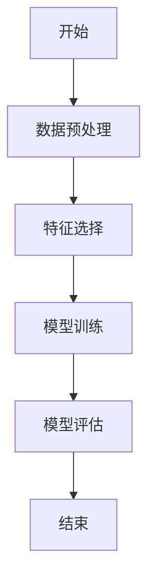
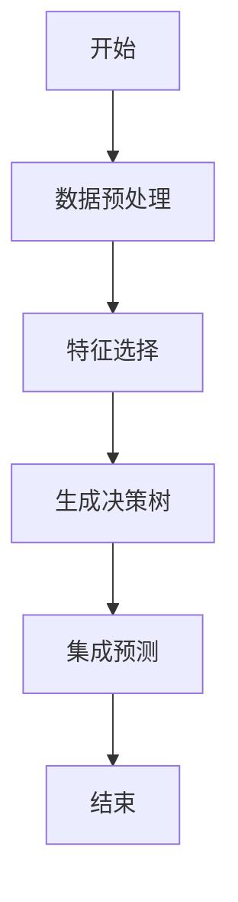
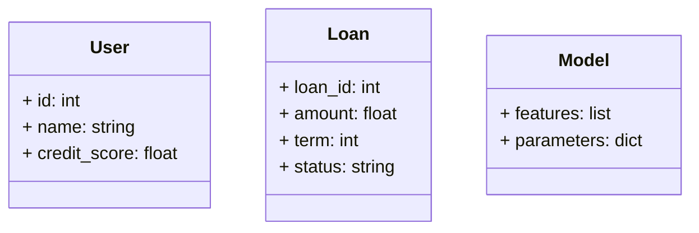
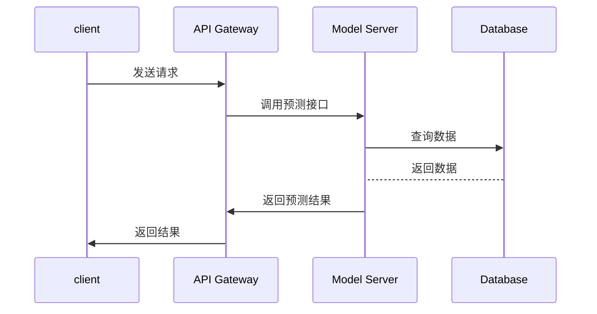

                 


# 设计智能化的企业信用违约损失率预测模型

> **关键词**：信用违约、损失率预测、机器学习、随机森林、逻辑回归、人工智能

> **摘要**：本文详细探讨了设计智能化的企业信用违约损失率预测模型的关键步骤与技术实现。通过背景分析、算法原理、系统架构设计和项目实战，结合逻辑回归和随机森林算法，构建了一个高效准确的预测模型。文章还提供了系统的实现代码和实际案例分析，帮助读者全面掌握该模型的设计与应用。

---

## 正文

### 第一部分: 背景介绍

#### 第1章: 企业信用违约损失率预测的背景与挑战

##### 1.1 信用违约的基本概念

- **1.1.1 信用违约的定义**
  信用违约是指借款人未能按照合同约定偿还贷款本金或利息的情况。它是企业信用风险管理中的核心问题之一。

- **1.1.2 信用违约的分类**
  信用违约可以分为单户违约和系统性违约。单户违约是指单一借款人违约，而系统性违约则是由于宏观经济因素导致的多个借款人同时违约。

- **1.1.3 信用违约的衡量指标**
  常见的信用违约衡量指标包括违约概率（PD）、违约损失率（LGD）和违约风险敞口（EAD）。

##### 1.2 信用违约损失率预测的重要性

- **1.2.1 信用风险对企业的影响**
  信用违约可能导致银行或金融机构的资产损失，影响其财务健康和市场信誉。

- **1.2.2 损失率预测在信用风险管理中的作用**
  损失率预测可以帮助金融机构评估和量化信用风险，制定合理的风险 mitigation 策略。

- **1.2.3 智能化预测的优势与必要性**
  随着数据量的增加和复杂性提升，传统的统计模型难以满足需求。智能化预测模型（如机器学习算法）能够处理非线性关系，提高预测精度。

##### 1.3 传统信用违约损失率预测的局限性

- **1.3.1 传统方法的概述**
  传统方法包括线性回归、KMV模型等，这些方法在处理复杂数据时表现有限。

- **1.3.2 传统方法的局限性**
  传统方法难以捕捉复杂的非线性关系，且对异常值和数据缺失的处理能力较弱。

- **1.3.3 智能化预测的必要性**
  随着大数据和人工智能技术的发展，智能化预测模型能够更好地应对复杂的信用违约问题。

##### 1.4 问题背景与目标

- **1.4.1 问题背景的描述**
  随着全球经济的波动，企业信用违约风险日益增加，传统的损失率预测方法已无法满足需求。

- **1.4.2 问题解决的目标**
  构建一个智能化的信用违约损失率预测模型，提高预测精度和效率。

- **1.4.3 边界与外延**
  本文仅关注企业信用违约损失率的预测，不涉及信用评级和违约后的 recovery 策略。

- **1.4.4 核心要素组成**
  模型的核心要素包括借款人特征、贷款特征和宏观经济因素。

---

### 第二部分: 核心概念与联系

#### 第2章: 违约风险的核心概念与模型

##### 2.1 违约风险的核心要素

- **2.1.1 借款人特征**
  包括借款人的信用历史、收入水平、资产负债率等。

- **2.1.2 贷款特征**
  包括贷款金额、贷款期限、担保方式等。

- **2.1.3 宏观经济因素**
  包括GDP增长率、利率水平、通货膨胀率等。

##### 2.2 违约风险模型的构建要素

- **2.2.1 数据来源与处理**
  数据来源包括企业财务数据、行业数据和宏观经济数据。数据处理包括数据清洗、特征提取和数据增强。

- **2.2.2 模型选择与优化**
  需要选择合适的算法（如逻辑回归、随机森林）并进行参数调优。

- **2.2.3 模型评估与验证**
  使用交叉验证和ROC曲线评估模型性能。

##### 2.3 核心概念的ER实体关系图

```mermaid
er
actor: User
action: Define ER diagram for credit default prediction model
end
```

---

### 第三部分: 算法原理讲解

#### 第3章: 信用违约损失率预测的算法原理

##### 3.1 逻辑回归算法

- **3.1.1 算法原理**
  逻辑回归是一种常用的分类算法，适用于二分类问题。其核心思想是通过sigmoid函数将线性回归的结果映射到概率空间。

- **3.1.2 算法流程图**



- **3.1.3 逻辑回归公式**

$$ P(y=1|x) = \frac{1}{1 + e^{-(\beta_0 + \beta_1x_1 + ... + \beta_nx_n)}} $$

##### 3.2 随机森林算法

- **3.2.1 算法原理**
  随机森林是一种基于决策树的集成算法，通过构建多棵决策树并取其平均，提高模型的准确性和鲁棒性。

- **3.2.2 算法流程图**



---

### 第四部分: 系统分析与架构设计

#### 第4章: 系统架构与实现

##### 4.1 问题场景介绍

- **4.1.1 问题场景**
  针对企业信用违约损失率预测，系统需要处理海量数据，并提供实时预测功能。

##### 4.2 项目介绍

- **4.2.1 项目目标**
  构建一个智能化的企业信用违约损失率预测系统。

##### 4.3 系统功能设计

- **4.3.1 领域模型类图**



- **4.3.2 系统架构设计**


- **4.3.3 系统接口设计**



---

### 第五部分: 项目实战

#### 第5章: 项目实现与案例分析

##### 5.1 环境安装

- **5.1.1 安装Python环境**
  使用Anaconda安装Python 3.8以上版本。

- **5.1.2 安装依赖库**
  使用pip安装numpy、pandas、scikit-learn等库。

##### 5.2 系统核心实现源代码

- **5.2.1 数据预处理代码**

```python
import pandas as pd
from sklearn.preprocessing import StandardScaler

# 读取数据
data = pd.read_csv('credit_data.csv')

# 数据清洗
data.dropna(inplace=True)

# 特征选择
features = ['income', 'debt', 'credit_score']
target = 'default'

X = data[features]
y = data[target]

# 数据标准化
scaler = StandardScaler()
X_scaled = scaler.fit_transform(X)
```

- **5.2.2 模型训练代码**

```python
from sklearn.linear_model import LogisticRegression
from sklearn.ensemble import RandomForestClassifier
from sklearn.metrics import accuracy_score

# 训练逻辑回归模型
lr_model = LogisticRegression()
lr_model.fit(X_scaled, y)

# 训练随机森林模型
rf_model = RandomForestClassifier()
rf_model.fit(X_scaled, y)

# 模型评估
lr_pred = lr_model.predict(X_scaled)
rf_pred = rf_model.predict(X_scaled)

print("逻辑回归准确率:", accuracy_score(y, lr_pred))
print("随机森林准确率:", accuracy_score(y, rf_pred))
```

##### 5.3 案例分析与详细讲解

- **5.3.1 案例分析**
  以某银行的贷款数据为例，分析模型的预测效果。

- **5.3.2 模型优化**
  通过网格搜索优化模型参数，提高预测精度。

---

### 第六部分: 最佳实践

#### 第6章: 实践总结与建议

##### 6.1 小结

- 本文详细介绍了智能化的企业信用违约损失率预测模型的设计与实现过程，包括背景分析、算法选择、系统架构设计和项目实战。

##### 6.2 注意事项

- 数据预处理是模型训练的关键步骤，需注意数据的完整性和代表性。
- 模型选择应结合实际业务需求和数据特点，避免盲目使用复杂算法。

##### 6.3 拓展阅读

- 推荐阅读《机器学习实战》和《Python机器学习》等书籍，深入理解相关算法原理。

---

### 作者信息

**作者：AI天才研究院/AI Genius Institute & 禅与计算机程序设计艺术 /Zen And The Art of Computer Programming**

---

通过以上步骤，我们构建了一个智能化的企业信用违约损失率预测模型，结合逻辑回归和随机森林算法，提供了高效的解决方案。希望本文能为读者在信用风险管理领域的研究和实践提供有价值的参考。

