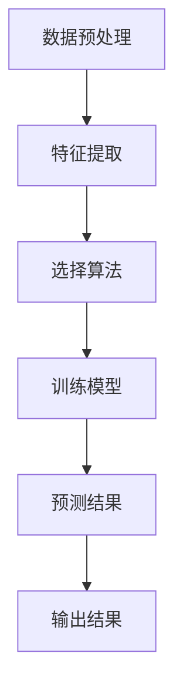
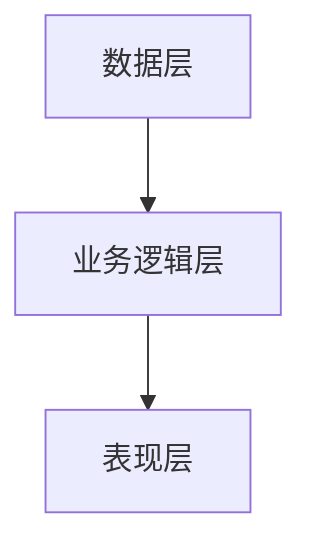

                 


# 设计智能化的企业财务异常交易检测系统

## 关键词
智能化、企业财务、异常交易检测、机器学习、大数据分析、系统设计

## 摘要
本文详细探讨了设计智能化的企业财务异常交易检测系统的背景、核心概念、算法原理、系统架构设计以及实际项目实现。通过结合大数据分析和机器学习技术，本文提出了一套高效准确的检测方案，旨在帮助企业及时发现和预防财务异常交易，保障企业财务健康。

---

## 第一部分：背景介绍

### 第1章：企业财务异常交易检测的背景与挑战

#### 1.1 问题背景

- **1.1.1 企业财务舞弊的现状**
  企业财务舞弊行为在全球范围内普遍存在，常见的形式包括虚增收入、虚减支出、关联交易舞弊等。这些行为不仅损害了企业的声誉，还可能引发法律风险和经济损失。

- **1.1.2 财务异常交易对企业的影响**
  财务异常交易可能导致企业资产质量下降、利润虚假、信用评级降低等问题，进而影响企业的融资能力和市场声誉。

- **1.1.3 传统财务检测方法的局限性**
  传统方法主要依赖人工审查，效率低、覆盖面窄，难以及时发现复杂的舞弊行为。

#### 1.2 问题描述

- **1.2.1 财务异常交易的定义**
  财务异常交易指在企业财务活动中，违反会计准则或法律法规，通过虚构、隐瞒、欺骗等手段，导致财务报表失真或误导的行为。

- **1.2.2 异常交易的主要类型**
  包括收入虚增、成本虚减、关联交易虚增、资产虚增等。

- **1.2.3 检测系统的目标与边界**
  目标是通过智能化技术，自动识别和预警财务异常交易；边界包括系统仅处理财务数据，不涉及其他业务领域。

#### 1.3 问题解决思路

- **1.3.1 引入智能化技术的必要性**
  利用机器学习、大数据分析等技术，提高检测效率和准确性。

- **1.3.2 数据驱动的检测方法**
  通过分析财务数据中的异常模式，发现潜在问题。

- **1.3.3 系统设计的总体思路**
  采用模块化设计，包括数据采集、预处理、特征提取、模型训练、结果输出等模块。

### 第2章：核心概念与联系

#### 2.1 核心概念原理

- **数据预处理**
  包括数据清洗、标准化、特征提取等步骤，确保数据质量。

- **异常检测算法**
  使用监督学习或无监督学习算法，识别异常交易。

- **系统架构设计**
  采用分层架构，包括数据层、业务逻辑层和表现层，确保系统可扩展性和维护性。

#### 2.2 概念属性特征对比表

| 概念       | 数据预处理 | 异常检测算法 | 系统架构设计 |
|------------|------------|--------------|---------------|
| 数据类型   | 结构化数据 | 结构化/非结构化数据 | 结构化数据 |
| 处理目标   | 清洗、标准化 | 识别异常 | 组织系统模块 |
| 输出结果   | 清洗后的数据 | 异常标签 | 系统架构图 |

#### 2.3 ER实体关系图

```mermaid
erDiagram
    customer[客户] {
        id : integer
        name : string
    }
    transaction[交易] {
        id : integer
        amount : float
        date : date
        customer_id : integer
    }
    anomaly_detection[异常检测] {
        id : integer
        transaction_id : integer
        is_anomaly : boolean
    }
    customer --> transaction : 发起
    transaction --> anomaly_detection : 检测
```

---

## 第三部分：算法原理讲解

### 第3章：算法原理讲解

#### 3.1 算法流程图



#### 3.2 算法实现代码

```python
from sklearn.ensemble import IsolationForest
import pandas as pd
import numpy as np

# 数据预处理
data = pd.read_csv('transactions.csv')
data = data.dropna()
data = pd.get_dummies(data)

# 特征提取
features = data[['amount', 'date', 'customer_id']]

# 训练模型
model = IsolationForest(n_estimators=100, contamination=0.1)
model.fit(features)

# 预测结果
pred = model.predict(features)
```

#### 3.3 数学公式

随机森林的数学模型可以用以下公式表示：

$$
y = \sum_{i=1}^{n} (w_i \cdot x_i) + b
$$

其中，\( w_i \) 是权重，\( x_i \) 是特征，\( b \) 是偏置项。

---

## 第四部分：系统分析与架构设计

### 第4章：系统分析

#### 4.1 问题场景介绍

描述常见的财务异常场景，如收入虚增、成本虚减等。

#### 4.2 系统功能设计

采用领域模型，展示系统的主要功能模块及其交互。

### 第5章：架构设计

#### 5.1 系统架构图

展示分层架构，包括数据层、业务逻辑层和表现层。



#### 5.2 接口设计

定义系统接口，如数据输入接口、模型训练接口等。

### 第6章：交互设计

#### 6.1 交互流程图

展示用户与系统之间的交互流程。

---

## 第五部分：项目实战

### 第7章：环境安装与配置

指导读者安装必要的库，如Python、机器学习库等。

### 第8章：系统实现

详细讲解系统核心功能的实现，包括数据预处理、模型训练等。

### 第9章：案例分析

通过具体案例，展示系统如何检测异常交易。

---

## 第六部分：最佳实践

### 第10章：小结与注意事项

总结项目内容，提醒读者注意数据隐私、模型调优等问题。

### 第11章：拓展阅读

推荐相关书籍和资源，供读者深入学习。

---

## 作者

作者：AI天才研究院/AI Genius Institute & 禅与计算机程序设计艺术 /Zen And The Art of Computer Programming

