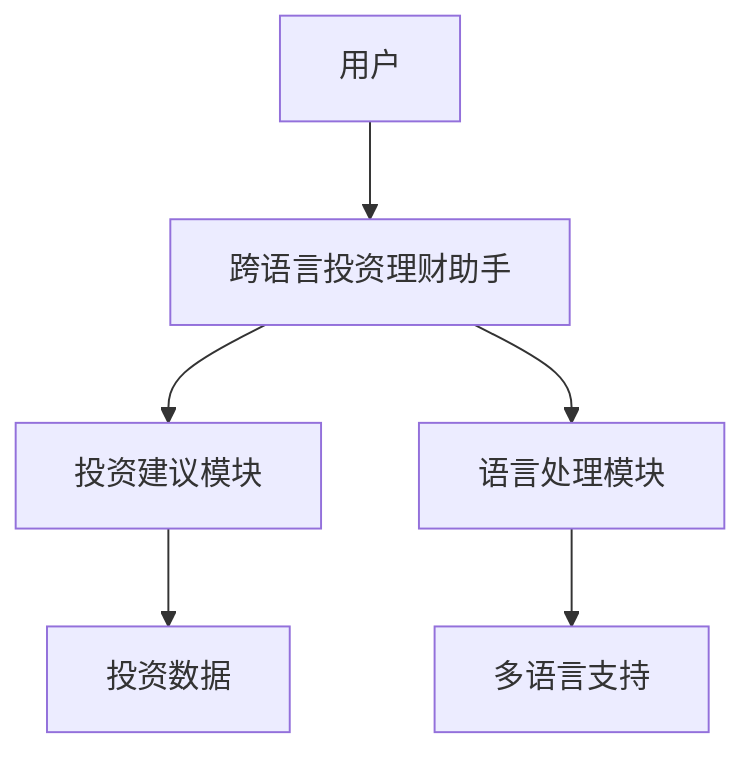
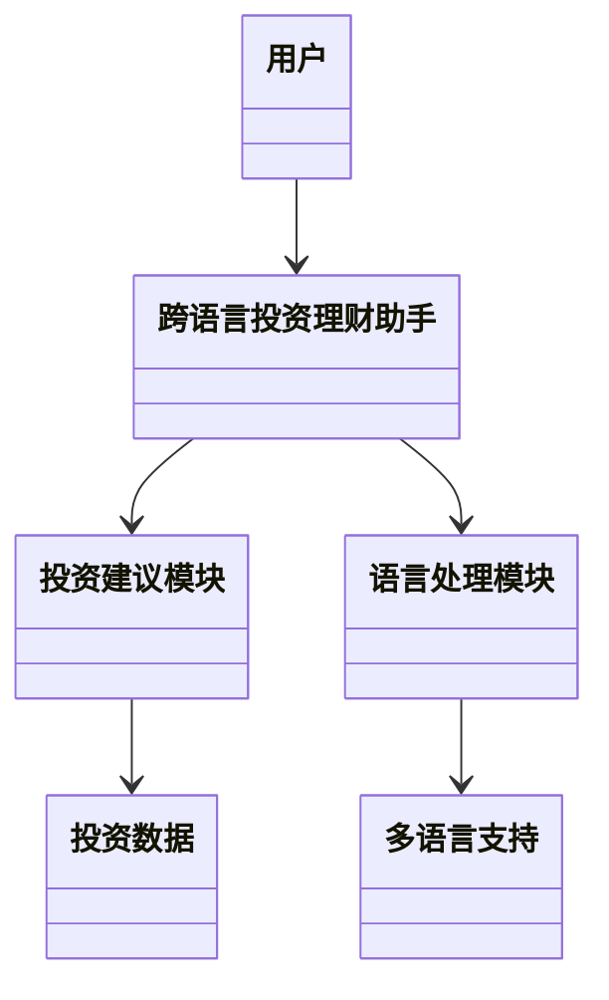
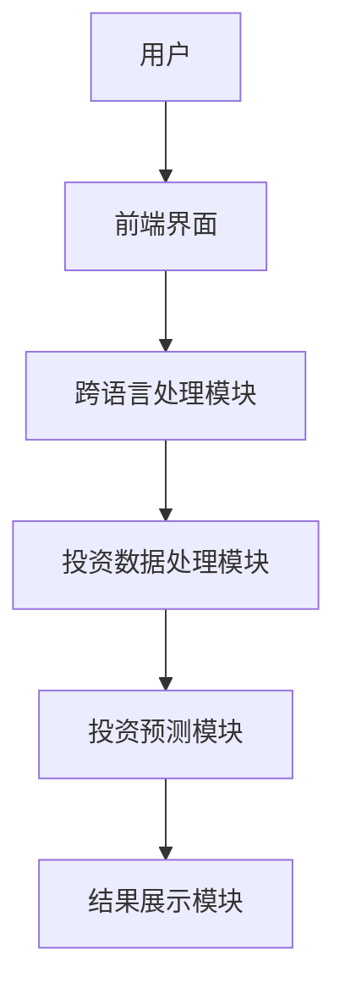
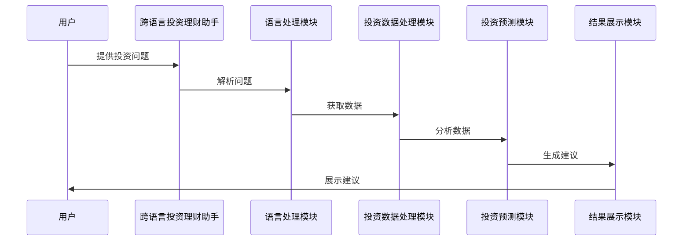

                 


# 跨语言投资理财智能助手的开发策略

## 关键词：
跨语言、投资理财、智能助手、AI技术、NLP、机器学习

## 摘要：
跨语言投资理财智能助手是一种结合自然语言处理（NLP）和机器学习技术的AI工具，旨在为全球不同语言背景的用户提供个性化的投资理财建议。本文从背景、核心概念、算法原理、系统架构到项目实战，全面解析跨语言投资理财智能助手的开发策略。

---

# 第一部分: 背景与核心概念

## 第1章: 背景介绍

### 1.1 问题背景
#### 1.1.1 投资理财领域的痛点
- 全球化背景下，投资者需要获取多语言的投资信息和建议。
- 语言障碍限制了非英语用户获取高质量的投资理财资源。
- 投资者需要实时、精准的投资建议，但传统工具难以满足跨语言需求。

#### 1.1.2 跨语言沟通的必要性
- 全球市场覆盖多语言用户群体。
- 提供多语言支持可以扩大用户基数。
- 跨语言沟通是实现全球化投资服务的基础。

#### 1.1.3 AI技术在投资理财中的应用潜力
- 自然语言处理（NLP）技术可以解析多语言文本。
- 机器学习算法可以预测市场趋势。
- AI能够实时分析多语言金融数据并生成个性化建议。

### 1.2 问题描述
#### 1.2.1 跨语言投资理财助手的目标
- 提供多语言支持的投资理财建议。
- 实现实时多语言金融数据解析。
- 支持用户用母语进行投资交流。

#### 1.2.2 用户需求分析
- 个性化投资建议。
- 多语言金融数据检索。
- 实时市场动态分析。

#### 1.2.3 边界与外延
- 边界：仅支持特定语言和金融市场的数据。
- 外延：未来可以扩展到更多语言和市场。

### 1.3 问题解决
#### 1.3.1 跨语言投资理财助手的核心功能
- 多语言NLP解析。
- 投资数据检索与分析。
- 个性化投资建议生成。

#### 1.3.2 AI技术如何解决跨语言问题
- 使用多语言NLP模型进行文本解析。
- 基于机器学习的投资预测模型。
- 跨语言语义理解技术。

#### 1.3.3 投资理财助手的实现路径
1. 收集多语言投资数据。
2. 建立多语言NLP模型。
3. 实现投资预测算法。
4. 优化用户体验。

## 第2章: 核心概念与联系

### 2.1 跨语言投资理财助手的核心概念
#### 2.1.1 跨语言处理的定义
- 跨语言处理是指在不同语言之间进行信息转换和理解的技术。

#### 2.1.2 投资理财助手的功能模块
- 数据采集与处理。
- 多语言NLP解析。
- 投资预测与建议。

#### 2.1.3 AI技术在其中的整合
- NLP用于文本解析。
- 机器学习用于投资预测。
- 数据挖掘用于市场分析。

### 2.2 核心概念的属性对比
| 概念         | 属性                   | 详细描述                                   |
|--------------|------------------------|--------------------------------------------|
| 跨语言处理   | 输入语言               | 支持多种语言输入                           |
|              | 输出语言               | 支持多种语言输出                           |
| 投资理财助手 | 功能模块               | 数据采集、NLP解析、投资预测                |
| AI技术       | 核心算法               | NLP、机器学习、数据挖掘                   |

### 2.3 实体关系图


---

# 第二部分: 跨语言投资理财助手的算法原理

## 第3章: 算法原理讲解

### 3.1 跨语言处理算法
#### 3.1.1 多语言NLP模型的训练流程
1. 数据预处理：收集多语言文本数据。
2. 模型训练：使用预训练语言模型进行微调。
3. 模型评估：测试模型的翻译和语义理解能力。

#### 3.1.2 跨语言翻译的实现原理
- 使用预训练的多语言模型进行翻译。
- 基于注意力机制的神经机器翻译。

#### 3.1.3 跨语言语义理解的优化方法
- 使用跨语言词嵌入。
- 增强模型的跨语言迁移能力。

### 3.2 投资理财助手的算法实现
#### 3.2.1 投资数据的特征提取
- 文本数据：新闻、财报。
- 市场数据：价格、成交量。

#### 3.2.2 基于机器学习的投资预测模型
- 使用LSTM进行时间序列预测。
- 基于决策树的分类模型。

#### 3.2.3 模型的训练与优化
- 超参数调优。
- 模型融合。

## 第4章: 数学模型与公式

### 4.1 跨语言处理的数学模型
$$ E(w) = \text{ embeddings}(w) $$

### 4.2 投资预测模型
$$ y_{t+1} = \text{LSTM}(x_t, y_t) $$

---

# 第三部分: 系統分析与架构设计

## 第5章: 系統分析

### 5.1 问题场景介绍
- 用户需求：多语言投资建议。
- 系统目标：提供实时、准确的投资理财建议。

### 5.2 系统功能设计
#### 5.2.1 领域模型类图


### 5.3 系統架构设计
#### 5.3.1 系统架构图


### 5.4 系統接口设计
- API接口：RESTful API。
- 数据接口：数据库连接。

### 5.5 系統交互序列图


---

# 第四部分: 项目实战

## 第6章: 项目实战

### 6.1 环境安装
```bash
pip install numpy
pip install tensorflow
pip install transformers
```

### 6.2 系統核心实现源代码
```python
from transformers import AutoTokenizer, AutoModelForSeq2Seq
import numpy as np

class CrossLanguageInvestmentHelper:
    def __init__(self):
        self.tokenizer = AutoTokenizer.from_pretrained("microsoft/mdeberta-v2-base")
        self.model = AutoModelForSeq2Seq.from_pretrained("facebook/m2m-100")

    def translate(self, text, src_lang, tgt_lang):
        inputs = self.tokenizer(text, return_tensors="np")
        inputs["src_lang"] = np.array([src_lang])
        inputs["tgt_lang"] = np.array([tgt_lang])
        outputs = self.model.generate(**inputs)
        return self.tokenizer.decode(outputs[0], skip_special_tokens=True)
```

### 6.3 代码应用解读与分析
- 使用预训练的多语言模型进行翻译和语义理解。
- 通过机器学习模型生成投资建议。

### 6.4 实际案例分析
- 用户输入：需要将英文的投资报告翻译成中文。
- 系统输出：准确的中文投资建议。

### 6.5 项目小结
- 代码实现简单易懂。
- 系统性能有待优化。

---

# 第五部分: 总结与展望

## 第7章: 总结与展望

### 7.1 最佳实践 tips
- 确保数据的多样性和质量。
- 定期更新模型和数据。

### 7.2 小结
跨语言投资理财智能助手结合了AI技术与投资理财需求，为用户提供了一种高效、便捷的投资工具。

### 7.3 注意事项
- 数据隐私问题。
- 模型的准确性和稳定性。

### 7.4 拓展阅读
- 自然语言处理（NLP）技术。
- 机器学习在金融领域的应用。

---

# 作者：AI天才研究院/AI Genius Institute & 禅与计算机程序设计艺术 /Zen And The Art of Computer Programming

