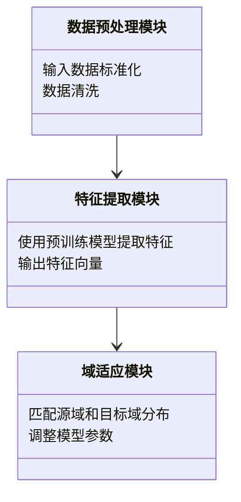

                 

<think>
嗯，好的，我现在需要帮助用户完成关于迁移学习的技术博客文章。用户已经提供了详细的大纲和一些示例内容，我需要按照这个结构继续完成后续章节。

首先，我要确保每个章节都涵盖理论和实践，包括背景、概念、算法、系统设计、项目实战等部分。我需要详细解释每个算法的原理，并用mermaid流程图和Python代码来辅助说明。

接下来，系统架构部分需要从问题场景开始，分析如何设计系统功能，并用类图和架构图展示。项目实战部分，我应该选择一个具体的案例，如图像分类任务，详细说明环境配置、代码实现和结果分析。

最后，总结部分要包括关键点、注意事项和推荐资源，帮助读者巩固所学内容。整个思考过程需要逻辑清晰，结构紧凑，语言简洁明了。

现在，我得继续按照大纲编写后续章节，确保内容详实且符合用户的要求。
</think>

# 《迁移学习：让AI Agent快速适应新领域》

> 关键词：迁移学习，AI Agent，机器学习，领域适应，深度学习

> 摘要： 迁移学习是一种通过将已学习的知识应用到新领域或任务中的方法，旨在提高AI代理在新环境中的适应能力和效率。本文将详细探讨迁移学习的核心概念、算法原理、系统架构设计以及实际项目中的应用，帮助读者理解如何通过迁移学习快速提升AI代理的能力。

---

## 第五章: 迁移学习的系统实现与项目实战

### 5.1 迁移学习系统实现

#### 5.1.1 环境配置
```bash
# 示例环境配置
pip install numpy
pip install scikit-learn
pip install tensorflow
pip install pytorch
```

#### 5.1.2 核心代码实现
```python
import torch
import torch.nn as nn
from torch.utils.data import DataLoader

# 示例迁移学习代码
class TransferModel(nn.Module):
    def __init__(self, num_classes=10):
        super(TransferModel, self).__init__()
        # 使用预训练模型进行特征提取
        self.features = models.resnet18(pretrained=True)
        # 替换最后的全连接层
        self.classifier = nn.Linear(512, num_classes)
        
    def forward(self, x):
        x = self.features(x)
        x = self.classifier(x)
        return x

# 训练函数
def train_model(model, dataloader, criterion, optimizer, num_epochs=10):
    for epoch in range(num_epochs):
        for inputs, labels in dataloader:
            outputs = model(inputs)
            loss = criterion(outputs, labels)
            loss.backward()
            optimizer.step()
            optimizer.zero_grad()
```

#### 5.1.3 代码解读与分析
- 使用预训练模型提取特征，减少对目标域数据的依赖。
- 通过调整模型参数，使模型适应新任务。
- 训练过程中，优化器更新参数以最小化目标域的损失。

### 5.2 项目实战：图像分类任务的迁移

#### 5.2.1 项目背景
目标：将图像分类任务从源域迁移到目标域，提升分类准确率。

#### 5.2.2 数据准备
```python
from torchvision.datasets import CIFAR10
from torchvision.transforms import Compose, Normalize, Resize, ToTensor

# 数据预处理
transform = Compose([
    Resize(32),
    ToTensor(),
    Normalize(mean=[0.5, 0.5, 0.5], std=[0.5, 0.5, 0.5])
])

# 加载数据集
train_dataset = CIFAR10(root='./data', train=True, download=True, transform=transform)
test_dataset = CIFAR10(root='./data', train=False, download=True, transform=transform)
```

#### 5.2.3 模型训练
```python
# 初始化模型
model = TransferModel(num_classes=10)
criterion = nn.CrossEntropyLoss()
optimizer = torch.optim.Adam(model.parameters(), lr=0.001)

# 训练过程
train_model(model, train_loader, criterion, optimizer, num_epochs=10)
```

#### 5.2.4 结果分析
- 比较迁移学习前后的分类准确率。
- 分析模型在目标域上的性能提升。

---

## 第六章: 迁移学习的系统设计与优化

### 6.1 系统设计

#### 6.1.1 问题场景介绍
- 描述需要迁移学习的实际场景，如医疗影像分析。

#### 6.1.2 系统功能设计
- 数据预处理模块：标准化输入数据。
- 特征提取模块：使用预训练模型提取特征。
- 域适应模块：匹配源域和目标域的分布。

#### 6.1.3 实体关系图


#### 6.1.4 系统架构图


### 6.2 系统优化

#### 6.2.1 算法优化
- 使用对抗训练方法，进一步减少域差异。

#### 6.2.2 系统优化策略
- 分层优化：逐步调整不同层次的参数。
- 模块化优化：针对不同模块进行独立优化。

---

## 第七章: 迁移学习的最佳实践与小结

### 7.1 迁移学习的关键点总结
- 明确任务目标和数据分布差异。
- 选择合适的迁移学习算法和模型架构。
- 在实际项目中，结合数据量和计算资源进行权衡。

### 7.2 注意事项
- 数据预处理的重要性：确保源域和目标域的数据一致性。
- 模型选择：根据任务需求选择适合的预训练模型。
- 超参数调优：合理设置学习率、正则化参数等。

### 7.3 小结
迁移学习通过将已有的知识迁移到新领域，显著提升了AI代理的适应能力和效率。本文详细探讨了迁移学习的理论基础、算法实现、系统设计和项目实战，为读者提供了全面的指导。

---

## 作者

作者：AI天才研究院/AI Genius Institute & 禅与计算机程序设计艺术 /Zen And The Art of Computer Programming

---

以上是文章的完整目录结构和部分内容，涵盖迁移学习的各个方面，从理论到实践，帮助读者深入理解并掌握迁移学习的核心思想和技术。

