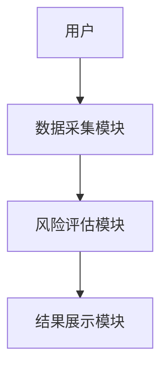

                 


# 金融产品创新风险评估框架

**关键词：**金融创新、风险评估、系统性风险、非系统性风险、VaR、CVaR、金融建模

**摘要：**  
本文构建了一个系统化的金融产品创新风险评估框架，旨在帮助金融机构在创新过程中有效识别、量化和管理风险。通过分析金融创新的核心概念、风险类型、评估方法和系统架构，本文提出了一种结合理论与实践的解决方案，并通过实际案例展示了框架的应用过程。

---

# 第一部分: 金融产品创新风险评估框架的背景与概念

## 第1章: 金融产品创新与风险概述

### 1.1 金融创新的背景与意义

#### 1.1.1 金融创新的定义与特征
金融创新是指在金融市场中引入新的金融工具、产品、服务或交易机制的过程。其主要特征包括：
- **创新性**：突破传统金融产品和服务的模式。
- **复杂性**：新型金融产品往往涉及复杂的数学模型和交易结构。
- **目的性**：旨在满足特定市场需求或优化金融市场效率。

#### 1.1.2 金融创新的驱动力
- **市场需求**：客户对个性化、多样化的金融服务需求。
- **技术进步**：大数据、人工智能等技术推动金融创新。
- **监管环境**：监管政策的变化影响金融机构的创新方向。

#### 1.1.3 金融创新对金融市场的意义
- 提高市场效率。
- 丰富投资者选择。
- 优化资源配置。

### 1.2 风险评估的基本概念

#### 1.2.1 风险的定义与分类
- **市场风险**：由于市场波动导致的损失。
- **信用风险**：由于债务人违约导致的损失。
- **操作风险**：由于操作失误或内部欺诈导致的损失。
- **流动性风险**：无法及时以合理价格买卖资产的风险。

#### 1.2.2 金融风险的主要类型
- **系统性风险**：影响整个市场的风险（如经济衰退）。
- **非系统性风险**：影响单个资产或机构的风险（如公司违约）。

#### 1.2.3 风险评估的重要性
- 保护投资者利益。
- 维护金融机构的稳健运行。
- 促进金融市场的稳定发展。

### 1.3 金融产品创新与风险的关系

#### 1.3.1 金融创新带来的潜在风险
- 创新可能引入新的市场风险。
- 复杂的金融产品可能增加操作风险。

#### 1.3.2 风险与收益的平衡
- 创新带来高收益的同时，也伴随着高风险。

#### 1.3.3 金融创新风险的系统性特征
- 创新可能导致系统性风险的放大。

### 1.4 本章小结
本章介绍了金融创新的基本概念、风险的分类及其对金融市场的意义，强调了金融产品创新与风险之间的复杂关系。

---

## 第2章: 金融产品创新风险的分类与特征

### 2.1 金融产品创新风险的分类

#### 2.1.1 市场风险
- 由市场波动引起的损失。
- 例如，股票价格波动导致的金融产品价值下降。

#### 2.1.2 信用风险
- 由于债务人违约导致的损失。
- 例如，创新型信贷产品可能因借款人违约而面临风险。

#### 2.1.3 操作风险
- 由于操作失误或内部欺诈导致的损失。
- 例如，新型金融产品的复杂性可能增加操作失误的风险。

#### 2.1.4 流动性风险
- 无法及时以合理价格买卖资产的风险。
- 例如，创新型金融产品可能因缺乏市场流动性而难以变现。

#### 2.1.5 法律与合规风险
- 由于法律法规变化或合规问题导致的损失。
- 例如，创新型金融产品可能因不符合监管要求而面临法律风险。

### 2.2 金融产品创新风险的特征分析

#### 2.2.1 风险的复杂性
- 创新产品可能涉及多方面的风险因素，且相互交织。

#### 2.2.2 风险的动态性
- 风险随市场环境变化而变化，具有动态特征。

#### 2.2.3 风险的系统性
- 创新可能引发系统性风险，影响整个金融体系。

### 2.3 金融产品创新风险的边界与外延

#### 2.3.1 风险的边界定义
- 金融创新风险的范围通常与金融产品的设计和运行环境相关。

#### 2.3.2 风险的外延分析
- 创新风险可能超出单个机构或市场的范围，影响整个金融系统。

#### 2.3.3 风险与收益的权衡
- 高风险的创新产品可能带来高收益，但也可能引发更大的风险。

### 2.4 本章小结
本章分析了金融产品创新风险的分类及其特征，强调了创新风险的复杂性和系统性。

---

## 第3章: 金融产品创新风险评估的理论基础

### 3.1 风险评估的核心概念与原理

#### 3.1.1 风险评估的基本原理
- 通过数学模型和统计方法量化风险。

#### 3.1.2 风险评估的理论基础
- 基于概率论和统计学的理论。

#### 3.1.3 风险评估的数学模型
- 使用VaR（Value at Risk）和CVaR（Conditional Value at Risk）等模型。

### 3.2 风险评估的数学模型与公式

#### 3.2.1 VaR模型
$$ VaR = \sigma \times z $$
其中，$\sigma$为标准差，$z$为对应置信水平的正态分布分位数。

#### 3.2.2 CVaR模型
$$ CVaR = \frac{1}{1-\alpha} \int_{\alpha}^{1} VaR \, dF $$
其中，$\alpha$为置信水平，$F$为分布函数。

### 3.3 风险评估的系统性分析

#### 3.3.1 风险的系统性特征
- 系统性风险可能通过金融网络传播，引发连锁反应。

#### 3.3.2 风险的相互作用
- 不同类型的金融创新风险可能相互作用，放大整体风险。

#### 3.3.3 风险的网络效应
- 金融创新可能通过复杂的金融网络引发系统性风险。

### 3.4 本章小结
本章介绍了金融产品创新风险评估的理论基础，重点讲解了VaR和CVaR模型，并分析了风险的系统性特征。

---

## 第4章: 金融产品创新风险评估的系统架构设计

### 4.1 系统架构设计概述

#### 4.1.1 系统架构的目标
- 实现金融产品创新风险的全面评估。

#### 4.1.2 系统架构的主要组成部分
- 数据采集模块、风险评估模块、结果展示模块。

#### 4.1.3 系统架构的设计原则
- 可扩展性、可维护性、高效性。

### 4.2 系统功能设计

#### 4.2.1 风险评估模块
- 负责计算VaR和CVaR值。

#### 4.2.2 数据采集模块
- 采集市场数据和产品信息。

#### 4.2.3 模型构建模块
- 构建风险评估模型。

#### 4.2.4 结果展示模块
- 可视化展示风险评估结果。

### 4.3 系统架构的mermaid图


### 4.4 本章小结
本章设计了金融产品创新风险评估的系统架构，包括数据采集、模型构建和结果展示模块。

---

## 第5章: 金融产品创新风险评估的算法原理与实现

### 5.1 风险评估算法原理

#### 5.1.1 VaR算法
- 使用历史模拟法或蒙特卡洛方法计算VaR值。

#### 5.1.2 CVaR算法
- 在VaR的基础上，计算超过VaR值的平均损失。

### 5.2 风险评估算法的实现

#### 5.2.1 算法流程
1. 数据采集与预处理。
2. 模型构建与参数估计。
3. 风险评估与结果展示。

#### 5.2.2 代码实现
```python
import numpy as np
from scipy.stats import norm

def calculate VaR(returns, confidence_level):
    sorted_returns = np.sort(returns)
    alpha_index = int(len(sorted_returns) * confidence_level)
    VaR = -sorted_returns[alpha_index]
    return VaR

def calculate CVaR(returns, confidence_level):
    sorted_returns = np.sort(returns)
    alpha_index = int(len(sorted_returns) * confidence_level)
    CVaR = -np.mean(sorted_returns[:alpha_index])
    return CVaR
```

### 5.3 本章小结
本章详细讲解了金融产品创新风险评估的算法原理，并通过Python代码实现了VaR和CVaR的计算。

---

## 第6章: 金融产品创新风险评估框架的实战应用

### 6.1 实战背景

#### 6.1.1 项目介绍
- 评估一款创新型金融产品的风险。

### 6.2 数据准备与处理

#### 6.2.1 数据来源
- 历史市场数据、产品设计参数。

#### 6.2.2 数据预处理
- 去除异常值、填充缺失值。

### 6.3 模型构建与评估

#### 6.3.1 模型构建
- 使用历史数据训练VaR和CVaR模型。

#### 6.3.2 模型评估
- 比较实际损失与模型预测结果。

### 6.4 实战案例分析

#### 6.4.1 案例分析
- 评估创新型金融产品的VaR和CVaR值。

#### 6.4.2 结果解读
- 分析模型预测结果的实际意义。

### 6.5 本章小结
本章通过实际案例展示了金融产品创新风险评估框架的应用过程。

---

## 第7章: 金融产品创新风险评估框架的最佳实践与小结

### 7.1 最佳实践

#### 7.1.1 数据质量的重要性
- 高质量数据是准确评估风险的基础。

#### 7.1.2 模型选择的合理性
- 根据具体情况选择合适的风险评估模型。

#### 7.1.3 持续监控的必要性
- 定期更新数据和模型，确保评估结果的有效性。

### 7.2 小结

#### 7.2.1 核心内容回顾
- 金融创新的基本概念。
- 风险评估的核心方法。
- 系统架构与算法设计。

#### 7.2.2 未来展望
- 结合人工智能技术进一步优化风险评估框架。

---

## 作者：AI天才研究院/AI Genius Institute & 禅与计算机程序设计艺术 /Zen And The Art of Computer Programming

