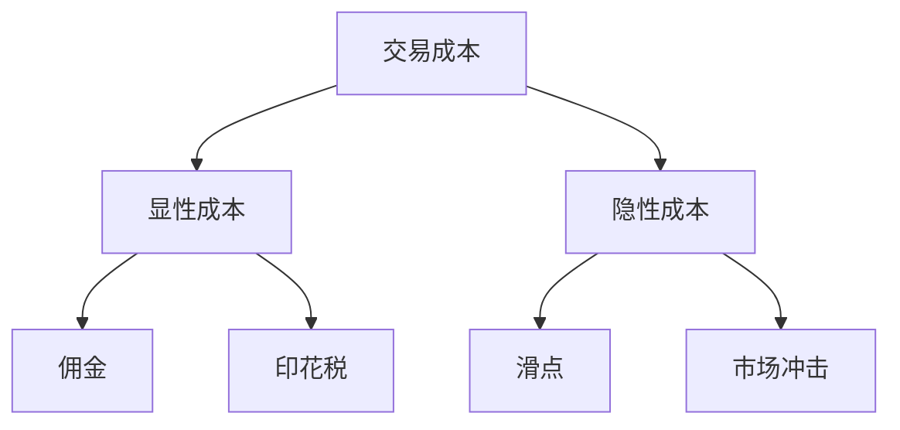
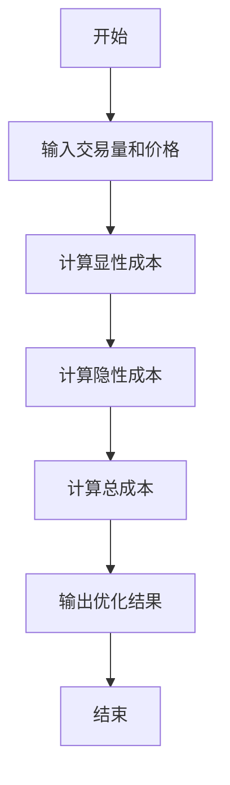
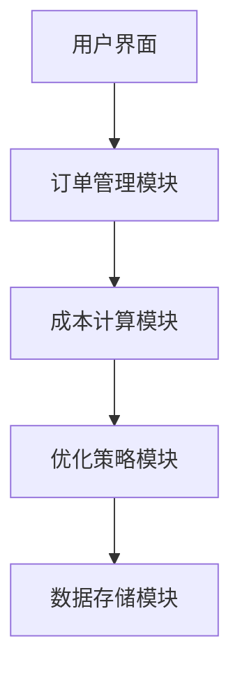

                 


# 金融市场交易成本分析与策略优化平台

> 关键词：金融市场、交易成本、策略优化、量化交易、算法优化、金融数据分析

> 摘要：本文将深入分析金融市场交易成本的构成、影响及优化策略，结合实际案例，探讨如何构建高效的交易成本分析与策略优化平台，为投资者提供科学的决策支持。

---

## 第1章: 金融市场交易成本分析概述

### 1.1 交易成本的基本概念

#### 1.1.1 交易成本的定义
交易成本是指在金融市场上进行证券交易时所产生的各种费用和损耗，包括显性成本（如佣金、印花税）和隐性成本（如滑点、市场冲击）。交易成本的高低直接影响投资收益。

#### 1.1.2 交易成本的分类
1. **显性成本**：可以直接量化的费用，如佣金、印花税等。
2. **隐性成本**：无法直接量化的成本，如滑点、市场冲击等。
3. **综合成本**：显性成本与隐性成本的总和。

#### 1.1.3 交易成本的影响因素
- 市场深度：市场深度越大，交易成本越低。
- 流动性：流动性越高，交易成本越低。
- 交易量：大额交易可能导致较大的市场冲击，增加交易成本。

### 1.2 金融市场交易成本的背景与问题

#### 1.2.1 金融市场交易的基本流程
1. 委托下单
2. 成交确认
3. 结算与交割

#### 1.2.2 交易成本在金融交易中的重要性
- 交易成本直接影响投资收益。
- 高额的交易成本可能导致投资亏损。

#### 1.2.3 降低交易成本的必要性
- 提高投资效率
- 增加投资收益
- 优化交易策略

### 1.3 交易成本分析的核心目标

#### 1.3.1 提高交易效率
通过优化交易策略和减少交易次数，降低交易成本。

#### 1.3.2 减少资金损耗
通过分析交易成本的构成，找出降低成本的关键点。

#### 1.3.3 提升投资收益
通过降低交易成本，增加净收益。

---

## 第2章: 交易成本的构成与分类

### 2.1 交易成本的主要构成

#### 2.1.1 佣金费用
佣金是投资者委托交易时支付给经纪商的费用，通常按交易金额的比例收取。

#### 2.1.2 滑点成本
滑点是指实际成交价与预期交易价格之间的差异，滑点成本可以通过买卖价差来衡量。

#### 2.1.3 印花税及其他费用
印花税是投资者在卖出股票时需要缴纳的税费，通常为交易金额的一定比例。

### 2.2 交易成本的分类

#### 2.2.1 显性成本
显性成本是直接可见的费用，如佣金、印花税等。

#### 2.2.2 隐性成本
隐性成本是间接产生的费用，如滑点、市场冲击等。

#### 2.2.3 综合成本
综合成本是显性成本与隐性成本的总和，反映了交易的总体成本。

### 2.3 交易成本对投资收益的影响

#### 2.3.1 成本对收益的直接扣除
交易成本会直接从投资收益中扣除，影响最终的投资回报。

#### 2.3.2 成本对投资组合的影响
高交易成本可能导致投资组合的表现不佳，影响资产配置的效果。

#### 2.3.3 成本对交易策略的影响
交易策略的设计需要考虑交易成本，以避免策略的有效性被削弱。

---

## 第3章: 交易成本分析的核心概念与联系

### 3.1 核心概念原理

#### 3.1.1 交易成本的计算公式
$$ \text{总成本} = \text{显性成本} + \text{隐性成本} $$

#### 3.1.2 交易成本与市场深度的关系
市场深度越大，交易成本越低，因为大额交易更容易执行。

#### 3.1.3 交易成本与流动性之间的关系
流动性越高，交易成本越低，因为交易更容易以较小的滑点完成。

### 3.2 核心概念属性特征对比表格

| **对比项** | **显性成本** | **隐性成本** |
|------------|---------------|---------------|
| 定义       | 直接可见的费用，如佣金、印花税 | 间接产生的费用，如滑点、市场冲击 |
| 计量方式   | 可直接量化       | 需通过模型估算 |
| 影响因素   | 佣金率、税率     | 市场深度、流动性 |

### 3.3 ER实体关系图



---

## 第4章: 高频交易中的交易成本分析

### 4.1 高频交易的定义与特点

#### 4.1.1 高频交易的定义
高频交易是指通过计算机算法在极短时间内进行大量的交易，通常以 microseconds 为单位执行交易。

#### 4.1.2 高频交易的特点
- 高速执行
- 高频成交
- 算法驱动

### 4.2 高频交易中的成本分析

#### 4.2.1 高频交易中的滑点成本
高频交易算法需要精确计算买卖价差，以最小化滑点成本。

#### 4.2.2 高频交易中的市场冲击
高频交易可能导致市场波动，增加交易成本。

### 4.3 高频交易中的实际案例分析

#### 4.3.1 案例一：算法交易中的滑点优化
通过优化算法，减少买卖价差，降低滑点成本。

#### 4.3.2 案例二：高频交易中的市场冲击控制
通过分散订单，降低对市场的冲击，减少交易成本。

---

## 第5章: 交易成本分析的数学模型与算法

### 5.1 数学模型

#### 5.1.1 成本函数
$$ C = \alpha \times Q + \beta \times P $$
其中，$C$ 表示交易成本，$Q$ 表示交易量，$P$ 表示价格冲击，$\alpha$ 和 $\beta$ 是模型参数。

#### 5.1.2 优化模型
$$ \min C = \alpha \times Q + \beta \times P $$
约束条件：
$$ Q \leq Q_{\text{max}} $$
$$ P \leq P_{\text{max}} $$

### 5.2 算法流程



### 5.3 Python实现代码

```python
def calculate_cost(quant, price):
    alpha = 0.01  # 佣金率
    beta = 0.005   # 滑点系数
    explicit_cost = alpha * quant
    implicit_cost = beta * price
    total_cost = explicit_cost + implicit_cost
    return total_cost

quant = 1000
price = 100
cost = calculate_cost(quant, price)
print(f"总成本为：{cost}")
```

---

## 第6章: 策略优化平台的设计与实现

### 6.1 系统架构设计



### 6.2 功能模块设计

#### 6.2.1 数据采集模块
负责采集市场数据，包括价格、成交量等。

#### 6.2.2 成本计算模块
根据市场数据计算交易成本，包括显性成本和隐性成本。

#### 6.2.3 优化策略模块
根据交易成本优化交易策略，生成最优订单。

### 6.3 实现步骤

1. 数据采集：从数据源获取市场数据。
2. 成本计算：计算显性成本和隐性成本。
3. 策略优化：生成最优订单。
4. 结果输出：输出优化结果。

---

## 第7章: 项目实战

### 7.1 需求分析
- 需求背景：降低交易成本，提升投资收益。
- 功能需求：构建交易成本分析与策略优化平台。

### 7.2 数据收集
从数据源获取市场数据，包括价格、成交量等。

### 7.3 成本分析
计算交易成本，包括显性成本和隐性成本。

### 7.4 策略优化
根据交易成本优化交易策略，生成最优订单。

### 7.5 平台实现
实现交易成本分析与策略优化平台，提供用户友好的界面。

---

## 第8章: 最佳实践与总结

### 8.1 最佳实践
- 定期优化交易策略。
- 监控交易成本变化。
- 使用先进的技术工具。

### 8.2 小结
本文详细分析了金融市场交易成本的构成、影响及优化策略，结合实际案例，探讨了如何构建高效的交易成本分析与策略优化平台。

### 8.3 注意事项
- 交易成本分析需要结合实际市场情况。
- 优化策略需要根据市场变化进行调整。
- 注意市场风险，避免过度优化。

### 8.4 拓展阅读
- 《算法交易：从前到后》
- 《量化交易实战》
- 《金融数据分析与建模》

---

作者：AI天才研究院/AI Genius Institute & 禅与计算机程序设计艺术/Zen And The Art of Computer Programming

---

# END

