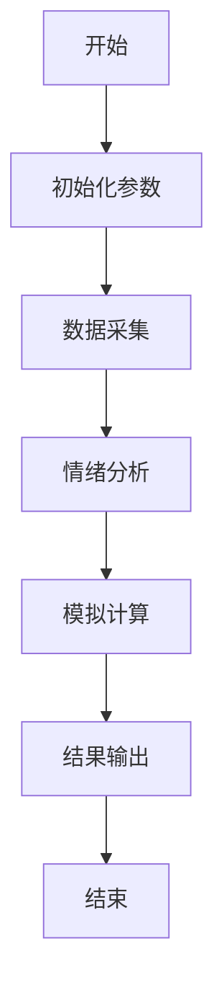
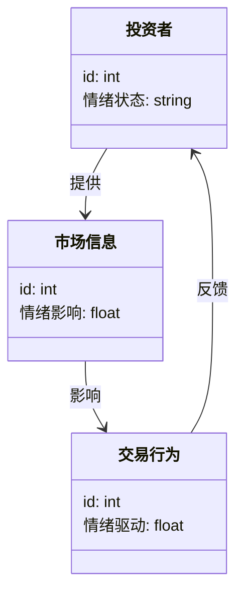
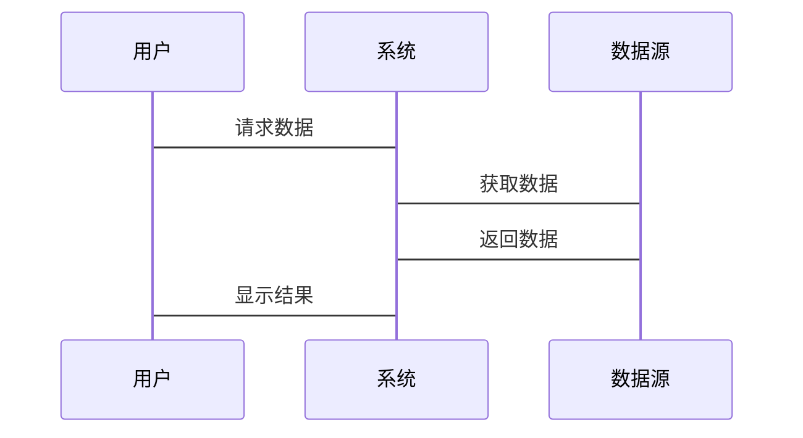

                 


# 金融市场情绪传染效应模拟与控制系统

## 关键词：金融市场，情绪传染，系统控制，算法模拟，行为金融学

## 摘要：本文深入探讨了金融市场中情绪传染效应的模拟与控制方法，结合行为金融学理论，通过数学建模和系统设计，提出了一种基于网络模型的情绪传染模拟系统，并展示了如何利用该系统进行情绪传染的实时监控与干预。文章内容涵盖情绪传染的理论基础、数学模型、系统架构设计以及实际案例分析，为金融市场情绪管理提供了新的思路和解决方案。

---

# 第一部分: 金融市场情绪传染效应概述

## 第1章: 金融市场情绪传染效应的背景与概念

### 1.1 金融市场的基本概念
#### 1.1.1 金融市场的定义与组成
金融市场是指资金的融通场所，包括股票市场、债券市场、外汇市场等。市场参与者包括投资者、机构、监管机构等。市场的波动性是由于参与者行为和市场信息的双重影响。

#### 1.1.2 市场参与者的行为特征
投资者行为受情绪驱动，机构投资者则更注重理性分析。个体投资者更容易受情绪影响，而机构投资者则通过套利行为稳定市场。

#### 1.1.3 市场波动的内在机制
市场波动由供需关系、信息传播、参与者情绪等多种因素共同作用。情绪波动加剧了市场的波动性，从而影响整体市场的稳定性。

### 1.2 情绪传染效应的定义与特征
#### 1.2.1 情绪传染效应的定义
情绪传染效应是指市场参与者之间的情绪相互影响，从而导致整体市场情绪发生变化的现象。

#### 1.2.2 情绪传染的传播路径
情绪传染可以通过信息传播、社交网络、市场行为等多种途径进行。信息传播是主要的传染途径，社交媒体和新闻媒体在其中起到了关键作用。

#### 1.2.3 情绪传染的量化指标
常用的量化指标包括波动率、恐慌指数（VIX）、投资者情绪指数等。这些指标反映了市场的整体情绪状态。

### 1.3 情绪传染效应的理论基础
#### 1.3.1 行为金融学的视角
行为金融学指出，投资者决策受情绪影响，导致市场的非理性波动。情绪传染效应强化了这种非理性行为。

#### 1.3.2 群体心理与市场波动的关系
群体心理表现出从众效应和羊群效应，这些心理现象加剧了情绪传染效应，导致市场的剧烈波动。

#### 1.3.3 现代金融理论中的情绪因素
现代金融理论将情绪视为影响市场定价的重要因素，情绪传染效应则进一步放大了这种影响。

---

## 第2章: 情绪传染效应的核心概念与联系

### 2.1 情绪传染效应的核心要素
#### 2.1.1 市场信息的传播机制
信息的传播速度和广度直接影响情绪传染的范围和强度。社交媒体的兴起加速了信息传播，从而增强了情绪传染效应。

#### 2.1.2 投资者情绪的形成过程
投资者情绪由市场信息、个人经验、外部环境等多因素共同作用形成。情绪的形成过程具有个体差异，但群体情绪表现出一致性。

#### 2.1.3 情绪对市场行为的影响
情绪影响投资者的决策，进而影响市场价格和成交量。积极情绪推高股价，消极情绪则导致股价下跌。

### 2.2 情绪传染效应的属性特征对比
#### 2.2.1 情绪传染的强度对比
不同市场环境和事件下，情绪传染的强度有所不同。金融危机期间，情绪传染强度显著增加。

#### 2.2.2 不同市场参与者的情绪特征
个体投资者情绪波动大，机构投资者情绪相对稳定。情绪特征的差异影响了情绪传染的传播路径。

#### 2.2.3 情绪传染的时间维度
情绪传染具有短期性和周期性特征。短期情绪波动频繁，长期情绪传染则表现为市场趋势的变化。

### 2.3 情绪传染效应的ER实体关系图
```mermaid
er
    actor 投资者 {
        <外键> id
        <外键> 情绪状态
    }
    actor 市场信息 {
        <外键> id
        情绪影响
    }
    actor 交易行为 {
        <外键> id
        情绪驱动
    }
    情绪状态 <-- 关联 --> 情绪传染
    市场信息 <-- 关联 --> 情绪传播
    交易行为 <-- 关联 --> 情绪影响
```

---

## 第3章: 情绪传染效应的数学模型与算法原理

### 3.1 情绪传染效应的数学模型
#### 3.1.1 情绪传播的概率分布模型
$$ P(mood) = \frac{1}{1 + e^{-\beta t}} $$
其中，$\beta$ 是情绪传播速率，$t$ 是时间变量。该公式描述了情绪从低到高的传播过程。

#### 3.1.2 情绪传染的网络模型
$$ C = \sum_{i=1}^{n} w_{i} \cdot m_{i} $$
其中，$C$ 表示传染强度，$w_{i}$ 表示权重，$m_{i}$ 表示情绪强度。该模型用于评估不同参与者对整体情绪传染的贡献。

### 3.2 情绪传染效应的算法流程


### 3.3 算法实现与代码示例
以下是情绪传染模拟的Python代码示例：

```python
import numpy as np
import matplotlib.pyplot as plt

def mood_spread(beta, t_max):
    t = np.arange(0, t_max, 1)
    mood = 1 / (1 + np.exp(-beta * t))
    return t, mood

beta = 0.5
t_max = 20

t, mood = mood_spread(beta, t_max)
plt.plot(t, mood)
plt.xlabel('时间')
plt.ylabel('情绪强度')
plt.title('情绪传播概率分布')
plt.show()
```

---

# 第二部分: 情绪传染效应的系统分析与架构设计

## 第4章: 系统需求分析与架构设计

### 4.1 系统需求分析
#### 4.1.1 功能需求
- 数据采集与处理
- 情绪分析与预测
- 情绪传染模拟
- 系统控制与干预

#### 4.1.2 性能需求
- 实时处理能力
- 高精度分析
- 系统稳定性

### 4.2 系统功能设计


### 4.3 系统架构设计


### 4.4 系统接口设计
- 数据接口：与数据源（如社交媒体、新闻网站）对接，获取实时数据。
- 分析接口：提供情绪分析和传染模拟的API。
- 控制接口：用于系统干预，如发出预警信号。

### 4.5 系统交互设计


---

## 第5章: 系统实现与优化

### 5.1 系统实现细节
#### 5.1.1 数据采集
通过API接口获取社交媒体和新闻网站的实时数据，清洗和预处理数据。

#### 5.1.2 情绪分析
使用自然语言处理技术（如NLP）分析文本数据，计算情绪指数。

#### 5.1.3 情绪传染模拟
基于网络模型，模拟情绪的传播过程，评估传染强度。

#### 5.1.4 系统控制
根据模拟结果，发出干预信号，如发布正面消息或采取其他措施稳定市场。

### 5.2 系统优化策略
- 提高数据采集的实时性和准确性。
- 优化情绪分析算法，减少误判。
- 加强系统的容错性和稳定性。

---

# 第三部分: 项目实战与小结

## 第6章: 项目实战

### 6.1 案例背景与数据来源
选择股灾期间的市场数据，分析情绪传染效应的具体表现。

### 6.2 数据处理与分析
清洗数据，提取关键指标，进行情绪分析。

### 6.3 系统模拟与控制
模拟情绪传染过程，评估系统的干预效果。

### 6.4 案例分析与结果解读
展示模拟结果，分析情绪传染对市场的影响，并提出改进建议。

---

## 第7章: 小结与展望

### 7.1 全文小结
总结全文内容，强调情绪传染效应的重要性和系统控制的必要性。

### 7.2 注意事项
提醒读者注意数据质量和模型的适用性，避免过度依赖单一模型。

### 7.3 未来展望
提出未来的研究方向，如结合AI和大数据技术，进一步优化情绪传染模型。

---

# 作者：AI天才研究院/AI Genius Institute & 禅与计算机程序设计艺术 /Zen And The Art of Computer Programming

---

本文通过系统的理论分析和实际案例，深入探讨了金融市场情绪传染效应的模拟与控制方法。从理论到实践，全面展示了如何利用技术手段应对市场情绪波动，为金融市场的稳定运行提供了新的解决方案。

