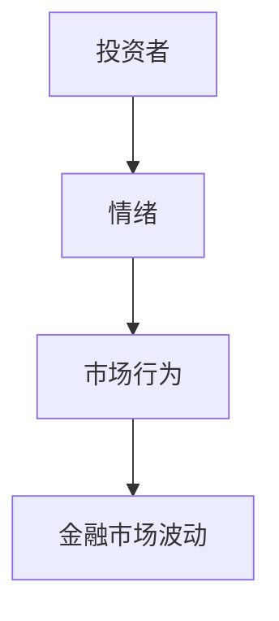
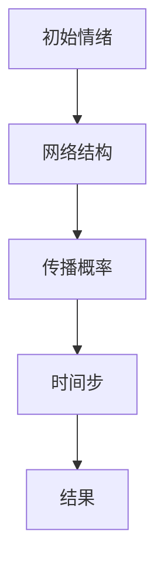
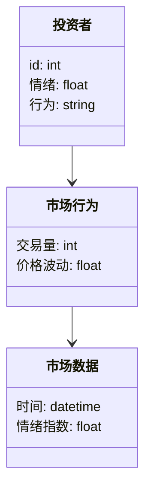
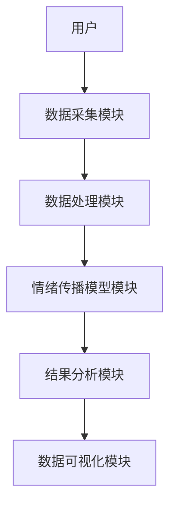

                 


# 金融市场情绪传染效应模拟系统

## 关键词：金融市场，情绪传染效应，模拟系统，数据挖掘，系统架构

## 摘要：本文详细探讨了金融市场中情绪传染效应的模拟系统，从理论基础到系统设计，再到项目实战，全面解析了情绪传染效应如何影响金融市场，并提供了一个基于网络模型和复杂传播机制的模拟系统。通过数据采集与处理、系统架构设计、模拟实验与结果分析，本文展示了情绪传染效应的实际应用场景和未来研究方向。

---

## 第一部分：金融市场情绪传染效应的背景与理论基础

### 第1章：情绪传染效应的定义与理论基础

#### 1.1 情绪传染效应的定义
情绪传染效应是指投资者之间的情绪通过互动、信息传播等方式相互影响，导致市场参与者的行为出现一致性的现象。这种效应在金融市场中表现为投资者的恐慌性抛售或乐观性买入，进而引发市场的剧烈波动。

#### 1.2 情绪传染效应的理论基础
情绪传染效应的理论基础主要来源于行为金融学和网络理论：
- **行为金融学**：传统金融学假设投资者是理性的，但行为金融学研究表明，投资者的情绪和认知偏差会影响决策，导致市场波动。
- **网络理论**：金融市场中的情绪传播可以看作是一个复杂网络中的信息扩散问题，投资者之间通过社交网络、媒体传播等渠道相互影响。

#### 1.3 情绪传染效应的边界与外延
情绪传染效应在金融市场中的表现并非无条件的，其影响范围和强度受到多种因素的限制：
- **边界条件**：包括市场参与者的社交网络结构、信息传播渠道、投资者的心理特征等。
- **外延领域**：情绪传染效应不仅影响金融市场，还可能扩散到实体经济、消费行为等领域。

---

## 第二部分：金融市场情绪传染效应的核心概念与联系

### 第2章：情绪传染效应的核心概念与联系

#### 2.1 核心概念原理
情绪传染效应的核心概念包括以下几个方面：
- **传播路径**：情绪通过社交网络、媒体传播等方式在投资者之间扩散。
- **传播机制**：情绪传播涉及信息接收者的情感共鸣和模仿行为，导致群体行为趋同。
- **量化指标**：通过分析市场数据，如波动率、交易量等，量化情绪传染的强度和影响范围。

#### 2.2 核心概念属性特征对比
以下是不同情绪传染模型的对比分析：

| 模型类型     | 传播机制       | 模型复杂度   | 应用场景       |
|--------------|----------------|--------------|----------------|
| 线性扩散模型 | 单向传播，逐步扩散 | 较低          | 小型社交网络     |
| 网络扩散模型 | 多向传播，网络结构影响 | 较高          | 大型金融市场     |
| 行为扩散模型 | 基于投资者行为数据，动态传播 | 高             | 实际金融市场分析   |

#### 2.3 ER实体关系图
以下是情绪传染效应的实体关系图：



---

## 第三部分：金融市场情绪传染效应的算法原理

### 第3章：情绪传染效应的算法原理

#### 3.1 情绪传染效应的传播模型
情绪传染效应的传播模型可以分为以下几种：
- **基于网络的情绪传播模型**：将市场参与者视为网络节点，情绪通过边传播。
- **基于复杂网络的情绪传播模型**：考虑网络结构特征，如节点度数、社区结构等。

#### 3.2 情绪传染效应的算法实现
以下是基于复杂网络的情绪传播算法流程：



以下是具体的Python实现代码：

```python
import networkx as nx
import numpy as np

def情绪传播算法(network, initial_sentiment, max_steps=100):
    G = nx.from_dict(network)
    nodes = list(G.nodes())
    sentiment = {node: 0.0 for node in nodes}
    for node in initial_sentiment:
        sentiment[node] = 1.0

    for step in range(max_steps):
        for node in nodes:
            neighbors = list(G.neighbors(node))
            if len(neighbors) == 0:
                continue
            total = sum(sentiment[neighbor] for neighbor in neighbors)
            sentiment[node] += total / len(neighbors) * 0.1
    return sentiment

# 示例网络
network = {
    'A': ['B', 'C'],
    'B': ['A', 'D'],
    'C': ['A'],
    'D': ['B']
}

# 初始情绪
initial_sentiment = ['A']

# 运行算法
result = 情绪传播算法(network, initial_sentiment)

# 分析结果
print(result)
```

---

## 第四部分：金融市场情绪传染效应的系统架构与设计

### 第4章：系统架构与设计

#### 4.1 问题场景介绍
金融市场情绪传染效应模拟系统的应用场景包括：
- 风险管理：帮助金融机构识别和预测市场情绪波动。
- 投资策略优化：基于情绪传染效应制定投资策略。
- 市场监控：实时监控市场情绪，及时预警风险。

#### 4.2 系统功能设计
以下是系统功能设计的领域模型：



#### 4.3 系统架构设计
以下是系统的架构设计：



---

## 第五部分：项目实战

### 第5章：项目实战

#### 5.1 环境安装
需要安装的依赖包包括：
- `networkx`：用于构建和分析网络结构。
- `numpy`：用于数值计算。
- `pandas`：用于数据处理。
- `matplotlib`：用于数据可视化。

#### 5.2 系统核心实现源代码
以下是系统的部分核心代码：

```python
import networkx as nx
import pandas as pd
import matplotlib.pyplot as plt

def load_data(file_path):
    # 加载数据
    df = pd.read_csv(file_path)
    return df

def build_network(data):
    # 构建网络
    G = nx.Graph()
    for index, row in data.iterrows():
        G.add_edge(row['source'], row['target'])
    return G

def simulate_emotion_spread(G, initial_nodes, steps=10):
    # 情绪传播模拟
    sentiment = {node: 0 for node in G.nodes()}
    for node in initial_nodes:
        sentiment[node] = 1.0

    for _ in range(steps):
        for node in G.nodes():
            neighbors = list(G.neighbors(node))
            if not neighbors:
                continue
            total = sum(sentiment[neighbor] for neighbor in neighbors)
            sentiment[node] += (total / len(neighbors)) * 0.1
    return sentiment

# 示例数据加载
data = load_data('market_data.csv')
# 构建网络
G = build_network(data)
# 初始情绪节点
initial_nodes = ['A']
# 运行模拟
result = simulate_emotion_spread(G, initial_nodes)
# 可视化结果
nx.draw(G, with_labels=True)
plt.show()
```

---

## 第六部分：总结与展望

### 第6章：总结与展望

#### 6.1 项目总结
通过本项目，我们构建了一个金融市场情绪传染效应的模拟系统，详细分析了情绪传染效应的传播机制和影响因素，并通过实际案例展示了系统的应用效果。

#### 6.2 未来展望
未来的研究方向包括：
- **复杂网络分析**：进一步研究网络结构对情绪传播的影响。
- **实时数据处理**：开发实时情绪监测系统，提供更及时的预警。
- **多因素模型**：结合其他因素，如宏观经济指标，构建更全面的情绪传播模型。

---

## 作者：AI天才研究院/AI Genius Institute & 禅与计算机程序设计艺术/Zen And The Art of Computer Programming

---

感谢您的阅读！希望本文能为您提供有价值的信息，并对金融市场情绪传染效应的研究有所帮助。

