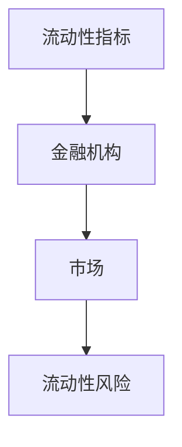
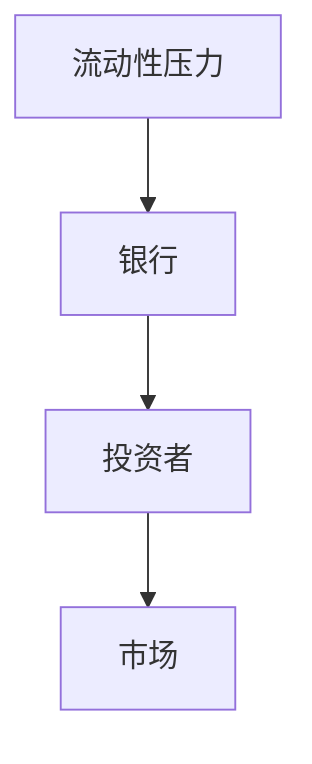
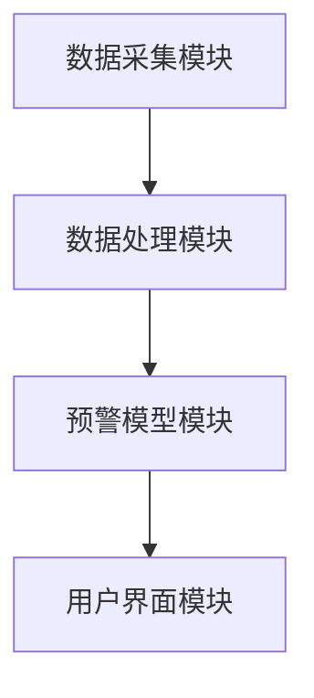

                 


# 金融市场流动性枯竭预警模型

> 关键词：金融市场流动性、流动性枯竭、预警模型、时间序列分析、机器学习、金融风险

> 摘要：本文详细探讨了金融市场流动性枯竭预警模型的构建与应用。首先介绍了流动性在金融市场中的重要性，分析了流动性枯竭的定义、表现及其对金融系统的影响。接着，详细讲解了构建预警模型的核心概念，包括流动性指标的选择与分析、流动性风险传染机制等。随后，从算法原理的角度，阐述了基于时间序列分析和机器学习的预警模型，通过Python代码实现，并给出了实际案例分析。最后，讨论了系统架构设计、项目实战与最佳实践，帮助读者全面理解如何构建和应用流动性枯竭预警模型。

---

## 第一部分: 金融市场流动性枯竭预警模型背景与概念

### 第1章: 金融市场流动性概述

#### 1.1 金融市场流动性基本概念

##### 1.1.1 流动性的定义与特征
流动性是指资产在金融市场中迅速转化为现金的能力。具有高流动性的资产可以在短时间内以合理价格买卖，且买卖过程中的交易成本和价格波动较低。流动性还具有以下特征：
- **可转换性**：资产可以快速转换为现金。
- **稳定性**：在市场波动中，流动性不会突然消失。
- **可预测性**：流动性变化可以通过一定的指标和模型进行预测。

##### 1.1.2 流动性在金融市场中的作用
流动性是金融市场运行的基石。它确保了市场的高效运作，使投资者能够方便地买卖资产，维持市场的价格发现机制，并降低交易成本。

##### 1.1.3 流动性枯竭的定义与表现
流动性枯竭是指市场中资金短缺，导致资产难以迅速变现，价格大幅波动，交易量急剧下降。其表现包括：
- 市场深度下降，买卖价差扩大。
- 资产价格剧烈波动，尤其是债券和货币市场工具的价格。
- 交易量骤减，市场参与者难以找到买家或卖家。

#### 1.2 金融市场流动性问题的背景

##### 1.2.1 近年来金融市场流动性问题的现状
近年来，全球金融市场经历多次流动性危机，如2008年金融危机和2020年新冠疫情引发的市场崩盘。这些问题暴露了金融系统中流动性管理的脆弱性。

##### 1.2.2 流动性枯竭对市场的影响
流动性枯竭会导致市场恐慌，投资者大量抛售资产，进一步加剧流动性危机，形成恶性循环。银行和金融机构可能面临资金链断裂，导致系统性风险。

##### 1.2.3 流动性管理的重要性
有效的流动性管理是维护金融市场稳定的关键。通过建立预警机制，可以提前识别潜在风险，采取措施缓解流动性压力。

### 第2章: 流动性枯竭预警模型的必要性与目标

#### 2.1 流动性风险的潜在威胁

##### 2.1.1 流动性风险的来源
流动性风险主要来源于以下几个方面：
- **市场波动**：突发事件或市场情绪变化导致的大规模抛售。
- **资金链断裂**：金融机构因资金短缺无法履行义务。
- **监管政策变化**：监管政策的调整可能引发市场流动性波动。

##### 2.1.2 流动性风险的传播机制
流动性风险可以通过多种渠道传播，例如：
- **银行间市场**：一家金融机构的流动性问题可能引发连锁反应。
- **机构投资者行为**：大量机构投资者同时出售资产可能导致市场流动性枯竭。
- **零售投资者行为**：散户投资者的恐慌性抛售会加剧流动性危机。

##### 2.1.3 流动性风险对金融系统的冲击
流动性风险可能导致系统性金融危机，影响整个金融系统的稳定，甚至引发经济衰退。

#### 2.2 流动性枯竭预警模型的目标

##### 2.2.1 提前识别流动性风险
预警模型的目标是通过分析市场数据，识别潜在的流动性风险，提前发出警报。

##### 2.2.2 量化流动性压力
模型需要量化当前市场的流动性压力，评估其严重程度，并提供应对策略。

##### 2.2.3 提供应对策略建议
预警模型不仅识别风险，还应提供具体的应对策略，帮助金融机构和监管机构采取措施缓解流动性压力。

---

## 第二部分: 流动性枯竭预警模型的核心概念与联系

### 第3章: 流动性枯竭预警模型的核心要素

#### 3.1 流动性指标的选取与分析

##### 3.1.1 常见流动性指标
常用的流动性指标包括：
- **流动性覆盖率（LCR）**：衡量银行的高质量流动性资产与短期负债的比例。
- **净稳定资金比率（NSFR）**：确保银行拥有足够的稳定资金来支持其业务活动。
- **交易量与价格波动**：通过分析资产的交易量和价格波动，判断市场的流动性状况。

##### 3.1.2 指标之间的关系与影响
流动性指标之间存在相互影响。例如，交易量的下降可能导致价格波动增加，进而影响市场深度。

#### 3.2 流动性风险传染机制

##### 3.2.1 银行间市场的流动性传染
银行间市场的流动性问题可能通过短期融资市场传导至其他金融机构，引发连锁反应。

##### 3.2.2 机构投资者的流动性需求变化
机构投资者的大规模撤资可能导致市场流动性枯竭，尤其是当多个机构同时出售资产时。

##### 3.2.3 零售投资者的行为影响
零售投资者的恐慌性抛售会加剧市场流动性压力，进一步放大风险。

### 第4章: 流动性枯竭预警模型的构建逻辑

#### 4.1 模型构建的基本原理

##### 4.1.1 数据来源与处理
模型需要收集和处理多源数据，包括市场交易数据、机构投资者行为数据和宏观经济指标等。

##### 4.1.2 模型假设与边界条件
模型假设包括：
- 数据的完整性和准确性。
- 市场参与者行为的理性假设。
- 模型的适用范围和时间窗口。

##### 4.1.3 模型的输入与输出
模型的输入包括流动性指标、市场数据和宏观经济指标，输出为流动性风险等级和应对策略建议。

#### 4.2 核心概念的ER实体关系图



#### 4.3 流动性风险传染的流程图



---

## 第三部分: 流动性枯竭预警模型的算法原理

### 第5章: 算法原理与实现

#### 5.1 时间序列分析

##### 5.1.1 ARIMA模型
ARIMA（自回归积分滑动平均模型）是一种常用的时间序列预测方法。其数学模型如下：

$$ ARIMA(p, d, q) $$

其中，p为自回归阶数，d为差分阶数，q为滑动平均阶数。

##### 5.1.2 LSTM网络
长短期记忆网络（LSTM）适用于处理时间序列数据，能够捕捉长期依赖关系。其核心结构包括输入门、遗忘门和输出门。

#### 5.2 机器学习算法实现

##### 5.2.1 数据预处理
对数据进行标准化、缺失值处理和异常值剔除。

##### 5.2.2 模型训练与评估
使用训练数据训练模型，并通过交叉验证评估模型的性能。

#### 5.3 Python代码实现

```python
import pandas as pd
import numpy as np
from sklearn.preprocessing import MinMaxScaler
from keras.models import Sequential
from keras.layers import LSTM, Dense

# 数据预处理
data = pd.read_csv('market_data.csv')
scaler = MinMaxScaler()
scaled_data = scaler.fit_transform(data['price'])

# 划分训练集和测试集
train_data = scaled_data[:700]
test_data = scaled_data[700:]

# 构建LSTM模型
model = Sequential()
model.add(LSTM(128, input_shape=(1, 1)))
model.add(Dense(1))
model.compile(loss='mean_squared_error', optimizer='adam')

# 训练模型
model.fit(train_data.reshape((train_data.shape[0], 1, 1)), 
          train_data, 
          epochs=100, 
          batch_size=32)

# 预测
test_loss = model.predict(test_data.reshape((test_data.shape[0], 1, 1)))
```

---

## 第四部分: 系统架构设计与实现

### 第6章: 系统架构设计

#### 6.1 系统功能设计

##### 6.1.1 数据采集模块
负责收集市场交易数据、机构行为数据和宏观经济指标。

##### 6.1.2 数据处理模块
对数据进行清洗、转换和特征提取。

##### 6.1.3 预警模型模块
基于处理后的数据，运行预警模型，生成风险等级和应对策略。

##### 6.1.4 用户界面模块
向用户展示预警结果和应对建议。

#### 6.2 系统架构设计



---

## 第五部分: 项目实战与案例分析

### 第7章: 项目实战

#### 7.1 环境配置

##### 7.1.1 安装Python和相关库
```bash
pip install numpy pandas scikit-learn tensorflow
```

#### 7.2 核心代码实现

##### 7.2.1 数据处理与建模
```python
import pandas as pd
from sklearn.ensemble import RandomForestRegressor
from sklearn.model_selection import train_test_split

# 加载数据
data = pd.read_csv('market_data.csv')

# 划分训练集和测试集
X = data[['volume', 'price_change']]
y = data['流动性风险等级']
X_train, X_test, y_train, y_test = train_test_split(X, y, test_size=0.2)

# 训练随机森林模型
model = RandomForestRegressor()
model.fit(X_train, y_train)

# 预测
y_pred = model.predict(X_test)
```

#### 7.3 案例分析

##### 7.3.1 实际案例分析
通过分析2020年新冠疫情对市场的冲击，验证模型的预警能力。

##### 7.3.2 模型效果评估
评估模型的准确率、召回率和F1分数。

---

## 第六部分: 最佳实践与总结

### 第8章: 最佳实践

#### 8.1 小结
流动性枯竭预警模型的构建需要结合市场数据和先进算法，能够有效识别潜在风险。

#### 8.2 注意事项
- 数据质量对模型性能影响重大。
- 模型需要定期更新和维护。
- 结合多模型和专家意见，提高预警的准确性。

#### 8.3 拓展阅读
推荐相关书籍和论文，深入学习金融市场流动性管理。

---

## 作者：AI天才研究院 & 禅与计算机程序设计艺术

---

感谢您的阅读！如需进一步探讨，欢迎随时联系。

