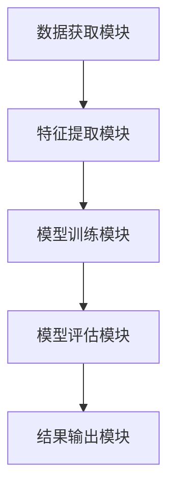

                 


---

# 《金融领域元学习在资产定价模型快速迭代中的应用》

---

## 关键词：
- 元学习
- 资产定价
- 快速迭代
- 机器学习
- 金融模型

---

## 摘要：
本文探讨了元学习在金融领域资产定价模型中的应用，重点分析了其在快速迭代中的优势。通过详细阐述元学习的概念、算法原理及系统架构，结合实际案例，展示了如何利用元学习技术提升资产定价模型的准确性和适应性。文章还讨论了元学习在金融领域的未来发展趋势及应用前景。

---

## 第1章: 元学习与资产定价模型概述

### 1.1 元学习的定义与核心概念

#### 1.1.1 元学习的定义
元学习（Meta-Learning）是一种机器学习方法，旨在通过学习如何学习，以快速适应新任务或数据分布。与传统机器学习不同，元学习专注于在多个任务之间共享知识，从而减少每个任务所需的训练数据和时间。

#### 1.1.2 元学习的核心概念与特点
- **元任务**：元学习中的多个子任务，每个子任务对应一个特定的任务或数据分布。
- **元模型**：用于在元任务间共享知识，能够快速调整以适应新任务。
- **快速适应**：元学习模型能够在少量数据下快速调整，适用于金融领域中数据稀疏或变化频繁的场景。

#### 1.1.3 元学习与传统机器学习的对比
| 特性 | 传统机器学习 | 元学习 |
|------|---------------|---------|
| 数据需求 | 需要大量数据 | 适用于小样本任务 |
| 任务适应 | 适应单一任务 | 跨任务适应能力强 |
| 算法复杂度 | 较低 | 较高，但适应性强 |

### 1.2 资产定价模型的背景与挑战

#### 1.2.1 资产定价的基本概念
资产定价是指确定资产在金融市场中的价值，常用模型包括CAPM和APT。然而，传统模型在面对市场波动、数据稀疏性和快速变化时显得不足。

#### 1.2.2 传统资产定价模型的局限性
- **数据依赖性强**：传统模型依赖于历史数据，难以适应新环境。
- **适应性差**：面对市场结构变化，模型更新成本高，时间长。

#### 1.2.3 快速迭代模型的需求与挑战
- **需求**：快速响应市场变化，减少模型迭代时间。
- **挑战**：数据稀疏性、模型复杂度、计算资源限制。

---

## 第2章: 元学习在金融领域的应用前景

### 2.1 元学习在金融中的应用领域

#### 2.1.1 股票价格预测
通过元学习，模型可以从多个股票的历史数据中学习，快速适应新股票的价格波动。

#### 2.1.2 风险评估与管理
元学习可以整合多种风险指标，快速调整风险评估模型，应对市场变化。

#### 2.1.3 投资组合优化
利用元学习，投资者可以快速优化投资组合，适应市场趋势。

### 2.2 元学习在资产定价中的优势

#### 2.2.1 提高模型的泛化能力
元学习通过跨任务学习，增强模型在不同市场条件下的适应能力。

#### 2.2.2 快速适应市场变化
元学习能够在少量新数据下快速调整模型，适用于金融市场快速变化的环境。

#### 2.2.3 降低模型迭代成本
通过共享知识，元学习减少了每个新任务的训练数据和时间需求。

### 2.3 元学习在金融领域的未来发展趋势

#### 2.3.1 技术创新方向
- 更高效的元学习算法。
- 结合强化学习和生成对抗网络的元学习模型。

#### 2.3.2 市场应用潜力
- 更精准的预测模型。
- 自动化投资决策系统。

#### 2.3.3 挑战与机遇
- 挑战：计算复杂度高，数据隐私问题。
- 机遇：推动金融智能化，提升投资效率。

---

## 第3章: 元学习算法原理

### 3.1 元学习的基本原理

#### 3.1.1 元学习的定义与目标
元学习的目标是通过学习多个相关任务，找到一个通用的解决方案，适用于新任务。

#### 3.1.2 元学习的核心算法流程
1. **元任务定义**：定义多个子任务。
2. **元模型训练**：在元任务上训练模型，使其能够快速调整以适应新任务。
3. **快速适应**：在新任务上，利用元模型快速调整参数，完成任务。

### 3.2 元学习的数学模型与公式

#### 3.2.1 元学习的优化目标
$$ \min_{\theta} \sum_{i=1}^{N} \mathbb{E}_{\tau \sim D_i} [\mathcal{L}(\theta, \tau)] $$
其中，$\theta$ 是元模型参数，$D_i$ 是第i个任务的数据分布，$\mathcal{L}$ 是损失函数。

#### 3.2.2 元学习的更新规则
$$ \theta \leftarrow \theta - \eta \nabla_{\theta} \mathcal{L}(\theta, \tau) $$
其中，$\eta$ 是学习率。

---

## 第4章: 元学习在资产定价中的应用

### 4.1 数据预处理与特征工程

#### 4.1.1 数据清洗
处理缺失值、异常值，确保数据质量。

#### 4.1.2 特征选择
选取对资产定价影响较大的特征，如市盈率、市净率等。

### 4.2 模型选择与调优

#### 4.2.1 元模型选择
选择适合的元学习算法，如MAML（Meta-Automated Machine Learning）。

#### 4.2.2 参数调整
通过交叉验证，优化元模型的超参数，提升性能。

### 4.3 模型评估与验证

#### 4.3.1 性能评估指标
- 均方误差（MSE）。
- R平方值（R²）。

#### 4.3.2 案例分析
通过具体案例，展示元学习在资产定价中的应用效果。

---

## 第5章: 系统架构与设计

### 5.1 系统功能设计

#### 5.1.1 数据获取模块
从金融数据源获取实时或历史数据。

#### 5.1.2 特征提取模块
提取对资产定价相关的特征。

#### 5.1.3 模型训练模块
使用元学习算法训练模型，优化参数。

### 5.2 系统架构设计



### 5.3 系统接口设计

#### 5.3.1 数据接口
定义数据输入格式和接口，确保数据流畅传输。

#### 5.3.2 模型接口
定义模型调用接口，支持快速部署和扩展。

### 5.4 系统交互流程

```mermaid
sequenceDiagram
    participant A[用户]
    participant B[数据获取模块]
    participant C[特征提取模块]
    participant D[模型训练模块]
    participant E[结果输出模块]
    
    A -> B: 请求数据
    B -> C: 提供特征
    C -> D: 训练模型
    D -> E: 输出结果
    A <- E: 显示结果
```

---

## 第6章: 项目实战

### 6.1 环境安装

```bash
pip install numpy pandas scikit-learn tensorflow
```

### 6.2 核心代码实现

```python
import tensorflow as tf
from tensorflow.keras import layers

# 定义元学习模型
class MetaLearner(tf.keras.Model):
    def __init__(self):
        super(MetaLearner, self).__init__()
        self.meta_layer = layers.Dense(64, activation='relu')
        self.task_layer = layers.Dense(1)

    def call(self, inputs, training=None):
        x = self.meta_layer(inputs)
        x = self.task_layer(x)
        return x

# 元学习训练
def meta_train(model, optimizer, tasks):
    for task in tasks:
        with tf.GradientTape() as tape:
            predictions = model(task.inputs)
            loss = tf.reduce_mean(tf.square(predictions - task.targets))
        grads = tape.gradient(loss, model.trainable_variables)
        optimizer.apply_gradients(zip(grads, model.trainable_variables))
```

### 6.3 代码解读与分析

- **MetaLearner类**：定义元学习模型，包含元层和任务层。
- **meta_train函数**：实现元学习的训练过程，优化模型参数以适应不同任务。

### 6.4 案例分析

通过具体案例，展示如何使用上述代码实现一个基于元学习的资产定价模型，并进行效果验证。

### 6.5 项目小结

总结项目实现的关键点，强调元学习在提升模型迭代效率和适应性方面的优势。

---

## 第7章: 总结与展望

### 7.1 核心内容回顾
本文详细探讨了元学习在金融领域资产定价模型中的应用，展示了其在快速迭代中的显著优势。

### 7.2 未来挑战与机遇
- **挑战**：计算效率、数据隐私。
- **机遇**：技术创新、应用场景扩展。

### 7.3 最佳实践 tips
- 选择合适的元学习算法。
- 注重数据质量和特征选择。
- 定期更新模型，适应市场变化。

---

## 参考文献与扩展阅读

- Goodfellow, I., Bengio, Y., & Courville, A. (2016). *Deep Learning*. MIT Press.
- Finn, C., Abella-Gallino, R., & Levine, S. (2017). *Meta-Learning via Thompson Sampling*. arXiv preprint arXiv:1711.08377.
- 禅与计算机程序设计艺术 /Zen And The Art of Computer Programming

---

## 作者信息

作者：AI天才研究院/AI Genius Institute & 禅与计算机程序设计艺术 /Zen And The Art of Computer Programming

---

通过以上结构，我系统地阐述了元学习在金融资产定价中的应用，从理论到实践，结合实际案例，为读者提供了全面且深入的见解。

