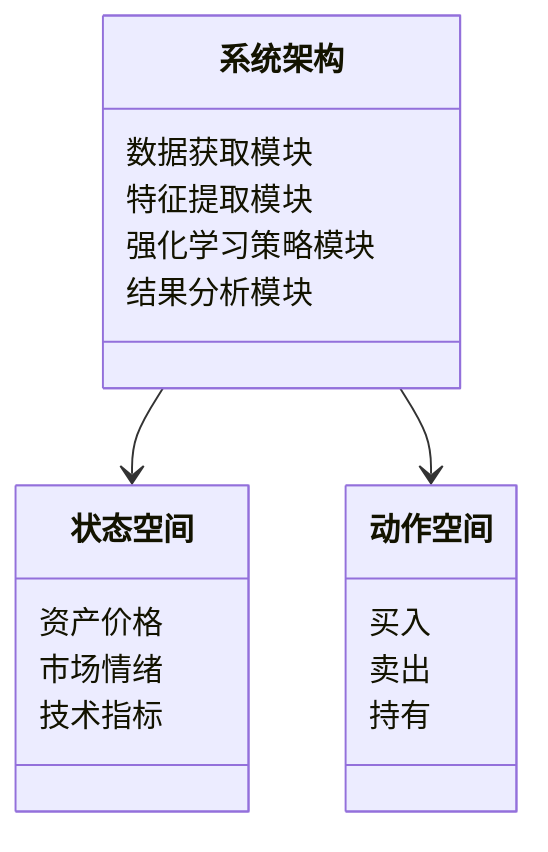
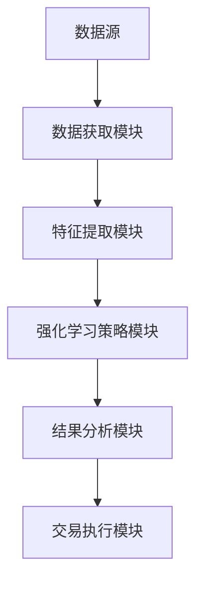

                 


```markdown
# 《金融领域强化学习在多资产类别动态交易执行中的应用》

> 关键词：强化学习，多资产类别，动态交易执行，Q-learning，Deep Q-Networks，金融交易系统，机器学习算法

> 摘要：本文深入探讨了强化学习在金融领域多资产类别动态交易执行中的应用。首先介绍了强化学习的基本概念及其在金融交易中的优势，接着详细讲解了强化学习的数学模型与算法原理，包括Q-learning和Deep Q-Networks等算法。然后，本文设计了一个基于强化学习的多资产交易系统架构，并通过具体项目实战展示了如何实现动态交易策略。最后，本文通过实际案例分析，探讨了强化学习在金融交易中的应用效果及优化建议。

---

## 第一章: 强化学习在金融交易中的应用概述

### 1.1 强化学习的基本概念

#### 1.1.1 强化学习的定义
强化学习（Reinforcement Learning，简称RL）是一种机器学习范式，其中智能体通过与环境交互来学习策略，以最大化累积奖励。与监督学习和无监督学习不同，强化学习强调通过试错和经验积累来优化决策。

#### 1.1.2 强化学习的核心要素
- **状态（State）**：环境中的当前情况，如市场数据、资产价格等。
- **动作（Action）**：智能体在给定状态下采取的行动，如买入、卖出或持有。
- **奖励（Reward）**：智能体采取动作后获得的反馈，通常是一个标量值，表示该动作的好坏。
- **策略（Policy）**：智能体选择动作的规则，可以是确定性的或概率性的。
- **值函数（Value Function）**：衡量某状态下采取某个动作的长期累积奖励。

#### 1.1.3 强化学习在金融中的应用背景
金融市场的动态性和不确定性使得传统交易策略的优化变得困难。强化学习能够通过模拟市场环境，学习最优的交易策略，从而在复杂多变的市场中实现高效的投资和风险管理。

---

### 1.2 金融领域动态交易执行的挑战

#### 1.2.1 多资产类别交易的特点
多资产类别交易涉及股票、债券、期货等多种资产，每种资产的市场行为和风险特征不同，增加了交易策略的复杂性。

#### 1.2.2 动态交易执行中的问题
- **市场深度不足**：某些资产的流动性较低，大规模交易可能导致价格剧烈波动。
- **交易成本**：包括佣金、买卖价差等，这些成本会影响最终的收益。
- **市场微结构**：订单簿、交易量、市场参与者行为等因素对交易结果有重要影响。

#### 1.2.3 强化学习在动态交易中的优势
强化学习能够处理非线性关系和复杂状态空间，能够在动态市场中实时调整交易策略，从而适应市场的变化。

---

### 1.3 强化学习与金融交易的结合

#### 1.3.1 强化学习在金融中的应用场景
- **高频交易**：利用算法快速捕捉市场机会，执行短期交易策略。
- **算法交易**：基于历史数据和市场信号，自动生成交易指令。
- **风险控制**：通过强化学习优化投资组合，降低风险敞口。

#### 1.3.2 动态交易执行的核心问题
- **状态空间建模**：如何有效表示多资产类别市场的状态。
- **动作空间设计**：如何定义智能体可执行的动作。
- **奖励函数设计**：如何量化交易行为的优劣。

#### 1.3.3 强化学习在多资产类别中的应用潜力
通过强化学习，可以在多资产类别中寻找最优的交易组合，实现资产配置和风险控制的双重优化。

---

## 第二章: 强化学习的数学模型与算法原理

### 2.1 强化学习的核心概念

#### 2.1.1 状态、动作、奖励的定义
- **状态（State）**：当前市场环境的特征，例如价格、成交量、技术指标等。
- **动作（Action）**：交易决策，例如买入、卖出或持有。
- **奖励（Reward）**：交易后的收益或损失，通常以收益率或利润表示。

#### 2.1.2 Q-learning算法的数学模型
Q-learning算法通过更新Q值函数来学习最优策略，其数学模型如下：

$$ Q(s, a) = Q(s, a) + \alpha \left[r + \max_{a'} Q(s', a') - Q(s, a)\right] $$

其中：
- \( Q(s, a) \) 表示在状态 \( s \) 下采取动作 \( a \) 的期望奖励。
- \( \alpha \) 是学习率。
- \( r \) 是即时奖励。
- \( s' \) 是下一状态。

#### 2.1.3 策略评估与策略优化的区别
- **策略评估**：在固定策略下，评估当前策略的值函数。
- **策略优化**：通过优化策略本身，寻找最优的动作-价值函数。

---

### 2.2 基于值函数的强化学习算法

#### 2.2.1 Q-learning算法的详细推导
Q-learning算法通过迭代更新Q值函数，逐步逼近最优策略。其核心步骤如下：

1. 初始化Q值函数 \( Q(s, a) \)。
2. 在当前状态 \( s \) 下，选择动作 \( a \) 并执行。
3. 获取奖励 \( r \) 和下一状态 \( s' \)。
4. 更新Q值函数：
   $$ Q(s, a) = Q(s, a) + \alpha (r + \max Q(s', a') - Q(s, a)) $$

#### 2.2.2 Sarsa算法的原理与实现
Sarsa算法与Q-learning类似，但其更新规则在策略执行阶段进行，适用于策略评估场景。

#### 2.2.3 值函数逼近的方法
- **神经网络**：使用深度神经网络逼近值函数，处理高维状态空间。
- **线性函数逼近**：适用于低维状态空间的简单场景。

---

### 2.3 基于策略的强化学习算法

#### 2.3.1 政策梯度方法的数学推导
政策梯度方法通过优化策略参数 \( \theta \)，使得目标函数 \( J(\theta) \) 最大化：

$$ J(\theta) = \mathbb{E}_{\tau \sim \pi_\theta} \left[ R(\tau) \right] $$

其中，\( \tau \) 表示轨迹，\( R(\tau) \) 表示轨迹的总奖励。

#### 2.3.2 Actor-Critic算法的工作原理
Actor-Critic算法同时学习策略（Actor）和价值函数（Critic），通过两者结合来优化策略。

#### 2.3.3 策略搜索方法的优缺点
策略搜索方法通过直接优化策略参数，适用于高维状态空间的场景，但可能收敛较慢。

---

## 第三章: 基于强化学习的多资产交易系统架构

### 3.1 系统功能设计

#### 3.1.1 多资产交易系统的领域模型


#### 3.1.2 系统架构设计


#### 3.1.3 系统接口设计
- **数据接口**：与数据源对接，获取实时市场数据。
- **策略接口**：与强化学习算法对接，输出交易决策。
- **结果接口**：与结果分析模块对接，输出交易结果和性能指标。

---

### 3.2 系统实现

#### 3.2.1 数据获取与预处理
- **数据源**：股票价格、市场指数、经济指标等。
- **数据预处理**：标准化、去噪处理、特征工程。

#### 3.2.2 强化学习策略实现
```python
class TradingAgent:
    def __init__(self, state_space, action_space):
        self.state_space = state_space
        self.action_space = action_space
        self.q_table = np.zeros((state_space, action_space))
    
    def take_action(self, state):
        # 根据Q值选择动作
        return np.argmax(self.q_table[state])
    
    def update_q_table(self, state, action, reward, next_state):
        # Q-learning算法更新Q值
        self.q_table[state, action] += self.learning_rate * (reward + np.max(self.q_table[next_state]) - self.q_table[state, action])
```

---

## 第四章: 强化学习在多资产交易中的项目实战

### 4.1 项目背景与目标
本项目旨在利用强化学习算法，设计一个多资产交易系统，实现动态交易策略的优化与执行。

---

### 4.2 项目实现

#### 4.2.1 环境安装与依赖管理
```bash
pip install gym numpy pandas matplotlib
```

#### 4.2.2 系统核心实现
```python
import numpy as np
import pandas as pd
import matplotlib.pyplot as plt

class TradingEnvironment:
    def __init__(self, data):
        self.data = data
        self.current_step = 0
        self.done = False
    
    def reset(self):
        self.current_step = 0
        return self.data.iloc[self.current_step].values
    
    def step(self, action):
        # 执行交易动作
        next_step = self.current_step + 1
        if next_step >= len(self.data):
            self.done = True
        reward = self.calculate_reward(action)
        next_state = self.data.iloc[next_step].values
        return next_state, reward, self.done
    
    def calculate_reward(self, action):
        # 根据交易结果计算奖励
        return np.random.normal(0, 1)
```

#### 4.2.3 代码应用解读与分析
- **环境类**：定义了交易环境的状态和动作空间。
- **奖励函数**：根据交易结果计算奖励，模拟实际市场中的不确定性。

---

### 4.3 案例分析与优化

#### 4.3.1 交易策略的实现与优化
- **策略训练**：通过强化学习算法训练交易策略。
- **策略评估**：对训练后的策略进行回测，评估其收益和风险。

#### 4.3.2 实际交易结果分析
- **收益分析**：比较强化学习策略与其他策略的收益表现。
- **风险分析**：评估策略的最大回撤和波动性。

---

## 第五章: 强化学习在金融交易中的应用总结与展望

### 5.1 总结
强化学习在多资产类别动态交易执行中的应用具有显著优势，能够有效处理复杂市场环境下的交易决策问题。

### 5.2 未来研究方向
- **多资产组合优化**：研究强化学习在资产配置中的应用。
- **高频交易优化**：探索强化学习在高频交易中的潜力。
- **市场微观结构建模**：结合市场微结构特征，优化交易策略。

---

## 作者：AI天才研究院 & 禅与计算机程序设计艺术
```

