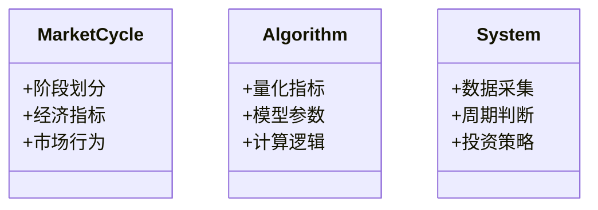

                 


# 霍华德·马克斯的市场周期理论

## 关键词
- 市场周期理论
- 霍华德·马克斯
- 经济波动
- 量化分析
- 投资策略
- 系统架构设计

## 摘要
霍华德·马克斯的市场周期理论是投资学领域的重要理论之一，它通过分析市场的周期性波动，帮助投资者在不同的市场阶段做出明智的投资决策。本文将从市场周期的基本概念出发，逐步深入探讨马克斯理论的核心思想、量化分析方法、系统架构设计以及实际应用案例。通过系统的分析和详细的代码实现，本文旨在为读者提供一个全面理解市场周期理论的框架。

---

## 第1章: 市场周期的基本概念与背景

### 1.1 市场周期的定义与特征
#### 1.1.1 市场周期的定义
市场的周期性波动是指在经济活动中，市场价格、成交量、投资者情绪等指标会随着时间的推移呈现出周期性变化的现象。市场周期的核心特征包括波动性、周期性和非线性。

#### 1.1.2 市场周期的核心特征
- **波动性**：市场价格和成交量的频繁波动。
- **周期性**：市场波动呈现出明显的周期性规律。
- **非线性**：市场波动并非简单的正弦波，而是受到多种因素的复杂影响。

#### 1.1.3 市场周期与经济波动的关系
市场周期与经济波动密切相关，经济周期的波动会直接影响市场的供需关系、投资者情绪和市场价格。

---

### 1.2 霍华德·马克斯的市场周期理论概述
#### 1.2.1 霍华德·马克斯的生平简介
霍华德·马克斯（Howard Marks）是美国著名投资家，橡树资本（Oaktree Capital）的联合创始人。他的投资理念以价值投资和市场周期分析为核心。

#### 1.2.2 马克斯市场周期理论的提出背景
马克斯的市场周期理论是在20世纪80年代提出的，旨在帮助投资者识别市场周期的不同阶段，并据此制定投资策略。

#### 1.2.3 理论的核心思想与应用领域
马克斯理论的核心思想是：市场周期的波动是由投资者情绪和市场估值的非理性变化引起的。其应用领域包括股票投资、债券投资、风险管理等。

---

## 第2章: 市场周期的核心概念与联系

### 2.1 市场周期的驱动因素
#### 2.1.1 经济基本面因素
- 经济增长率
- 利率水平
- 通货膨胀率
- 就业率

#### 2.1.2 投资者心理因素
- 投资者情绪
- 风险偏好
- 群从心理

#### 2.1.3 市场参与者的行为模式
- 投资者行为
- 市场操纵
- 信息不对称

---

### 2.2 市场周期的阶段划分
#### 2.2.1 衰退期
- 市场价格下降
- 交易量减少
- 投资者情绪低落

#### 2.2.2 萌芽期
- 市场价格逐渐回升
- 交易量开始增加
- 投资者情绪逐渐恢复

#### 2.2.3 成长期
- 市场价格快速上涨
- 交易量显著增加
- 投资者情绪高涨

#### 2.2.4 泡沫期
- 市场价格虚高
- 交易量达到峰值
- 投资者情绪极度乐观

#### 2.2.5 破灭期
- 市场价格突然下跌
- 交易量骤减
- 投资者情绪恐慌

---

### 2.3 市场周期与经济指标的关系
#### 2.3.1 主要经济指标的定义与作用
- **GDP**：国内生产总值，衡量经济整体表现。
- **失业率**：反映劳动力市场的健康状况。
- **通胀率**：衡量物价水平的变化。

#### 2.3.2 经济指标与市场周期的关联性分析
- 高通胀率可能导致市场进入衰退期。
- 低失业率可能推动市场进入成长期。

#### 2.3.3 经济指标在周期判断中的应用
通过分析GDP增长率、失业率等经济指标，投资者可以更好地判断市场所处的周期阶段。

---

## 第3章: 市场周期的量化分析与算法原理

### 3.1 市场周期的量化指标
#### 3.1.1 市盈率（P/E）分析
市盈率 = 股价 / 每股收益

#### 3.1.2 市净率（P/B）分析
市净率 = 股价 / 每股净资产

#### 3.1.3 市销率（P/S）分析
市销率 = 股价 / 每股销售收入

#### 3.1.4 股息率分析
股息率 = 每股股息 / 股价

---

### 3.2 市场周期的算法模型
#### 3.2.1 均值回归模型
$$ P_{t+1} = \alpha + \beta P_t + \epsilon $$

其中：
- $P_t$ 表示当前价格
- $\alpha$ 是截距
- $\beta$ 是回归系数
- $\epsilon$ 是误差项

#### 3.2.2 波动率分析模型
$$ \sigma^2 = \lambda \sigma_{t-1}^2 + (1-\lambda) R_t^2 $$

其中：
- $\sigma^2$ 是当前波动率
- $\lambda$ 是平滑参数
- $R_t^2$ 是当前收益率的平方

#### 3.2.3 马克斯市场周期量化模型
通过结合市盈率、市净率等指标，构建一个多因子回归模型，预测市场周期的阶段。

---

## 第4章: 市场周期的系统分析与架构设计

### 4.1 系统分析
#### 4.1.1 问题场景介绍
投资者需要根据市场周期的变化，动态调整投资策略。

#### 4.1.2 项目目标与范围
开发一个基于霍华德·马克斯市场周期理论的投资决策支持系统。

#### 4.1.3 系统功能需求
- 数据采集模块
- 周期判断模块
- 投资策略模块
- 输出报告模块

---

### 4.2 系统架构设计
#### 4.2.1 领域模型设计（Mermaid 类图）


#### 4.2.2 系统架构图（Mermaid 架构图）


---

## 第5章: 项目实战

### 5.1 环境安装与配置
- 安装Python和相关库（Pandas、NumPy、Scikit-learn）
- 数据源获取（股票数据、经济指标数据）

### 5.2 核心代码实现
```python
import pandas as pd
import numpy as np
from sklearn.linear_model import LinearRegression

# 数据预处理
data = pd.read_csv('market_data.csv')
data = data.dropna()

# 特征工程
features = ['PE', 'PB', 'PS', 'DIV']
target = 'market_phase'

model = LinearRegression()
model.fit(data[features], data[target])

# 模型预测
new_data = pd.DataFrame({
    'PE': [15],
    'PB': [2],
    'PS': [1.5],
    'DIV': [0.05]
})
predicted_phase = model.predict(new_data[features])
```

### 5.3 案例分析
以2008年金融危机为例，分析市场周期的变化和投资策略的调整。

---

## 第6章: 总结与展望

### 6.1 最佳实践 tips
- 定期回顾市场周期阶段
- 结合多种指标进行综合判断
- 灵活调整投资策略

### 6.2 小结
霍华德·马克斯的市场周期理论为投资者提供了重要的分析工具，帮助他们在复杂的市场环境中做出明智决策。

### 6.3 注意事项
- 市场周期理论并非绝对准确，需结合实际情况灵活运用
- 数据质量和模型选择对结果有重要影响

### 6.4 拓展阅读
- 《投资学》
- 《市场周期分析》

---

## 作者：AI天才研究院/AI Genius Institute & 禅与计算机程序设计艺术 /Zen And The Art of Computer Programming

---

**本文内容为AI天才研究院原创，转载请注明出处。**

