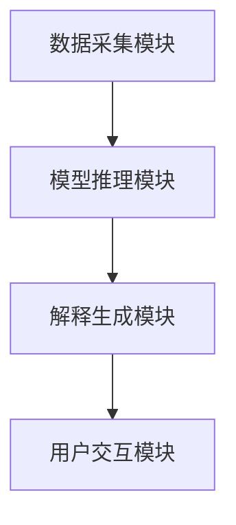
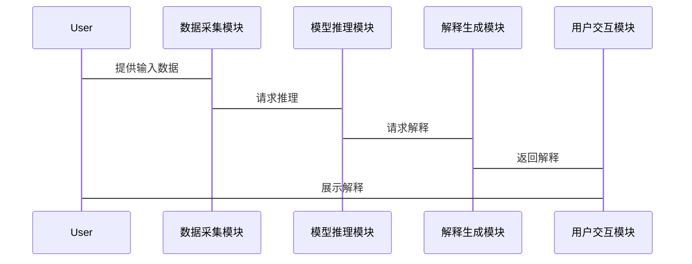

                 


```markdown
# AI Agent的可解释性设计：提高模型决策的透明度

> 关键词：AI Agent，可解释性，透明度，决策模型，算法原理，系统架构

> 摘要：随着人工智能技术的快速发展，AI Agent在各个领域的应用日益广泛。然而，AI Agent的决策过程往往缺乏透明度，导致用户难以理解和信任。本文从AI Agent的基本概念出发，深入探讨了可解释性设计的核心原理、算法实现以及系统架构，结合实际案例分析，详细阐述了如何提高AI Agent决策的透明度。通过本文的学习，读者将能够理解AI Agent可解释性设计的重要性，并掌握相关的设计方法和技巧。

---

# 第1章: AI Agent与可解释性概述

## 1.1 AI Agent的基本概念
### 1.1.1 AI Agent的定义与分类
AI Agent（人工智能代理）是指能够感知环境、自主决策并执行任务的智能体。根据功能和智能水平，AI Agent可以分为反应式代理、基于模型的代理、效用导向代理等。

### 1.1.2 可解释性在AI Agent中的重要性
可解释性是指AI Agent的决策过程能够被人类理解和解释。在医疗、金融等高风险领域，可解释性是信任和合规的重要前提。

### 1.1.3 可解释性与透明度的关系
透明度是可解释性的核心，高透明度的AI Agent能够清晰地展示其决策逻辑和数据依据。

## 1.2 可解释性设计的背景与挑战
### 1.2.1 当前AI Agent的广泛应用场景
AI Agent已应用于自动驾驶、智能客服、医疗诊断等领域，但其决策过程往往“黑箱化”。

### 1.2.2 可解释性在实际应用中的需求
用户和监管机构对AI决策透明度的要求日益提高，推动了可解释性设计的发展。

### 1.2.3 当前AI Agent可解释性设计的挑战
复杂的模型（如深度神经网络）通常缺乏可解释性，如何在保证性能的同时提高透明度是一个难题。

## 1.3 本章小结
本章介绍了AI Agent的基本概念及其在可解释性设计中的重要性，指出了当前面临的挑战。

---

# 第2章: AI Agent可解释性设计的核心概念

## 2.1 可解释性的定义与维度
### 2.1.1 可解释性的定义
可解释性是指AI系统的决策过程能够被人类理解和解释。

### 2.1.2 可解释性的主要维度
- **透明度**：决策过程的清晰度。
- **可理解性**：用户能够理解决策逻辑。
- **可追溯性**：能够追踪决策的依据和过程。

## 2.2 AI Agent决策过程的透明度
### 2.2.1 决策过程的透明度层次
- **数据透明度**：输入数据的来源和处理方式。
- **模型透明度**：模型的结构和参数。
- **结果透明度**：输出结果的依据和推理过程。

### 2.2.2 决策透明度与用户信任的关系
高透明度的AI Agent能够增强用户的信任，从而更广泛地被接受和应用。

## 2.3 可解释性与模型复杂度的平衡
### 2.3.1 模型复杂度对可解释性的影响
复杂的模型通常具有更高的性能，但可解释性较差。

### 2.3.2 简化模型以提高可解释性的方法
- 使用线性模型（如线性回归）代替复杂模型。
- 通过特征选择减少输入维度。

## 2.4 本章小结
本章详细阐述了可解释性的核心概念及其在AI Agent中的应用，探讨了透明度与模型复杂度的平衡。

---

# 第3章: AI Agent可解释性设计的核心原理

## 3.1 可解释性设计的理论基础
### 3.1.1 信息论视角下的可解释性
信息论认为，可解释性是信息传递的效率和清晰度的体现。

### 3.1.2 认知科学视角下的可解释性
认知科学关注人类如何理解和解释AI的决策过程。

## 3.2 可解释性设计的数学模型
### 3.2.1 解释性模型的构建
解释性模型旨在将复杂的决策过程简化为人类可理解的形式。

### 3.2.2 解释性度量的数学公式
$$ \text{可解释性度量} = \frac{\text{模型的可理解性}}{\text{模型的复杂度}} $$

## 3.3 可解释性设计的算法原理
### 3.3.1 解释性生成算法
- **LIME**：通过局部线性近似生成解释。
- **SHAP**：基于Shapley值的特征重要性分析。

### 3.3.2 解释性评估算法
- **信息增益法**：通过信息论中的增益度量特征的重要性。
- **方差分解法**：分解特征对模型输出方差的贡献。

## 3.4 本章小结
本章从理论和算法角度分析了AI Agent可解释性设计的核心原理。

---

# 第4章: AI Agent可解释性设计的算法实现

## 4.1 解释性生成算法
### 4.1.1 LIME算法
LIME通过局部线性近似生成可解释的解释。

### 4.1.2 SHAP值
SHAP值基于Shapley值，提供更准确的特征重要性分析。

### 4.1.3 其他解释性算法
- **TreeSHAP**：专门用于树模型的SHAP值计算。
- **Atrribute Importance**：基于特征重要性的解释。

## 4.2 解释性评估算法
### 4.2.1 信息增益法
信息增益法通过计算特征对决策树划分的信息增益来评估特征重要性。

### 4.2.2 方差分解法
方差分解法将模型输出的方差分解为各个特征的贡献。

### 4.2.3 专家评分法
通过领域专家对模型解释的评分来评估可解释性。

## 4.3 算法实现的Python代码示例
### 4.3.1 LIME算法实现
```python
from lime import lime_explainer

explainer = lime_explainer.LimeExplainer()
explanation = explainer.explain_instance(X, model.predict, num_samples=1000)
```

### 4.3.2 SHAP值计算
```python
import shap

explainer = shap.TreeExplainer(model)
shap_values = explainer.shap_values(X)
```

### 4.3.3 信息增益法实现
```python
from sklearn.tree import DecisionTreeClassifier
from sklearn.metrics import accuracy_score

model = DecisionTreeClassifier()
model.fit(X, y)
importances = model.feature_importances_
```

## 4.4 本章小结
本章通过具体的算法实现，展示了如何在AI Agent中提高决策的可解释性。

---

# 第5章: AI Agent可解释性设计的系统架构

## 5.1 系统架构设计
### 5.1.1 系统功能模块划分
- **数据采集模块**：收集输入数据。
- **模型推理模块**：执行决策过程。
- **解释生成模块**：生成可解释的解释。
- **用户交互模块**：展示解释结果。

### 5.1.2 模块之间的交互关系
数据→模型推理→解释生成→用户交互。

## 5.2 系统功能设计
### 5.2.1 领域模型设计
基于领域知识构建模型，确保决策过程符合实际需求。

### 5.2.2 实体关系设计
通过ER图展示系统中各实体之间的关系。

## 5.3 系统架构图


## 5.4 系统接口设计
定义清晰的接口规范，确保模块之间的高效交互。

## 5.5 系统交互流程


## 5.6 本章小结
本章详细设计了AI Agent的系统架构，确保各模块协同工作，提高决策透明度。

---

# 第6章: AI Agent可解释性设计的项目实战

## 6.1 项目背景与目标
### 6.1.1 项目背景
以医疗诊断为例，展示AI Agent在实际中的应用。

### 6.1.2 项目目标
提高诊断过程的透明度和可解释性。

## 6.2 项目环境安装
### 6.2.1 安装Python环境
使用Anaconda或虚拟环境，安装必要的库。

### 6.2.2 安装依赖包
安装`scikit-learn`、`shap`、`lime`等包。

## 6.3 项目核心实现
### 6.3.1 数据预处理
对医疗数据进行清洗和特征选择。

### 6.3.2 模型训练
训练分类模型，如随机森林或支持向量机。

### 6.3.3 可解释性分析
使用SHAP或LIME生成解释。

## 6.4 项目案例分析
### 6.4.1 案例描述
展示一个具体的诊断案例，分析AI Agent的决策过程。

### 6.4.2 解释结果展示
通过可视化工具展示解释结果，帮助医生理解诊断依据。

## 6.5 项目小结
本章通过实际案例展示了AI Agent可解释性设计的实现过程和应用效果。

---

# 第7章: AI Agent可解释性设计的最佳实践

## 7.1 总结与回顾
### 7.1.1 核心内容总结
回顾AI Agent可解释性设计的主要内容和方法。

### 7.1.2 关键点总结
强调透明度、模型复杂度和用户信任的重要性。

## 7.2 可行性与局限性
### 7.2.1 可行性分析
可解释性设计在特定场景下是可行的。

### 7.2.2 局限性分析
复杂模型的可解释性仍然存在挑战。

## 7.3 注意事项与建议
### 7.3.1 设计阶段注意事项
确保需求分析和领域知识的充分性。

### 7.3.2 实现阶段建议
选择适合的解释性算法，平衡性能与可解释性。

## 7.4 拓展阅读
推荐相关书籍和论文，鼓励深入学习。

## 7.5 本章小结
本章总结了AI Agent可解释性设计的关键点，提出了实际应用中的注意事项和建议。

---

# 作者：AI天才研究院 & 禅与计算机程序设计艺术
```

