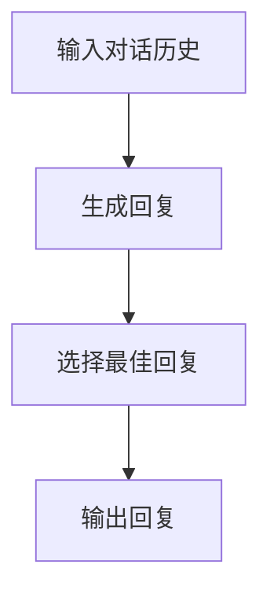
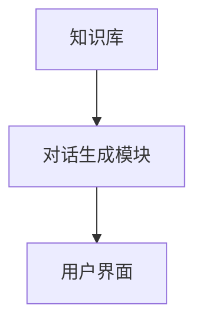
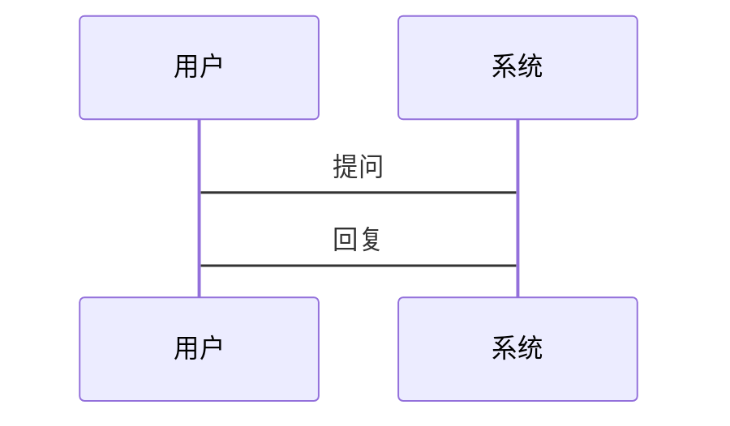

                 


---

# AI Agent的对话策略在教育辅导中的应用

## 关键词：
AI Agent，对话策略，教育辅导，自然语言处理，机器学习，生成式模型，教育系统

## 摘要：
本文探讨AI Agent在教育辅导中的对话策略应用，分析其在教育场景中的优势与挑战，结合生成式模型和自然语言处理技术，提出对话策略的设计与实现方法。文章通过案例分析和系统设计，展示了AI Agent在教育辅导中的实际应用，并展望了未来的发展方向。

---

# 第1章 AI Agent与对话策略概述

## 1.1 AI Agent的基本概念

### 1.1.1 AI Agent的定义与特点
AI Agent是一种智能体，能够感知环境、自主决策并执行任务。其特点包括自主性、反应性、目标导向和社会能力。

### 1.1.2 对话策略的基本概念
对话策略是AI Agent在对话中选择回复的策略，旨在实现特定目标。在教育辅导中，目标是帮助学生学习和解决问题。

### 1.1.3 教育辅导中的对话策略应用背景
随着AI技术的发展，AI Agent在教育辅导中的应用日益广泛，对话策略是其核心能力之一。

---

## 1.2 教育辅导中的对话策略需求

### 1.2.1 学生学习需求分析
学生需要个性化辅导、实时反馈和情感支持。

### 1.2.2 教师辅导需求分析
教师需要高效的教学工具和数据分析支持。

### 1.2.3 对话策略在教育辅导中的目标与意义
目标是提高教学效率和学生学习效果，意义在于个性化和智能化。

---

## 1.3 当前教育辅导中的对话策略现状

### 1.3.1 传统教育辅导方式的局限性
资源不足、效率低下、难以个性化。

### 1.3.2 AI Agent在教育辅导中的优势
个性化、高效、24/7可用。

### 1.3.3 当前技术与应用场景的匹配性
生成式模型和自然语言处理技术的成熟推动了对话策略在教育中的应用。

---

# 第2章 对话策略的核心概念与联系

## 2.1 对话策略的核心概念

### 2.1.1 对话策略的定义与分类
定义：对话策略是AI Agent在对话中选择回复的策略。分类：基于规则、统计和生成式模型。

### 2.1.2 对话策略的关键属性特征对比表
| 属性 | 基于规则 | 统计模型 | 生成式模型 |
|------|----------|----------|------------|
| 决策方式 | 预定义规则 | 统计概率 | 生成新内容 |
| 适用场景 | 简单对话 | 多样场景 | 创新场景 |

### 2.1.3 ER实体关系图架构
```mermaid
er
actor(AI Agent) --> role(对话策略)
role(对话策略) --> strategy(策略类型)
strategy(策略类型) --> response(回复内容)
```

---

## 2.2 对话策略与教育场景的结合

### 2.2.1 对话策略在教育辅导中的关键环节
知识传递、情感支持、问题解决。

### 2.2.2 教育场景中的对话策略实现方式
基于规则、统计和生成式模型。

### 2.2.3 对话策略与教育目标的匹配关系
对话策略需与教学目标一致，确保有效性和个性化。

---

# 第3章 对话策略生成的算法原理

## 3.1 生成式模型简介

### 3.1.1 基于生成式模型的对话策略生成
生成式模型如GPT-3能够生成多样化的回复，适应不同教育场景。

### 3.1.2 常见的生成式模型及其特点
- GPT系列：强大的文本生成能力。
- Transformer：高效的序列处理。
- LLM：大规模预训练模型。

## 3.2 对话策略生成的算法流程

### 3.2.1 对话历史的处理与理解
AI Agent需分析对话历史，理解上下文。

### 3.2.2 对话意图识别与回复生成
使用自然语言处理技术识别意图，并生成回复。

### 3.2.3 回复优化与策略调整
根据对话效果优化回复内容。

---

## 3.3 对话策略生成的算法实现

### 3.3.1 基于生成式模型的对话策略生成代码示例
```python
import torch
from transformers import GPT2LMHeadModel, GPT2Tokenizer

model = GPT2LMHeadModel.from_pretrained('gpt2')
tokenizer = GPT2Tokenizer.from_pretrained('gpt2')

def generate_response(input_text):
    inputs = tokenizer.encode(input_text, return_tensors='pt')
    outputs = model.generate(inputs, max_length=50, num_beams=5, temperature=0.7)
    response = tokenizer.decode(outputs[0], skip_special_tokens=True)
    return response

input_text = "解释一下牛顿第一定律"
response = generate_response(input_text)
print(response)
```

### 3.3.2 对话策略生成的优化与调优
优化温度、重复率等参数，提升回复的相关性和多样性。

---

## 3.4 对话策略生成的数学模型与公式

### 3.4.1 生成式模型的数学模型
生成式模型使用概率分布生成文本，公式：
$$ P(y|x) = \text{模型生成的概率} $$

### 3.4.2 对话策略生成的优化目标
最大化生成文本与上下文的相关性，公式：
$$ \text{损失函数} = \text{交叉熵损失} $$

---

## 3.5 对话策略生成的算法实现步骤

### 3.5.1 数据预处理
将对话历史和当前输入转化为模型可接受的格式。

### 3.5.2 模型训练与微调
使用教育领域的数据微调模型，提升其在教育场景中的表现。

### 3.5.3 对话策略生成的流程图


---

# 第4章 对话策略的数学模型与公式

## 4.1 生成式模型的数学模型

### 4.1.1 概率分布模型
生成式模型基于概率分布生成文本，公式：
$$ P(y|x) = \frac{1}{Z} \exp(\text{模型输出}) $$

### 4.1.2 生成式模型的损失函数
交叉熵损失公式：
$$ \text{损失函数} = -\sum_{i=1}^{n} \log P(y_i|x) $$

## 4.2 对话策略生成的数学模型

### 4.2.1 对话历史的表示
将对话历史表示为序列，使用序列模型处理。

### 4.2.2 对话策略生成的优化目标
最大化生成回复的相关性和有用性。

---

## 4.3 对话策略生成的数学公式

### 4.3.1 生成式模型的数学表达
模型输出：
$$ \text{输出} = f(x) $$

### 4.3.2 对话策略生成的优化目标
最大化生成文本的适用性：
$$ \text{优化目标} = \arg\max \text{生成文本的适用性} $$

---

# 第5章 对话策略的系统分析与架构设计

## 5.1 系统需求分析

### 5.1.1 教育辅导系统的功能需求
知识库管理、对话生成、用户交互。

### 5.1.2 对话策略的核心需求
个性化回复、实时反馈、情感支持。

## 5.2 系统架构设计

### 5.2.1 系统功能模块设计
知识库、对话生成模块、用户界面。

### 5.2.2 系统架构图


### 5.2.3 系统接口设计
API接口实现对话请求的接收和回复的返回。

## 5.3 对话策略的交互设计

### 5.3.1 对话流程设计
用户输入问题，系统生成回复。

### 5.3.2 交互流程图


---

# 第6章 项目实战：基于开源模型构建教育辅导系统

## 6.1 环境安装

### 6.1.1 安装Python和依赖库
安装Python和必要的库，如transformers。

## 6.2 系统核心实现

### 6.2.1 对话生成模块实现
使用开源模型生成回复。

### 6.2.2 知识库的构建
收集和整理教育相关知识。

## 6.3 案例分析

### 6.3.1 实际案例分析
具体案例分析对话生成的过程。

## 6.4 项目总结

### 6.4.1 项目实现的关键点
模型选择、知识库构建、对话流程优化。

---

# 第7章 最佳实践与未来展望

## 7.1 最佳实践

### 7.1.1 对话策略的设计注意事项
保持简洁、准确性、个性化。

## 7.2 未来展望

### 7.2.1 对话策略的优化方向
提升生成回复的相关性和多样性。

### 7.2.2 AI Agent在教育中的未来发展
更智能、更个性化的教育辅导。

---

# 总结

AI Agent的对话策略在教育辅导中的应用前景广阔，随着技术的发展，其在教育领域的应用将更加深入和多样化。

---

# 作者：AI天才研究院 & 禅与计算机程序设计艺术

