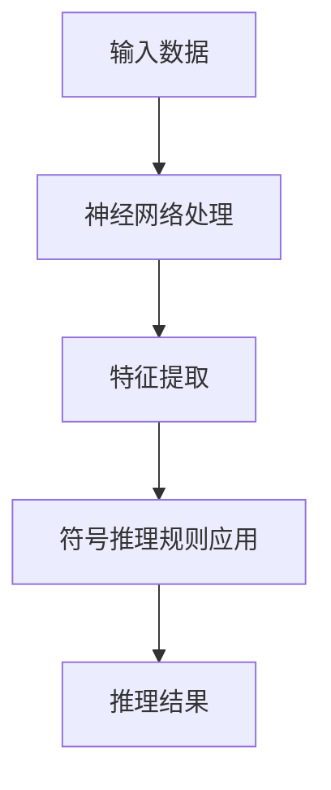
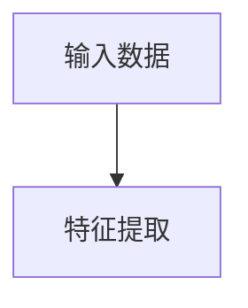
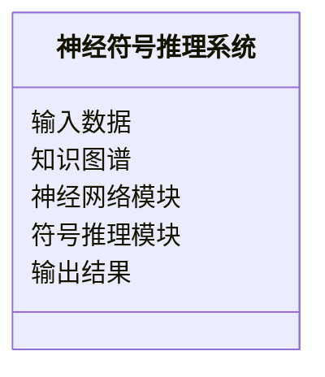
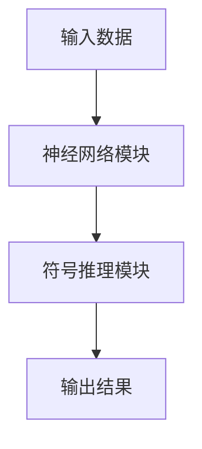
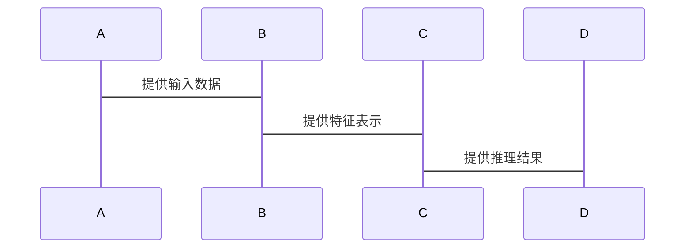

                 


```markdown
# AI Agent的神经符号推理系统设计

> 关键词：神经符号推理、AI Agent、知识图谱、逻辑推理、系统架构设计

> 摘要：本文详细探讨了AI Agent的神经符号推理系统设计，从背景介绍、核心概念、算法原理到系统架构设计，结合实际案例分析，为读者提供了一套完整的神经符号推理系统设计方案。

---

# 第一部分: AI Agent的神经符号推理系统设计背景

## 第1章: AI Agent与神经符号推理概述

### 1.1 AI Agent的基本概念

#### 1.1.1 AI Agent的定义与特点
AI Agent（人工智能代理）是指能够感知环境并采取行动以实现目标的智能体。其特点包括自主性、反应性、目标导向性和社会性。

#### 1.1.2 神经符号推理的定义与特点
神经符号推理（Neural-Symbolic Reasoning）是结合神经网络和符号推理的一种方法，能够处理非结构化数据并生成结构化的推理结果。其特点包括可解释性、灵活性和高精度。

#### 1.1.3 神经符号推理与传统符号推理的区别
| 特性            | 神经符号推理                | 传统符号推理              |
|-----------------|-----------------------------|---------------------------|
| 数据处理能力    | 支持非结构化数据            | 仅支持结构化数据          |
| 可解释性        | 较低                       | 较高                     |
| 精度            | 高                        | 中等                     |

### 1.2 神经符号推理的背景与意义

#### 1.2.1 神经符号推理的发展历程
神经符号推理的发展经历了从符号推理到深度学习，再到两者结合的阶段。当前，它在自然语言处理、视觉推理等领域得到了广泛应用。

#### 1.2.2 神经符号推理在AI Agent中的作用
神经符号推理为AI Agent提供了强大的推理能力，使其能够处理复杂任务，如知识图谱构建和逻辑推理。

#### 1.2.3 神经符号推理的当前研究热点
当前研究主要集中在如何有效结合神经网络和符号推理，提升推理的准确性和效率。

---

# 第二部分: 神经符号推理的核心概念与原理

## 第2章: 神经符号推理的核心概念

### 2.1 神经符号推理的核心要素

#### 2.1.1 神经网络的表示能力
神经网络擅长处理非结构化数据，如图像和文本，通过特征提取和表示学习，为符号推理提供丰富的语义信息。

#### 2.1.2 符号推理的逻辑规则
符号推理基于逻辑规则进行推理，如谓词逻辑和规则推理，能够处理结构化数据，确保推理的准确性和可解释性。

#### 2.1.3 神经符号推理的结合方式
神经符号推理通过将神经网络的输出作为符号推理的输入，或通过联合优化模型将两者结合，实现优势互补。

### 2.2 神经符号推理的原理分析

#### 2.2.1 神经符号推理的结合机制
神经符号推理通过知识图谱将符号信息与感知数据相结合，利用神经网络进行特征提取，再通过符号推理生成结论。

#### 2.2.2 神经符号推理的计算流程


#### 2.2.3 神经符号推理的优缺点对比
| 特性            | 优点                         | 缺点                         |
|-----------------|------------------------------|------------------------------|
| 可解释性        | 较高                       | 较低                     |
| 处理能力        | 强大                       | 有限                     |

### 2.3 神经符号推理的核心算法

#### 2.3.1 知识图谱表示法
知识图谱通过实体和关系表示知识，为符号推理提供结构化的知识库。

#### 2.3.2 神经符号推理的逻辑推理模型
神经符号推理模型结合了神经网络和逻辑推理，通过知识图谱进行推理。

#### 2.3.3 神经符号推理的训练方法
结合端到端训练和符号规则，优化神经网络和符号推理的联合训练。

---

# 第三部分: 神经符号推理的算法原理与实现

## 第3章: 神经符号推理的算法原理

### 3.1 神经符号推理的数学模型

#### 3.1.1 神经网络的数学表示
神经网络通过权重和激活函数进行非线性变换，表示为：
$$
h(x) = \sigma(Wx + b)
$$

#### 3.1.2 符号推理的逻辑表达
符号推理基于谓词逻辑，如：
$$
\forall x, P(x) \rightarrow Q(x)
$$

#### 3.1.3 神经符号推理的联合优化模型
联合优化模型将神经网络和符号推理结合，优化目标函数：
$$
\min_{\theta, \phi} \mathcal{L}(\theta, \phi)
$$

### 3.2 神经符号推理的算法流程

#### 3.2.1 数据输入与特征提取


#### 3.2.2 神经网络的特征表示
神经网络提取输入数据的特征表示。

#### 3.2.3 符号推理的逻辑推理
符号推理基于知识图谱进行逻辑推理，生成结论。

#### 3.2.4 结果输出与反馈优化
推理结果输出，并根据反馈优化模型参数。

### 3.3 神经符号推理的实现细节

#### 3.3.1 神经网络的结构设计
使用卷积神经网络或循环神经网络进行特征提取。

#### 3.3.2 符号推理规则的编码方法
将符号规则编码为逻辑表达式，嵌入到神经网络中。

#### 3.3.3 神经符号推理的训练策略
采用端到端训练，结合符号规则进行优化。

---

# 第四部分: 神经符号推理系统的架构设计

## 第4章: 神经符号推理系统的架构设计

### 4.1 系统功能需求分析

#### 4.1.1 系统目标与功能模块划分
系统目标：构建神经符号推理系统。功能模块：数据输入、特征提取、逻辑推理、结果输出。

#### 4.1.2 神经符号推理系统的输入输出设计
输入：非结构化数据和知识图谱。输出：推理结果和解释。

#### 4.1.3 系统性能指标与约束条件
性能指标：推理速度、准确率。约束条件：知识图谱规模、计算资源。

### 4.2 神经符号推理系统的架构设计

#### 4.2.1 系统功能设计


#### 4.2.2 系统架构设计


#### 4.2.3 系统接口设计
接口1：输入数据接口。接口2：知识图谱接口。接口3：输出结果接口。

#### 4.2.4 系统交互设计


---

# 第五部分: 神经符号推理系统的实现与应用

## 第5章: 神经符号推理系统的实现

### 5.1 环境安装与配置
安装Python、TensorFlow、符号推理库等。

### 5.2 核心代码实现

#### 5.2.1 神经网络模块实现
```python
import tensorflow as tf
def neural_network(input_layer):
    dense_layer = tf.layers.dense(input_layer, 64, activation='relu')
    return dense_layer
```

#### 5.2.2 符号推理模块实现
```python
def symbolic_reasoning(features, knowledge_base):
    # 使用知识图谱进行逻辑推理
    pass
```

### 5.3 代码应用解读与分析
通过代码实现神经符号推理的流程，结合知识图谱和神经网络进行推理。

### 5.4 实际案例分析
分析一个实际案例，展示神经符号推理系统的应用效果。

### 5.5 项目小结
总结项目实现的关键点和经验教训。

---

## 第6章: 神经符号推理系统的最佳实践

### 6.1 小结
总结神经符号推理系统的优缺点和应用场景。

### 6.2 注意事项
在实际应用中需要注意的事项，如知识图谱的质量和神经网络的训练数据。

### 6.3 拓展阅读
推荐相关领域的书籍和论文，供读者深入学习。

---

# 作者

作者：AI天才研究院/AI Genius Institute & 禅与计算机程序设计艺术 /Zen And The Art of Computer Programming
```

