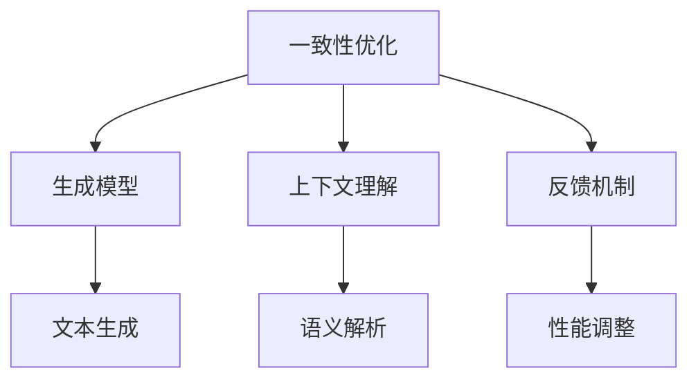
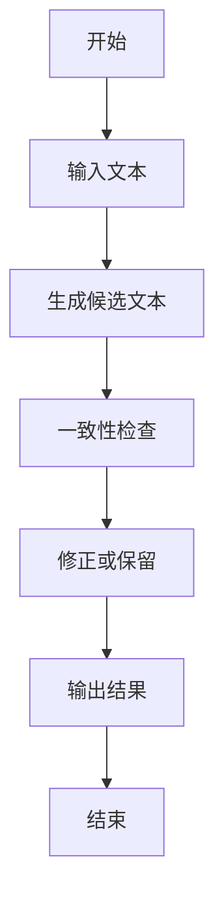
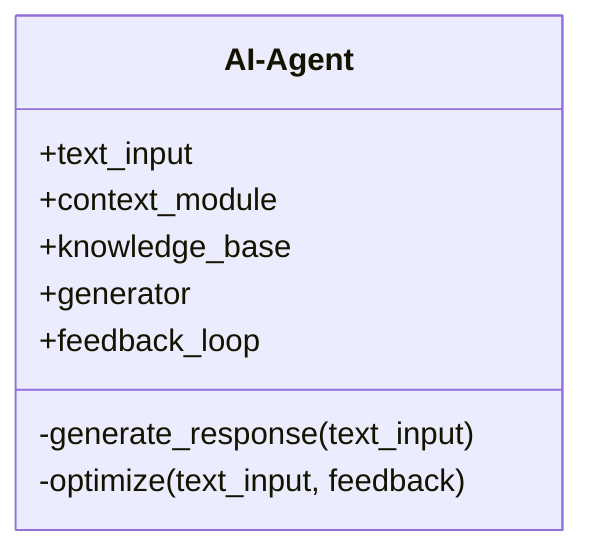
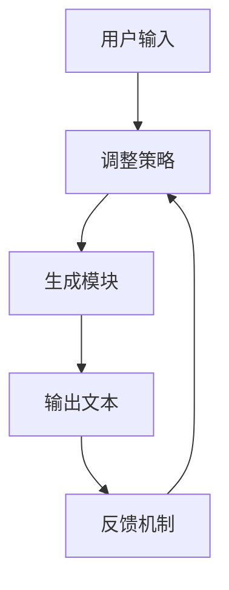
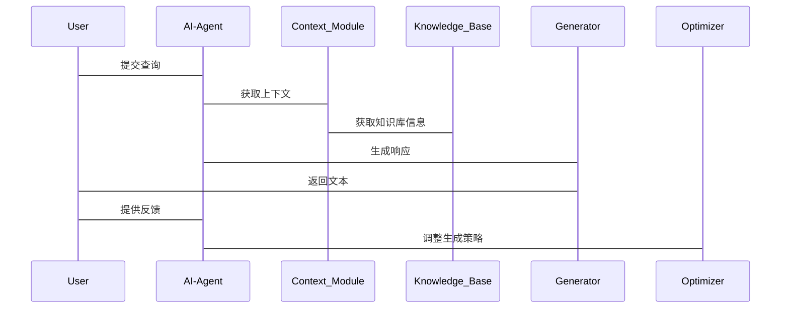

                 


# AI Agent的自然语言生成一致性优化

> 关键词：AI Agent, 自然语言生成, 一致性优化, 对话系统, 生成式AI, 文本修复

> 摘要：本文详细探讨AI Agent在自然语言生成中的一致性优化问题，分析其核心概念、算法原理、系统架构及项目实战。通过理论与实践结合，提供优化方法和建议，助力提升生成内容的连贯性和一致性。

---

## 第1章 背景介绍

### 1.1 问题背景

#### 1.1.1 当前AI Agent自然语言生成的挑战

AI Agent在自然语言生成（Natural Language Generation, NLG）中的应用日益广泛，如智能客服、虚拟助手等。然而，生成内容的一致性问题严重影响用户体验和系统效率。一致性问题主要体现在上下文不连贯、信息重复或矛盾等方面。

#### 1.1.2 一致性问题的定义与重要性

一致性优化旨在确保生成文本在语义、语法和逻辑上保持连贯。这不仅提升用户体验，还增强系统信任度，降低错误理解风险。

#### 1.1.3 一致性优化的目标与意义

目标是使生成文本在上下文和逻辑上保持一致，意义在于提升用户体验和系统性能，降低维护成本。

### 1.2 问题描述

#### 1.2.1 自然语言生成中的常见问题

包括语义模糊、逻辑矛盾、信息冗余等。

#### 1.2.2 一致性问题的具体表现

如对话跳跃、文本矛盾等。

#### 1.2.3 问题解决的必要性与可行性

通过优化算法和系统设计，一致性问题可以有效解决。

### 1.3 解决方案概述

#### 1.3.1 一致性优化的基本思路

结合上下文理解和知识图谱约束，采用反馈机制进行自适应优化。

#### 1.3.2 优化方法的分类与选择

包括基于上下文的修正、知识图谱约束和反馈机制调整。

#### 1.3.3 解决方案的实施步骤

从数据预处理到模型训练，再到系统集成，逐步优化生成过程。

### 1.4 边界与外延

#### 1.4.1 一致性优化的适用范围

主要用于AI Agent的对话系统和文本生成任务。

#### 1.4.2 相关问题的区分与界定

如歧义性和模糊性的区分。

#### 1.4.3 与其他优化目标的关系

一致性优化与生成效率、准确性等目标相互影响。

### 1.5 核心概念结构与要素

#### 1.5.1 一致性优化的核心要素

包括生成模型、上下文理解、反馈机制。

#### 1.5.2 各要素之间的关系

生成模型依赖上下文理解，反馈机制调整生成结果。

#### 1.5.3 系统整体架构

展示生成模型、上下文模块和反馈机制的协同工作。

---

## 第2章 核心概念与联系

### 2.1 一致性优化的原理

#### 2.1.1 基于上下文的生成一致性

利用上下文理解生成连贯文本，确保语义一致。

#### 2.1.2 基于知识图谱的约束一致性

通过知识约束消除矛盾，提升准确性。

#### 2.1.3 基于反馈机制的自适应一致性

根据反馈调整生成策略，增强自适应能力。

### 2.2 核心概念对比

#### 2.2.1 生成式AI与检索式AI的对比

生成式AI自由创造，检索式AI基于现有数据。

#### 2.2.2 对话系统与单轮生成的对比

对话系统注重连贯性，单轮生成注重准确性。

#### 2.2.3 文本修复与生成优化的对比

文本修复修正错误，生成优化提升质量。

### 2.3 ER实体关系图



---

## 第3章 算法原理

### 3.1 一致性优化算法

#### 3.1.1 基于上下文的修正算法

通过上下文分析，修正生成文本中的矛盾。

#### 3.1.2 基于知识图谱的约束算法

利用知识图谱，约束生成内容的准确性。

#### 3.1.3 基于反馈机制的自适应算法

根据用户反馈，动态调整生成策略。

### 3.2 算法流程图



### 3.3 算法实现

#### 3.3.1 Python代码示例

```python
def consistency_optimize(text):
    # 步骤1：生成候选文本
    candidates = generate_candidates(text)
    # 步骤2：一致性检查
    for candidate in candidates:
        if check_consistency(candidate):
            return candidate
    return candidates[0]  # 默认返回第一个候选
```

#### 3.3.2 数学模型与公式

困惑度公式：
$$ \text{困惑度} = \frac{1}{N} \sum_{i=1}^{N} \log P(w_i) $$

---

## 第4章 系统分析与架构设计

### 4.1 系统分析

#### 4.1.1 问题场景介绍

以智能客服对话系统为例，分析一致性优化的应用。

#### 4.1.2 领域模型



#### 4.1.3 系统架构设计



#### 4.1.4 系统接口设计

定义API接口，如`generate(text, context)`和`optimize(text, feedback)`。

#### 4.1.5 系统交互流程图



---

## 第5章 项目实战

### 5.1 项目实战场景

#### 5.1.1 项目介绍

以智能客服对话系统为例，展示一致性优化的实际应用。

#### 5.1.2 环境安装

安装必要的库：

```bash
pip install transformers numpy
```

#### 5.1.3 核心代码实现

实现一致性优化的Python代码：

```python
import transformers
import numpy as np

def generate_candidates(text):
    model = transformers.AutoModelForCausalLM.from_pretrained('gpt2')
    candidates = []
    # 生成候选文本
    # ...
    return candidates

def check_consistency(candidate):
    # 使用知识图谱检查一致性
    # ...
    return True  # 假设候选文本一致
```

#### 5.1.4 案例分析与解读

分析优化前后的对话，展示一致性提升的效果。

#### 5.1.5 项目小结

总结项目实施的经验和优化效果。

---

## 第6章 总结与展望

### 6.1 最佳实践 tips

- 结合上下文理解和知识图谱约束。
- 采用反馈机制提升自适应能力。

### 6.2 小结

一致性优化是AI Agent自然语言生成的重要环节，通过多方面优化，可显著提升生成质量。

### 6.3 注意事项

确保数据质量和算法鲁棒性，避免优化过程中的过拟合。

### 6.4 拓展阅读

推荐相关书籍和论文，如《深度学习》和《生成式AI》。

---

## 作者：AI天才研究院 & 禅与计算机程序设计艺术

通过本文的详细分析，读者可以系统了解AI Agent的自然语言生成一致性优化的核心概念、算法原理和系统设计。希望本文能为相关领域的研究和实践提供有价值的参考。

